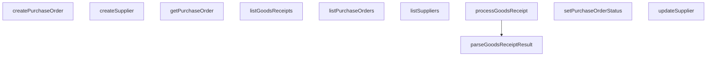

## Genel Bakış

Bu modül, HVAC tedarik zinciri yönetim sisteminin satın alma (purchasing) süreçlerini yönetir. Tedarikçi kayıtlarının oluşturulması ve güncellenmesi, satın alma siparişlerinin yaşam döngüsünün takibi ile mal alım (goods receipt) işlemlerinin kaydedilmesinden sorumludur. Tüm veri erişimleri Supabase istemcisi üzerinden gerçekleştirilir.

## Fonksiyon Grupları

### Tedarikçi Yönetimi
Tedarikçi bilgilerinin listelenmesi, yeni tedarikçi oluşturulması ve mevcut tedarikçi kayıtlarının güncellenmesini sağlar. Opsiyonel olarak pasif tedarikçilerin listeye dahil edilip edilmeyeceği kontrol edilebilir.
- listSuppliers, createSupplier, updateSupplier

### Satın Alma Siparişi Yönetimi
Satın alma siparişlerinin listelenmesi, tekil sorgulanması, yeni sipariş oluşturulması ve sipariş durumunun değiştirilmesini kapsar. Durum değişikliği sırasında opsiyonel kapanış notu eklenebilir. Siparişler duruma göre filtrelenebilir.
- listPurchaseOrders, getPurchaseOrder, createPurchaseOrder, setPurchaseOrderStatus

### Mal Alım İşlemleri
Belirli bir satın alma siparişine ait mal alımlarının kaydedilmesi, listelenmesi ve alım sonuçlarının ayrıştırılmasını sağlar. `processGoodsReceipt` fonksiyonu satır bazlı alım girdilerini işlerken, `parseGoodsReceiptResult` ham JSON verisini tip güvenli bir sonuca dönüştüren yardımcı bir fonksiyondur.
- parseGoodsReceiptResult, processGoodsReceipt, listGoodsReceipts

## Bağımlılıklar

**Dış Bağımlılıklar:**
- `SupabaseClient<Database>` — tüm veritabanı işlemleri bu istemci üzerinden yürütülür
- Tip tanımları: `SupplierRow`, `SupplierInsert`, `SupplierUpdate`, `PurchaseOrderRow`, `PurchaseOrderWithItems`, `PurchaseOrderInput`, `GoodsReceiptResult`, `GoodsReceiptLineInput`, `GoodsReceiptRow`, `Json`

**İç İlişkiler:**
- `processGoodsReceipt` ve `listGoodsReceipts` fonksiyonları bir `poId` parametresi alarak satın alma siparişine bağlı çalışır
- `setPurchaseOrderStatus` fonksiyonu, mal alımı sonrası sipariş durumunu ilerletmek için kullanılabilir
- `parseGoodsReceiptResult`, `processGoodsReceipt` tarafından üretilen ham veriyi ayrıştırmak amacıyla kullanılır

**Mimari Not:**
Modül, servis katmanında konumlanır ve veritabanı erişimini soyutlayarak üst katmanlara (controller, API rotaları) temiz bir arayüz sunar. Lazy veya dinamik yükleme belirtilmemiştir.

---

## AXIOMS – Mimari Varsayımlar

Bu modül, tüm veritabanı işlemlerinde bir `SupabaseClient<Database>` nesnesine bağımlıdır.

[Aksiyom 1]: Eğer `supabase` parametresi yoksa veya geçerli bir Supabase bağlantısı sağlanmamışsa, tüm veritabanı işlemleri (listeleme, oluşturma, güncelleme) başarısız olur.

[Aksiyom 2]: Eğer `getPurchaseOrder` fonksiyonuna verilen `id` ile eşleşen bir satın alma siparişi bulunamazsa, sonuç `null` döner.

[Aksiyom 3]: Eğer `listSuppliers` çağrısında `includeInactive` belirtilmezse, yalnızca aktif tedarikçiler listelenir (varsayılan davranış).

[Aksiyom 4]: Eğer `listPurchaseOrders` çağrısında `status` belirtilmezse, tüm durumlardaki satın alma siparişleri listelenir (varsayılan davranış).

[Aksiyom 5]: Eğer `setPurchaseOrderStatus` fonksiyonunda `closeNote` belirtilmezse, sipariş kapatma notu eklenmeden durum değişikliği yapılır.

[Aksiyom 6]: Eğer `processGoodsReceipt` fonksiyonundaki `lines` dizisi boşsa, mal kabul işlemi satır olmadan gerçekleştirilir.

[Aksiyom 7]: Eğer `processGoodsReceipt` fonksiyonundaki `note` belirtilmezse, mal kabul notu eklenmeden işlem yapılır.

[Aksiyom 8]: Eğer `parseGoodsReceiptResult` fonksiyonuna `null` verilirse, boş bir `GoodsReceiptResult` döner (bu fonksiyon async değildir ve veritabanı bağlantısı gerektirmez).

---

## FONKSİYON DETAYLARI

### listSuppliers
**Ne yapar**: Supabase veritabanındaki `suppliers` tablosundaki tüm tedarikçileri ada göre sıralı şekilde listeler. Varsayılan olarak yalnızca aktif tedarikçileri döndürür; `includeInactive` seçeneğiyle pasif kayıtlar da dahil edilebilir.

**Nasıl yapar**: `supabase.from('suppliers').select('*').order('name')` sorgusunu oluşturur. Eğer `opts.includeInactive` tanımlı değilse veya `false` ise sorguya `.eq('is_active', true)` filtresi eklenir; böylece yalnızca aktif tedarikçiler getirilir. Sorgu sonucunda hata varsa fırlatılır, veri yoksa boş dizi döndürülür.

**Parametreler**:
- supabase: SupabaseClient\<Database\> — Supabase istemci örneği; veritabanı bağlantısını temsil eder.
- opts: \{ includeInactive?: boolean \} — Opsiyonel seçenekler nesnesi. `includeInactive` true ise pasif tedarikçiler de listeye dahil edilir. Varsayılan değeri boş nesnedir (\{\}).

**Dönüş**: Promise\<SupplierRow[]> — `suppliers` tablosundaki satırları temsil eden `SupplierRow` dizisi döner. Veri null ise boş dizi döndürülür.

### createSupplier
**Ne yapar**: Geliştirildi ancak detay üretilemedi.

### updateSupplier
**Ne yapar**: Geliştirildi ancak detay üretilemedi.

### listPurchaseOrders
**Ne yapar**: Geliştirildi ancak detay üretilemedi.

### getPurchaseOrder
**Ne yapar**: Geliştirildi ancak detay üretilemedi.

### createPurchaseOrder
**Ne yapar**: Geliştirildi ancak detay üretilemedi.

### setPurchaseOrderStatus
**Ne yapar**: Geliştirildi ancak detay üretilemedi.

### parseGoodsReceiptResult
**Ne yapar**: Geliştirildi ancak detay üretilemedi.

### processGoodsReceipt
**Ne yapar**: Geliştirildi ancak detay üretilemedi.

### listGoodsReceipts
**Ne yapar**: Geliştirildi ancak detay üretilemedi.

---

## İTHALATLAR (IMPORTS)
- import: @/lib/audit::logAdminAction
- import: @/lib/purchasing/poStatusMachine::isManualPoTransitionAllowed
- import: @/types/database.types::type { Database, Json }
- import: @supabase/supabase-js::type { SupabaseClient }

---

## INTERFACES

### PurchaseOrderLineInput
PO satır girdisi: maliyet SNAPSHOT'ı sipariş anında burada verilir (cetvel §5.1).
- `product_id: string`
- `qty_ordered: number`
- `unit_cost: number`
- `currency?: string`
- `tax_rate?: number`

### PurchaseOrderInput
- `supplier_id: string`
- `currency: string`
- `expected_at?: string | null`
- `note?: string | null`
- `lines: PurchaseOrderLineInput[]`

### PurchaseOrderWithItems extends PurchaseOrderRow
- `purchase_order_items: PurchaseOrderItemRow[]`

### GoodsReceiptResult
`process_goods_receipt` RPC zarfı — `success === true` kontrolü ZORUNLU (T052 dersi).
- `success: boolean`
- `error?: string`
- `receipt_id?: string`
- `processed_count?: number`
- `received_units?: number`
- `po_status?: string`

### GoodsReceiptLineInput
- `product_id: string`
- `qty: number`
- `unit_cost?: number`

---

## TYPE ALIASES

### SupplierRow
```typescript
type SupplierRow = Database['public']['Tables']['suppliers']['Row']
```

### SupplierInsert
```typescript
type SupplierInsert = Database['public']['Tables']['suppliers']['Insert']
```

### SupplierUpdate
```typescript
type SupplierUpdate = Database['public']['Tables']['suppliers']['Update']
```

### PurchaseOrderRow
```typescript
type PurchaseOrderRow = Database['public']['Tables']['purchase_orders']['Row']
```

### PurchaseOrderItemRow
```typescript
type PurchaseOrderItemRow = Database['public']['Tables']['purchase_order_items']['Row']
```

### GoodsReceiptRow
```typescript
type GoodsReceiptRow = Database['public']['Tables']['goods_receipts']['Row']
```

---

## AST POINTERS

### [N1_NASIL] AST Pointer: purchasing.service.ts::listSuppliers
- **params**:
  - `supabase` — SupabaseClient<Database> tipinde, veritabanı bağlantısı
  - `opts` — `{ includeInactive?: boolean }` tipinde, opsiyonel; varsayılan değeri boş nesne `{}`
- **ic_degiskenler**:
  - `q` — supabase sorgu nesnesi; önce `suppliers` tablosundan tüm alanları seçer ve `name` alanına göre sıralar; `opts.includeInactive` falsy ise `is_active` değeri `true` olan satırlara filtre uygulanır
  - `data` — sorgu sonucu dönen satırlar dizisi
  - `error` — sorgu sırasında oluşan hata nesnesi; varsa throw ile fırlatılır
- **Dönüş**: `Promise<SupplierRow[]>` — tedarikçi satırları dizisi; veri yoksa boş dizi döner

---


## MERMAID CALL GRAPH


## NODE ID STANDARD

  file: src\lib\services\purchasing.service.ts
  function: src\lib\services\purchasing.service.ts::listSuppliers
  function: src\lib\services\purchasing.service.ts::createSupplier
  function: src\lib\services\purchasing.service.ts::updateSupplier
  function: src\lib\services\purchasing.service.ts::listPurchaseOrders
  function: src\lib\services\purchasing.service.ts::getPurchaseOrder
  function: src\lib\services\purchasing.service.ts::createPurchaseOrder
  function: src\lib\services\purchasing.service.ts::setPurchaseOrderStatus
  function: src\lib\services\purchasing.service.ts::parseGoodsReceiptResult
  function: src\lib\services\purchasing.service.ts::processGoodsReceipt
  function: src\lib\services\purchasing.service.ts::listGoodsReceipts

---

## DISA AKTARILANLAR (EXPORTS)
  export: GoodsReceiptLineInput
  export: GoodsReceiptResult
  export: GoodsReceiptRow
  export: PurchaseOrderInput
  export: PurchaseOrderItemRow
  export: PurchaseOrderLineInput
  export: PurchaseOrderRow
  export: PurchaseOrderWithItems
  export: SupplierInsert
  export: SupplierRow
  export: SupplierUpdate
  export: createPurchaseOrder
  export: createSupplier
  export: getPurchaseOrder
  export: listGoodsReceipts
  export: listPurchaseOrders
  export: listSuppliers
  export: parseGoodsReceiptResult
  export: processGoodsReceipt
  export: setPurchaseOrderStatus
  export: updateSupplier

---

## BILEŞIM (CONTAINS)
  contains: PurchaseOrderRow