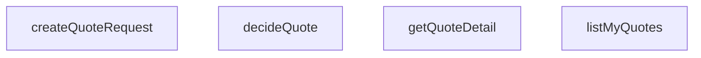

## Genel Bakış

Bu modül, teklif (quote) nesnelerinin yaşam döngüsünü yönetir. Supabase veritabanı üzerinden teklif oluşturma, kullanıcıya ait teklifleri listeleme, tekil teklif detayını getirme ve teklife kabul veya red kararı verme işlemlerini sunar. Tüm fonksiyonlar ortak olarak `SupabaseClient<Database>` bağımlılığı alır ve veritabanı etkileşimini bu istemci üzerinden gerçekleştirir.

## Fonksiyon Grupları

### Teklif Oluşturma
Yeni bir teklif isteği oluşturur ve veritabanına kaydeder. Oluşturulan teklif kaydını döndürür.
- createQuoteRequest

### Teklif Sorgulama
Kullanıcıya ait teklifleri listeler veya belirli bir teklifin detaylı bilgisini (ilişkili kalemler dahil) getirir. `getQuoteDetail` bulunamayan durumda null döndürür.
- listMyQuotes, getQuoteDetail

### Teklif Karar Verme
Mevcut bir teklifin durumunu kabul veya red olarak günceller. Fonksiyon, teklif kimliğini ve mevcut durumunu alır; yalnızca `accepted` veya `rejected` değerlerinden birini uygular.
- decideQuote

---

## AXIOMS – Mimari Varsayımlar

**[Aksiyom 1]**: Eğer `quoteId` ile eşleşen bir teklif kaydı yoksa, `getQuoteDetail` fonksiyonu `null` döner.

**[Aksiyom 2]**: Eğer `decision` parametresi `'accepted'` veya `'rejected'` dışında bir değer içeriyorsa, `decideQuote` fonksiyonu çağrılamaz; TypeScript derleme aşamasında tip hatası oluşur.

**[Aksiyom 3]**: Eğer `decideQuote` fonksiyonuna verilen `quote` nesnesi `'id'` ve `'status'` alanlarını içermiyorsa, fonksiyon çağrılamaz; TypeScript derleme aşamasında tip hatası oluşur.

**[Aksiyom 4]**: Eğer `createQuoteRequest` fonksiyonuna geçerli bir `CreateQuoteRequestInput` sağlanmazsa, fonksiyon çağrılamaz; TypeScript derleme aşamasında tip hatası oluşur.

**[Aksiyom 5]**: Eğer `supabase` istemcisi geçerli bir oturumla yapılandırılmamışsa, `listMyQuotes` fonksiyonunun hangi kullanıcıya ait teklifleri döndüreceği belirlenemez; bu bilgi fonksiyon gövdesinden çıkarılamaz.

---

## FONKSİYON DETAYLARI

### createQuoteRequest
**Ne yapar**: Yeni bir teklif talebi oluşturur. Başlık bilgisini ve en az bir kalem (ürün kalemi) snapshot'ını veritabanına kaydeder. Cetvel Q1 kuralı gereği içerik kopyalanır, ancak kaynak satır ID'leri kopyalanmaz. Kalemsiz teklif talebi oluşturulamaz; bu durumda hata fırlatılır.

**Nasıl yapar**: Fonksiyon önce `input.items` dizisinin boş olup olmadığını kontrol eder; boşsa `'quote request needs at least one item'` hatası fırlatır. Ardından `venthub_quotes` tablosuna başlık satırını (`user_id`, `source`, `source_project_id`) ekler ve eklenen satırı geri döndürür. `sourceProjectId` tanımsızsa `null` olarak kaydedilir. Başlık başarıyla oluşturulduktan sonra `venthub_quote_items` tablosuna her bir kalem için (`quote_id`, `product_id`, `product_name`, `qty`, `note`) satırları toplu olarak eklenir. Kalem yazımı başarısız olursa hata yükseltilir; yarım başlık veritabanında kalır (ticari kayıt silinmez politikası gereği DELETE politikası bilinçli olarak yoktur) ve kullanıcıdan yeniden denemesi istenir. Bu davranış fail-closed prensibinin görünür bir uygulamasıdır.

**Parametreler**:
- `supabase`: `SupabaseClient<Database>` — Supabase istemci nesnesi; veritabanı işlemlerini yürütür.
- `input`: `CreateQuoteRequestInput` — Teklif talebinin tüm verilerini içeren girdi nesnesi. `userId` (talebi oluşturan kullanıcı), `source` (kaynak bilgisi), `sourceProjectId` (opsiyonel kaynak proje ID'si) ve `items` (ürün kalemleri dizisi; her biri `productId`, `productName`, `qty`, `note` alanlarını içerir) alanlarını barındırır.

**Dönüş**: `Promise<QuoteRow>` — Oluşturulan teklif başlık satırını temsil eden `QuoteRow` nesnesi. Kalem bilgileri bu dönüş değerinde yer almaz; yalnızca başlık satırı döndürülür.

### listMyQuotes
**Ne yapar**: Geliştirildi ancak detay üretilemedi.

### getQuoteDetail
**Ne yapar**: Geliştirildi ancak detay üretilemedi.

### decideQuote
**Ne yapar**: Geliştirildi ancak detay üretilemedi.

---

## İTHALATLAR (IMPORTS)
- import: ../../types/database.types::type { Database }
- import: @supabase/supabase-js::type { SupabaseClient }

---

## INTERFACES

### QuoteRequestItemInput
- `productId: string | null`
- `productName: string`
- `qty: number`
- `note?: string | null`

### CreateQuoteRequestInput
- `userId: string`
- `source: QuoteSource`
- `sourceProjectId?: string | null`
- `items: QuoteRequestItemInput[]`

### QuoteWithItems extends QuoteRow
- `items: QuoteItemRow[]`

---

## TYPE ALIASES

### QuoteRow
```typescript
type QuoteRow = Database['public']['Tables']['venthub_quotes']['Row']
```

### QuoteItemRow
```typescript
type QuoteItemRow = Database['public']['Tables']['venthub_quote_items']['Row']
```

### QuoteSource
v1 giriş kapıları (cetvel Q4) — DB check kısıtının UI aynası.
```typescript
type QuoteSource = 'pdp' | 'cart' | 'project'
```

---

## AST POINTERS

### [N1_NASIL] AST Pointer: src/lib/services/quoteService.ts::createQuoteRequest
- **params**: `supabase` — SupabaseClient<Database> tipinde, veritabanı bağlantısı; `input` — CreateQuoteRequestInput tipinde, teklif talebi girdisi
- **ic_degiskenler**:
  - `input.items.length` — gelen kalemlerin sayısı; 0 ise "quote request needs at least one item" hatası fırlatılır
  - `input.userId` — venthub_quotes tablosuna yazılacak kullanıcı kimliği
  - `input.source` — venthub_quotes tablosuna yazılacak kaynak bilgisi
  - `input.sourceProjectId` — venthub_quotes tablosuna yazılacak kaynak proje kimliği; null ise `null` olarak gönderilir (`?? null`)
  - `quote` — venthub_quotes tablosuna insert sonrası `.select().single()` ile dönen tekil satır (QuoteRow)
  - `error` — venthub_quotes insert işlemi sonrası oluşan hata; varsa fırlatılır
  - `itemsError` — venthub_quote_items toplu insert işlemi sonrası oluşan hata; varsa fırlatılır (başlık silinmez, yarım kayıt 'requested' durumunda kalır)
  - `item` — `input.items.map()` içindeki her bir kalem öğesi
  - `item.productId` — kalem ürün kimliği, venthub_quote_items.product_id alanına yazılır
  - `item.productName` — kalem ürün adı, venthub_quote_items.product_name alanına yazılır
  - `item.qty` — kalem miktarı, venthub_quote_items.qty alanına yazılır
  - `item.note` — kalem notu; null ise `null` olarak gönderilir (`?? null`), venthub_quote_items.note alanına yazılır
  - `quote.id` — oluşturulan başlık satırının kimliği, her kalemin quote_id alanına atanır
- **Dönüş**: `quote` (QuoteRow) — oluşturulan teklif başlık satırı

### [N2_NASIL] AST Pointer: src/lib/services/quoteService.ts::listMyQuotes
- **params**: `supabase` — SupabaseClient<Database> tipinde, veritabanı bağlantısı
- **ic_degiskenler**:
  - `quotes` — venthub_quotes tablosundan `.select()` ile gelen tüm satırlar; `created_at` alanına göre azalan sıralanır
  - `error` — quotes sorgusu sonrası oluşan hata; varsa fırlatılır
  - `items` — venthub_quote_items tablosundan `.select()` ile gelen kalemler; `quotes` içindeki tüm `q.id` değerlerine eşleşenler (`.in('quote_id', ...)`) alınır, `created_at` alanına göre artan sıralanır
  - `itemsError` — items sorgusu sonrası oluşan hata; varsa fırlatılır
  - `byQuote` — `Map<string, QuoteItemRow[]>` tipinde, `quote_id` anahtarıyla gruplanmış kalem listeleri haritası
  - `item` — `items ?? []` döngüsündeki her bir kalem satırı
  - `item.quote_id` — kalem satırının ait olduğu teklif kimliği; Map anahtarı olarak kullanılır
  - `list` — `byQuote.get(item.quote_id)` sonucu; yoksa boş dizi `[]` ile başlatılır, kalem eklenip Map'e geri yazılır
  - `q` — `quotes.map()` içindeki her bir teklif satırı
  - `q.id` — teklif satırının kimliği; Map'ten kalem listesi almak için kullanılır
- **Dönüş**: `quotes.map((q) => ({ ...q, items: byQuote.get(q.id) ?? [] }))` — her teklif satırına `items` alanı eklenmiş QuoteWithItems dizisi; kalemsiz teklifler boş dizi alır

### [N3_NASIL] AST Pointer: src/lib/services/quoteService.ts::getQuoteDetail
- **params**: `supabase` — SupabaseClient<Database> tipinde, veritabanı bağlantısı; `quoteId` — string tipinde, sorgulanacak teklif kimliği
- **ic_degiskenler**:
  - `quote` — venthub_quotes tablosundan `.eq('id', quoteId).maybeSingle()` ile gelen tekil satır; bulunamazsa `null`
  - `error` — quote sorgusu sonrası oluşan hata; varsa fırlatılır
  - `items` — venthub_quote_items tablosundan `.eq('quote_id', quoteId)` ile gelen kalemler; `created_at` alanına göre artan sıralanır
  - `itemsError` — items sorgusu sonrası oluşan hata; varsa fırlatılır
- **Dönüş**: `{ ...quote, items: items ?? [] }` (QuoteWithItems) — teklif satırına `items` alanı eklenmiş nesne; quote bulunamazsa `null`

### [N4_NASIL] AST Pointer: src/lib/services/quoteService.ts::decideQuote
- **params**: `supabase` — SupabaseClient<Database> tipinde, veritabanı bağlantısı; `quote` — Pick<QuoteRow, 'id' | 'status'> tipinde, mevcut teklif durumu; `decision` — Extract<QuoteStatus, 'accepted' | 'rejected'> tipinde, verilen karar
- **ic_degiskenler**:
  - `allowedCustomerQuoteActions(quote.status)` — mevcut duruma izin verilen geçiş aksiyonlarını döndüren fonksiyon çağrısı; `decision` bu listede yoksa "invalid customer quote transition" hatası fırlatılır
  - `error` — venthub_quotes tablosunda `.update({ status: decision }).eq('id', quote.id)` sonrası oluşan hata; varsa fırlatılır
- **Dönüş**: yok (void) — yan etki olarak venthub_quotes tablosundaki ilgili satırın `status` alanı `decision` değerine güncellenir

---


## MERMAID CALL GRAPH


## NODE ID STANDARD

  file: quoteService.ts
  function: quoteService.ts::createQuoteRequest
  function: quoteService.ts::listMyQuotes
  function: quoteService.ts::getQuoteDetail
  function: quoteService.ts::decideQuote

---

## DISA AKTARILANLAR (EXPORTS)
  export: CreateQuoteRequestInput
  export: QuoteItemRow
  export: QuoteRequestItemInput
  export: QuoteRow
  export: QuoteSource
  export: QuoteWithItems
  export: createQuoteRequest
  export: decideQuote
  export: getQuoteDetail
  export: listMyQuotes

---

## BILEŞIM (CONTAINS)
  contains: QuoteRow