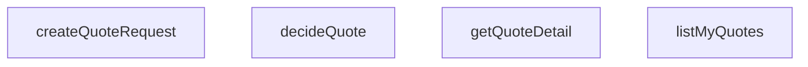

## Genel Bakış

Bu modül, teklif (quote) nesnelerinin yaşam döngüsünü yönetir. Supabase veritabanı üzerinden teklif oluşturma, kullanıcıya ait teklifleri listeleme, tekil teklif detayını getirme ve teklife kabul veya red kararı verme işlemlerini sunar. Tüm fonksiyonlar ortak olarak `SupabaseClient<Database>` bağımlılığı alır ve veritabanı etkileşimini bu istemci üzerinden gerçekleştirir.

## Fonksiyon Grupları

### Teklif Oluşturma
Yeni bir teklif isteği oluşturur ve veritabanına kaydeder. Oluşturulan teklif kaydını döndürür.
- createQuoteRequest

### Teklif Sorgulama
Kullanıcıya ait teklifleri listeler veya belirli bir teklifin detaylı bilgisini (ilişkili kalemler dahil) getirir. `getQuoteDetail` bulunamayan durumda `null` döndürür.
- listMyQuotes, getQuoteDetail

### Teklif Karar Verme
Mevcut bir teklifin durumunu kabul veya red olarak günceller. Fonksiyon, teklif kimliğini ve mevcut durumunu alır; yalnızca `accepted` veya `rejected` değerlerinden birini uygular.
- decideQuote

---

## AXIOMS – Mimari Varsayımlar
- Bu modül davranışsal mantık içermez (salt veri / konfigürasyon / tip tanımı).
- [Aksiyom 1]: Modülün dışa açtığı yapı (anahtar kümesi / şema) bir sözleşmedir; tüketiciler bu sabit yapıya bağlıdır — kırıcı değişiklik tüm tüketicileri etkiler.
- [Aksiyom 2]: Bir öğe ekleme/çıkarma yapısal-uyumlu olmalı; ilgili tipler ve seçiciler aynı commit'te güncel tutulmalıdır.

---

## FONKSİYON DETAYLARI

### createQuoteRequest
**Ne yapar**: Yeni bir teklif talebi oluşturur. Teklif başlığını ve kalemlerini veritabanına yazar. Kalemsiz talep oluşturmaya izin vermez; en az bir kalem zorunludur ve bu koşul sağlanmazsa hata fırlatılır.

**Nasıl yapar**: Önce `input.items` dizisinin uzunluğunu kontrol eder; boşsa hata fırlatır. Ardından `venthub_quotes` tablosuna teklif başlığını ekler; bu sırada kimlik üçlüsü (ad, e-posta, telefon) doğrudan belgeye yazılır ve profile bağlanmaz — profil sonradan değişse bile teklifin kime verildiği belgede sabit kalır. Başlık başarıyla oluşturulduktan sonra `venthub_quote_items` tablosuna her bir kalem için kayıt ekler. Kalem yazımı başarısız olursa hata yükseltilir; yarım başlık sessizce yutulmaz, kullanıcıya yeniden denemesi için bildirilir (fail-closed yaklaşımı). Ticari kayıt silinmediği için DELETE politikası bilinçli olarak yoktur.

**Parametreler**:
- supabase: `SupabaseClient<Database>` — Veritabanı işlemleri için Supabase istemcisi.
- input: `CreateQuoteRequestInput` — Teklif talebinin tüm verilerini içeren girdi nesnesi. Şu alanları içerir:
  - userId: string — Talebi oluşturan kullanıcının kimliği.
  - contact: `{ name: string; email: string; phone: string }` — Kimlik üçlüsü; belgeye doğrudan yazılır.
  - source: string — Talebin kaynağı.
  - sourceProjectId: string | null — Kaynak proje kimliği; belirtilmemişse null olarak kaydedilir.
  - items: `Array<{ productId: string; productName: string; qty: number; note?: string }>` — Teklif kalemleri dizisi; en az bir eleman içermelidir.

**Dönüş**: `Promise<QuoteRow>` — Oluşturulan teklif başlık satırını döndürür. Bu satır, `venthub_quotes` tablosuna eklenen kaydı temsil eder.

### listMyQuotes
**Ne yapar**: Geliştirildi ancak detay üretilemedi.

### getQuoteDetail
**Ne yapar**: Geliştirildi ancak detay üretilemedi.

### decideQuote
**Ne yapar**: Geliştirildi ancak detay üretilemedi.

---

## İTHALATLAR (IMPORTS)
- import: ../../types/database.types::type { Database }
- import: @supabase/supabase-js::type { SupabaseClient }

---

## INTERFACES

### QuoteRequestItemInput
- `productId: string`
- `productName: string`
- `qty: number`
- `note?: string | null`

### QuoteContactInput
Muhatap kimliği (cetvel §2.5) — **kimliksiz teklif OLMAZ.** Üçü de DB'de NOT NULL. Hesap ekseninden ayrıdır: `user_id` teklifin ONAYLANABİLMESİ için gerekir, bu üçlü teklifin VAR OLABİLMESİ için.
- `name: string`
- `email: string`
- `phone: string`

### CreateQuoteRequestInput
- `userId: string`
- `contact: QuoteContactInput`
- `source: QuoteSource`
- `sourceProjectId?: string | null`
- `items: QuoteRequestItemInput[]`

### QuoteWithItems extends QuoteRow
- `items: QuoteItemRow[]`

---

## TYPE ALIASES

### QuoteRow
```typescript
type QuoteRow = Database['public']['Tables']['venthub_quotes']['Row']
```

### QuoteItemRow
```typescript
type QuoteItemRow = Database['public']['Tables']['venthub_quote_items']['Row']
```

### QuoteSource
v1 giriş kapıları (cetvel Q4) — DB check kısıtının UI aynası.
```typescript
type QuoteSource = 'pdp' | 'cart' | 'project'
```

---

## AST POINTERS

### [N1_NASIL] AST Pointer: src/lib/services/quoteService.ts::createQuoteRequest
- **params**: `supabase` — SupabaseClient<Database> tipinde istemci; `input` — CreateQuoteRequestInput tipinde teklif talep girdisi
- **ic_degiskenler**:
  - `input.items` — teklif kalemler dizisi; `.length` ile boş olup olmadığı denetlenir, boşsa hata fırlatılır
  - `input.userId` — teklifin bağlı olacağı kullanıcı kimliği, `user_id` alanına yazılır
  - `input.contact.name` — iletişim adı, `contact_name` alanına yazılır
  - `input.contact.email` — iletişim e-postası, `contact_email` alanına yazılır
  - `input.contact.phone` — iletişim telefonu, `contact_phone` alanına yazılır
  - `input.source` — teklif kaynağı, `source` alanına yazılır
  - `input.sourceProjectId` — kaynak proje kimliği; null ise `null` olarak `source_project_id` alanına yazılır
  - `quote` — `venthub_quotes` tablosuna insert sonrası dönen tek satır (`.select().single()`)
  - `error` — `venthub_quotes` insert işleminde oluşan hata; varsa fırlatılır
  - `itemsError` — `venthub_quote_items` insert işleminde oluşan hata; varsa fırlatılır
  - `item` — `input.items.map()` içindeki her bir kalem nesnesi
  - `item.productId` — ürün kimliği, `product_id` alanına yazılır
  - `item.productName` — ürün adı, `product_name` alanına yazılır
  - `item.qty` — miktar, `qty` alanına yazılır
  - `item.note` — not; null ise `null` olarak `note` alanına yazılır
  - `quote.id` — oluşturulan teklifin kimliği, her kalemin `quote_id` alanına atanır
- **Dönüş**: `QuoteRow` — oluşturulan teklif satırı (`quote`)

### [N2_NASIL] AST Pointer: src/lib/services/quoteService.ts::listMyQuotes
- **params**: `supabase` — SupabaseClient<Database> tipinde istemci
- **ic_degiskenler**:
  - `quotes` — `venthub_quotes` tablosundan `created_at` azalan sırayla çekilen tüm satırlar
  - `error` — quotes sorgusundaki hata; varsa fırlatılır
  - `items` — `venthub_quote_items` tablosundan, quotes dizisindeki tüm `id` değerlerine eşleşen kalemler; `created_at` artan sırayla çekilir
  - `itemsError` — items sorgusundaki hata; varsa fırlatılır
  - `byQuote` — `Map<string, QuoteItemRow[]>` tipinde harita; her teklif kimliğini ilgili kalemler listesine eşler
  - `item` — `items` dizisi üzerinde döngüdeki her bir kalem satırı
  - `item.quote_id` — kalemin ait olduğu teklif kimliği; Map anahtarı olarak kullanılır
  - `list` — Map'ten alınan mevcut kalem dizisi; bulunamazsa boş dizi oluşturulur, item eklenip Map'e geri yazılır
  - `q` — `quotes.map()` içindeki her teklif satırı
  - `q.id` — teklif kimliği; `byQuote` Map'inden ilgili kalemleri almak için kullanılır
- **Dönüş**: `QuoteWithItems[]` — her teklif satırına `items` alanı eklenmiş dizi; kalemi olmayan teklifler boş dizi alır

### [N3_NASIL] AST Pointer: src/lib/services/quoteService.ts::getQuoteDetail
- **params**: `supabase` — SupabaseClient<Database> tipinde istemci; `quoteId` — string tipinde teklif kimliği
- **ic_degiskenler**:
  - `quote` — `venthub_quotes` tablosundan `id` eşleşmesiyle çekilen tek satır (`.maybeSingle()`); bulunamazsa null döner
  - `error` — quotes sorgusundaki hata; varsa fırlatılır
  - `items` — `venthub_quote_items` tablosundan `quote_id` eşleşmesiyle çekilen kalemler; `created_at` artan sırayla
  - `itemsError` — items sorgusundaki hata; varsa fırlatılır
- **Dönüş**: `QuoteWithItems | null` — teklif satırına `items` alanı eklenmiş nesne; teklif bulunamazsa `null`

### [N4_NASIL] AST Pointer: src/lib/services/quoteService.ts::decideQuote
- **params**: `supabase` — SupabaseClient<Database> tipinde istemci; `quote` — Pick<QuoteRow, 'id' | 'status' | 'revision_no'> tipinde teklif özeti; `decision` — Extract<QuoteStatus, 'accepted' | 'rejected'> tipinde karar
- **ic_degiskenler**:
  - `quote.status` — mevcut teklif durumu; `allowedCustomerQuoteActions()` fonksiyonuna gönderilerek geçerli kararlar listesi alınır, `decision` bu listede yoksa hata fırlatılır
  - `decision` — müşteri kararı; `'accepted'` veya `'rejected'` değerlerinden biri
  - `payload` — `venthub_quotes` tablosuna gönderilecek güncelleme nesnesi; `decision === 'accepted'` ise `status`, `accepted_at` (ISO tarih), `accept_channel` (`'site'`), `accepted_revision_no` (`quote.revision_no`) alanlarını içerir; `'rejected'` ise yalnızca `status` alanını içerir
  - `quote.revision_no` — kabul durumunda belgeye pinlenen revizyon numarası
  - `quote.id` — güncelleme sorgusunda `.eq('id', quote.id)` ile eşleştirilen teklif kimliği
  - `error` — update işlemindeki hata; varsa fırlatılır
- **Dönüş**: yok (void) — yan etki olarak `venthub_quotes` tablosunda satır güncellenir

---


## MERMAID CALL GRAPH


## NODE ID STANDARD

  file: src\lib\services\quoteService.ts
  function: src\lib\services\quoteService.ts::createQuoteRequest
  function: src\lib\services\quoteService.ts::listMyQuotes
  function: src\lib\services\quoteService.ts::getQuoteDetail
  function: src\lib\services\quoteService.ts::decideQuote

---

## DISA AKTARILANLAR (EXPORTS)
  export: CreateQuoteRequestInput
  export: QuoteContactInput
  export: QuoteItemRow
  export: QuoteRequestItemInput
  export: QuoteRow
  export: QuoteSource
  export: QuoteWithItems
  export: createQuoteRequest
  export: decideQuote
  export: getQuoteDetail
  export: listMyQuotes

---

## BILEŞIM (CONTAINS)
  contains: QuoteRow