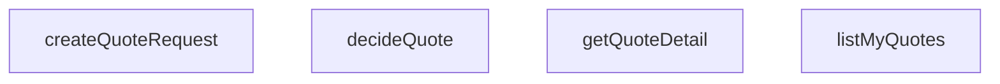

## Genel Bakış
Bu modül, müşteri tekliflerinin (quote) tüm yaşam döngüsünü yöneten temel servis katmanıdır. Teklif taleplerinin oluşturulmasından, kullanıcıya özel listelenmesinden, detaylarının getirilmesinden ve nihai kabul/red kararlarının uygulanmasına kadar tüm iş akışlarını merkezi olarak sağlar. Fonksiyonlar, iş mantığını doğrudan veritabanı istemcisi (Supabase) üzerinden yürütür ve modül, uygulamanın teklif领域ındaki tüm veri işlemlerinden sorumludur.

## Fonksiyon Grupları
### Teklif Oluşturma
Bu grup, yeni bir teklif talebinin iş mantığına uygun şekilde (en az bir kalem içerecek şekilde) başlatılmasını ve veritabanına yazılmasını sağlar.
- `createQuoteRequest`

### Teklif Sorgulama ve Güncelleme
Bu grup, mevcut tekliflerin listelenmesi, detaylarının getirilmesi ve durumlarının (kabul/red) değiştirilmesi işlemlerini kapsar; okuma ve güncelleme odaklıdır.
- `listMyQuotes`, `getQuoteDetail`, `decideQuote`

---

## AXIOMS – Mimari Varsayımlar

Bu modül, teklif yaşam döngüsünü yönetir; tüm veri işlemleri authenticated Supabase istemcisi üzerinden gerçekleştirilir.

[Aksiyom 1]: Eğer Supabase istemcisi (`supabase`) geçerli ve authenticated bir oturum içermiyorsa, `listMyQuotes` fonksiyonu kullanıcıya ait teklifleri listelemez (boş liste veya hata döner).

[Aksiyom 2]: Eğer `createQuoteRequest` için verilen `input` parametresi `CreateQuoteRequestInput` şemasına uymuyorsa, teklif oluşturulamaz (validasyon hatası fırlatılır veya kayıt başarısız olur).

[Aksiyom 3]: Eğer `getQuoteDetail` fonksiyonuna verilen `quoteId` ile eşleşen bir teklif veritabanında mevcut değilse, fonksiyon `null` döner.

[Aksiyom 4]: Eğer `decideQuote` fonksiyonuna verilen `quote.id` ile eşleşen teklif mevcut değilse veya teklifin mevcut durumu (`status`) karar verilebilir bir durumda değilse, karar uygulanamaz (hata fırlatılır).

[Aksiyom 5]: Eğer `decideQuote` fonksiyonuna verilen `decision` parametresi `'accepted'` veya `'rejected'` değerlerinden biri değilse, fonksiyon TypeError fırlatır (TypeScript derleme zamanı garantisi).

[Aksiyom 6]: Eğer `decideQuote` fonksiyonuna verilen `quote` nesnesinin `status` alanı, teklifin veritabanındaki gerçek durumuyla uyuşmuyorsa (örn:Race condition), karar uygulanamaz veya tutarsız durum oluşur.

[Aksiyom 7]: Eğer `listMyQuotes` fonksiyonu çağrıldığında Supabase istemcisi üzerinde RLS (Row Level Security) politikaları aktif değilse, kullanıcı tüm teklifleri görebilir (veri sızıntısı riski).

---

## FONKSİYON DETAYLARI

### createQuoteRequest
**Ne yapar**: Yeni bir teklif talebi (başlık) ve ilişkili teklif kalemlerini oluşturur. Bu, süreçteki ilk adımdır; kalemsiz bir talep oluşturamaz.
**Nasıl yapar**: Fonksiyon, gelen `input` nesnesindeki `items` dizisinin boş olup olmadığını kontrol eder; boşsa hata fırlatır. Ardından `venthub_quotes` tablosuna ana kaydı ekler ve `select().single()` ile oluşturulan satırı geri döner. Başarılı ekleme sonrası, `venthub_quote_items` tablosuna her bir kalem için bir satır ekler. Kalem ekleme işlemi başarısız olursa hata yükseltilir; bu durumda yarı-kalmış bir başlık kaydı (`requested` durumunda) oluşmuş olur, ancak bu kasıtlı bir "fail-closed" (hata durumunda güvenli kapanış) tasarım kararıdır ve usersyenin tekrar denemesine olanak tanır.
**Parametreler**:
- supabase: `SupabaseClient<Database>` — Veritabanı işlemleri için Supabase istemcisi örneği.
- input: `CreateQuoteRequestInput` — Teklif talebinin başlık ve kalem verilerini içeren giriş nesnesi (userId, source, sourceProjectId ve items alanlarını barındırır).
**Dönüş**: `Promise<QuoteRow>` — Yeni oluşturulan teklif başlık satırını döner.

### listMyQuotes
**Ne yapar**: Oturum açmış kullanıcının tüm tekliflerini, her birinin ilgili kalemleriyle birlikte, en yeniden en eskiye doğru sıralı olarak listeler.
**Nasıl yapar**: İki ayrı Supabase sorgusu kullanır. İlk sorguda `venthub_quotes` tablosundan kullanıcının tüm tekliflerini (RLS politikaları tarafından filtrelenerek) `created_at` alanına göre azalan sırada çeker. İkinci sorguda, birinci sorgudaki tüm teklif ID'lerini (`quote_id`) içeren `venthub_quote_items` kayıtlarını çekip `created_at`艺术ına göre artan sırada sıralar. Son olarak, elde edilen kalem listesini `quote_id` alanına göre bir haritada gruplayarak her teklif nesnesine `items` dizisini ekler ve sonucu döner.
**Parametreler**:
- supabase: `SupabaseClient<Database>` — Veritabanı işlemleri için Supabase istemcisi örneği.
**Dönüş**: `Promise<QuoteWithItems[]>` — Her biri `items` alanını içeren teklif nesnelerinden oluşan diziyi döner.

### getQuoteDetail
**Ne yapar**: Belirli bir teklifin detaylı bilgisini, tüm kalemleriyle birlikte getirir. Eğer belirtilen ID ile eşleşen bir kayıt yoksa veya satır düzeyindeki güvenlik (RLS) politikası kaydı filtreliyorsa `null` döner.
**Nasıl yapar**: İlk olarak `venthub_quotes` tablosunda `id` alanı verilen `quoteId` ile eşleşen kaydı `maybeSingle()` kullanarak çeker. Kayıt bulunamazsa `null` döner. Kayıt bulunursa, `venthub_quote_items` tablosunda `quote_id` alanı bu teklife ait olan kalemleri `created_at`艺术ına göre artan sırada çeker ve teklif nesnesinin `items` alanına ekleyerek sonucu döner.
**Parametreler**:
- supabase: `SupabaseClient<Database>` — Veritabanı işlemleri için Supabase istemcisi örneği.
- quoteId: `string` — Detayları getirilecek teklifin benzersiz tanımlayıcısı.
**Dönüş**: `Promise<QuoteWithItems | null>` — Bulunan teklif detayı veya `null`.

### decideQuote
**Ne yapar**: Müşteri tarafında bir teklife yönelik nihai kararı (kabul veya ret) kaydeder ve teklifin durumunu buna göre günceller.
**Nasıl yapar**: İlk olarak mevcut durumdan hedef duruma geçişin iş kurallarına uygun olup olmadığını kontrol eder (`allowedCustomerQuoteActions` fonksiyonuyla). Uygunsa, `venthub_quotes` tablosunda ilgili teklifin `id` alanını eşleştirerek `status` alanını yeni karar (`accepted` veya `rejected`) ile günceller. Geçiş kuralı ihlal edilirse hata fırlatır. Bu kontrol, veritabanı seviyesindeki tetikleyiciler ve RLS politikalarıyla sunucu tarafında da uygulanır.
**Parametreler**:
- supabase: `SupabaseClient<Database>` — Veritabanı işlemleri için Supabase istemcisi örneği.
- quote: `Pick<QuoteRow, 'id' | 'status'>` — Güncellenecek teklifin `id` ve mevcut `status` alanlarını içeren nesne. Bu, fonksiyonun mevcut durumu doğrulaması için gereklidir.
- decision: `Extract<QuoteStatus, 'accepted' | 'rejected'>` — Müşterinin vereceği karar; sadece 'accepted' veya 'rejected' değerlerinden biri olabilir.
**Dönüş**: `Promise<void>` — İşlem başarılıysa herhangi bir değer dönmez; hata oluşursa bir hata fırlatır.

---

## İTHALATLAR (IMPORTS)
- import: ../../types/database.types::type { Database }
- import: @supabase/supabase-js::type { SupabaseClient }

---

## INTERFACES

### QuoteRequestItemInput
- `productId: string | null`
- `productName: string`
- `qty: number`
- `note?: string | null`

### CreateQuoteRequestInput
- `userId: string`
- `source: QuoteSource`
- `sourceProjectId?: string | null`
- `items: QuoteRequestItemInput[]`

### QuoteWithItems extends QuoteRow
- `items: QuoteItemRow[]`

---

## TYPE ALIASES

### QuoteRow
```typescript
type QuoteRow = Database['public']['Tables']['venthub_quotes']['Row']
```

### QuoteItemRow
```typescript
type QuoteItemRow = Database['public']['Tables']['venthub_quote_items']['Row']
```

### QuoteSource
v1 giriş kapıları (cetvel Q4) — DB check kısıtının UI aynası.
```typescript
type QuoteSource = 'pdp' | 'cart' | 'project'
```

---

## AST POINTERS

### [N1_NASIL] AST Pointer: src/lib/services/quoteService.ts::createQuoteRequest
- **params**: (supabase: SupabaseClient<Database>, input: CreateQuoteRequestInput)
- **ic_degiskenler**:
    - `quote` — supabase.from('venthub_quotes').insert().select().single() ile oluşturulan teklif satırı (QuoteRow), returned
    - `error` — quote insert işleminde oluşan hata nesnesi
    - `itemsError` — venthub_quote_items insert işleminde oluşan hata nesnesi
- **Dönüş**: QuoteRow (quote)

### [N2_NASIL] AST Pointer: src/lib/services/quoteService.ts::listMyQuotes
- **params**: (supabase: SupabaseClient<Database>)
- **ic_degiskenler**:
    - `quotes` — supabase.from('venthub_quotes').select().order() ile çekilen tüm teklif satırları dizisi (QuoteRow[])
    - `error` — quotes sorgusunda oluşan hata nesnesi
    - `items` — supabase.from('venthub_quote_items').select().in().order() ile çekilen teklif kalemleri dizisi (QuoteItemRow[])
    - `itemsError` — items sorgusunda oluşan hata nesnesi
    - `byQuote` — quote_id bazında kalemleri gruplayan Map (Map<string, QuoteItemRow[]>)
- **Dönüş**: QuoteWithItems[] (quotes.map ile oluşturulur, her quote'a items eklenir)

### [N3_NASIL] AST Pointer: src/lib/services/quoteService.ts::getQuoteDetail
- **params**: (supabase: SupabaseClient<Database>, quoteId: string)
- **ic_degiskenler**:
    - `quote` — supabase.from('venthub_quotes').select().eq().maybeSingle() ile çekilen tek teklif satırı (QuoteRow | null)
    - `error` — quote sorgusunda oluşan hata nesnesi
    - `items` — supabase.from('venthub_quote_items').select().eq().order() ile çekilen teklif kalemleri dizisi (QuoteItemRow[])
    - `itemsError` — items sorgusunda oluşan hata nesnesi
- **Dönüş**: QuoteWithItems | null (quote ve items birleştirilerek döner, quote yoksa null)

### [N4_NASIL] AST Pointer: src/lib/services/quoteService.ts::decideQuote
- **params**: (supabase: SupabaseClient<Database>, quote: Pick<QuoteRow, 'id' | 'status'>, decision: Extract<QuoteStatus, 'accepted' | 'rejected'>)
- **ic_degiskenler**:
    - `error` — supabase.from('venthub_quotes').update().eq() işleminde oluşan hata nesnesi
- **Dönüş**: void (sadece yan etki: quote.status güncellenir)

---


## MERMAID CALL GRAPH


## NODE ID STANDARD

  file: src\lib\services\quoteService.ts
  function: src\lib\services\quoteService.ts::createQuoteRequest
  function: src\lib\services\quoteService.ts::listMyQuotes
  function: src\lib\services\quoteService.ts::getQuoteDetail
  function: src\lib\services\quoteService.ts::decideQuote

---

## DISA AKTARILANLAR (EXPORTS)
  export: CreateQuoteRequestInput
  export: QuoteItemRow
  export: QuoteRequestItemInput
  export: QuoteRow
  export: QuoteSource
  export: QuoteWithItems
  export: createQuoteRequest
  export: decideQuote
  export: getQuoteDetail
  export: listMyQuotes

---

## BILEŞIM (CONTAINS)
  contains: QuoteRow