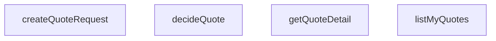

## Genel Bakış
Bu modül, bir teklif (quote) yaşam döngüsünü yönetmekten sorumludur. Tüm veri işlemleri, bağımsız bir veritabanı istemcisi (Supabase) üzerinden gerçekleştirilir; modülün temel amacı, tekliflerin oluşturulması, listelenmesi, detaylarının getirilmesi ve karar (kabul/red) süreçlerinin yürütülmesini sağlamaktır.

## Fonksiyon Grupları
### Teklif İşlem ve Yaşam Döngüsü Yönetimi
Bu grup, bir teklifin tüm süreçlerini – oluşturma, kullanıcıya özel listeleme, detay alma ve nihai karar verme – merkezi olarak yönetir.
- `createQuoteRequest`, yeni bir teklif talebi oluşturur ve sonucu döndürür.
- `listMyaurants`, giriş yapan kullanıcıya ait tüm teklifleri ve ilgili kalemleri getirir.
- `getQuoteDetail`, belirli bir teklifin tüm detaylarını (kalemleriyle birlikte) getirir.
- `decideQuote`, bir teklifin durumunu 'accepted' veya 'rejected' olarak günceller.

---

## AXIOMS – Mimari Varsayımlar

Bu modül, teklif (quote) oluşturma, listeleme, detay görüntüleme ve karar verme işlemlerini yöneten bir servis katmanıdır. Aşağıdaki mimari varsayımlar fonksiyon imzalarından türetilmiştir.

---

## FONKSİYON DETAYLARI

### createQuoteRequest
**Ne yapar**: Yeni bir müşteri teklif talebi oluşturur. Bu talep, bir başlık kaydı ve en az bir kalem kalemi içermelidir; kalemsiz bir talep iş mantığına aykırıdır ve hata ile sonuçlanır.
**Nasıl yapar**: Fonksiyon, girdi nesnesindeki kalem listesinin boş olup olmadığını kontrol ederek başlar. Boşsa bir hata fırlatır. Ardından `withQuotesSchema` fonksiyonu ile veritabanı istemcisini teklif şemasına kısıtlar. İlk olarak `venthub_quotes` tablosuna başlık kaydı ekler ve eklenen kaydın tüm alanlarını (`select().single()`) döndürür. Başlık ID'si kullanılarak `venthub_quote_items` tablosuna toplu olarak kalemler eklenir. Kalem ekleme işlemi başarısız olursa, yarım kalmış bir başlık kaydı veritabanında bırakılır (ticari kayıt silinmez politikası nedeniyle), ancak hata yukarı fırlatılarak kullanıcının yeniden denemesi sağlanır (hatalı durum kapalı dikiş).
**Parametreler**:
- supabase: SupabaseClient<Database> — Veritabanı işlemleri için kullanılan Supabase istemci nesnesi.
- input: CreateQuoteRequestInput — Oluşturulacak teklif talebine ait verileri içeren nesne. `userId`, `source`, opsiyonel `sourceProjectId` ve en az bir eleman içeren `items` dizisini barındırır.
**Dönüş**: Promise<QuoteRow> — Yeni oluşturulan ve veritabanına eklenen teklif başlık kaydını döndürür.

### listMyQuotes
**Ne yapar**: Oturum sahibi (mevcut kullanıcı) tarafından oluşturulan tüm teklif taleplerini, her birine ait kalemlerle birlikte listeler. Sonuçlar en yeniden en eskiye doğru sıralanmıştır.
**Nasıl yapar**: Fonksiyon, `withQuotesSchema` ile şemaya kısıtlanmış veritabanı istemcisi kullanarak `venthub_quotes` tablosundan tüm kayıtları çeker ve `created_at` alanına göre azalan sırayla sıralar. Eğer hiç teklif yoksa boş bir dizi döner. Tekliflerin kalemleri ayrı bir sorgu ile getirilir (ilişki metadata'sı tanımlı olmadığı için). `venthub_quote_items` tablosundan, bir önceki adımda elde edilen teklif ID'lerini içeren (`IN` operatörü ile) ve artan zamana göre sıralanmış kalemler sorgulanır. Son olarak, her teklif nesnesine, ilgili kalemleri eşleştiren bir `items` alanı eklenerek `QuoteWithItems` dizisi oluşturulur.
**Parametreler**:
- supabase: SupabaseClient<Database> — Veritabanı işlemleri için kullanılan Supabase istemci nesnesi.
**Dönüş**: Promise<QuoteWithItems[]> — Kullanıcıya ait tüm tekliflerin ve ilgili kalemlerin dizisi.

### getQuoteDetail
**Ne yapar**: Belirli bir teklif talebinin (başlığın) detayını ve ilgili tüm kalemlerini getirir. Teklif bulunamazsa veya RLS (Satır Seviyesi Güvenlik) politikası tarafından filtrelenirse `null` döner.
**Nasıl yapar**: Fonksiyon, verilen `quoteId` ile `venthub_quotes` tablosunda tek bir kayıt arar (`eq` ve `maybeSingle`). Kayıt bulunamazsa `null` döner. Bulunursa, aynı `quoteId` değerine sahip kalemleri `venthub_quote_items` tablosundan `created_at` artan sırasıyla çeker. Son olarak, teklif başlık nesnesine `items` dizisi eklenerek `QuoteWithItems` nesnesi oluşturulur.
**Parametreler**:
- supabase: SupabaseClient<Database> — Veritabanı işlemleri için kullanılan Supabase istemci nesnesi.
- quoteId: string — Detayları getirilmek istenen teklifin benzersiz tanımlayıcısı.
**Dönüş**: Promise<QuoteWithItems | null> — Belirtilen teklifin detaylarını ve kalemlerini içeren nesne veya bulunamadığında `null`.

### decideQuote
**Ne yapar**: Bir müşteri teklifinin durumunu, belirli bir iş kuralına uygun şekilde günceller. Sadece 'accepted' (kabul) veya 'rejected' (reddet) kararlarına izin verilir.
**Nasıl yapar**: Fonksiyon öncelikle `allowedCustomerQuoteActions` yardımcı fonksiyonunu çağırarak, mevcut `quote.status` değerinden yapılabilecek geçerli müşteri eylemlerini kontrol eder. Verilen `decision` bu eylemler listesinde yoksa bir hata fırlatır. Geçerliyse, `withQuotesSchema` ile şemaya kısıtlanmış veritabanı istemcisi kullanarak ilgili teklifin `status` alanını yeni `decision` değeriyle günceller.
**Parametreler**:
- supabase: SupabaseClient<Database> — Veritabanı işlemleri için kullanılan Supabase istemci nesnesi.
- quote: Pick<QuoteRow, 'id' | 'status'> — Güncellenecek teklifin `id`'sini ve mevcut `status` değerini içeren nesne.
- decision: Extract<QuoteStatus, 'accepted' | 'rejected'> — Müşterinin verdiği karar; sadece 'accepted' veya 'rejected' olabilir.
**Dönüş**: Promise<void> — İşlem başarılı olursa herhangi bir değer dönmez.

---

## İTHALATLAR (IMPORTS)
- import: ../../types/database.types::type { Database }
- import: @supabase/supabase-js::type { SupabaseClient }

---

## INTERFACES

### QuoteRequestItemInput
- `productId: string | null`
- `productName: string`
- `qty: number`
- `note?: string | null`

### CreateQuoteRequestInput
- `userId: string`
- `source: QuoteSource`
- `sourceProjectId?: string | null`
- `items: QuoteRequestItemInput[]`

### QuoteWithItems extends QuoteRow
- `items: QuoteItemRow[]`

---

## AST POINTERS

### [N1_NASIL] AST Pointer: `src/lib/services/quoteService.ts::createQuoteRequest`
- **params**: `supabase: SupabaseClient<Database>`, `input: CreateQuoteRequestInput`
- **ic_degiskenler**:
  - `db` — `withQuotesSchema(supabase)` ile sarılmış supabase istemcisi; venthub_quotes ve venthub_quote_items tablolarına şema bazlı erişim sağlar
  - `quote` — `db.from('venthub_quotes').insert({...}).select().single()` sonucu dönen tek satır; oluşturulan teklif başlığını temsil eder (`QuoteRow`)
  - `error` — quote insert işleminin hata nesnesi; `null` değilse `throw error` ile yukarı fırlatılır
  - `itemsError` — `db.from('venthub_quote_items').insert(...)` sonucu hata nesnesi; kalemler yazılamazsa hatayı yukarı iletir
- **Dönüş**: `QuoteRow` — insert edilen teklif başlık kaydı
- **Yan etkiler**: `venthub_quotes` tablosuna 1 satır, `venthub_quote_items` tablosuna `input.items.length` adet satır insert eder

---

## MERMAID CALL GRAPH

## NODE ID STANDARD

  file: src\lib\services\quoteService.ts
  function: src\lib\services\quoteService.ts::createQuoteRequest
  function: src\lib\services\quoteService.ts::listMyQuotes
  function: src\lib\services\quoteService.ts::getQuoteDetail
  function: src\lib\services\quoteService.ts::decideQuote

---

## DISA AKTARILANLAR (EXPORTS)
  export: CreateQuoteRequestInput
  export: QuoteRequestItemInput
  export: QuoteWithItems
  export: createQuoteRequest
  export: decideQuote
  export: getQuoteDetail
  export: listMyQuotes

---

## BILEŞIM (CONTAINS)
  contains: QuoteRow