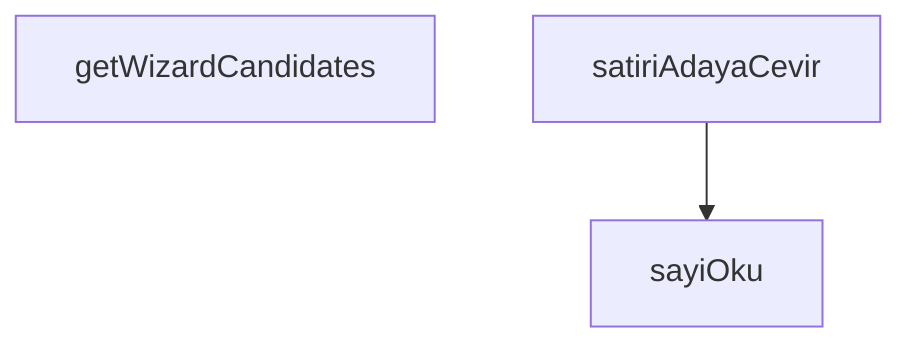

## Genel Bakış

Bu modül, HVAC fan seçim sihirbazı için veritabanından gelen ham ürün verilerinin uygun forma dönüştürülmesi ve sihirbazın kullanacağı aday listesinin hazırlanmasıyla ilgilenir. Supabase üzerinden kategori bazlı sorgulama yaparak fan adaylarını getirir ve ham ürün satırlarını sihirbazın beklediği `FanAdayi` yapısına çevirir.

## Fonksiyon Grupları

### Veri Getirme ve Dönüştürme

Supabase veritabanından belirli bir kategoriye ait ürünleri sorgular ve bunları sihirbazın kullanabileceği aday listesine dönüştürür. Bu grup, modülün ana işlevini üstlenir.

- `getWizardCandidates`, `satiriAdayaCevir`

### Yardımcı Veri Okuma

Veritabanından gelen JSON yapısındaki teknik spesifikasyonlardan (`specs`) belirtilen anahtarlar altında sayısal değerleri güvenli biçimde okur. Null veya eksik veri durumlarını ele alır.

- `sayiOku`

---

## AXIOMS – Mimari Varsayımlar
- Bu modül davranışsal mantık içermez (salt veri / konfigürasyon / tip tanımı).
- [Aksiyom 1]: Modülün dışa açtığı yapı (anahtar kümesi / şema) bir sözleşmedir; tüketiciler bu sabit yapıya bağlıdır — kırıcı değişiklik tüm tüketicileri etkiler.
- [Aksiyom 2]: Bir öğe ekleme/çıkarma yapısal-uyumlu olmalı; ilgili tipler ve seçiciler aynı commit'te güncel tutulmalıdır.

---

## FONKSİYON DETAYLARI

### sayiOku
**Ne yapar**: `technical_specs` objesi içinden verilen anahtar listesindeki ilk dolu ve geçerli sayısal değeri okur. Hiçbir geçerli sayı bulunamazsa `null` döner. Bu fonksiyon, ürün teknik özelliklerinden sayısal verileri güvenli bir şekilde çıkarmak için kullanılır.

**Nasıl yapar**: Öncelikle `specs` parametresinin `null` olup olmadığını kontrol eder; `null` ise hemen `null` döner. Ardından `anahtarlar` dizisi üzerinde sırayla döngüye girer. Her anahtar için `specs` objesinden karşılık gelen ham değeri alır. Ham değer `null` veya `undefined` ise bir sonraki anahtara geçer. Ham değer zaten `number` tipindeyse doğrudan kullanır; değilse string'e dönüştürür ve virgül yerine nokta (`replace(',', '.')`) kullanarak ondalık ayracı standartlaştırır. Elde edilen sayı `Number.isFinite()` ile kontrol edilir; sonlu ve geçerli bir sayıysa hemen döndürülür. Hiçbir anahtar geçerli bir sayı sağlamazsa fonksiyonun sonunda `null` döner.

**Parametreler**:
- specs: `Record<string, DbJson> | null` — Teknik özellikleri içeren sözlük yapısı. `null` olabilir; bu durumda fonksiyon doğrudan `null` döner.
- anahtarlar: `readonly string[]` — `specs` objesi içinde aranacak anahtar adlarının sıralı listesi. İlk bulunan geçerli sayısal değer döndürüldüğünden, öncelik sırası önemlidir.

**Dönüş**: `number | null` — Bulunan ilk geçerli sayısal değer; hiçbir geçerli değer bulunamazsa `null`.

### satiriAdayaCevir
**Ne yapar**: Geliştirildi ancak detay üretilemedi.

### getWizardCandidates
**Ne yapar**: Geliştirildi ancak detay üretilemedi.

---

## İTHALATLAR (IMPORTS)
- import: ./product.columns::VARIANT_DETAIL_COLUMNS
- import: @/lib/hvac/ductFanSelection::type { FanAdayi }
- import: @/types/database.types::type { Database }
- import: @/types/db-rows::type { DbJson, DbProduct }
- import: @/utils/adminQueryFilters::eqValue
- import: @/utils/adminQueryFilters::orConditions
- import: @supabase/supabase-js::type { SupabaseClient }

---

## SABİTLER
- **SPEC_ANAHTARLARI** (as_expression) — `{
  /** Yedek yön güvenli: nominal ≤ max, yani fanı abartmaz. */
  debiM3h:...`

---

## AST POINTERS

### [N1_NASIL] AST Pointer: src/lib/services/wizard.service.ts::sayiOku
- **params**:
  - `specs: Record<string, DbJson> | null` — teknik özellikler sözlüğü; null ise fonksiyon hemen null döner
  - `anahtarlar: readonly string[]` — aranacak anahtar adlarının sıralı listesi
- **ic_degiskenler**:
  - `anahtar` — for-of döngüsü değişkeni; `anahtarlar` dizisindeki her bir anahtar sırayla atanır
  - `ham` — `specs[anahtar]` erişimiyle elde edilen ham değer; null/undefined ise sonraki anahtara geçilir
  - `sayi` — `ham` değerinden üretilen sayı; `ham` zaten number tipindeyse doğrudan atanır, değilse string'e çevrilip virgül noktaya dönüştürülerek `Number()` ile parse edilir
- **Dönüş**: `number | null` — ilk geçerli (finite) sayısal değer veya hiç bulunamazsa null

### [N2_NASIL] AST Pointer: src/lib/services/wizard.service.ts::satiriAdayaCevir
- **params**:
  - `satir: DbProduct` — veritabanından gelen tek ürün satırı
- **ic_degiskenler**:
  - `specs` — `satir.technical_specs` alanına atanan değer; DbJson sözlüğü veya undefined olabilir
- **Dönüş**: `FanAdayi` — şu alanlardan oluşan nesne:
  - `id` ← `satir.id`
  - `sku` ← `satir.sku ?? ''`
  - `ad` ← `satir.name ?? ''`
  - `slug` ← `satir.slug ?? ''`
  - `pqCurveHam` ← `specs?.pq_curve ?? null`
  - `maksDebiM3h` ← `sayiOku(specs, SPEC_ANAHTARLARI.debiM3h)` sonucu
  - `sesDbA` ← `sayiOku(specs, SPEC_ANAHTARLARI.sesDbA)` sonucu
  - `gucW` ← `sayiOku(specs, SPEC_ANAHTARLARI.gucW)` sonucu
  - `capMm` ← `sayiOku(specs, SPEC_ANAHTARLARI.capMm)` sonucu

### [N3_NASIL] AST Pointer: src/lib/services/wizard.service.ts::getWizardCandidates
- **params**:
  - `supabase: SupabaseClient<Database>` — Supabase istemcisi
  - `categorySlug: string` — kategori slug değeri
- **ic_degiskenler**:
  - `kategori` — `supabase.from('categories').select('id').eq('slug', categorySlug).maybeSingle()` sorgusundan dönen `data` destructuring sonucu; bulunamazsa null
  - `kategoriHatasi` — aynı sorgunun `error` destructuring sonucu; varsa throw ile fırlatılır
  - `data` — `supabase.from('products').select(VARIANT_DETAIL_COLUMNS).or(...).eq('status','active').is('deleted_at',null).order('name',{ascending:true})` sorgusundan dönen ürün listesi
  - `error` — products sorgusunun `error` destructuring sonucu; varsa throw ile fırlatılır
- **Dönüş**: `Promise<FanAdayi[]>` — kategori bulunamazsa boş dizi `[]`; bulunursa `data` dizisinin her elemanı `satiriAdayaCevir` ile `FanAdayi`'ye dönüştürülerek döner

---

## MERMAID CALL GRAPH

## NODE ID STANDARD

  file: src\lib\services\wizard.service.ts
  function: src\lib\services\wizard.service.ts::sayiOku
  function: src\lib\services\wizard.service.ts::satiriAdayaCevir
  function: src\lib\services\wizard.service.ts::getWizardCandidates

---

## DISA AKTARILANLAR (EXPORTS)
  export: getWizardCandidates
  export: satiriAdayaCevir
  export: sayiOku