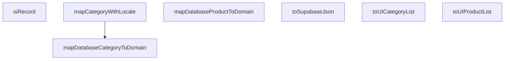

## Genel Bakış

Bu modül, veritabanı ile uygulama arasında veri transferi sırasında tip dönüştürme işlemlerini merkezi olarak yönetir. Supabase'e gönderilecek verilerin JSON serileştirilmesi ve veritabanı tiplerinin uygulama içi kullanım için hazırlanmış domain tiplerine çevrilmesi temel sorumluluklarıdır.

## Fonksiyon Grupları

### Veritabanı → Domain Dönüşümleri
Tek bir veritabanı kaydını karşılık gelen domain nesnesine dönüştürür. Kategori ve ürün olmak üzere iki temel varlık tipi için ayrı haritalama fonksiyonları bulunur; dil desteği gerektiğinde locale bilgisi de işlenir.

- `mapDatabaseCategoryToDomain`, `mapDatabaseProductToDomain`, `mapCategoryWithLocale`

### Toplu Dönüştürücüler
Birden fazla veritabanı kaydını aynı anda domain nesnesi listesine dönüştürerek UI katmanına hazır hale getirir. Tekli haritalama fonksiyonlarını döngü içinde çağırarak toplu dönüşümü basitleştirir.

- `toUICategoryList`, `toUIProductList`

### Serileştirme ve Yardımcı Araçlar
Dış servislere gönderilecek verilerin JSON formatına dönüştürülmesi ve girdi değerlerinin nesne (record) tipinde olup olmadığının kontrolü gibi alt düzey yardımcı işlemleri sağlar.

- `toSupabaseJson`, `isRecord`

---

## AXIOMS – Mimari Varsayımlar

Bu modül, veritabanı tiplerini uygulama katmanı tiplerine dönüştüren bir veri dönüşüm modülüdür. Doğru çalışması için aşağıdaki varsayımlar geçerlidir.

**[Aksiyom 1]**: Eğer `DbCategory` veya `DbProduct` tipleri tanımlı değilse, `mapDatabaseCategoryToDomain`, `mapDatabaseProductToDomain`, `mapCategoryWithLocale`, `toUICategoryList` ve `toUIProductList` fonksiyonları derleme hatası verir.

**[Aksiyom 2]**: Eğer `mapCategoryWithLocale` fonksiyonuna `lang` parametresi olarak `'tr'` veya `'en'` dışında bir değer verilirse, fonksiyonun davranışı tanımsızdır (TypeScript derleme aşamasında engellenir).

**[Aksiyom 3]**: Eğer `toUICategoryList` veya `toUIProductList` fonksiyonlarına `undefined` veya `null` yerine geçerli bir dizi ([]) verilmezse, iç iterasyon hata ile karşılaşır.

**[Aksiyom 4]**: Eğer `toSupabaseJson` fonksiyonuna verilen `data` nesnesi `JSON.stringify` tarafından serileştirilebilir (cyclic referans içermeyen, desteklenen tiplerden oluşan) bir yapı değilse, Supabase'e gönderilebilir geçerli bir JSON çıktısı üretilemez.

**[Aksiyom 5]**: Eğer `mapDatabaseCategoryToDomain` veya `mapDatabaseProductToDomain` fonksiyonlarına verilen veritabanı nesneleri, beklenen alanları (field'ları) içermiyorsa, dönüşüm sonucu eksik veya `undefined` değerler içeren domain nesneleri oluşur.

**[Aksiyom 6]**: Eğer `isRecord` fonksiyonu `null` veya dizi tipinde bir değer alırsa, bu değerler için `false` döndürmelidir (JavaScript'te `typeof null === 'object'` ve `typeof [] === 'object'` durumları).

**[Aksiyom 7]**: Eğer `mapCategoryWithLocale` fonksiyonu locale duyarlı alanları içeren bir DbCategory alırsa, ilgili alanın dil karşılığı (`tr` veya `en`) nesne içinde mevcut olmalıdır; aksi halde dönüşüm sonucu boş veya eksik alan oluşur.

---

## FONKSİYON DETAYLARI

### toSupabaseJson
**Ne yapar**: TypeScript'in karmaşık veri tiplerini, Supabase'in beklediği kesin `Json` tipine güvenli bir şekilde dönüştürür. Bu fonksiyon, unsafe type cast'ler kullanmadan tip güvenliğini korur.

**Nasıl yapar**: Veriyi önce `JSON.stringify` ile string'e çevirir, ardından `JSON.parse` ile geri dönüştürür. Bu round-trip işlemi, TypeScript'in tip çıkarım mekanizmasını doğal şekilde tatmin ederek `Json` tipinin elde edilmesini sağlar.

**Parametreler**:
- `data`: `T` — Supabase'e gönderilmek üzere dönüştürülecek herhangi bir TypeScript nesnesi veya veri yapısı

**Dönüş**: `Json` — Supabase'in kabul ettiği standart JSON tiplerine (string, number, boolean, null, object, array) uygun, güvenli tip garantili nesne

### isRecord
**Ne yapar**: Bilinmeyen bir değerin genel `Record<string, unknown>` türünde olup olmadığını güvenli bir şekilde kontrol eden bir tip koruyucusudur.
**Nasıl yapar**: İç mantığı belirtilmemiştir; bir tip koruyucusu olarak derleme zamanında tip daraltma sağlar.
**Parametreler**:
- value: unknown — Kontrol edilecek değer
**Dönüş**: Belirtilmemiştir (tip koruyucusu olduğundan `value is Record<string, unknown>` döndürmesi beklenir, ancak resmi dönüş tipi verilmemiştir)

### mapDatabaseCategoryToDomain
**Ne yapar**: Veritabanındaki bir `DbCategory` satırını, UI katmanında kullanılmak üzere `DomainCategory` modeline güvenli bir şekilde dönüştürür. Supabase'den gelebilecek `Json`/`Text` tip uyumsuzluklarını merkezi olarak yönetir.
**Nasıl yapar**: Dönüşüm mantığı belirtilmemiştir ancak bu fonksiyon, veritabanı ile domain modeli arasındaki tip farklılıklarını soyutlar.
**Parametreler**:
- dbCat: DbCategory — Dönüştürülecek veritabanı kategori satırı
**Dönüş**: `DomainCategory` — UI için hazırlanmış domain kategorisi modeli

### mapDatabaseProductToDomain
**Ne yapar**: Veritabanındaki bir `DbProduct` satırını, UI katmanında kullanılmak üzere `DomainProduct` modeline güvenli bir şekilde dönüştürür.
**Nasıl yapar**: Dönüşüm mantığı belirtilmemiştir; veritabanı alanlarını domain modelinin beklediği yapıya eşler.
**Parametreler**:
- dbProd: DbProduct — Dönüştürülecek veritabanı ürün satırı
**Dönüş**: `DomainProduct` — UI için hazırlanmış domain ürün modeli

### toUICategoryList
**Ne yapar**: Toplu veri işleme için bir liste dönüştürücüsüdür; birden fazla `DbCategory` nesnesini `DomainCategory` dizisine dönüştürür.
**Nasıl yapar**: İç mantığı belirtilmemiştir; büyük olasılıkla `mapDatabaseCategoryToDomain` fonksiyonunu her bir öğe üzerinde çağırır.
**Parametreler**:
- cats: DbCategory[] — Dönüştürülecek kategorilerin listesi
**Dönüş**: `DomainCategory[]` — UI için hazır domain kategorileri dizisi

### toUIProductList
**Ne yapar**: Toplu veri işleme için bir liste dönüştürücüsüdür; birden fazla `DbProduct` nesnesini `DomainProduct` dizisine dönüştürür.
**Nasıl yapar**: İç mantığı belirtilmemiştir; büyük olasılıkla `mapDatabaseProductToDomain` fonksiyonunu her bir öğe üzerinde çağırır.
**Parametreler**:
- prods: DbProduct[] — Dönüştürülecek ürünlerin listesi
**Dönüş**: `DomainProduct[]` — UI için hazır domain ürünleri dizisi

### mapCategoryWithLocale
**Ne yapar**: Bir `DbCategory` nesnesini `DomainCategory` modeline dönüştürür ve bu sırada aktif dile (`'tr'` veya `'en'`) göre yerelleştirilmiş kategori metaveri alanlarını çözümleyerek runtime `undefined` hatalarını önler.
**Nasıl yapar**: Dönüşüm mantığı belirtilmemiştir; `lang` parametresini kullanarak doğru dildeki metin alanlarını seçer ve domain modeline atar.
**Parametreler**:
- dbCat: DbCategory — Dönüştürülecek veritabanı kategori satırı
- lang: `'tr' | 'en'` — Kullanılacak aktif dil (Türkçe veya İngilizce)
**Dönüş**: `DomainCategory` — UI için hazırlanmış ve yerelleştirilmiş domain kategorisi modeli

---

## AST POINTERS

### [N1_NASIL] AST Pointer: src/lib/type-converters.ts::toSupabaseJson
- **params**: `data: T` — JSON'a dönüştürülecek herhangi bir veri
- **ic_degiskenler**:
  - `JSON.stringify(data)` — Veriyi JSON stringine dönüştürür
  - `JSON.parse(...)` — JSON stringini tekrar parse ederek derin kopya oluşturur
- **Dönüş**: `Json` — Derin kopyalanmış JSON verisi

### [N2_NASIL] AST Pointer: src/lib/type-converters.ts::isRecord
- **params**: `value: unknown` — Kontrol edilecek değer
- **ic_degiskenler**:
  - `typeof value === 'object'` — Değerin object tipinde olup olmadığını kontrol eder
  - `value !== null` — Değerin null olmadığını kontrol eder
  - `!Array.isArray(value)` — Değerin dizi olmadığını kontrol eder
- **Dönüş**: `value is Record<string, unknown>` — Değerin record (nesne) olup olmadığı type guard'ı

### [N3_NASIL] AST Pointer: src/lib/type-converters.ts::mapDatabaseCategoryToDomain
- **params**: `dbCat: DbCategory` — Veritabanından gelen kategori nesnesi
- **ic_degiskenler**:
  - `dbCat.name` — Kategorinin adı (nullsa boş string)
  - `dbCat.menu_label` — Menü etiketi (nullsa name veya boş string)
  - `dbCat.marketing_title` — Pazarlama başlığı (nullsa name veya boş string)
  - `dbCat.description` — Kategori açıklaması (nullsa boş string)
- **Dönüş**: `DomainCategory` — Düzenlenmiş ve garanti altına alınmış string alanlarıyla kategori nesnesi

### [N4_NASIL] AST Pointer: src/lib/type-converters.ts::mapDatabaseProductToDomain
- **params**: `dbProd: DbProduct` — Veritabanından gelen ürün nesnesi
- **ic_degiskenler**:
  - `dbProd.name` — Ürün adı (nullsa boş string)
  - `dbProd.description` — Ürün açıklaması (nullsa boş string)
  - `dbProd.brand` — Marka adı (nullsa 'Venthub' varsayılanı)
- **Dönüş**: `DomainProduct` — Düzenlenmiş ve garanti altına alınmış string alanlarıyla ürün nesnesi

### [N5_NASIL] AST Pointer: src/lib/type-converters.ts::toUICategoryList
- **params**: `cats: DbCategory[]` — Kategori nesneleri dizisi
- **ic_degiskenler**:
  - `mapDatabaseCategoryToDomain` — Her kategoriyi dönüştüren fonksiyon referansı
- **Dönüş**: `DomainCategory[]` — Dönüştürülmüş kategori nesneleri dizisi

### [N6_NASIL] AST Pointer: src/lib/type-converters.ts::toUIProductList
- **params**: `prods: DbProduct[]` — Ürün nesneleri dizisi
- **ic_degiskenler**:
  - `mapDatabaseProductToDomain` — Her ürünü dönüştüren fonksiyon referansı
- **Dönüş**: `DomainProduct[]` — Dönüştürülmüş ürün nesneleri dizisi

### [N7_NASIL] AST Pointer: src/lib/type-converters.ts::mapCategoryWithLocale
- **params**: `dbCat: DbCategory` — Veritabanından gelen kategori nesnesi, `lang: 'tr' | 'en' = 'tr'` — Dil tercihi (varsayılan 'tr')
- **ic_degiskenler**:
  - `mapDatabaseCategoryToDomain(dbCat)` — Veritabanı kategorisini domain modeline dönüştüren çağrı
  - `base` — Dönüştürülmüş temel kategori nesnesi
  - `dbCat.metadata` — Kategorinin metadata alanı (null olabilir)
  - `meta` — dbCat.metadata'nın kendisi
  - `meta[lang]` — Seçilen dil için metadata
  - `meta['tr']` — Türkçe metadata (fallback)
  - `localized` — Dil-specific metadata veya fallback değer
- **Dönüş**: `DomainCategory` — Localized metadata ile zenginleştirilmiş kategori nesnesi

---

## MERMAID CALL GRAPH

## NODE ID STANDARD

  file: src\lib\type-converters.ts
  function: src\lib\type-converters.ts::toSupabaseJson
  function: src\lib\type-converters.ts::isRecord
  function: src\lib\type-converters.ts::mapDatabaseCategoryToDomain
  function: src\lib\type-converters.ts::mapDatabaseProductToDomain
  function: src\lib\type-converters.ts::toUICategoryList
  function: src\lib\type-converters.ts::toUIProductList
  function: src\lib\type-converters.ts::mapCategoryWithLocale

---

## DISA AKTARILANLAR (EXPORTS)
  export: isRecord
  export: mapCategoryWithLocale
  export: mapDatabaseCategoryToDomain
  export: mapDatabaseProductToDomain
  export: toSupabaseJson
  export: toUICategoryList
  export: toUIProductList