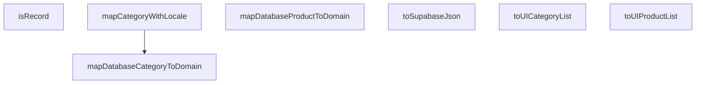

## Genel Bakış
Bu modül, veritabanı (Supabase) katmanı ile uygulama/domain katmanı arasındaki veri dönüşümlerini merkezi olarak yönetir. Veritabanı kayıtlarını domain modellerine dönüştüren mapper fonksiyonları ve genel yardımcı fonksiyonlar içerir.

## Fonksiyon Grupları

### Genel Yardımcı Fonksiyonlar
Genel veri işleme ve doğrulama amaçlı kullanılan, belirli bir domain nesnesine bağlı olmayan yardımcı fonksiyonlardır.
- `toSupabaseJson`, `isRecord`

### Veritabanı-Domain Model Dönüşümleri
Tekil veritabanı kayıtlarını (DbCategory, DbProduct) uygulama katmanındaki karşılık gelen domain modellerine dönüştüren mapper fonksiyonlarıdır. `mapCategoryWithLocale` varyantı, dil bilgisine göre lokalize edilmiş dönüşüm sağlar.
- `mapDatabaseCategoryToDomain`, `mapDatabaseProductToDomain`, `mapCategoryWithLocale`

### Liste Düzeyinde Dönüşümler
Veritabanından gelen kayıt dizilerini toplu olarak domain model listelerine dönüştüren fonksiyonlardır. Tekil mapper fonksiyonlarını liste üzerinde uygulayarak çalışırlar.
- `toUICategoryList`, `toUIProductList`

---

## AXIOMS – Mimari Varsayımlar
- Bu modül davranışsal mantık içermez (salt veri / konfigürasyon / tip tanımı).
- [Aksiyom 1]: Modülün dışa açtığı yapı (anahtar kümesi / şema) bir sözleşmedir; tüketiciler bu sabit yapıya bağlıdır — kırıcı değişiklik tüm tüketicileri etkiler.
- [Aksiyom 2]: Bir öğe ekleme/çıkarma yapısal-uyumlu olmalı; ilgili tipler ve seçiciler aynı commit'te güncel tutulmalıdır.

---

## FONKSİYON DETAYLARI

### toSupabaseJson
**Ne yapar**: Karmaşık TypeScript tiplerini Supabase'in beklediği `Json` tipine güvenli bir şekilde dönüştürür. Güvensiz tip dönüşümlerini (unsafe cast) önlemek amacıyla JSON.parse ve JSON.stringify kullanır; bu yöntem TypeScript'in tip çıkarımını temiz bir şekilde tatmin eder.

**Nasıl yapar**: Veriyi önce `JSON.stringify` ile metin temsiline, ardından `JSON.parse` ile tekrar nesneye çevirir. Bu sayede TypeScript derleyicisi, sonucun `Json` tipiyle uyumlu olduğunu güvenilir biçimde çıkarabilir ve `as` anahtar kelimesiyle yapılan güvensiz dönüşümlere gerek kalmaz.

**Parametreler**:
- data: T — Dönüştürülecek herhangi bir TypeScript verisi. Generic `T` tipi kullanılarak fonksiyon esneklik kazanır.

**Dönüş**: Json — Supabase'in tanımladığı `Json` tipinde, güvenli bir şekilde dönüştürülmüş veri.

### isRecord
**Ne yapar**: Geliştirildi ancak detay üretilemedi.

### mapDatabaseCategoryToDomain
**Ne yapar**: Geliştirildi ancak detay üretilemedi.

### mapDatabaseProductToDomain
**Ne yapar**: Geliştirildi ancak detay üretilemedi.

### toUICategoryList
**Ne yapar**: Geliştirildi ancak detay üretilemedi.

### toUIProductList
**Ne yapar**: Geliştirildi ancak detay üretilemedi.

### mapCategoryWithLocale
**Ne yapar**: Geliştirildi ancak detay üretilemedi.

---

## İTHALATLAR (IMPORTS)
- import: ../types/database.types::type { Json }
- import: ../types/ui-models::type { DomainCategory, DomainProduct }

---

## AST POINTERS

### [N1_NASIL] AST Pointer: src/lib/type-converters.ts::toSupabaseJson
- **params**: `data` — generic T tipinde, JSON'a dönüştürülecek veri
- **ic_degiskenler**: yok
- **Dönüş**: Json — `data` nesnesinin deep-copy klonu (JSON.parse + JSON.stringify zinciriyle)

### [N2_NASIL] AST Pointer: src/lib/type-converters.ts::isRecord
- **params**: `value` — unknown tipinde, sınanacak değer
- **ic_degiskenler**: yok
- **Dönüş**: `value is Record<string, unknown>` — type guard; `value` object ise, null değilse ve dizi değilse `true` döner

### [N3_NASIL] AST Pointer: src/lib/type-converters.ts::mapDatabaseCategoryToDomain
- **params**: `dbCat` — DbCategory tipinde, veritabanından gelen kategori kaydı
- **ic_degiskenler**: yok
- **Dönüş**: DomainCategory — `dbCat` alanlarının spread edilmiş hali; `name`, `menu_label`, `marketing_title`, `description` alanları String() ile dönüştürülür ve boş string fallback'leri uygulanır. `menu_label` boşsa `dbCat.name`'e, `marketing_title` boşsa `dbCat.name`'e düşer.

### [N4_NASIL] AST Pointer: src/lib/type-converters.ts::mapDatabaseProductToDomain
- **params**: `dbProd` — DbProduct tipinde, veritabanından gelen ürün kaydı
- **ic_degiskenler**: yok
- **Dönüş**: DomainProduct — `dbProd` alanlarının spread edilmiş hali; `name` String() ile dönüştürülür (boş string fallback), `description` `dbProd.description_i18n?.tr` alanından alınır (boş string fallback; eski `description` kolonu DROP edilmiş), `brand` String() ile dönüştürülür (varsayılan `'Venthub'`).

### [N5_NASIL] AST Pointer: src/lib/type-converters.ts::toUICategoryList
- **params**: `cats` — DbCategory dizisi, veritabanından gelen kategori listesi
- **ic_degiskenler**: yok
- **Dönüş**: DomainCategory[] — `cats` dizisinin her elemanına `mapDatabaseCategoryToDomain` uygulanmış hali

### [N6_NASIL] AST Pointer: src/lib/type-converters.ts::toUIProductList
- **params**: `prods` — DbProduct dizisi, veritabanından gelen ürün listesi
- **ic_degiskenler**: yok
- **Dönüş**: DomainProduct[] — `prods` dizisinin her elemanına `mapDatabaseProductToDomain` uygulanmış hali

### [N7_NASIL] AST Pointer: src/lib/type-converters.ts::mapCategoryWithLocale
- **params**: `dbCat` — DbCategory tipinde, veritabanından gelen kategori kaydı; `lang` — `'tr' | 'en'` tipinde, varsayılan `'tr'`, istenen dil kodu
- **ic_degiskenler**:
  - `base` — `mapDatabaseCategoryToDomain(dbCat)` çağrısının dönüşü; temel DomainCategory nesnesi (dil bağımsız)
  - `meta` — `dbCat.metadata`; kategorinin ham metadata alanı
  - `localized` — `meta[lang] || meta['tr'] || meta` zincirinden elde edilen CategoryMetadata; önce istenen dil, yoksa `'tr'` fallback, o da yoksa tüm meta nesnesi. `as CategoryMetadata` ile cast edilir.
- **Dönüş**: DomainCategory — `base` nesnesinin spread edilmiş hali üzerine `metadata` alanı: orijinal `meta` ile `localized` nesnesi merge edilir (`...meta, ...localized`), `as LocalizedCategoryMetadata` ile cast edilir. `dbCat.metadata` falsy ise `base` doğrudan döner.

---

## MERMAID CALL GRAPH

## NODE ID STANDARD

  file: type-converters.ts
  function: type-converters.ts::toSupabaseJson
  function: type-converters.ts::isRecord
  function: type-converters.ts::mapDatabaseCategoryToDomain
  function: type-converters.ts::mapDatabaseProductToDomain
  function: type-converters.ts::toUICategoryList
  function: type-converters.ts::toUIProductList
  function: type-converters.ts::mapCategoryWithLocale

---

## DISA AKTARILANLAR (EXPORTS)
  export: isRecord
  export: mapCategoryWithLocale
  export: mapDatabaseCategoryToDomain
  export: mapDatabaseProductToDomain
  export: toSupabaseJson
  export: toUICategoryList
  export: toUIProductList