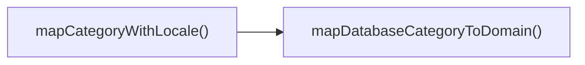

## Genel Bakış
Bu modül, uygulamanın farklı katmanları ve dış servisler arasında veri yapılarını dönüştürmek için kullanılan tip dönüştürücü fonksiyonlar koleksiyonudur. Özellikle veritabanı tiplerini uygulamanın iş katmanı (domain) tiplerine çevirme ve Supabase gibi dış servisler için uyumlu veri formatı oluşturma işlemlerini üstlenir.

---

## AXIOMS – Mimari Varsayımlar  

Bu modül için özel aksiyom tanımlanmamıştır. Ancak fonksiyon imzalarından ve tip bilgilerinden hareketle, modülün doğru çalışması için aşağıdaki koşulların sağlanması gerekir.

**Aksiyom 1**: Eğer `toSupabaseJson` fonksiyonuna verilen `data` nesnesi **JSON‑serileştirilebilir** değilse, Supabase’a gönderilebilecek geçerli bir JSON nesnesi oluşturulamaz ve hata oluşur.  

**Aksiyom 2**: Eğer `isRecord` fonksiyonuna verilen `value` `null` ya da `Array` tipindeyse, fonksiyon `false` döndürür; aksi takdirde `value` bir `object` (record) ise `true` döndürür.  

**Aksiyom 3**: Eğer `mapDatabaseCategoryToDomain` fonksiyonuna verilen `dbCat` `DbCategory` tipinde **geçerli bir kayıt** (tüm zorunlu alanlar tanımlı) değilse, dönüşüm sırasında eksik alan hatası ortaya çıkar ve fonksiyon beklenen `DomainCategory` nesnesini üretmez.  

**Aksiyom 4**: Eğer `mapDatabaseProductToDomain` fonksiyonuna verilen `dbProd` `DbProduct` tipinde **geçerli bir kayıt** (zorunlu alanlar eksiksiz) değilse, dönüşüm başarısız olur ve fonksiyon `undefined`/hata fırlatır.  

**Aksiyom 5**: Eğer `toUICategoryList` fonksiyonuna verilen `cats` dizisi içinde **her bir eleman** `DbCategory` tipinde değilse, fonksiyon geçerli bir `UICategory[]` listesi oluşturamaz ve tip uyumsuzluğu hatası oluşur.  

**Aksiyom 6**: Eğer `toUIProductList` fonksiyonuna verilen `prods` dizisi içinde **her bir eleman** `DbProduct` tipinde değilse, fonksiyon geçerli bir `UIProduct[]` listesi oluşturamaz ve tip uyumsuzluğu hatası oluşur.  

**Aksiyom 7**: Eğer `mapCategoryWithLocale` fonksiyonuna verilen `lang` değeri `'tr'` ya da `'en'` dışındaki bir string ise, fonksiyon locale‑spesifik dönüşüm yapamaz ve varsayılan (bilinmeyen) dil işleme mantığı uygulanır (genellikle `'en'` tercih edilir).  

**Domain‑specific kurallar**  
- `mapCategoryWithLocale` için kabul edilen dil kodları kesinlikle `'tr'` veya `'en'` olmalıdır; başka bir değer **bilinmiyor** ve tanımsız davranışa yol açar.  
- Liste dönüşüm fonksiyonları (`toUICategoryList`, `toUIProductList`) **dizinin boş olması** durumunda da geçerli bir boş UI listesi (`[]`) döndürmelidir; aksi takdirde `null`/`undefined` döndürülmesi hatalı kabul edilir.

---

## FONKSIYON DETAYLARI

### toSupabaseJson
**Ne yapar**: Karmaşık TypeScript tiplerini Supabase'in kesin `Json` tipine, güvensiz cast'ler kullanmadan güvenli bir şekilde dönüştürür.
**Nasıl yapar**: JSON ayrıştırma (JSON.parse/JSON.stringify) kullanarak TypeScript tip çıkarımını karşılar, böylece tip güvenliği sağlanır.
**Parametreler**:
- data: T — Dönüştürülecek kaynak veri
**Dönüş**: `Json` — Dönüştürülmüş, Supabase uyumlu JSON nesnesi

### isRecord
**Ne yapar**: Bilinmeyen bir değerin genel `Record<string, unknown>` türünde olup olmadığını güvenli bir şekilde kontrol eden bir tip koruyucusudur.
**Nasıl yapar**: İç mantığı belirtilmemiştir; bir tip koruyucusu olarak derleme zamanında tip daraltma sağlar.
**Parametreler**:
- value: unknown — Kontrol edilecek değer
**Dönüş**: Belirtilmemiştir (tip koruyucusu olduğundan `value is Record<string, unknown>` döndürmesi beklenir, ancak resmi dönüş tipi verilmemiştir)

### mapDatabaseCategoryToDomain
**Ne yapar**: Veritabanındaki bir `DbCategory` satırını, UI katmanında kullanılmak üzere `DomainCategory` modeline güvenli bir şekilde dönüştürür. Supabase'den gelebilecek `Json`/`Text` tip uyumsuzluklarını merkezi olarak yönetir.
**Nasıl yapar**: Dönüşüm mantığı belirtilmemiştir ancak bu fonksiyon, veritabanı ile domain modeli arasındaki tip farklılıklarını soyutlar.
**Parametreler**:
- dbCat: DbCategory — Dönüştürülecek veritabanı kategori satırı
**Dönüş**: `DomainCategory` — UI için hazırlanmış domain kategorisi modeli

### mapDatabaseProductToDomain
**Ne yapar**: Veritabanındaki bir `DbProduct` satırını, UI katmanında kullanılmak üzere `DomainProduct` modeline güvenli bir şekilde dönüştürür.
**Nasıl yapar**: Dönüşüm mantığı belirtilmemiştir; veritabanı alanlarını domain modelinin beklediği yapıya eşler.
**Parametreler**:
- dbProd: DbProduct — Dönüştürülecek veritabanı ürün satırı
**Dönüş**: `DomainProduct` — UI için hazırlanmış domain ürün modeli

### toUICategoryList
**Ne yapar**: Toplu veri işleme için bir liste dönüştürücüsüdür; birden fazla `DbCategory` nesnesini `DomainCategory` dizisine dönüştürür.
**Nasıl yapar**: İç mantığı belirtilmemiştir; büyük olasılıkla `mapDatabaseCategoryToDomain` fonksiyonunu her bir öğe üzerinde çağırır.
**Parametreler**:
- cats: DbCategory[] — Dönüştürülecek kategorilerin listesi
**Dönüş**: `DomainCategory[]` — UI için hazır domain kategorileri dizisi

### toUIProductList
**Ne yapar**: Toplu veri işleme için bir liste dönüştürücüsüdür; birden fazla `DbProduct` nesnesini `DomainProduct` dizisine dönüştürür.
**Nasıl yapar**: İç mantığı belirtilmemiştir; büyük olasılıkla `mapDatabaseProductToDomain` fonksiyonunu her bir öğe üzerinde çağırır.
**Parametreler**:
- prods: DbProduct[] — Dönüştürülecek ürünlerin listesi
**Dönüş**: `DomainProduct[]` — UI için hazır domain ürünleri dizisi

### mapCategoryWithLocale
**Ne yapar**: Bir `DbCategory` nesnesini `DomainCategory` modeline dönüştürür ve bu sırada aktif dile (`'tr'` veya `'en'`) göre yerelleştirilmiş kategori metaveri alanlarını çözümleyerek runtime `undefined` hatalarını önler.
**Nasıl yapar**: Dönüşüm mantığı belirtilmemiştir; `lang` parametresini kullanarak doğru dildeki metin alanlarını seçer ve domain modeline atar.
**Parametreler**:
- dbCat: DbCategory — Dönüştürülecek veritabanı kategori satırı
- lang: `'tr' | 'en'` — Kullanılacak aktif dil (Türkçe veya İngilizce)
**Dönüş**: `DomainCategory` — UI için hazırlanmış ve yerelleştirilmiş domain kategorisi modeli

---

## AST POINTERS

### [N1_NASIL] AST Pointer: C:\Users\alize\venthub-hvac\src\lib\type-converters.ts::toSupabaseJson
- **params**: (data: T)
- **ic_degiskenler**:
  - `data` — dönüştürülmek istenen herhangi bir tipteki değer; JSON uyumlu bir nesne haline getirilir.
- **Dönüş**: Json — `JSON.parse(JSON.stringify(data))` ifadesiyle elde edilen derin kopya JSON nesnesi.

### [N2_NASIL] AST Pointer: C:\Users\alize\venthub-hvac\src\lib\type-converters.ts::isRecord
- **params**: (value: unknown)
- **ic_degiskenler**:
  - `value` — tip kontrolü yapılan değişken; nesne olup olmadığı ve dizi olmaması kontrol edilir.
- **Dönüş**: yok — tip koruyucu `value is Record<string, unknown>` ifadesiyle `value`'nun bir kayıt (record) olduğunu belirtir.

### [N3_NASIL] AST Pointer: C:\Users\alize\venthub-hvac\src\lib\type-converters.ts::mapDatabaseCategoryToDomain
- **params**: (dbCat: DbCategory)
- **ic_degiskenler**:
  - `dbCat` — veritabanından gelen kategori nesnesi; alanları dönüştürülerek domain modeline aktarılır.
- **Dönüş**: DomainCategory — `dbCat` nesnesinin kopyası üzerine string dönüşümleri uygulanmış yeni nesne.

### [N4_NASIL] AST Pointer: C:\Users\alize\venthub-hvac\src\lib\type-converters.ts::mapDatabaseProductToDomain
- **params**: (dbProd: DbProduct)
- **ic_degiskenler**:
  - `dbProd` — veritabanından gelen ürün nesnesi; alanları dönüştürülerek domain modeline aktarılır.
- **Dönüş**: DomainProduct — `dbProd` nesnesinin kopyası üzerine string dönüşümleri uygulanmış yeni nesne.

### [N5_NASIL] AST Pointer: C:\Users\alize\venthub-hvac\src\lib\type-converters.ts::toUICategoryList
- **params**: (cats: DbCategory[])
- **ic_degiskenler**:
  - `cats` — veritabanı kategorileri dizisi; her eleman `mapDatabaseCategoryToDomain` fonksiyonuna gönderilir.
- **Dönüş**: DomainCategory[] — `cats.map(mapDatabaseCategoryToDomain)` sonucu elde edilen domain kategori listesi.

### [N6_NASIL] AST Pointer: C:\Users\alize\venthub-hvac\src\lib\type-converters.ts::toUIProductList
- **params**: (prods: DbProduct[])
- **ic_degiskenler**:
  - `prods` — veritabanı ürünleri dizisi; her eleman `mapDatabaseProductToDomain` fonksiyonuna gönderilir.
- **Dönüş**: DomainProduct[] — `prods.map(mapDatabaseProductToDomain)` sonucu elde edilen domain ürün listesi.

### [N7_NASIL] AST Pointer: C:\Users\alize\venthub-hvac\src\lib\type-converters.ts::mapCategoryWithLocale
- **params**: (dbCat: DbCategory, lang: 'tr' | 'en' = 'tr')
- **ic_degiskenler**:
  - `dbCat` — veritabanı kategorisi; temel domain nesnesi oluşturulur ve locale metadata eklenir.
  - `lang` — istenen dil kodu; varsayılan `'tr'`.
  - `base` — `mapDatabaseCategoryToDomain(dbCat)` çağrısıyla elde edilen temel domain kategori nesnesi.
  - `meta` — `dbCat.metadata` ifadesiyle alınan metadata nesnesi; mevcutsa kullanılır.
  - `localized` — `meta[lang] || meta['tr'] || meta` ifadesiyle seçilen locale-specific metadata; `CategoryMetadata` tipinde.
- **Dönüş**: DomainCategory — `base` nesnesine locale‑specific metadata birleştirilerek döndürülür.

---

## ÇAĞRI HARİTASI

### Disariya Çağrılar (Outgoing)  
- **mapCategoryWithLocale** fonksiyonu, veri tabanı kategorisini alan modeline dönüştürmek için **mapDatabaseCategoryToDomain** fonksiyonunu çağırır.

### Disarıdan Çağrılanlar (Incoming)  
- Bu modülü kullanan dış dosya veya fonksiyon bilgisi verilmemiştir.

### İç İç Fonksiyonlar (Nested)  
- Yok.

---

## DOSYA-İÇİ ÇAĞRI GRAFİĞİ
  mapCategoryWithLocale() → mapDatabaseCategoryToDomain()

---

## NODE ID STANDARD

  file: src\lib\type-converters.ts
  function: src\lib\type-converters.ts::toSupabaseJson
  function: src\lib\type-converters.ts::isRecord
  function: src\lib\type-converters.ts::mapDatabaseCategoryToDomain
  function: src\lib\type-converters.ts::mapDatabaseProductToDomain
  function: src\lib\type-converters.ts::toUICategoryList
  function: src\lib\type-converters.ts::toUIProductList
  function: src\lib\type-converters.ts::mapCategoryWithLocale

---

## DISA AKTARILANLAR (EXPORTS)
  export: isRecord
  export: mapCategoryWithLocale
  export: mapDatabaseCategoryToDomain
  export: mapDatabaseProductToDomain
  export: toSupabaseJson
  export: toUICategoryList
  export: toUIProductList