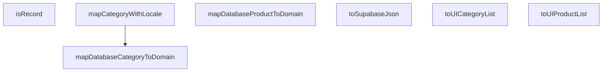

## Genel Bakış
Bu modül, Supabase veritabanı ile uygulama arasındaki veri akışını kolaylaştıran merkezi bir dönüşüm katmanıdır. Ham veritabanı kayıtlarını uygulama içinde kullanıma uygun, zenginleştirilmiş domain nesnelerine dönüştürmek ve dış servislere gönderilecek verileri JSON formatına hazırlamak temel sorumluluklarıdır.

## Fonksiyon Grupları
### Veritabanı Kayıtlarını Domain Nesnelerine Dönüştürme
Tek bir veritabanı kaydını (kategori veya ürün) karşılık gelen uygulama içi domain nesnesine dönüştürür. Dil desteği gerektiğinde locale ayarına göre alanları haritalandırarak zenginleştirilmiş bir nesne oluşturur.

- `mapDatabaseCategoryToDomain`, `mapDatabaseProductToDomain`, `mapCategoryWithLocale`

### Toplu Dönüşüm İşlemleri
Birden fazla veritabanı kaydını (kategori listesi veya ürün listesi) aynı anda domain nesneleri koleksiyonuna dönüştürerek UI katmanına veri sağlamak için gerekli toplu dönüşümü basitleştirir.

- `toUICategoryList`, `toUIProductList`

### Yardımcı Dönüştürme ve Doğrulama Araçları
Verileri dış servislere (Supabase) gönderilmek üzere JSON formatına serileştirmek ve girdi değerlerinin nesne yapısında olup olmadığını kontrol etmek için gerekli düşük seviyeli yardımcı araçları sağlar.

- `toSupabaseJson`, `isRecord`

---

## AXIOMS – Mimari Varsayımlar

Bu modül, veritabanı tiplerinden uygulama içi domain tiplerine veri dönüşümü yaptığı için, girdi verilerinin beklenen yapıda (shape) olması temel varsayımdır. Aksi takdirde dönüşüm hataları, eksik veriler veya çalışma zamanı hataları oluşur.

[Aksiyom 1]: Eğer `toSupabaseJson` fonksiyonuna geçilen `data` parametresi, JavaScript nesne serileştirme (JSON.stringify) işlemine uygun, döngüsel referans içermeyen geçerli bir veri yapısı değilse, fonksiyon beklenmeyen bir hata fırlatır veya geçersiz bir JSON dizesi üretir.

[Aksiyom 2]: Eğer `isRecord` fonksiyonuna geçilen `value` parametresi `null` veya `undefined` ise, fonksiyon `false` döndürür.

[Aksiyom 3]: Eğer `mapDatabaseCategoryToDomain` fonksiyonuna geçilen `dbCat` parametresi, `DbCategory` tipinin tanımladığı zorunlu alanları (örn: `id`, `name_tr`, `name_en` gibi alanlar) içermiyorsa, fonksiyonun içinde yapılacak alan erişiminde (`dbCat.xxx`) bir `undefined` hatası oluşur veya eksik alanları olan hatalı bir domain nesnesi üretilir.

[Aksiyom 4]: Eğer `mapDatabaseProductToDomain` fonksiyonuna geçilen `dbProd` parametresi, `DbProduct` tipinin tanımladığı zorunlu alanları içermiyorsa, benzer şekilde alan erişim hataları veya eksik alanlı domain nesnesi oluşur.

[Aksiyom 5]: Eğer `toUICategoryList` veya `toUIProductList` fonksiyonlarına geçilen dizi (`DbCategory[]` veya `DbProduct[]`) boş bir dizi (`[]`) ise, fonksiyonlar sırasıyla boş bir `UICategory[]` veya `UIProduct[]` dizi döndürür.

[Aksiyom 6]: Eğer `mapCategoryWithLocale` fonksiyonuna geçilen `lang` parametresi, fonksiyon imzasında belirtilen `'tr' | 'en'` birleşim tipine uymayan bir değerse (örn: kodun TypeScript olmayan bir ortamda çalıştırılması durumunda), fonksiyonun dil bazlı alan seçme mantığı (`name_tr` veya `name_en` arasında geçiş) bozulur ve beklenmeyen bir alan değeri (`undefined`) döner.

[Aksiyom 7]: Bu modüldeki tüm haritalama fonksiyonları (`mapDatabaseCategoryToDomain`, `mapDatabaseProductToDomain`, `mapCategoryWithLocale`), veritabanı şemasındaki alan isimleri ile domain modelindeki alan isimleri arasında önceden tanımlı, sabit bir eşleşme olduğu varsayımıyla çalışır. Veritabanı şemasında alan ismi değişikliği yapılırsa bu fonksiyonların güncel gerekir.

---

## FONKSİYON DETAYLARI

### toSupabaseJson
**Ne yapar**: TypeScript'in karmaşık veri tiplerini, Supabase'in beklediği kesin `Json` tipine güvenli bir şekilde dönüştürür. Bu fonksiyon, unsafe type cast'ler kullanmadan tip güvenliğini korur.

**Nasıl yapar**: Veriyi önce `JSON.stringify` ile string'e çevirir, ardından `JSON.parse` ile geri dönüştürür. Bu round-trip işlemi, TypeScript'in tip çıkarım mekanizmasını doğal şekilde tatmin ederek `Json` tipinin elde edilmesini sağlar.

**Parametreler**:
- `data`: `T` — Supabase'e gönderilmek üzere dönüştürülecek herhangi bir TypeScript nesnesi veya veri yapısı

**Dönüş**: `Json` — Supabase'in kabul ettiği standart JSON tiplerine (string, number, boolean, null, object, array) uygun, güvenli tip garantili nesne

### isRecord
**Ne yapar**: Bilinmeyen bir değerin genel `Record<string, unknown>` türünde olup olmadığını güvenli bir şekilde kontrol eden bir tip koruyucusudur.
**Nasıl yapar**: İç mantığı belirtilmemiştir; bir tip koruyucusu olarak derleme zamanında tip daraltma sağlar.
**Parametreler**:
- value: unknown — Kontrol edilecek değer
**Dönüş**: Belirtilmemiştir (tip koruyucusu olduğundan `value is Record<string, unknown>` döndürmesi beklenir, ancak resmi dönüş tipi verilmemiştir)

### mapDatabaseCategoryToDomain
**Ne yapar**: Veritabanındaki bir `DbCategory` satırını, UI katmanında kullanılmak üzere `DomainCategory` modeline güvenli bir şekilde dönüştürür. Supabase'den gelebilecek `Json`/`Text` tip uyumsuzluklarını merkezi olarak yönetir.
**Nasıl yapar**: Dönüşüm mantığı belirtilmemiştir ancak bu fonksiyon, veritabanı ile domain modeli arasındaki tip farklılıklarını soyutlar.
**Parametreler**:
- dbCat: DbCategory — Dönüştürülecek veritabanı kategori satırı
**Dönüş**: `DomainCategory` — UI için hazırlanmış domain kategorisi modeli

### mapDatabaseProductToDomain
**Ne yapar**: Veritabanındaki bir `DbProduct` satırını, UI katmanında kullanılmak üzere `DomainProduct` modeline güvenli bir şekilde dönüştürür.
**Nasıl yapar**: Dönüşüm mantığı belirtilmemiştir; veritabanı alanlarını domain modelinin beklediği yapıya eşler.
**Parametreler**:
- dbProd: DbProduct — Dönüştürülecek veritabanı ürün satırı
**Dönüş**: `DomainProduct` — UI için hazırlanmış domain ürün modeli

### toUICategoryList
**Ne yapar**: Toplu veri işleme için bir liste dönüştürücüsüdür; birden fazla `DbCategory` nesnesini `DomainCategory` dizisine dönüştürür.
**Nasıl yapar**: İç mantığı belirtilmemiştir; büyük olasılıkla `mapDatabaseCategoryToDomain` fonksiyonunu her bir öğe üzerinde çağırır.
**Parametreler**:
- cats: DbCategory[] — Dönüştürülecek kategorilerin listesi
**Dönüş**: `DomainCategory[]` — UI için hazır domain kategorileri dizisi

### toUIProductList
**Ne yapar**: Toplu veri işleme için bir liste dönüştürücüsüdür; birden fazla `DbProduct` nesnesini `DomainProduct` dizisine dönüştürür.
**Nasıl yapar**: İç mantığı belirtilmemiştir; büyük olasılıkla `mapDatabaseProductToDomain` fonksiyonunu her bir öğe üzerinde çağırır.
**Parametreler**:
- prods: DbProduct[] — Dönüştürülecek ürünlerin listesi
**Dönüş**: `DomainProduct[]` — UI için hazır domain ürünleri dizisi

### mapCategoryWithLocale
**Ne yapar**: Bir `DbCategory` nesnesini `DomainCategory` modeline dönüştürür ve bu sırada aktif dile (`'tr'` veya `'en'`) göre yerelleştirilmiş kategori metaveri alanlarını çözümleyerek runtime `undefined` hatalarını önler.
**Nasıl yapar**: Dönüşüm mantığı belirtilmemiştir; `lang` parametresini kullanarak doğru dildeki metin alanlarını seçer ve domain modeline atar.
**Parametreler**:
- dbCat: DbCategory — Dönüştürülecek veritabanı kategori satırı
- lang: `'tr' | 'en'` — Kullanılacak aktif dil (Türkçe veya İngilizce)
**Dönüş**: `DomainCategory` — UI için hazırlanmış ve yerelleştirilmiş domain kategorisi modeli

---

## AST POINTERS

### [N1_NASIL] AST Pointer: type-converters.ts::toSupabaseJson
- **params**: `data: T` — JSON' dönüştürülecek herhangi bir tipte veri
- **ic_degiskenler**:
  - `JSON.parse(JSON.stringify(data))` — veri önce string'e serialize edilip sonra parse edilerek derin bir kopya oluşturulur; bu işlem ile `T` tipi `Json` tipine dönüştürülür
- **Dönüş**: `Json` — derin kopya oluşturulmuş ve Json türüne cast edilmiş veri

### [N2_NASIL] AST Pointer: type-converters.ts::isRecord
- **params**: `value: unknown` — kontrol edilecek herhangi bir değer
- **ic_degiskenler**: (yok)
- **Dönüş**: `value is Record<string, unknown>` — value'nun nesne olup olmadığı (array ve null olmayan), type guard sonucu

### [N3_NASIL] AST Pointer: type-converters.ts::mapDatabaseCategoryToDomain
- **params**: `dbCat: DbCategory` — veritabanından gelen kategori nesnesi
- **ic_degiskenler**:
  - `dbCat.name` — kategorinin adı; String() ile string'e çevrilir, boş ise boş string fallback'i alınır
  - `dbCat.menu_label` — menü etiketi; String() ile string'e çevrilir, boş ise dbCat.name fallback'i alınır
  - `dbCat.marketing_title` — pazarlama başlığı; String() ile string'e çevrilir, boş ise dbCat.name fallback'i alınır
  - `dbCat.description` — kategori açıklaması; String() ile string'e çevrilir, boş ise boş string fallback'i alınır
- **Dönüş**: `DomainCategory` — dbCat'in tüm alanlarını yayarak String() güvenliğine geçirilmiş name, menu_label, marketing_title, description alanlarıyla dönen domain nesnesi

### [N4_NASIL] AST Pointer: type-converters.ts::mapDatabaseProductToDomain
- **params**: `dbProd: DbProduct` — veritabanından gelen ürün nesnesi
- **ic_degiskenler**:
  - `dbProd.name` — ürün adı; String() ile string'e çevrilir, boş ise boş string fallback'i alınır
  - `dbProd.description` — ürün açıklaması; String() ile string'e çevrilir, boş ise boş string fallback'i alınır
  - `dbProd.brand` — ürün markası; String() ile string'e çevrilir, boş ise `'Venthub'` fallback'i alınır
- **Dönüş**: `DomainProduct` — dbProd'un tüm alanlarını yayarak String() güvenliğine geçirilmiş name, description, brand alanlarıyla dönen domain nesnesi

### [N5_NASIL] AST Pointer: type-converters.ts::toUICategoryList
- **params**: `cats: DbCategory[]` — DbCategory dizisi
- **ic_degiskenler**: (yok)
- **Dönüş**: `DomainCategory[]` — cats dizisi üzerinde `mapDatabaseCategoryToDomain` fonksiyonu uygulanarak elde edilen DomainCategory dizisi

### [N6_NASIL] AST Pointer: type-converters.ts::toUIProductList
- **params**: `prods: DbProduct[]` — DbProduct dizisi
- **ic_degiskenler**: (yok)
- **Dönüş**: `DomainProduct[]` — prods dizisi üzerinde `mapDatabaseProductToDomain` fonksiyonu uygulanarak elde edilen DomainProduct dizisi

### [N7_NASIL] AST Pointer: type-converters.ts::mapCategoryWithLocale
- **params**: `dbCat: DbCategory` — veritabanından gelen kategori nesnesi; `lang: 'tr' | 'en'` — dil kodu, varsayılan `'tr'`
- **ic_degiskenler**:
  - `base` — `mapDatabaseCategoryToDomain(dbCat)` çağrısıyla elde edilen temel DomainCategory nesnesi; fonksiyonun dönüş değeri olarak kullanılır (metadata yoksa doğrudan döner)
  - `dbCat.metadata` — kategorinin ham metadata nesnesi; falsy ise base döner
  - `meta` — `dbCat.metadata` referansı; metadata objesinin kendisi
  - `localized` — `meta[lang]` ya da `meta['tr']` ya da `meta` fallback'i ile elde edilen dil-specific CategoryMetadata nesnesi; `as CategoryMetadata` ile cast edilir
- **Dönüş**: `DomainCategory` — base'in tüm alanları加上 `metadata` alanı ile genişletilmiş; metadata içeriği `...meta` (tüm diller) üzerine `...localized` (seçili dil) yazılarak birleştirilmiş DomainCategory nesnesi

---

## MERMAID CALL GRAPH

## NODE ID STANDARD

  file: src\lib\type-converters.ts
  function: src\lib\type-converters.ts::toSupabaseJson
  function: src\lib\type-converters.ts::isRecord
  function: src\lib\type-converters.ts::mapDatabaseCategoryToDomain
  function: src\lib\type-converters.ts::mapDatabaseProductToDomain
  function: src\lib\type-converters.ts::toUICategoryList
  function: src\lib\type-converters.ts::toUIProductList
  function: src\lib\type-converters.ts::mapCategoryWithLocale

---

## DISA AKTARILANLAR (EXPORTS)
  export: isRecord
  export: mapCategoryWithLocale
  export: mapDatabaseCategoryToDomain
  export: mapDatabaseProductToDomain
  export: toSupabaseJson
  export: toUICategoryList
  export: toUIProductList