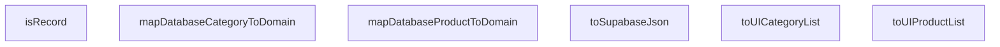

## Genel Bakış
Bu modül, VentHub HVAC projesinin farklı yazılım katmanları arasında tip güvenliği sağlayan veri dönüşümleri gerçekleştiren merkezi bir yardımcı modülüdür. Supabase gibi harici servisler, veritabanı katmanı, uygulama domaini ve kullanıcı arayüzü arasında kullanılan uyumsuz veri tiplerinin birbirine dönüştürülmesi, tip doğrulaması ve model eşleme işlemlerini üstlenir. Tüm dönüşüm süreçlerini tek bir noktada toplayarak kod tekrarını önler ve tip kaynaklı hataları engeller.

## Fonksiyon Grupları
### Temel Tip Kontrolü ve Serileştirme
Genel amaçlı tip doğrulama ve harici servisler için veri serileştirme işlemlerini gerçekleştirir, tüm dönüşüm süreçlerinde kullanılan temel yardımcı fonksiyonları barındırır.
- isRecord, toSupabaseJson

### Veritabanı-Domain Tekil Eşleme Fonksiyonları
Veritabanından gelen tekil kategori ve ürün nesnelerini, uygulamanın iç işleyişinde kullanılan domain model tiplerine dönüştüren eşleme fonksiyonlarını içerir. Veritabanı şeması ile domain modeli arasındaki farklılıkları gidererek güvenli veri aktarımı sağlar.
- mapDatabaseCategoryToDomain, mapDatabaseProductToDomain

### Kullanıcı Arayüzü için Toplu Dönüşüm Fonksiyonları
Veritabanından gelen çoklu öğe içeren kategori ve ürün listelerini, kullanıcı arayüzünde doğrudan kullanılabilecek domain tiplerine toplu olarak dönüştürür. Arayüz katmanının veri hazırlama ihtiyacını tek seferde karşılar.
- toUICategoryList, toUIProductList

---

## AXIOMS – Mimari Varsayımlar
Bu modül, Supabase veritabanından gelen veri tiplerini domain ve UI katmanlarında kullanılabilecek formata dönüştüren, ayrıca domain verilerini Supabase ile uyumlu JSON formatına çeviren tip dönüşüm modülüdür; tüm dönüşüm fonksiyonlarının hatasız çalışması için girdi olarak alınan nesnelerin ilgili türlerin gerektirdiği tüm zorunlu alanlara sahip olması şarttır.

[Aksiyom 1]: Eğer toSupabaseJson fonksiyonuna girdi verilen data nesnesinin T tipinin tüm zorunlu alanlarına sahip olma koşulu yoksa, Supabase tarafından reddedilen veya eksik alanlı veritabanı kaydı oluşturulmasına neden olur.
[Aksiyom 2]: Eğer isRecord tip kontrol fonksiyonuna girdi verilen value nesnesinin geçerli nesne türünde olma koşulu yoksa, modül içi tüm tip koruma mekanizmalarının devre dışı kalması ve runtime hataları oluşmasına yol açar.
[Aksiyom 3]: Eğer mapDatabaseCategoryToDomain fonksiyonuna girdi verilen dbCat nesnesinin DbCategory tipinin tüm zorunlu alanlarına sahip olma koşulu yoksa, domain katmanında kullanılacak kategori nesnesinin eksik veriler içermesine ve kategori bazlı tüm iş süreçlerinde hata oluşmasına neden olur.
[Aksiyom 4]: Eğer mapDatabaseProductToDomain fonksiyonuna girdi verilen dbProd nesnesinin DbProduct tipinin tüm zorunlu alanlarına sahip olma koşulu yoksa, domain katmanındaki ürün nesnesinin veri tutarsızlığı içermesine ve ürün iş akışlarında hatalar ortaya çıkmasına yol açar.
[Aksiyom 5]: Eğer toUICategoryList fonksiyonuna girdi verilen cats dizisinin tüm öğelerinin geçerli DbCategory nesnesi olma koşulu yoksa, UI tarafında görüntülenecek kategori listesinin eksik veya hatalı öğeler içermesine, kullanıcı arayüzünde yanlış veri gösterilmesine neden olur.
[Aksiyom 6]: Eğer toUIProductList fonksiyonuna girdi verilen prods dizisinin tüm öğelerinin geçerli DbProduct nesnesi olma koşulu yoksa, UI'da görüntülenecek ürün listesinin bozuk oluşmasına, kullanıcı tarafından ürünler üzerinde işlem yapılamamasına veya doğru görüntülenememesine yol açar.

---

## FONKSIYON DETAYLARI

### toSupabaseJson
**Ne yapar**: Karmaşık TypeScript tiplerini Supabase'in gerektirdiği tam Json tipine güvenli bir şekilde dönüştürür, güvenli olmayan manuel tip dönüşümlerini tamamen ortadan kaldırır. TypeScript'in tip çıkarım mekanizmasını tam olarak karşılayan bir dönüşüm süreci sunar.
**Nasıl yapar**: Yerleşik JSON ayrıştırma mekanizmasını kullanarak tip uyumluluğunu sağlar, manuel olarak `as` operatörüyle yapılan unsafe cast işlemlerine gerek bırakmadan TypeScript'in tip kontrolünden sorunsuz geçecek bir çıktı üretir.
**Parametreler**:
- name: data, type: T — Dönüştürülmek istenen, generic T tipinde herhangi bir TypeScript verisi
**Dönüş**: Json — Supabase tarafından kabul edilen standart Json tipinde, güvenli şekilde dönüştürülmüş veri

### isRecord
**Ne yapar**: Türü bilinmeyen herhangi bir değerin genel `Record<string, unknown>` tipinde olup olmadığını güvenli bir şekilde doğrulayan bir tip koruyucusudur (type guard). Gelen bilinmeyen verilerin tiplerini TypeScript tarafında güvenle daraltmak için kullanılır.
**Nasıl yapar**: TypeScript'in type guard yapısını kullanarak, değerin nesne yapısına sahip olup olmadığını, string tipinde anahtarlar barındırıp barındırmadığını kontrol eder, bu sayede tip daraltma işlemini TypeScript derleyicisinin de tanıyacağı şekilde güvenli hale getirir.
**Parametreler**:
- name: value, type: unknown — Türü doğrulanmak istenen, bilinmeyen türündeki herhangi bir değer
**Dönüş**: Doğrulama sonucunu yansıtan boolean bir değer; değer `Record<string, unknown>` tipiyle uyumluysa true, aksi halde false döndürür

### mapDatabaseCategoryToDomain
**Ne yapar**: Veritabanından gelen ham kategori satırını, arayüz (UI) tarafında kullanıma hazır kategori modeline güvenli şekilde dönüştürür. Supabase kaynaklı olası Json/Metin format uyuşmazlıklarını tek merkezden yöneterek tüm projede tutarlı veri formatı sağlar.
**Nasıl yapar**: Veritabanından gelen ham verinin tüm alanlarını UI'nin ihtiyaç duyduğu standartlara uygun şekilde eşler, olası format uyuşmazlıklarını bu merkezileştirilmiş fonksiyonda gidererek, dönüşümün projenin her yerinde aynı şekilde gerçekleşmesini garanti eder.
**Parametreler**:
- name: dbCat, type: DbCategory — Supabase veritabanından gelen, ham DbCategory tipindeki kategori verisi
**Dönüş**: DomainCategory — Arayüz tarafında kullanıma hazır, formatı uyarlanmış DomainCategory tipindeki kategori modeli

### mapDatabaseProductToDomain
**Ne yapar**: Veritabanından gelen ham ürün satırını, arayüz tarafında kullanıma hazır ürün modeline güvenli şekilde dönüştürür. Tüm ürün dönüşümlerini tek bir merkezde toplayarak projede tutarsız veri formatlarının oluşmasını engeller.
**Nasıl yapar**: Ham veritabanı ürününün tüm alanlarını UI'nin ihtiyaç duyduğu standartlara uygun şekilde eşler, olası alan uyumsuzluklarını bu fonksiyonda gidererek tekrar eden dönüşüm kodlarının projeye dağılmasının önüne geçer.
**Parametreler**:
- name: dbProd, type: DbProduct — Supabase veritabanından gelen, ham DbProduct tipindeki ürün verisi
**Dönüş**: DomainProduct — Arayüz tarafında kullanıma hazır, formatı uyarlanmış DomainProduct tipindeki ürün modeli

### toUICategoryList
**Ne yapar**: Birden fazla veritabanı kategori verisini toplu halde, arayüz kullanımına uygun kategori listesine dönüştüren toplu veri dönüştürme fonksiyonudur. Büyük ölçekli kategori listelerini tek bir fonksiyon çağrısıyla UI kullanımına hazır hale getirir.
**Nasıl yapar**: Gelen `DbCategory` dizisindeki her bir öğe için `mapDatabaseCategoryToDomain` fonksiyonunu çağırarak, tüm elemanları tek tek güvenli şekilde dönüştürür ve toplu dönüşümde bile tüm standartların korunmasını sağlar.
**Parametreler**:
- name: cats, type: DbCategory[] — Supabase veritabanından gelen, birden fazla ham kategori verisini içeren DbCategory tipi dizi
**Dönüş**: DomainCategory[] — Tüm elemanları UI kullanımına hazır hale getirilmiş DomainCategory tipi dizi

### toUIProductList
**Ne yapar**: Birden fazla veritabanı ürün verisini toplu halde, arayüz kullanımına uygun ürün listesine dönüştüren toplu veri dönüştürme fonksiyonudur. Toplu olarak gelen ürün verilerini tek bir çağrı ile UI tarafında kullanılabilecek formata dönüştürür.
**Nasıl yapar**: Gelen `DbProduct` dizisindeki her bir öğe için `mapDatabaseProductToDomain` fonksiyonunu çağırarak tüm ürünleri tek tek güvenli şekilde dönüştürür, toplu işlem sırasında da tekil dönüşüm standartlarının korunmasını garanti eder.
**Parametreler**:
- name: prods, type: DbProduct[] — Supabase veritabanından gelen, birden fazla ham ürün verisini içeren DbProduct tipi dizi
**Dönüş**: DomainProduct[] — Tüm elemanları UI kullanımına hazır hale getirilmiş DomainProduct tipi dizi

---

## AST POINTERS

### [N1_NASIL] AST Pointer: C:\Users\alize\venthub-hvac\src\lib\type-converters.ts::isRecord
- **params**: [value: unknown]
- **ic_degiskenler**:
  - `value` — Tür kontrolü yapılacak giriş değeri, nesne olup olmadığı doğrulanır
- **Dönüş**: boolean (type guard: value is Record<string, unknown>)

### [N2_NASIL] AST Pointer: C:\Users\alize\venthub-hvac\src\lib\type-converters.ts::mapDatabaseCategoryToDomain
- **params**: [dbCat: DbCategory]
- **ic_degiskenler**:
  - `dbCat` — Veritabanından okunan kategori satırı, UI uyumlu domain kategorisine dönüştürülmek için kullanılan giriş verisi, tüm özellikleri spread ile aktarılır, name, menu_label, marketing_title, description özelliklerine erişilerek standart string formatına dönüştürülür
- **Dönüş**: DomainCategory

### [N3_NASIL] AST Pointer: C:\Users\alize\venthub-hvac\src\lib\type-converters.ts::mapDatabaseProductToDomain
- **params**: [dbProd: DbProduct]
- **ic_degiskenler**:
  - `dbProd` — Veritabanından okunan ürün satırı, UI uyumlu domain ürününe dönüştürülmek için kullanılan giriş verisi, tüm özellikleri spread ile aktarılır, name, description, brand özelliklerine erişilerek standart string formatına dönüştürülür
- **Dönüş**: DomainProduct

### [N4_NASIL] AST Pointer: C:\Users\alize\venthub-hvac\src\lib\type-converters.ts::toSupabaseJson
- **params**: [data: T]
- **ic_degiskenler**: (gövde verisi mevcut değil)
- **Dönüş**: Json

### [N5_NASIL] AST Pointer: C:\Users\alize\venthub-hvac\src\lib\type-converters.ts::toUICategoryList
- **params**: [cats: DbCategory[]]
- **ic_degiskenler**: (gövde verisi mevcut değil)
- **Dönüş**: DomainCategory[]

### [N6_NASIL] AST Pointer: C:\Users\alize\venthub-hvac\src\lib\type-converters.ts::toUIProductList
- **params**: [prods: DbProduct[]]
- **ic_degiskenler**: (gövde verisi mevcut değil)
- **Dönüş**: DomainProduct[]

---

## MERMAID CALL GRAPH

## NODE ID STANDARD

  file: src\lib\type-converters.ts
  function: src\lib\type-converters.ts::toSupabaseJson
  function: src\lib\type-converters.ts::isRecord
  function: src\lib\type-converters.ts::mapDatabaseCategoryToDomain
  function: src\lib\type-converters.ts::mapDatabaseProductToDomain
  function: src\lib\type-converters.ts::toUICategoryList
  function: src\lib\type-converters.ts::toUIProductList

---

## DISA AKTARILANLAR (EXPORTS)
  export: isRecord
  export: mapDatabaseCategoryToDomain
  export: mapDatabaseProductToDomain
  export: toSupabaseJson
  export: toUICategoryList
  export: toUIProductList