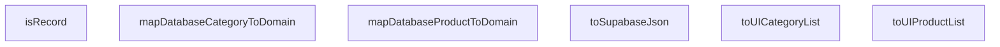

## Genel Bakış
Bu modül, uygulamanın farklı katmanları ve dış servisler arasında veri yapılarını dönüştürmek için kullanılan tip dönüştürücü fonksiyonlar koleksiyonudur. Özellikle veritabanı tiplerini uygulamanın iş katmanı (domain) tiplerine çevirme ve Supabase gibi dış servisler için uyumlu veri formatı oluşturma işlemlerini üstlenir.

## Fonksiyon Grupları
### Genel Dönüşüm ve Yardımcı Kontroller
Genel veri formatı dönüşümleri ve tip doğrulama işlemleri yapan yardımcı fonksiyonlardır.
- isRecord, toSupabaseJson

### Veritabanı-Domain Veri Dönüşümleri
Veritabanından gelen kategori ve ürün verilerini, uygulamanın arayüz ve iş katmanında kullanılabilir domain tiplerine dönüştürür. Tekil varlıklar ve listeler için ayrı dönüşüm seçenekleri sunar.
- mapDatabaseCategoryToDomain, mapDatabaseProductToDomain, toUICategoryList, toUIProductList

---

## AXIOMS – Mimari Varsayımlar
Bu modüldeki tüm fonksiyonlar, girdi parametrelerinin imzada belirtilen türlerde olması durumunda doğru çalışma eğilimindedir.

[Aksiyom 1]: Eğer toSupabaseJson fonksiyonuna geçirilen data parametresi imzada belirtilen T türünde değilse, beklenmeyen çalışma zamanı davranışı veya hata oluşur.
[Aksiyom 2]: Eğer isRecord fonksiyonuna geçirilen value parametresi geçerli bir TypeScript değeri değilse, beklenmeyen çalışma zamanı davranışı veya hata oluşur.
[Aksiyom 3]: Eğer mapDatabaseCategoryToDomain fonksiyonuna geçirilen dbCat parametresi imzada belirtilen DbCategory türünde değilse, beklenmeyen çalışma zamanı davranışı veya hata oluşur.
[Aksiyom 4]: Eğer mapDatabaseProductToDomain fonksiyonuna geçirilen dbProd parametresi imzada belirtilen DbProduct türünde değilse, beklenmeyen çalışma zamanı davranışı veya hata oluşur.
[Aksiyom 5]: Eğer toUICategoryList fonksiyonuna geçirilen cats parametresi imzada belirtilen DbCategory dizisi değilse, beklenmeyen çalışma zamanı davranışı veya hata oluşur.
[Aksiyom 6]: Eğer toUIProductList fonksiyonuna geçirilen prods parametresi imzada belirtilen DbProduct dizisi değilse, beklenmeyen çalışma zamanı davranışı veya hata oluşur.

---

## FONKSIYON DETAYLARI

### toSupabaseJson
**Ne yapar**: Karmaşık TypeScript tiplerini Supabase’in kesin `Json` tipine güvenli bir şekilde dönüştürür.  
**Nasıl yapar**: Gelen veri önce `JSON.stringify` ile metin haline getirilir, ardından `JSON.parse` ile yeniden nesneye çevrilir; bu işlem tip güvenliğini korur ve tehlikeli tip atamalarını önler.  
**Parametreler**:
- `data`: `T` — Dönüştürülmek istenen, herhangi bir TypeScript tipi.
**Dönüş**: `Json` — Supabase’in beklediği JSON yapısı.

### isRecord
**Ne yapar**: Bilinmeyen bir değerin `Record<string, unknown>` tipine uygun olup olmadığını kontrol eder.  
**Nasıl yapar**: Değerin `typeof` kontrolü `object` ve `null` olmaması, ayrıca `Object.prototype.toString` çıktısının `[object Object]` olması gibi temel nesne kontrolleri yapılır; ardından tüm anahtarların string ve değerlerin `unknown` tipinde olduğu doğrulanır.  
**Parametreler**:
- `value`: `unknown` — Tipi kontrol edilecek değer.
**Dönüş**: Belirtilmemiş (fonksiyonun dönüş tipi dokümantasyonda yer almıyor).

### mapDatabaseCategoryToDomain
**Ne yapar**: Veritabanı katmanı (`DbCategory`) satırını UI katmanının kullandığı `DomainCategory` modeline dönüştürür.  
**Nasıl yapar**: Gelen `DbCategory` nesnesindeki alanlar tek tek okunur; JSON veya metin tipindeki alanlar gerektiğinde `toSupabaseJson` ile normalize edilerek `DomainCategory` nesnesine atanır.  
**Parametreler**:
- `dbCat`: `DbCategory` — Veritabanından gelen kategori kaydı.
**Dönüş**: `DomainCategory` — UI’da kullanılabilecek kategori modeli.

### mapDatabaseProductToDomain
**Ne yapar**: Veritabanı ürün satırını (`DbProduct`) UI katmanının beklediği `DomainProduct` modeline dönüştürür.  
**Nasıl yapar**: `DbProduct` nesnesindeki her alan okunur; tip uyumsuzlukları (örneğin JSON/Text alanları) `toSupabaseJson` yardımıyla düzeltilir ve yeni `DomainProduct` nesnesine aktarılır.  
**Parametreler**:
- `dbProd`: `DbProduct` — Veritabanından gelen ürün kaydı.
**Dönüş**: `DomainProduct` — UI’da kullanılabilecek ürün modeli.

### toUICategoryList
**Ne yapar**: Bir dizi `DbCategory` kaydını `DomainCategory` dizisine dönüştürerek toplu veri işleme sağlar.  
**Nasıl yapar**: Gelen `cats` dizisi `mapDatabaseCategoryToDomain` fonksiyonuna tek tek geçirilir; sonuçlar yeni bir dizi olarak toplanır.  
**Parametreler**:
- `cats`: `DbCategory[]` — Veritabanından gelen kategori listesi.
**Dönüş**: `DomainCategory[]` — UI’da kullanılabilecek kategori listesi.

### toUIProductList
**Ne yapar**: Bir dizi `DbProduct` kaydını `DomainProduct` dizisine dönüştürür.  
**Nasıl yapar**: Gelen `prods` dizisi `mapDatabaseProductToDomain` fonksiyonuna sırayla uygulanır; elde edilen `DomainProduct` nesneleri yeni bir dizi içinde toplanır.  
**Parametreler**:
- `prods`: `DbProduct[]` — Veritabanından gelen ürün listesi.
**Dönüş**: `DomainProduct[]` — UI’da kullanılabilecek ürün listesi.

---

## AST POINTERS

### [N1_NASIL] AST Pointer: src/lib/type-converters.ts::toSupabaseJson
- **params**: (data: T)
- **ic_degiskenler**:
  - `data` — generic input data to be converted into a JSON-compatible structure
- **Dönüş**: Json — deep-cloned JSON representation of the input

### [N2_NASIL] AST Pointer: src/lib/type-converters.ts::isRecord
- **params**: (value: unknown)
- **ic_degiskenler**:
  - `value` — value to test whether it is a plain object
- **Dönüş**: yok — returns a boolean type guard indicating if `value` is a `Record<string, unknown>`

### [N3_NASIL] AST Pointer: src/lib/type-converters.ts::mapDatabaseCategoryToDomain
- **params**: (dbCat: DbCategory)
- **ic_degiskenler**:
  - `dbCat` — database row representing a category
- **Dönüş**: DomainCategory — domain model object with stringified fields and defaults

### [N4_NASIL] AST Pointer: src/lib/type-converters.ts::mapDatabaseProductToDomain
- **params**: (dbProd: DbProduct)
- **ic_degiskenler**:
  - `dbProd` — database row representing a product
- **Dönüş**: DomainProduct — domain model object with stringified fields and default brand

### [N5_NASIL] AST Pointer: src/lib/type-converters.ts::toUICategoryList
- **params**: (cats: DbCategory[])
- **ic_degiskenler**:
  - `cats` — array of database category rows
- **Dönüş**: DomainCategory[] — array of domain category objects produced by mapping each element with `mapDatabaseCategoryToDomain`

### [N6_NASIL] AST Pointer: src/lib/type-converters.ts::toUIProductList
- **params**: (prods: DbProduct[])
- **ic_degiskenler**:
  - `prods` — array of database product rows
- **Dönüş**: DomainProduct[] — array of domain product objects produced by mapping each element with `mapDatabaseProductToDomain`

---

## MERMAID CALL GRAPH

## NODE ID STANDARD

  file: src\lib\type-converters.ts
  function: src\lib\type-converters.ts::toSupabaseJson
  function: src\lib\type-converters.ts::isRecord
  function: src\lib\type-converters.ts::mapDatabaseCategoryToDomain
  function: src\lib\type-converters.ts::mapDatabaseProductToDomain
  function: src\lib\type-converters.ts::toUICategoryList
  function: src\lib\type-converters.ts::toUIProductList

---

## DISA AKTARILANLAR (EXPORTS)
  export: isRecord
  export: mapDatabaseCategoryToDomain
  export: mapDatabaseProductToDomain
  export: toSupabaseJson
  export: toUICategoryList
  export: toUIProductList