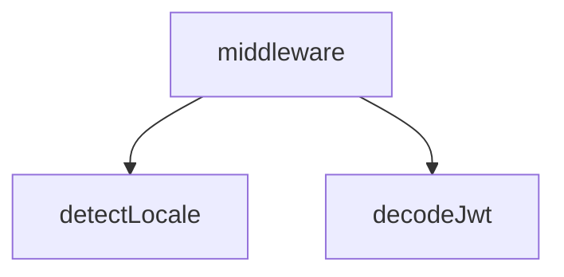

## Genel Bakış
Bu modül, VentHub HVAC projesinin Next.js ara katmanıdır. Gelen tüm HTTP isteklerini rota öncesinde yakalayarak locale tespiti, JWT tabanlı kimlik doğrulama ve erişim kontrolü gibi ön işlemleri merkezi olarak yönetir. Proje genelinde tutarlı, güvenli ve yerelleştirilmiş bir kullanıcı deneyimi sağlamak için tüm isteklerin işlenişini tek bir noktadan kontrol eder.

## Fonksiyon Grupları
### Dil/Locale Tespiti
Gelen isteklerin başlıkları ve çerezleri üzerinden kullanıcının tercih ettiği dili ve bölgesel ayarları belirleyerek yerelleştirme süreçlerini başlatır.
- detectLocale

### Güvenlik ve Kimlik Doğrulama
JWT tabanlı kimlik doğrulama ve token çözümleme gibi güvenlik önlemlerini uygulamak için gerekli yardımcı işlevleri sağlar.
- decodeJwt

### Merkezi Koordinasyon
Gelen tüm istekleri yakalayan ve dil tespiti, kimlik doğrulama, yetkilendirme ile yönlendirme gibi tüm rota öncesi işlemleri sırayla ve koordineli bir şekilde yürüten ana işleyicidir.
- middleware

---

## AXIOMS – Mimari Varsayımlar
Bu modül, Next.js ara katmanı olarak gelen istekleri işler. Aşağıda, fonksiyonların ve sabitlerin doğru çalışması için var olması gereken temel mimari varsayımlar listelenmiştir.

[Aksiyom 1]: Eğer `request` parametresi `NextRequest` tipinde veya onun türevi bir nesne değilse, `detectLocale` ve `middleware` fonksiyonları hata verir veya isteği düzgün işleyemez.
[Aksiyom 2]: Eğer `decodeJwt` fonksiyonuna传递 edilen `token` parametresi `string` tipinde değilse veya boş/null ise, fonksiyon hata fırlatır.
[Aksiyom 3]: Eğer `config` sabiti (middleware yapılandırması) tanımlı değilse veya geçerli bir nesne içermiyorsa, `middleware` fonksiyonu istekleri yönlendiremez ve işleyemez.
[Aksiyom 4]: Eğer `LOCALES` sabiti (desteklenen diller listesi) tanımlı değilse veya geçerli bir dizi/nesne içermiyorsa, `detectLocale` fonksiyonu doğru locale tespiti yapamaz ve varsayılan locale değerine geri döner.
[Aksiyom 5]: Eğer `ADMIN_ROLES` sabiti (admin rol listesi) tanımlı değilse, erişim kontrolü sırasında roller karşılaştırılamaz ve yetkilendirme hatalı çalışır.
[Aksiy

---

## FONKSİYON DETAYLARI

### detectLocale

**Ne yapar**: Kullanıcının tercih ettiği dilini (Türkçe veya İngilizce) belirler. Öncelikle cookie değerine, ardından tarayıcı dil tercihine bakarak uygun locale kodunu döndürür.

**Nasıl yapar**: Fonksiyon öncelikle `NEXT_LOCALE` adlı cookie'yi kontrol eder; eğer değeri geçerli bir dil koduysa (`tr` veya `en`) doğrudan bunu kullanır. Cookie'de geçerli bir dil yoksa, isteğin `accept-language` başlığını analiz eder ve İngilizce içeriyorsa `'en'` döndürür. Hiçbir koşul sağlanmazsa varsayılan olarak `'tr'` (Türkçe) değerini döndürür.

**Parametreler**:
- `request`: `NextRequest` — HTTP isteği nesnesi. Cookie değerlerine ve HTTP başlıklarına erişmek için kullanılır.

**Dönüş**: `string` — Belirlenen dil kodu (`'tr'` veya `'en'`).

### decodeJwt
**Ne yapar**: Verilen bir JSON Web Token (JWT) dizgesini çözümleyerek içindeki payload (yükleme) verisini ayrıştırır. Hata oluşması durumunda hata mesajını konsola yazar ve `null` döner.

**Nasıl yapar**: Fonksiyon, JWT'nin standart üç bölümlü yapısından (header.payload.signature) ikinci kısmı olan payload'ı alır. Bu kısım base64url formatında şifrelenmiştir. Fonksiyon, base64url karakter setini standart base64'e dönüştürür, base64 dekoderinden geçirerek byte dizisine, ardından `%` kodlamalı UTF-8 karakterlere çevirir. Elde edilen JSON dizgesini `JSON.parse` ile JavaScript nesnesine dönüştürerek döndürür. İşlem sırasında herhangi bir hata (geçersiz token, hatalı format vb.) yakalanır ve konsola yazdırılır.

**Parametreler**:
- token: string — Decode edilecek JWT token dizgesi. En az iki nokta ile ayrılmış üç bölümden oluşması beklenir.

**Dönüş**: any veya null — Başarılı olursa token'ın payload'ını temsil eden JavaScript nesnesi, hata oluşursa `null` döner.

### middleware
**Ne yapar**: Her bir isteği Next.js uygulamasına iletmeden önce yakalar ve işler. Ana görevleri, isteğin hangi kiracıya (tenant) ait olduğunu belirlemek, dil ayarını uygulamak, SEO amaçlı UUID'den slug'a yönlendirme yapmak ve admin rotaları için kimlik doğrulama ile yetkilendirme (RBAC) kontrolü uygulamaktır.

**Nasıl yapar**: Fonksiyon, isteğin `host` başlığını kullanarak `resolveTenant` fonksiyonu aracılığıyla tenant kimliğini belirler ve bunu istek başlıklarına ekler. Ardından, URL yolunu (`pathname`) analiz ederek dil (locale) kontrolü yapar. Dil yolunun eksik olduğu genel rotaları algılanan veya varsayılan dile yönlendirir. Eğer rotada `products` bölümü varsa ve tanımlayıcı bir UUID ise, veritabanından ilgili ürünün slug'ını çekerek SEO dostu URL'ye kalıcı yönlendirme (308) yapar. `admin` rotalarına erişimde, development ortamı ve localhost kontrolü yaparak bypass imkanı sağlar. Üretim ortamında Supabase sunucu istemcisi oluşturarak oturum kontrolü yapar ve JWT içindeki rol bilgisini (`decodeJwt` kullanarak) çıkarır. Kullanıcının rolleri `ADMIN_ROLES` seti içinde değilse ana sayfaya yönlendirir. İşlem sonunda, herhangi bir noktada döndürülecek yanıta kiracı çerezini (`tenant_id`) ekleyen `setTenantCookie` yardımcı fonksiyonunu kullanır.

**Parametreler**:
- request: NextRequest — Next.js tarafından sağlanan ve isteği temsil eden nesne. Başlıklar, URL, çerezler gibi bilgileri içerir.

**Dönüş**: NextResponse — İşlenmiş veya yönlendirilmiş bir sonraki yanıtı temsil eden nesne. Her durumda `setTenantCookie` fonksiyonuyla zenginleştirilmiş bir `NextResponse` döner.

---

## SABİTLER
- **config** (object) — `{

  matcher: [

    // Statik varlıklar dışındaki tüm istekleri dinle

    '...`
- **UUID_REGEX** (regex) — `/^[0-9a-f]{8}-[0-9a-f]{4}-[0-9a-f]{4}-[0-9a-f]{4}-[0-9a-f]{12}$/i`
- **ADMIN_ROLES** (new_expression) — `new Set(['super_admin', 'admin', 'moderator', 'warehouse', 'sales', 'viewer'])`
- **LOCALES** (as_expression) — `['tr', 'en'] as const`

---

## AST POINTERS

### [N1_NASIL] AST Pointer: src/middleware.ts::detectLocale
- **params**: (request: NextRequest)
- **ic_degiskenler**:
  - `cookieLocale` — `request.cookies.get('NEXT_LOCALE')?.value` ile elde edilen çerezdeki dil değeri
  - `acceptLang` — `request.headers.get('accept-language')` ile elde edilen tarayıcı dil tercihi, boş string fallback ile
- **Dönüş**: string (locale kodu: 'tr' veya 'en')

### [N2_NASIL] AST Pointer: src/middleware.ts::decodeJwt
- **params**: (token: string)
- **ic_degiskenler**:
  - `base64Url` — JWT token'ın payload kısmını temsil eden, noktayla ayrılan ikinci parça (`token.split('.')[1]`)
  - `base64` — base64Url formatından standart base64 formatına dönüştürülmüş string
  - `jsonPayload` — atob ile decode edilmiş, URI decode işleminden geçmiş JSON stringi
- **Dönüş**: nesne (decode edilmiş JWT payload) veya `null` (hata durumunda)

### [N3_NASIL] AST Pointer: src/middleware.ts::middleware
- **params**: (request: NextRequest)
- **ic_degiskenler**:
  - `host` — `request.headers.get('host')` ile elde edilen hostname bilgisi, boş string fallback ile
  - `tenantId` — `resolveTenant(host)` çağrısıyla elde edilen kiracı (tenant) ID'si
  - `setTenantCookie` — tenant_id çerezini ayarlayan yerel fonksiyon (closure: tenantId'yi kullanır)
  - `pathname` — `request.nextUrl.pathname` ile elde edilen URL yolu
  - `segments` — pathname'in `/` ile bölünüp boş elemanlar filtrelenmiş hali (yol parçaları dizisi)
  - `firstSegment` — `segments[0]` erişimi ile elde edilen URL yolunun ilk parçası
  - `response` — `NextResponse.next()` ile oluşturulan ve isteklerin devam etmesini sağlayan nesne
  - `locale` — aktif dil kodu, başlangıçta `DEFAULT_LOCALE` sabit değeri ile başlatılır
  - `effectiveSegments` — segmentlerin dil prefiksi considerations ile kopyası
  - `isLocaleInPath` — `firstSegment`'in `LOCALES` dizisinde olup olmadığı boolean kontrolü
  - `detectedLocale` — `detectLocale(request)` çağrısıyla tespit edilen dil kodu (sadece dil yolu yoksa kullanılır)
  - `supabaseUrl` — `process.env.NEXT_PUBLIC_SUPABASE_URL` ortam değişkeni
  - `anonKey` — `process.env.NEXT_PUBLIC_SUPABASE_ANON_KEY` ortam değişkeni
  - `identifier` — `effectiveSegments[1]` erişimi ile elde edilen ürün tanımlayıcı (UUID veya slug)
  - `supabase` — `createServerClient` ile oluşturulan Supabase istemcisi (cookie handling ile)
  - `data` — Supabase sorgusundan dönen veri nesnesi (`.single()` ile)
  - `error` — UUID→slug yönlendirmesinde oluşan hata (try-catch içinde)
  - `isDev` — `process.env.NODE_ENV === 'development'` kontrolü ile elde edilen boolean
  - `isLocalhost` — host'un `localhost` veya `127.0.0.1` ile başlayıp başlamadığını kontrol eden boolean
  - `session` — `supabase.auth.getSession()` çağrısından dönen oturum nesnesi (destructured: `data.session`)
  - `decoded` — `decodeJwt(session.access_token)` çağrısı ile decode edilen JWT içeriği
  - `jwtRole` — `decoded?.user_role` erişimi ile elde edilen JWT rolü
  - `loginUrl` — `/auth/login` yoluna yönlendirme için klonlanmış URL nesnesi
  - `homeUrl` – `/` yoluna yönlendirme için klonlanmış URL nesnesi
- **Dönüş**: yok (yan etkiler: cookie ayarları, yönlendirmeler, header değişiklikleri)

---

## MERMAID CALL GRAPH

## NODE ID STANDARD

  file: src\middleware.ts
  function: src\middleware.ts::detectLocale
  function: src\middleware.ts::decodeJwt
  function: src\middleware.ts::middleware

---

## DISA AKTARILANLAR (EXPORTS)
  export: config
  export: decodeJwt
  export: detectLocale
  export: middleware