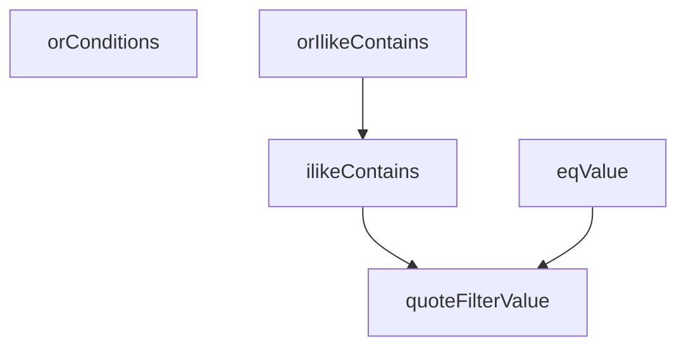

## Genel Bakış
Bu modül, admin panelinde kullanılan SQL sorgu filtrelerini oluşturmaya yarayan yardımcı fonksiyonları içerir. ILIKE tabanlı arama ve eşitlik kontrolleri için parametreli sorgu parçacıkları üretir. Fonksiyonlar, ham filtre değerlerini güvenli biçimde tırnaklayarak SQL injection riskini azaltır.

## Fonksiyon Grupları

### Filtre Değeri Güvenliği
Ham filtre değerlerini SQL sorgularına güvenle yerleştirmek için tırnaklama işlemi yapar.
- quoteFilterValue

### Tek Sütun Filtre Oluşturma
Belirli bir sütun üzerinde tekil arama veya eşitlik koşulları üretir.
- ilikeContains, eqValue

### Çoklu Koşul Birleştirme
Birden fazla sütunu veya koşulu OR operatörü ile birleştirerek kapsamlı filtre parçacıkları oluşturur.
- orIlikeContains, orConditions

---

## AXIOMS – Mimari Varsayımlar

Bu modül için fonksiyon gövdeleri verilmediğinden, yalnızca imzalardan çıkarılabilecek varsayımlar belirlenebilir.

[Aksiyom 1]: Eğer `quoteFilterValue` fonksiyonu girdi olarak boş string alırsa, davranış bilinmiyor — fonksiyon gövdesi incelenmeden null/undefined/boş string için koruma olup olmadığı belirlenemez.

[Aksiyom 2]: Eğer `ilikeContains` ve `orIlikeContains` fonksiyonları PostgreSQL dışı bir veritabanında çalıştırılırsa, ILIKE operatörü desteklenmediğinden sorgu hata verir.

[Aksiyom 3]: Eğer `orConditions` fonksiyonuna boş array verilirse, davranış bilinmiyor — fonksiyon gövdesi incelenmeden boş koşul listesi için koruma olup olmadığı belirlenemez.

[Aksiyom 4]: Eğer `orIlikeContains` fonksiyonuna boş columns array verilirse, davranış bilinmiyor — fonksiyon gövdesi incelenmeden boş sütun listesi için koruma olup olmadığı belirlenemez.

[Aksiyom 5]: Eğer `quoteFilterValue` fonksiyonu SQL injection koruması sağlamıyorsa, bu fonksiyonun ürettiği değerler doğrudan sorguya yerleştirildiğinde güvenlik açığı oluşur. Ancak fonksiyon gövdesi verilmediğinden koruma mekanizmasının varlığı bilinmiyor.

---

## FONKSİYON DETAYLARI

### quoteFilterValue
**Ne yapar**: Verilen bir filtre değerini PostgREST sorgularında güvenli bir şekilde kullanılabilecek bir metin dizesine dönüştürür. Amacı, sorgu enjeksiyonu riskini azaltmak ve özel karakterleri düzgün bir şekilde işlemektir.
**Nasıl yapar**: Girdi olarak alınan `raw` dizesindeki ters eğik çizgi (`\`) ve çift tırnak (`"`) karakterlerini, onları kaçırarak (escape ederek) güvenli hale getirir. Ardından, kaçırılmış bu dizeyi çift tırnak işaretleri arasına alarak sonucu oluşturur. Fonksiyon, SQL `LIKE` operatörünün joker karakterleri olan `%` ve `_` karakterlerine dokunmaz; bu kasıtlı bir tasarımdır ve bu karakterlerin filtre grameri değil, arama mantığının bir parçası olduğu varsayılır.
**Parametreler**:
- raw: string — Kaçırılacak ham filtre değerini temsil eder.
**Dönüş**: string — Çift tırnak içine alınmış ve özel karakterleri kaçırılmış güvenli filtre değerini döndürür.

### ilikeContains
**Ne yapar**: Belirli bir sütunda, verilen terimi içeren kayıtları bulmak için PostgREST'in `ilike` (büyük/küçük harf duyarsız benzerlik) operatörünü kullanan bir filtre dizesi oluşturur.
**Nasıl yapar**: Verilen `column` ve `term` parametrelerini kullanarak `${column}.ilike.${quoteFilterValue(`%${term}%`)}` formatında bir dize oluşturur. Burada `term` parametresinin başına ve sonuna `%` joker karakteri eklenerek "içerir" arama mantığı sağlanır. Oluşturulan terim, `quoteFilterValue` fonksiyonu aracılığıyla güvenli hale getirilir.
**Parametreler**:
- column: string — Arama yapılacak sütun adını temsil eder.
- term: string — Sütun içinde aranacak terimi temsil eder.
**Dönüş**: string — PostgREST sorgu sözdizimine uygun, `ilike` operatörünü kullanan filtre dizesini döndürür.

### eqValue
**Ne yapar**: Belirli bir sütunda, verilen değerle tam olarak eşleşen kayıtları bulmak için PostgREST'in `eq` (eşittir) operatörünü kullanan bir filtre dizesi oluşturur.
**Nasıl yapar**: Verilen `column` ve `value` parametrelerini kullanarak `${column}.eq.${quoteFilterValue(value)}` formatında bir dize oluşturur. `value` parametresi, `quoteFilterValue` fonksiyonu aracılığıyla güvenli hale getirilir.
**Parametreler**:
- column: string — Arama yapılacak sütun adını temsil eder.
- value: string — Sütunla tam olarak eşleşmesi gereken değeri temsil eder.
**Dönüş**: string — PostgREST sorgu sözdizimine uygun, `eq` operatörünü kullanan filtre dizesini döndürür.

### orIlikeContains
**Ne yapar**: Birden fazla sütunda, verilen terimi içeren kayıtları bulmak için `or()` operatörüne verilecek bir dize oluşturur. Her bir sütun için "içerir" araması koşulları oluşturulur ve virgülle birleştirilir.
**Nasıl yapar**: Verilen `columns` dizisindeki her bir sütun adı için `ilikeContains` fonksiyonunu çağırarak bir koşul dizesi oluşturur. Bu koşul dizelerini virgül (`,`) ile birleştirerek tek bir dize haline getirir. Bu dize, PostgREST'in `or()` fonksiyonuna doğrudan verilebilir. Docstring'te belirtildiği gibi, sütun adları kod tarafından sağlandığı için kaçırılmalarına gerek yoktur.
**Parametreler**:
- columns: readonly string[] — Arama yapılacak sütun adlarının listesini temsil eder. Dizi salt okunur (readonly) olarak tanımlanmıştır.
- term: string — Sütunlar içinde aranacak terimi temsil eder.
**Dönüş**: string — `or()` operatörüne verilebilecek, virgülle ayrılmış `ilike` koşulları dizgesini döndürür.

### orConditions
**Ne yapar**: Farklı operatörlerden (örneğin `eq`, `ilike`, `gt`, `lt` vb.) oluşan koşul dizelerini, `or()` operatörü için tek bir birleşik dize haline getirir.
**Nasıl yapar**: Verilen `conditions` dizisindeki tüm koşul dizelerini virgül (`,`) ile birleştirerek tek bir dize oluşturur. Bu fonksiyon, `orIlikeContains` fonksiyonundan farklı olarak, sadece `ilike` koşullarını değil, herhangi bir PostgREST operatörünü kullanan koşulları da birleştirebilir.
**Parametreler**:
- conditions: readonly string[] — Birleştirilecek koşul dizelerinin listesini temsil eder. Dizi salt okunur (readonly) olarak tanımlanmıştır.
**Dönüş**: string — `or()` operatörüne verilebilecek, virgülle ayrılmış koşullar dizgesini döndürür.

---

## AST POINTERS

### [N1_NASIL] AST Pointer: src/utils/adminQueryFilters.ts::quoteFilterValue
- **params**: `raw` — filtrelenmemiş ham değer (string)
- **ic_degiskenler**:
  - `escaped` — `raw` değerinin ters eğik çizgi ve çift tırnak karakterlerinin escape edilmiş hali; `raw.replace(/\\/g, '\\\\').replace(/"/g, '\\"')` ile üretilir
- **Dönüş**: string — escape edilmiş değer çift tırnak içine alınarak döndürülür (`"${escaped}"`)

### [N2_NASIL] AST Pointer: src/utils/adminQueryFilters.ts::ilikeContains
- **params**: `column` — sütun adı (string), `term` — aranacak terim (string)
- **ic_degiskenler**: yok
- **Dönüş**: string — `${column}.ilike.${quoteFilterValue(`%${term}%`)}` formatında PostgREST uyumlu filtre dizesi; `term` değeri `%` ile sarılıp `quoteFilterValue` ile escape edilir

### [N3_NASIL] AST Pointer: src/utils/adminQueryFilters.ts::eqValue
- **params**: `column` — sütun adı (string), `value` — eşitlik kontrolü yapılacak değer (string)
- **ic_degiskenler**: yok
- **Dönüş**: string — `${column}.eq.${quoteFilterValue(value)}` formatında PostgREST uyumlu eşitlik filtresi dizesi

### [N4_NASIL] AST Pointer: src/utils/adminQueryFilters.ts::orIlikeContains
- **params**: `columns` — sütun adlarının readonly dizisi (readonly string[]), `term` — aranacak terim (string)
- **ic_degiskenler**: yok
- **Dönüş**: string — her sütun için `ilikeContains(column, term)` çağrılarak üretilen filtrelerin virgülle birleştirilmiş hali; `columns.map(...).join(',')` ile oluşturulur

### [N5_NASIL] AST Pointer: src/utils/adminQueryFilters.ts::orConditions
- **params**: `conditions` — filtre koşullarının readonly dizisi (readonly string[])
- **ic_degiskenler**: yok
- **Dönüş**: string — `conditions` dizisinin virgülle birleştirilmiş hali; `conditions.join(',')` ile oluşturulur

---

## MERMAID CALL GRAPH

## NODE ID STANDARD

  file: src\utils\adminQueryFilters.ts
  function: src\utils\adminQueryFilters.ts::quoteFilterValue
  function: src\utils\adminQueryFilters.ts::ilikeContains
  function: src\utils\adminQueryFilters.ts::eqValue
  function: src\utils\adminQueryFilters.ts::orIlikeContains
  function: src\utils\adminQueryFilters.ts::orConditions

---

## DISA AKTARILANLAR (EXPORTS)
  export: eqValue
  export: ilikeContains
  export: orConditions
  export: orIlikeContains
  export: quoteFilterValue