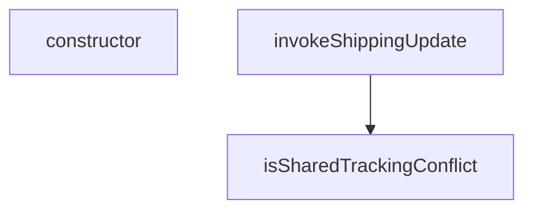

## Genel Bakış
Bu modül, admin panelinden gerçekleştirilen kargo güncelleme işlemlerini yönetir. Paylaşımlı takip numarası çakışmalarını tespit eder ve bu durumlarda özel hata mekanizması sunar. Supabase üzerinden kargo güncelleme çağrısı yaparken karşılaşılabilen hata durumlarını ele alır.

## Fonksiyon Grupları

### Kargo Güncelleme Çağrısı
Supabase fonksiyon host'u üzerinden kargo güncelleme isteği gönderir ve sonucu döndürür. Paylaşımlı takip numarasına izin verilip verilmediği parametreyle kontrol edilir.
- invokeShippingUpdate

### Hata Tespiti ve Yönetimi
Paylaşımlı takip numarası çakışması durumunu tanımlar ve tespit eder. `SharedTrackingDeclinedError` özel hata sınıfı, bu tür çakışmalarda fırlatılmak üzere tanımlanmıştır; `isSharedTrackingConflict` ise verilen bir hata nesnesinin bu çakışma türüne ait olup olmadığını kontrol eder.
- isSharedTrackingConflict, SharedTrackingDeclinedError (constructor)

---

## AXIOMS – Mimari Varsayımlar
- Bu modül davranışsal mantık içermez (salt veri / konfigürasyon / tip tanımı).
- [Aksiyom 1]: Modülün dışa açtığı yapı (anahtar kümesi / şema) bir sözleşmedir; tüketiciler bu sabit yapıya bağlıdır — kırıcı değişiklik tüm tüketicileri etkiler.
- [Aksiyom 2]: Bir öğe ekleme/çıkarma yapısal-uyumlu olmalı; ilgili tipler ve seçiciler aynı commit'te güncel tutulmalıdır.

---

## FONKSİYON DETAYLARI

### isSharedTrackingConflict
**Ne yapar**: Verilen hata nesnesinin bir "paylaşılan takip numarası" reddi (409 Conflict) olup olmadığını tespit eder. `supabase-js` kütüphanesi, Edge Function 2xx dışı bir durum kodu döndürüğünde `FunctionsHttpError` üretir; bu hata nesnesinin `context` alanı ham `Response` nesnesini taşır ve hata mesajı yalnızca "Edge Function returned a non-2xx status code" ifadesini içerir. Hangi 409 hatası olduğunu anlamak için yanıt gövdesindeki `error` kodunun okunması gerekir.

**Nasıl yapar**: İlk olarak `error` nesnesinin `context` özelliğini kontrol eder. `context` bir `Response` nesnesi değilse veya `status` değeri 409 değilse `false` döner. 409 durumunda yanıt gövdesini `clone()` metoduyla klonlayarak okur; bu klonlama, gövdenin tek kullanımlık olmasını önlemek içindir — çağıran aynı `Response` nesnesini loglamak için tekrar okumak isteyebilir. Gövde içindeki `error` alanının değeri `SHARED_TRACKING_CONFLICT` sabitiyle eşleşiyorsa `true`, aksi halde `false` döner. JSON ayrıştırma sırasında oluşan herhangi bir hata durumunda da `false` döner.

**Parametreler**:
- error: unknown — kontrol edilecek hata nesnesi; `supabase-js` tarafından üretilen `FunctionsHttpError` olabilir

**Dönüş**: `Promise<boolean>` — hata bir paylaşılan takip numarası reddiyse `true`, değilse `false`

### invokeShippingUpdate
**Ne yapar**: Geliştirildi ancak detay üretilemedi.

### constructor
**Ne yapar**: Geliştirildi ancak detay üretilemedi.

---

## INTERFACES

### ShippingFunctionsHost
Bu modülün istemciden ihtiyaç duyduğu TEK yetenek. `SupabaseClient<Database>` yerine dar bir sözleşme yazıldı — gerçek istemci bunu yapısal olarak zaten karşılıyor, ama test bir "sahte istemci" üretmek için tip zorlamasına (`as unknown as`) mecbur kalmıyor. Tip zorlaması testte de üretimdeki kadar t
- `functions: {
`

---

## TYPE ALIASES

### ShippingUpdateBody
`interface` DEĞİL `type`: arayüzlerin örtük indeks imzası yoktur ve `Record<string, unknown>` bekleyen `invoke` sözleşmesine geçmezdi.
```typescript
type ShippingUpdateBody = {
  order_id: string
  carrier: string
  tracking_number: string
  tracking_url: string | null
  send_email: boolean
}
```

### ShippingInvokeOutcome
```typescript
type ShippingInvokeOutcome = | { ok: true; conflict: false }
  /** `conflict: true` → SADECE paylaşılan takip numarası reddi; başka her hata `false`. */
  | { ok: false; conflict: boolean; error: unknown }
```

---

## AST POINTERS

### [N1_NASIL] AST Pointer: src/utils/adminShipping.ts::isSharedTrackingConflict
- **params**: `error: unknown`
- **ic_degiskenler**:
  - `context` — `error` nesnesinin `context` özelliği; optional chaining (`?.`) ile güvenli erişim sağlanır, ardından `null` kontrolü yapılır
  - `body` — `context`'in `clone().json()` ile ayrıştırılan yanıt gövdesi; `clone()` çağrısı, orijinal `Response` nesnesinin tüketilmesini engellemek için yapılır
- **Dönüş**: `Promise<boolean>` — `context` bir `Response` örneği değilse, `status` 409 değilse veya `json()` ayrıştırması başarısız olursa `false` döner; gövde içindeki `error` alanı `SHARED_TRACKING_CONFLICT` sabitine eşitse `true` döner

### [N2_NASIL] AST Pointer: src/utils/adminShipping.ts::invokeShippingUpdate
- **params**: `supabase: ShippingFunctionsHost`, `body: ShippingUpdateBody`, `allowSharedTracking` (varsayılan değer: `false`)
- **ic_degiskenler**:
  - `payload` — `allowSharedTracking` true ise `body` nesnesine `allow_shared_tracking: true` alanı eklenmiş genişletilmiş kopyası (`{ ...body, allow_shared_tracking: true }`); false ise `body`'nin kendisi
  - `error` — `supabase.functions.invoke('admin-update-shipping', { body: payload })` çağrısından dönen hata nesnesi; destructuring ile alınır
- **Dönüş**: `Promise<ShippingInvokeOutcome>` — hata yoksa `{ ok: true, conflict: false }` döner; hata varsa `{ ok: false, conflict: <isSharedTrackingConflict sonucu>, error }` döner

### [N3_NASIL] AST Pointer: src/utils/adminShipping.ts::SharedTrackingDeclinedError.constructor
- **params**: (parametre yok)
- **ic_degiskenler**: (yok)
- **Dönüş**: yok — `super()` çağrısı ile üst sınıfın constructor'ı `'Paylaşılan takip numarası onaylanmadı; kargo bilgisi yazılmadı.'` mesajıyla başlatılır; `this.name` `'SharedTrackingDeclinedError'` değerine atanır

---


## MERMAID CALL GRAPH


## NODE ID STANDARD

  file: adminShipping.ts
  function: adminShipping.ts::isSharedTrackingConflict
  function: adminShipping.ts::invokeShippingUpdate
  class: adminShipping.ts::SharedTrackingDeclinedError

---

## DISA AKTARILANLAR (EXPORTS)
  export: SharedTrackingDeclinedError
  export: ShippingFunctionsHost
  export: ShippingInvokeOutcome
  export: ShippingUpdateBody
  export: invokeShippingUpdate
  export: isSharedTrackingConflict