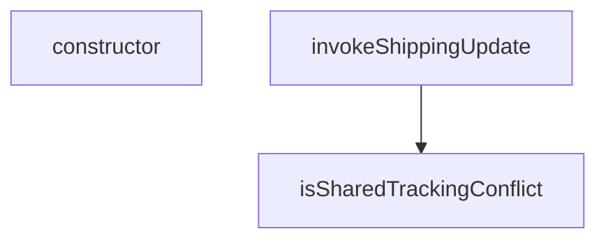

## Genel Bakış
Bu modül, gönderi güncelleme işlemlerindeki temel yardımcı fonksiyonları ve hat管理体系ını içerir. Paylaşımlı takip numarası çatışmalarını yönetmek ve gönderi güncelleme isteklerini güvenli bir şekilde tetiklemekten sorumludur.

## Fonksiyon Grupları
### Takip Numarası Çatışma Yönetimi
Gönderi güncellemeleri sırasında oluşabilecek paylaşımlı takip numarası çatışmalarını tespit eder ve yönetir.
- isSharedTrackingConflict, SharedTrackingDeclinedError

### Gönderi Güncelleme İşlemi
Supabase veritabanı bağlantısıyla gönderi durumu güncellemelerini merkezi olarak tetikler.
- invokeShippingUpdate

---

## AXIOMS – Mimari Varsayımlar

Bu modül için özel aksiyom tanımlanmamıştır.

**Gerekçe:** Sunulan fonksiyon imzaları (özellikle `isSharedTrackingConflict`, `invokeShippingUpdate` ve `SharedTrackingDeclinedError.constructor`) bilinmeyen tiplere (`ShippingFunctionsHost`, `ShippingUpdateBody`, `ShippingInvokeOutcome`) bağımlıdır. Fonksiyon gövdeleri verilmediğinden, doğru çalışmalarına yönelik zorunlu koşullar (örn. `supabase` objesinin hangi metotları içermesi gerektiği, `body`'de hangi alanların bulunması gerektiği, `allowSharedTracking` boolean'ının ne zaman `True`/`False` olması gerektiği vb.)uniq emperik veriye dayalı olarak çıkarılamamaktadır.

---

## FONKSİYON DETAYLARI

### isSharedTrackingConflict
**Ne yapar**: Verilen bir hata nesnesinin, `supabase-js` kütüphanesinden kaynaklanan bir "paylaşılan takip numarası çatışması" (409 Conflict) hatası olup olmadığını kontrol eder ve bunu boolean olarak döndürür.

**Nasıl yapar**: Fonksiyon, hata nesnesinin `context` özelliğinin bir `Response` nesnesi olup olmadığını ve bu yanıtın durum kodunun 409 olup olmadığını kontrol eder. Eğer koşullar sağlanırsa, yanıt gövdesini (body) bir klon üzerinden (`clone()` metodu ile) JSON olarak parse eder ve içeriğin `error` alanının `SHARED_TRACKING_CONFLICT` sabitine eşit olup olmadığını doğrular. `clone()` kullanımı, gövdenin orijinal akışını (stream) tüketmeden başa bir okuma yapılması için gereklidir.

**Parametreler**:
- error: unknown — Supabase Edge Function çağrısından dönen hata nesnesi. Bu nesnenin `context` özelliğinin bir `Response` olması beklenir.

**Dönüş**: Promise<boolean> — Hata, tanımlanan paylaşılan takip numarası çatışmasıysa `true`, aksi halde `false` döner.

### invokeShippingUpdate
**Ne yapar**: `supabase-js` client'ı kullanarak `admin-update-shipping` adlı Supabase Edge Function'ı çağırır ve sonucu yapılandırılmış bir çıktı nesnesi olarak döndürür. Çağrı, isteğe bağlı olarak "paylaşılan takip numarası" kuralını devre dışı bırakabilir.

**Nasıl yapar**: Fonksiyon, `allowSharedTracking` parametresi `true` ise `body` nesnesine `allow_shared_tracking: true` özelliği ekleyerek bir payload oluşturur. Ardından `supabase.functions.invoke` metodunu kullanarak Edge Function'ı çağırır. Çağrı başarılı olursa `{ ok: true, conflict: false }` döner. Bir hata oluşursa, hatayı `isSharedTrackingConflict` fonksiyonuyla analiz ederek hatanın bir çatışma (conflict) durumu olup olmadığını belirler ve `{ ok: false, conflict: boolean, error: FunctionsHttpError }` yapısındaki nesneyi döndürür.

**Parametreler**:
- supabase: ShippingFunctionsHost — Supabase Edge Function'ları çağırmak için kullanılan, `functions.invoke` metoduna sahip client nesnesi.
- body: ShippingUpdateBody — Edge Function'a gönderilecek kargo güncelleme verilerini içeren nesne.
- allowSharedTracking: boolean (varsayılan: false) — Eğer `true` geçilirse, sunucu tarafında benzersiz takip numarası kısıtlaması atlanır. Varsayılan olarak `false`dır, böylece sunucunun varsayılan koruma mekanizması aktif kalır.

**Dönüş**: Promise<ShippingInvokeOutcome> — Çağrının başarı durumunu (`ok`), bir çatışma hatası olup olmadığını (`conflict`) ve varsa ham hata nesnesini (`error`) içeren bir nesne döndürür.

### SharedTrackingDeclinedError.constructor
**Ne yapar**: `SharedTrackingDeclinedError` özel hata sınıfının constructor metodudur ve nesne oluşturulurken temel ayarları yapar.

**Nasıl yapar**: Bu bir sınıf constructor'ıdır. `super()` çağrısı ile üst sınıfın (`Error`) constructor'ını, “Paylaşılan takip numarası onaylanmadı; kargo bilgisi yazılmadı.” hata mesajıyla çağırır. Ardından, hata nesnesinin `name` özelliğini `'SharedTrackingDeclinedError'` olarak ayarlar. Bu, hata yakalandığında hata türünün tanımlanmasını kolaylaştırır.

**Parametreler**: Bu constructor metodu herhangi bir parametre almaz.

**Dönüş**: void (belirtilmemiş). Sınıf constructor'ları doğrudan bir değer döndürmez; yerine, `new` anahtar kelimesi ile oluşturulan sınıf örneğini döndürürler.

---

## INTERFACES

### ShippingFunctionsHost
Bu modülün istemciden ihtiyaç duyduğu TEK yetenek. `SupabaseClient<Database>` yerine dar bir sözleşme yazıldı — gerçek istemci bunu yapısal olarak zaten karşılıyor, ama test bir "sahte istemci" üretmek için tip zorlamasına (`as unknown as`) mecbur kalmıyor. Tip zorlaması testte de üretimdeki kadar t
- `functions: {
`

---

## TYPE ALIASES

### ShippingUpdateBody
`interface` DEĞİL `type`: arayüzlerin örtük indeks imzası yoktur ve `Record<string, unknown>` bekleyen `invoke` sözleşmesine geçmezdi.
```typescript
type ShippingUpdateBody = {
  order_id: string
  carrier: string
  tracking_number: string
  tracking_url: string | null
  send_email: boolean
}
```

### ShippingInvokeOutcome
```typescript
type ShippingInvokeOutcome = | { ok: true; conflict: false }
  /** `conflict: true` → SADECE paylaşılan takip numarası reddi; başka her hata `false`. */
  | { ok: false; conflict: boolean; error: unknown }
```

---

## AST POINTERS

### [N1_NASIL] AST Pointer: src/utils/adminShipping.ts::isSharedTrackingConflict
- **params**: `(error: unknown)` — kontrol edilecek hata nesnesi
- **ic_degiskenler**:
  - `context` — `error` objesinden optional chaining ile çıkarılan Response nesnesi; tip dönüşümü `(error as { context?: unknown } | null)?.context` kullanılır, Response instance değilse `false` dönülür
  - `body` — `context.clone().json()` ile asenkron olarak okunan Response gövdesi; `clone()` kullanma nedeni gövdenin tek kullanımlık olması ve orijinal Response'un consumed olmamasıdır
- **Dönüş**: `Promise<boolean>` — error içinde `context.status === 409` ve gövde JSON'unda `error === SHARED_TRACKING_CONFLICT` eşleşmesi varsa `true`, aksi halde `false`

### [N2_NASIL] AST Pointer: src/utils/adminShipping.ts::invokeShippingUpdate
- **params**:
  - `supabase: ShippingFunctionsHost` — Supabase Edge Functions çağırmak için kullanılan istemci nesnesi
  - `body: ShippingUpdateBody` — güncelleme için gönderilecek kargo bilgisi verisi
  - `allowSharedTracking = false` — paylaşılan takip numarasına izin verilip verilmeyeceği; varsayılan `false`
- **ic_degiskenler**:
  - `payload` — `allowSharedTracking` true ise `body` üzerine `allow_shared_tracking: true` eklenmiş genişletilmiş kopya, false ise orijinal `body`'nin kendisi
  - `error` — `supabase.functions.invoke('admin-update-shipping', ...)` çağrısından dönen hata nesnesi; başarılıysa `undefined`
- **Dönüş**: `Promise<ShippingInvokeOutcome>` — `{ ok: true, conflict: false }` (başarılı) veya `{ ok: false, conflict: boolean, error }` (hatalı; `conflict` değeri `isSharedTrackingConflict` ile belirlenir)

### [N3_NASIL] AST Pointer: src/utils/adminShipping.ts::SharedTrackingDeclinedError.constructor
- **params**: (yok — parametresiz constructor)
- **ic_degiskenler**:
  - `this.name` — hata nesnesinin `name` özelliğine `'SharedTrackingDeclinedError'` atanır
- **Dönüş**: yok — yan etki olarak `super('Paylaşılan takip numarası onaylanmadı; kargo bilgisi yazılmadı.')` çağrısıyla Error base class'ı başlatılır ve `this.name` ayarlanır

---


## MERMAID CALL GRAPH


## NODE ID STANDARD

  file: src\utils\adminShipping.ts
  function: src\utils\adminShipping.ts::isSharedTrackingConflict
  function: src\utils\adminShipping.ts::invokeShippingUpdate
  class: src\utils\adminShipping.ts::SharedTrackingDeclinedError

---

## DISA AKTARILANLAR (EXPORTS)
  export: SharedTrackingDeclinedError
  export: ShippingFunctionsHost
  export: ShippingInvokeOutcome
  export: ShippingUpdateBody
  export: invokeShippingUpdate
  export: isSharedTrackingConflict