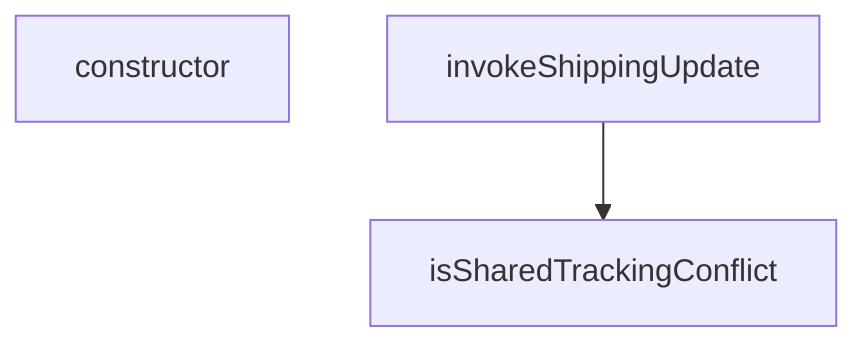

## Genel Bakış
Bu modül, gönderi güncelleme işlemlerindeki temel yardımcı fonksiyonları ve hat管理体系ını içerir. Paylaşımlı takip numarası çatışmalarını yönetmek ve gönderi güncelleme isteklerini güvenli bir şekilde tetiklemekten sorumludur.

## Fonksiyon Grupları
### Takip Numarası Çatışma Yönetimi
Gönderi güncellemeleri sırasında oluşabilecek paylaşımlı takip numarası çatışmalarını tespit eder ve yönetir.
- isSharedTrackingConflict, SharedTrackingDeclinedError

### Gönderi Güncelleme İşlemi
Supabase veritabanı bağlantısıyla gönderi durumu güncellemelerini merkezi olarak tetikler.
- invokeShippingUpdate

---

## AXIOMS – Mimari Varsayımlar

Bu modül için özel aksiyom tanımlanmamıştır.

**Gerekçe:** Sunulan fonksiyon imzaları (özellikle `isSharedTrackingConflict`, `invokeShippingUpdate` ve `SharedTrackingDeclinedError.constructor`) bilinmeyen tiplere (`ShippingFunctionsHost`, `ShippingUpdateBody`, `ShippingInvokeOutcome`) bağımlıdır. Fonksiyon gövdeleri verilmediğinden, doğru çalışmalarına yönelik zorunlu koşullar (örn. `supabase` objesinin hangi metotları içermesi gerektiği, `body`'de hangi alanların bulunması gerektiği, `allowSharedTracking` boolean'ının ne zaman `True`/`False` olması gerektiği vb.)uniq emperik veriye dayalı olarak çıkarılamamaktadır.

---

## FONKSİYON DETAYLARI

### isSharedTrackingConflict
**Ne yapar**: Verilen hata nesnesinin, sunucu tarafında ortaya çıkan ve “paylaşılan takip numarası” çatışmasını belirten spesifik bir 409 Conflict hatası olup olmadığını kontrol eder.

**Nasıl yapar**: Fonksiyon, bir hata nesnesi alır ve onun bir `Response` nesnesi içerip içermediğini, ayrıca bu yanıtın durum kodunun 409 (Conflict) olup olmadığını doğrular. Ardından, `Response` gövdesinin içeriğini parse ederek içindeki `error` alanının `SHARED_TRACKING_CONFLICT` sabit değeri ile eşleşip eşleşmediğini kontrol eder. Önemli bir detay olarak, `Response` gövdesini okurken `clone()` metodu kullanılır; çünkü `Response` gövdesi bir kez okunduğunda tüketilir ve çağrı yapan kodun aynı nesneyi tekrar okuması (örn. loglama için) mümkün olmaz.

**Parametreler**:
- error: unknown — Fonksiyonun test edeceği hata nesnesi. `supabase-js` kütüphanesinden kaynaklanan bir `FunctionsHttpError` olabilir.

**Dönüş**: Promise<boolean> — Eğer hata, paylaşılan takip numarası çatışması ile ilgili belirli bir 409 hatası ise `true`, değilse `false` döndürür.

### invokeShippingUpdate
**Ne yapar**: Supabase Edge Function olan `admin-update-shipping` fonksiyonunu çağırarak kargo güncelleme işlemini başlatır ve sonucu }}

}},?,?,?,?,**Nasıl yapar**: Fonksiyon, `supabase` istemcisini, `body` (gövde) verisini ve `allowSharedTracking` bayrağını alır. `allowSharedTracking` `true` olduğunda, gönderilen payload'a `allow_shared_tracking: true` alanı ekleyerek sunucuya bu cậpelleme için benzersizlik kısıtlamasının askıya alınmasını söyler. Varsayılan olarak `false`'dur, yani sunucunun varsayılan benzersizlik koruması aktiftir. Fonksiyon, belirtilen Supabase fonksiyonunu çağırır. Çağrı başarılı olursa `{ ok: true, conflict: false }` döner. Hata oluşursa, hatanın `isSharedTrackingConflict` fonksiyonu kullanılarak bir paylaşım çatışması olup olmadığını kontrol eder ve sonucu `{ ok: false, conflict: ..., error }` formatında döndürür.

**Parametreler**:
- supabase: ShippingFunctionsHost — Supabase istemcisini temsil eder ve `functions.invoke` metodunu içeren bir arayüzdür.
- body: ShippingUpdateBody — `admin-update-shipping` fonksiyonuna gönderilecek güncelleme verilerini içeren nesne.
- allowSharedTracking: boolean — Varsayılan `false`. Eğer `true` ise, paylaşılan takip numarasına izin verilir ve sunucu tarafı benzersizlik kontrolü atlatılır. Bu değer yalnızca kullanıcı tarafından açıkça onaylandığında `true` olarak ayarlanmalıdır.

**Dönüş**: Promise<ShippingInvokeOutcome> — İşlem sonucunu temsil eden bir nesne. İçeriği: `ok` (işlem başarı durumu), `conflict` (bir paylaşım çatışması olup olmadığı) ve hata oluşursa `error` alanını içerir.

### SharedTrackingDeclinedError.constructor
**Ne yapar**: `SharedTrackingDeclinedError` özel hata sınıfının constructor metodudur ve nesne oluşturulurken temel ayarları yapar.

**Nasıl yapar**: Bu bir sınıf constructor'ıdır. `super()` çağrısı ile üst sınıfın (`Error`) constructor'ını, “Paylaşılan takip numarası onaylanmadı; kargo bilgisi yazılmadı.” hata mesajıyla çağırır. Ardından, hata nesnesinin `name` özelliğini `'SharedTrackingDeclinedError'` olarak ayarlar. Bu, hata yakalandığında hata türünün tanımlanmasını kolaylaştırır.

**Parametreler**: Bu constructor metodu herhangi bir parametre almaz.

**Dönüş**: void (belirtilmemiş). Sınıf constructor'ları doğrudan bir değer döndürmez; yerine, `new` anahtar kelimesi ile oluşturulan sınıf örneğini döndürürler.

---

## INTERFACES

### ShippingFunctionsHost
Bu modülün istemciden ihtiyaç duyduğu TEK yetenek. `SupabaseClient<Database>` yerine dar bir sözleşme yazıldı — gerçek istemci bunu yapısal olarak zaten karşılıyor, ama test bir "sahte istemci" üretmek için tip zorlamasına (`as unknown as`) mecbur kalmıyor. Tip zorlaması testte de üretimdeki kadar t
- `functions: {`

---

## TYPE ALIASES

### ShippingUpdateBody
`interface` DEĞİL `type`: arayüzlerin örtük indeks imzası yoktur ve `Record<string, unknown>` bekleyen `invoke` sözleşmesine geçmezdi.
```typescript
type ShippingUpdateBody = {
  order_id: string
  carrier: string
  tracking_number: string
  tracking_url: string | null
  send_email: boolean
}
```

### ShippingInvokeOutcome
```typescript
type ShippingInvokeOutcome = | { ok: true; conflict: false }
  /** `conflict: true` → SADECE paylaşılan takip numarası reddi; başka her hata `false`. */
  | { ok: false; conflict: boolean; error: unknown }
```

---

## AST POINTERS

### [N1_NASIL] AST Pointer: adminShipping.ts::isSharedTrackingConflict
- **params**: `error: unknown` — kontrol edilecek hata nesnesi
- **ic_degiskenler**:
  - `context` — `error` nesnesinden çıkarılan `Response` nesnesi; `error.context` alanından `instanceof Response` ile elde edilir
  - `body` — `context.clone().json()` ile asenkron olarak okunan ve parse edilen JSON gövdesi; `clone()` ile orijinal Response tüketilmeden yan kopya oluşturulur
- **Referanslar**: `SHARED_TRACKING_CONFLICT` — modül seviyesi sabit; `body.error` değeri ile karşılaştırılır
- **Dönüş**: `Promise<boolean>` — hata 409 statuslu ve `SHARED_TRACKING_CONFLICT` ise `true`, aksi halde `false`

---

### [N2_NASIL] AST Pointer: adminShipping.ts::invokeShippingUpdate
- **params**: `supabase: ShippingFunctionsHost` — Supabase edge function erişim barındıran host nesnesi; `.functions.invoke()` çağrısı için kullanılır / `body: ShippingUpdateBody` — güncelleme verilerini taşıyan request gövdesi / `allowSharedTracking: boolean` (varsayılan `false`) — ortak takip numarasına izin verilip verilmeyeceğini belirler
- **ic_degiskenler**:
  - `payload` — `allowSharedTracking` durumuna göre `body`'nin `allow_shared_tracking: true` alanıyla genişletilmiş veya aynen kullanılan kopya; edge function'a gönderilen nihai veri
  - `error` — `supabase.functions.invoke()` yanıtından destructure edilen hata nesnesi; `null` ise başarılı demektir
- **Dönüş**: `Promise<ShippingInvokeOutcome>` — `{ ok: true, conflict: false }` başarılı durumda; başarısız ise `{ ok: false, conflict: boolean, error }` donde `conflict` değeri `isSharedTrackingConflict(error)` ile belirlenir

---

### [N3_NASIL] AST Pointer: adminShipping.ts::SharedTrackingDeclinedError.constructor
- **params**: (parametre yok; yalnızca gizli `this` bağımsız değişkeni)
- **ic_degiskenler**:
  - `this.name` — hatanın tanınabilir adını `'SharedTrackingDeclinedError'` değerine atar; `catch` bloklarında filtreleme amaçlı kullanılır
- **Yan etkiler**: `super('Paylaşılan takip numarası onaylanmadı; kargo bilgisi yazılmadı.')` çağrısı ile üst sınıfın (`Error`) constructor'ını mesaj ileteterek çalıştırır
- **Dönüş**: `yok` (constructor dönüş değeri üretmez)

---


## MERMAID CALL GRAPH


## NODE ID STANDARD

  file: src\utils\adminShipping.ts
  function: src\utils\adminShipping.ts::isSharedTrackingConflict
  function: src\utils\adminShipping.ts::invokeShippingUpdate
  class: src\utils\adminShipping.ts::SharedTrackingDeclinedError

---

## DISA AKTARILANLAR (EXPORTS)
  export: SharedTrackingDeclinedError
  export: ShippingFunctionsHost
  export: ShippingInvokeOutcome
  export: ShippingUpdateBody
  export: invokeShippingUpdate
  export: isSharedTrackingConflict