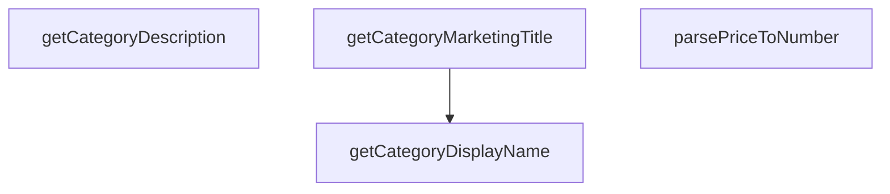

## Genel Bakış
Bu yardımcı modül, VentHub HVAC platformunda ürün kategorileri ile ilgili metin üretimi ve veri dönüşümü işlemlerini tek merkezde toplar. Veritabanından alınan kategori nesnelerini kullanarak kullanıcı arayüzü, pazarlama ve açıklama amaçlı metinler oluşturur, ayrıca heterojen formatlarda gelen fiyat verisini uygulamada kullanılabilir sayısal değere dönüştürür. Temel utility işlevleri sunarak farklı modüllerin tekrar eden kod yazmasının önüne geçer.

## Fonksiyon Grupları
### Kategori Odaklı Metin Üretimi
Veritabanından gelen kategori nesneleri üzerinden farklı kullanım senaryolarına uygun metin içerikleri üretir. Arayüzde gösterilecek görüntülenebilir isimler, pazarlama çalışmalarında kullanılacak başlıklar ve kategori açıklamaları bu gruptaki fonksiyonlar ile oluşturulur.
- getCategoryDisplayName, getCategoryMarketingTitle, getCategoryDescription

### Veri Dönüşüm Yardımcıları
Farklı kaynaklardan gelen bilinmeyen tipteki ham verileri uygulama standartlarına uygun tiplere dönüştürür. Özellikle fiyat verilerini sayısal değere çevirme işlevini sunarak tüm platformda fiyat işlemlerinde tutarlılık sağlar.
- parsePriceToNumber

---

## AXIOMS – Mimari Varsayımlar
Bu modül, veritabanından gelen kategori nesnelerini kullanıcı arayüzü için okunabilir metinlere dönüştürmek ve fiyat verilerini sayısal formata parse etmek amacıyla tasarlanmış yardımcı modüldür, tüm fonksiyonlarının doğru çalışması girdi olarak aldığı parametrelerin tür uyumluluğuna ve yapısal bütünlüğüne bağlıdır.

[Aksiyom 1]: Eğer getCategoryDisplayName fonksiyonuna iletilen DbCategory türündeki kategori nesnesi (null/undefined haricinde) gerekli alanları eksik olursa ya da opsiyonel olarak iletilen çeviri fonksiyonu (t) geçersiz bir değer olarak gönderilirse, kategori için kullanıcıya gösterilecek doğru görünür isim üretilemez, arayüzde boş veya hatalı metin görünür.
[Aksiyom 2]: Eğer getCategoryMarketingTitle ve getCategoryDescription fonksiyonlarına iletilen DbCategory nesnesi (null/undefined haricinde) yapısal olarak uyumsuz olursa, pazarlama başlığı veya açıklama metni üretilemez, ilgili arayüz alanlarında beklenmedik çıktı oluşur.
[Aksiyom 3]: Eğer parsePriceToNumber fonksiyonuna iletilen val parametresi sayıya dönüştürülebilecek string, sayı veya standart boş değerler (null/undefined) dışında geçersiz bir veri türü (nesne, dizi vb.) olarak gönderilirse, fiyat değeri başarılı bir şekilde sayısal formata dönüştürülemez, NaN veya hatalı sayısal değer döner, tüm fiyat bazlı hesaplamalar bozulur.
[Aksiyom 4]: Eğer tüm kategori işleme fonksiyonlarına DbCategory türüne uymayan rastgele bir nesne iletilirse, tüm kategori metni üretme işlemleri başarısız olur, modülün kullanıldığı tüm ekranlarda kategori bilgileri doğru şekilde görüntülenemez.

---

## FONKSİYON DETAYLARI

### getCategoryDisplayName
**Ne yapar**: Verilen kategori nesnesi için en uygun yerelleştirilmiş görünüm adını belirler. Kullanıcı arayüzlerinde kategorilerin okunabilir, konuma göre çevrilmiş isimlerini göstermek amacıyla tasarlanmıştır, null veya undefined kategori değerleri için de güvenli şekilde çalışır.
**Nasıl yapar**: Önceliği sağlanmışsa i18n uyumlu çeviri fonksiyonundan gelen yerelleştirilmiş değere verir. Eğer çeviri fonksiyonu sağlanmamışsa veya ilgili çeviri anahtarı mevcut değilse veritabanında kayıtlı `menu_label` alanına geri döner. O da mevcut değilse ham kategori `name` alanını kullanarak her zaman geçerli bir string döndürmesini garanti eder.
**Parametreler**:
- category: DbCategory | null | undefined — Görünüm adı çıkarılacak veritabanı kategori nesnesi, null veya undefined olması durumunda hata fırlatmadan güvenli şekilde çalışır
- t?: (key: string) => string — İsteğe bağlı olarak sağlanan, i18next veya özel bir hook'tan gelen çeviri fonksiyonu, çeviri anahtarı alıp yerelleştirilmiş string döndürür
**Dönüş**: string, çözümlenmiş yerelleştirilmiş kategori görünüm adı, her zaman geçerli bir string olarak döndürülür

---

## AST POINTERS

### [N1_NASIL] AST Pointer: C:\Users\alize\venthub-hvac\src\utils\categoryHelpers.ts::getCategoryDisplayName
- **params**: ["category: DbCategory | null | undefined", "t?: (key: string) => string"]
- **ic_degiskenler**:
  - `tKey` — kategori için çeviri anahtarı olarak kullanılan, öncelikle `translation_key` değerini, yoksa `slug` değerini alan değişken
  - `translationPath` — i18n çevirisinde kullanılacak tam yol, oluşturulan tKey'i `common.categoryList.` önekiyle birleştirir
  - `translated` — i18n çeviri fonksiyonu `t` ile alınan, kategorinin çevrilmiş görünen adı
- **Dönüş**: string

### [N2_NASIL] AST Pointer: C:\Users\alize\venthub-hvac\src\utils\categoryHelpers.ts::getCategoryMarketingTitle
- **params**: ["category: DbCategory | null | undefined"]
- **ic_degiskenler**: (yok)
- **Dönüş**: string

### [N3_NASIL] AST Pointer: C:\Users\alize\venthub-hvac\src\utils\categoryHelpers.ts::getCategoryDescription
- **params**: ["category: DbCategory | null | undefined"]
- **ic_degiskenler**:
  - `meta` — kategoriyle ilişkili metadata nesnesi, `hero_description` alanını okumak için kullanılır
- **Dönüş**: string

### [N4_NASIL] AST Pointer: C:\Users\alize\venthub-hvac\src\utils\categoryHelpers.ts::parsePriceToNumber
- **params**: ["val: unknown"]
- **ic_degiskenler**:
  - `cleaned` — giriş değerinden sayısal olmayan karakterleri temizleyen, virgül ayracını noktaya çeviren standartlaştırılmış fiyat stringi
  - `parsed` — temizlenmiş fiyat stringinden `parseFloat` ile çıkarılmış ondalıklı sayısal değer
- **Dönüş**: number

---

## MERMAID CALL GRAPH

## NODE ID STANDARD

  file: src\utils\categoryHelpers.ts
  function: src\utils\categoryHelpers.ts::getCategoryDisplayName
  function: src\utils\categoryHelpers.ts::getCategoryMarketingTitle
  function: src\utils\categoryHelpers.ts::getCategoryDescription
  function: src\utils\categoryHelpers.ts::parsePriceToNumber

---

## DISA AKTARILANLAR (EXPORTS)
  export: getCategoryDescription
  export: getCategoryDisplayName
  export: getCategoryMarketingTitle
  export: parsePriceToNumber