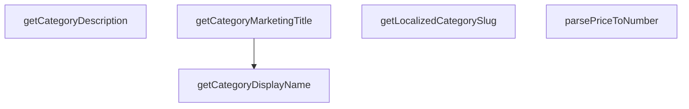

## Genel Bakış
Bu yardımcı modül, platform genelinde kategorilerle ilgili tutarlı ve doğru metinlerin (görünen isim, pazarlama başlığı, açıklama) üretilmesi ile heterojen kaynaklardan gelen fiyat verilerinin sayısal formata dönüştürülmesi sorumluluğunu taşır. Farklı bileşenlerin bu ortak işlemleri tekrar yazmasını engelleyerek veri sunumu tutarlılığı ve kod tekrarını önler.

## Fonksiyon Grupları
### Kategori Metin Üretimi
Bu grup, veritabanı veya alan modellerinden gelen kategori nesnelerini, farklı kullanım bağlamalarına (arayüz gösterimi, pazarlama metni, açıklama) uygun, okunabilir ve yerelleştirilmiş metinlere dönüştürmekten sorumludur.
- getCategoryDisplayName, getLocalizedCategorySlug, getCategoryMarketingTitle, getCategoryDescription

### Veri Normalizasyonu
Bu grup, dış kaynaklardan gelen (özellikle fiyat ile ilgili) tutarsız veya bilinmeyen tipteki ham verileri, uygulama içi işlemlerde güvenle kullanılabilecek standart tiplere (örn: sayısal) dönüştürerek veri kalitesini ve iş mantığının sağlamlığını garanti altına alır.
- parsePriceToNumber

---

## AXIOMS – Mimari Varsayımlar
- Bu modül davranışsal mantık içermez (salt veri / konfigürasyon / tip tanımı).
- [Aksiyom 1]: Modülün dışa açtığı yapı (anahtar kümesi / şema) bir sözleşmedir; tüketiciler bu sabit yapıya bağlıdır — kırıcı değişiklik tüm tüketicileri etkiler.
- [Aksiyom 2]: Bir öğe ekleme/çıkarma yapısal-uyumlu olmalı; ilgili tipler ve seçiciler aynı commit'te güncel tutulmalıdır.

---

## FONKSİYON DETAYLARI

### getCategoryDisplayName
**Ne yapar**: Verilen kategori nesnesi için en uygun yerelleştirilmiş görünüm adını belirler. Kullanıcı arayüzlerinde kategorilerin okunabilir, konuma göre çevrilmiş isimlerini göstermek amacıyla tasarlanmıştır, null veya undefined kategori değerleri için de güvenli şekilde çalışır.
**Nasıl yapar**: Önceliği sağlanmışsa i18n uyumlu çeviri fonksiyonundan gelen yerelleştirilmiş değere verir. Eğer çeviri fonksiyonu sağlanmamışsa veya ilgili çeviri anahtarı mevcut değilse veritabanında kayıtlı `menu_label` alanına geri döner. O da mevcut değilse ham kategori `name` alanını kullanarak her zaman geçerli bir string döndürmesini garanti eder.
**Parametreler**:
- category: DbCategory | null | undefined — Görünüm adı çıkarılacak veritabanı kategori nesnesi, null veya undefined olması durumunda hata fırlatmadan güvenli şekilde çalışır
- t?: (key: string) => string — İsteğe bağlı olarak sağlanan, i18next veya özel bir hook'tan gelen çeviri fonksiyonu, çeviri anahtarı alıp yerelleştirilmiş string döndürür
**Dönüş**: string, çözümlenmiş yerelleştirilmiş kategori görünüm adı, her zaman geçerli bir string olarak döndürülür

### getLocalizedCategorySlug

**Ne yapar**: Verilen bir kategorinin belirli bir dile karşılık gelen URL'de kullanılacak slug'ını (SEO dostu kısa adını) döndürür. Fonksiyon, kategorinin kanonik İngilizce slug'ı ile dil bazlı yerelleştirilmiş slug'ları arasındaki ayrımı yönetir.

**Nasıl yapar**: Fonksiyon, kategorinin `metadata` alanında bulunan `slug` nesnesini ( `{ tr, en }` yapısında) kontrol eder. Bu alan, localized-slug migrasyonu tarafından veritabanına eklenmiştir. Eğer ilgili dil için bir yerelleştirilmiş slug mevcutsa onu, aksi halde kanonik `slug` sütunundaki değeri (varsayılan olarak İngilizce) geri döndürür. Bu yaklaşım, migrasyon henüz uygulanmamış olsa bile fonksiyonun çalışmaya devam etmesini sağlar.

**Parametreler**:
- `category`: `DbCategory | DomainCategory | CategorySlugSource | null | undefined` — Slug'ı çözümlenecek kategori nesnesi. Veritabanından gelen bir satır (`DbCategory`), arayüzde kullanılan bir alan modeli (`DomainCategory`) veya sadece slug kaynağı olarak kullanılan bir nesne (`CategorySlugSource`) olabilir. `null` veya `undefined` değerleri de kabul edilir.
- `lang`: `string` — Aktif olan dil kodu. Geçerli değerler `'tr'` (Türkçe) veya `'en'` (İngilizce) olmalıdır.

**Dönüş**: `string` — Belirtilen dil için URL'de kullanılacak olan slug dizesi.

### getCategoryMarketingTitle

**Ne yapar**: Verilen kategori nesnesinin pazarlama odaklı başlığını döndürür. Veritabanında tanımlı bir `marketing_title` alanı varsa onu kullanır, aksi takdirde standart ekran adını (display name) alternatif olarak返回 eder.

**Nasıl yapar**: Fonksiyon, kategori nesnesinin `marketing_title` alanını kontrol eder. Eğer bu alan mevcut ve doluysa doğrudan o değer döndürülür. Alan yoksa veya boşsa, kategorinin standart display name değeri fallback olarak kullanılır. Null veya undefined girdiler için güvenli bir şekilde çalışır.

**Parametreler**:
- `category`: `DbCategory | null | undefined` — Pazarlama başlığı bilgisi çıkarılacak veritabanı kategori nesnesi. Null veya undefined olabilir.

**Dönüş**: `string` — Kategorinin pazarlama başlığı veya alternatif olarak standart ekran adı.

### getCategoryDescription
**Ne yapar**: Geliştirildi ancak detay üretilemedi.

### parsePriceToNumber
**Ne yapar**: Geliştirildi ancak detay üretilemedi.

---

## İTHALATLAR (IMPORTS)
- import: ../types/db-rows::type { DbCategory }
- import: ../types/ui-models::type { DomainCategory }

---

## TYPE ALIASES

### CategorySlugSource
Minimal shape needed to resolve a category URL slug: both `DbCategory` and `DomainCategory` satisfy it, as do raw Supabase rows whose `metadata` is still untyped (e.g. inside `generateStaticParams`).
```typescript
type CategorySlugSource = {
    slug: string | null
    metadata?: unknown
}
```

---

## AST POINTERS

### [N1_NASIL] AST Pointer: categoryHelpers.ts::getCategoryDisplayName
- **params**: (category: DbCategory | null | undefined, t?: (key: string) => string)
- **ic_degiskenler**:
  - `tKey` — i18n çeviri için kullanılacak anahtar; category.translation_key varsa onu, yoksa category.slug'ı kullanır
  - `translationPath` — tam çeviri yolu; `common.categoryList.${tKey}` formatında oluşturulur
  - `translated` — t(translationPath) çağrısının döndürdüğü çeviri sonucu; geçerliyse kullanılır
  - `category.translation_key` — veritabanından gelen çeviri anahtarı
  - `category.slug` — kategorinin URL slug'ı
  - `category.menu_label` — menüde gösterilen özel etiket (elle girilmiş override)
  - `category.name` — kategorinin orijinal adı (son fallback)
- **Dönüş**: string — kategorinin görüntülenecek adı; sırasıyla çeviri, menu_label veya name döner

---

### [N2_NASIL] AST Pointer: categoryHelpers.ts::getLocalizedCategorySlug
- **params**: (category: DbCategory | DomainCategory | CategorySlugSource | null | undefined, lang: string)
- **ic_degiskenler**:
  - `canonical` — canonical (standart) slug değeri; category.slug veya boş string
  - `meta` — category.metadata objesi; localized slug verilerini içerir
  - `localized` — meta içindeki slug objesi; farklı dillerdeki slug'ları barındırır
  - `key` — lang parametresine göre seçilen dil anahtarı; 'en' ise 'en', diğerleri 'tr'
  - `value` — localized objesinden seçilen dile ait slug string'i
  - `category.slug` — kategorinin orijinal/standart slug'ı
  - `category.metadata` — kategorinin metadata objesi (JSON)
- **Dönüş**: string — lokalize edilmiş slug; localized slug bulunamazsa canonical döner

---

### [N3_NASIL] AST Pointer: categoryHelpers.ts::getCategoryMarketingTitle
- **params**: (category: DbCategory | null | undefined)
- **ic_degiskenler**:
  - `category.marketing_title` — pazarlama amaçlı özel başlık (DB override)
- **Dönüş**: string — marketing_title varsa onu, yoksa getCategoryDisplayName(category) sonucunu döner

---

### [N4_NASIL] AST Pointer: categoryHelpers.ts::getCategoryDescription
- **params**: (category: DbCategory | null | undefined)
- **ic_degiskenler**:
  - `meta` — category.metadata objesi
  - `meta.hero_description` — metadata içindeki hero section açıklaması
  - `category.description` — kategorinin standart açıklaması (fallback)
- **Dönüş**: string — hero_description varsa onu, yoksa category.description veya boş string döner

---

### [N5_NASIL] AST Pointer: categoryHelpers.ts::parsePriceToNumber
- **params**: (val: unknown)
- **ic_degiskenler**:
  - `cleaned` — val string ise rakamlar, nokta ve virgül dışındaki tüm karakterleri temizlenmiş hali
  - `parsed` — cleaned string'in parseFloat ile sayıya çevrilmiş hali; NaN ise 0 döner
- **Dönüş**: number — parse edilmiş fiyat sayısı; geçerli değilse 0 döner

---


## MERMAID CALL GRAPH


## NODE ID STANDARD

  file: src\utils\categoryHelpers.ts
  function: src\utils\categoryHelpers.ts::getCategoryDisplayName
  function: src\utils\categoryHelpers.ts::getLocalizedCategorySlug
  function: src\utils\categoryHelpers.ts::getCategoryMarketingTitle
  function: src\utils\categoryHelpers.ts::getCategoryDescription
  function: src\utils\categoryHelpers.ts::parsePriceToNumber

---

## DISA AKTARILANLAR (EXPORTS)
  export: CategorySlugSource
  export: getCategoryDescription
  export: getCategoryDisplayName
  export: getCategoryMarketingTitle
  export: getLocalizedCategorySlug
  export: parsePriceToNumber