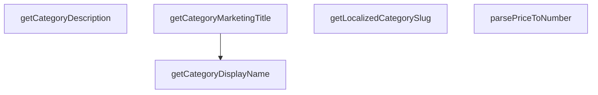

## Genel Bakış

Bu modül, kategori nesnelerinden kullanıcıya gösterilecek metinsel verileri (görünen ad, pazarlama başlığı, açıklama, URL slug) çıkaran yardımcı fonksiyonlar içerir. Ayrıca fiyat gibi ham değerleri sayısal biçime dönüştürme işlevi de barındırır. Fonksiyonlar birbirini doğrudan çağırmaz; her biri kendi alanında bağımsız çalışır.

## Fonksiyon Grupları

### Kategori Görüntüleme Yardımcıları

Kategori nesnesinden farklı bağlamlarda kullanılacak metinsel içerik üretir. Görünen ad, pazarlama başlığı ve açıklama alanlarını güvenli biçimde döndürür; kategori null veya undefined ise uygun varsayılan değer sağlar.

- getCategoryDisplayName, getCategoryMarketingTitle, getCategoryDescription

### Kategori URL ve Slug Yardımcıları

Kategori için dile özel, URL dostu bir slug üretir. Fonksiyon birden fazla kategori tipini (DbCategory, DomainCategory, CategorySlugSource) kabul eder ve dil parametresine göre yerelleştirilmiş çıktı verir.

- getLocalizedCategoryString

### Fiyat İşleme

Bilinmeyen türdeki bir değeri sayısal fiyata dönüştürür. Veritabanından gelen ham fiyat verisinin güvenli biçimde sayıya çevrilmesini sağlar.

- parsePriceToNumber

### Dış Bağımlılıklar

- DbCategory, DomainCategory, CategorySlugSource tipleri dış kaynaklardan tanımlanmıştır.
- getCategoryDisplayName fonksiyonu opsiyonel bir çeviri fonksiyonu (t) parametresi alır; bu fonksiyon dışarıdan sağlanır.
- Dinamik veya lazy yüklenen bir modül bağımlılığı bulunmamaktadır.

---

## AXIOMS – Mimari Varsayımlar

[Aksiyom 1]: Eğer `category` null veya undefined ise, `getCategoryDisplayName`, `getCategoryMarketingTitle` ve `getCategoryDescription` fonksiyonları uygun bir varsayılan string değer döndürmelidir; aksi takdirde null reference hatası oluşur.

[Aksiyom 2]: Eğer `t` (çeviri fonksiyonu) `getCategoryDisplayName` çağrılmadığında sağlanmazsa, kategori adı ham (çevrilmemiş) haliyle döndürülmelidir.

[Aksiyom 3]: Eğer `lang` parametresi boş string veya geçersiz bir dil kodu olarak verilirse, `getLocalizedCategorySlug` fonksiyonu uygun bir fallback slug üretmelidir; aksi takdirde geçersiz URL'ler oluşur.

[Aksiyom 4]: Eğer `getLocalizedCategorySlug` fonksiyonuna sağlanan `category` nesnesinde slug bilgisi yoksa, fonksiyon alternatif bir kaynaktan slug türetmeli veya varsayılan bir değer döndürmelidir.

[Aksiyom 5]: Eğer `parsePriceToNumber` fonksiyonuna sayıya dönüştürülemeyen bir `val` verilirse (örneğin null, undefined, boş string, metin), fonksiyon uygun bir varsayılan sayısal değer döndürmelidir; aksi takdirde NaN veya runtime hatası oluşur.

---

## FONKSİYON DETAYLARI

### getCategoryDisplayName
**Ne yapar**: Verilen bir kategori için en uygun yerelleştirilmiş görünen adı belirler. i18n çeviri anahtarını önceliklendirir, ardından veritabanındaki `menu_label` alanına, en sonunda ham `name` alanına geri döner.

**Nasıl yapar**: Fonksiyon öncelikle kategori nesnesinin null veya undefined olup olmadığını kontrol eder. Eğer bir çeviri fonksiyonu (`t`) sağlanmışsa ve kategorinin `name` alanı mevcutsa, bu anahtarla çeviri araması yapar. Çeviri bulunursa onu döndürür. Çeviri bulunamazsa veya çeviri fonksiyonu sağlanmamışsa, kategorinin `menu_label` alanını kontrol eder. `menu_label` de mevcut değilse, kategorinin ham `name` alanını döndürür. Hiçbir alan mevcut değilse boş bir string döner.

**Parametreler**:
- category: DbCategory | null | undefined — Görünen adı çıkarılacak veritabanı kategori nesnesi. Null veya undefined olabilir.
- t: (key: string) => string — i18next veya özel bir hook'tan gelen isteğe bağlı çeviri fonksiyonu. Sağlanırsa kategori adı bu fonksiyon aracılığıyla çevrilir.

**Dönüş**: string — Çözümlenmiş görünen ad string'i.

### getLocalizedCategorySlug
**Ne yapar**: Geliştirildi ancak detay üretilemedi.

### getCategoryMarketingTitle
**Ne yapar**: Geliştirildi ancak detay üretilemedi.

### getCategoryDescription
**Ne yapar**: Geliştirildi ancak detay üretilemedi.

### parsePriceToNumber
**Ne yapar**: Geliştirildi ancak detay üretilemedi.

---

## İTHALATLAR (IMPORTS)
- import: ../types/db-rows::type { DbCategory }
- import: ../types/ui-models::type { DomainCategory }

---

## TYPE ALIASES

### CategorySlugSource
Minimal shape needed to resolve a category URL slug: both `DbCategory` and `DomainCategory` satisfy it, as do raw Supabase rows whose `metadata` is still untyped (e.g. inside `generateStaticParams`).
```typescript
type CategorySlugSource = {
    slug: string | null
    metadata?: unknown
}
```

---

## AST POINTERS

### [N1_NASIL] AST Pointer: src/utils/categoryHelpers.ts::getCategoryDisplayName
- **params**: `category: DbCategory | null | undefined`, `t?: (key: string) => string`
- **ic_degiskenler**:
  - `tKey` — `category.translation_key` varsa onu, yoksa `category.slug` değerini tutar; çeviri anahtarı olarak kullanılır
  - `translationPath` — `common.categoryList.${tKey}` formatında oluşturulmuş i18n çeviri yolunu tutar
  - `translated` — `t(translationPath)` çağrısının dönüş değerini tutar; çevrilmiş metni veya orijinal path'i içerir
- **Dönüş**: `string` — boş kategori ise boş string; i18n çeviri başarılıysa çevrilmiş metin; değilse `category.menu_label`; o da yoksa `category.name`

### [N2_NASIL] AST Pointer: src/utils/categoryHelpers.ts::getLocalizedCategorySlug
- **params**: `category: DbCategory | DomainCategory | CategorySlugSource | null | undefined`, `lang: string`
- **ic_degiskenler**:
  - `canonical` — `category.slug` varsa onu, yoksa boş string'i tutar; varsayılan slug değeridir
  - `meta` — `category.metadata` alanını tutar; yerelleştirilmiş slug bilgisini içerir
  - `localized` — `meta` objesindeki `slug` alanını tutar; dillere göre slug eşleştirmesini içerir
  - `key` — `lang` değeri `'en'` ise `'en'`, değilse `'tr'` değerini tutar; hangi dilin slug'ının alınacağını belirler
  - `value` — `localized` objesinden `key` ile erişilen string değerini tutar; yerelleştirilmiş slug
- **Dönüş**: `string` — boş kategori ise boş string; metadata içinde geçerli yerelleştirilmiş slug varsa onu; yoksa `canonical` slug

### [N3_NASIL] AST Pointer: src/utils/categoryHelpers.ts::getCategoryMarketingTitle
- **params**: `category: DbCategory | null | undefined`
- **ic_degiskenler**: yok
- **Dönüş**: `string` — boş kategori ise boş string; `category.marketing_title` varsa onu; yoksa `getCategoryDisplayName(category)` fonksiyonunun dönüş değerini döndürür

### [N4_NASIL] AST Pointer: src/utils/categoryHelpers.ts::getCategoryDescription
- **params**: `category: DbCategory | null | undefined`
- **ic_degiskenler**:
  - `meta` — `category.metadata` alanını tutar; `hero_description` içerip içermediği kontrol edilir
- **Dönüş**: `string` — boş kategori ise boş string; `meta.hero_description` varsa onu (string olarak cast edilmiş); yoksa `category.description` varsa onu; o da yoksa boş string

### [N5_NASIL] AST Pointer: src/utils/categoryHelpers.ts::parsePriceToNumber
- **params**: `val: unknown`
- **ic_degiskenler**:
  - `cleaned` — `val` string ise rakam, nokta ve virgül dışındaki karakterlerden arındırılmış, virgülleri noktaya çevrilmiş string'i tutar
  - `parsed` — `parseFloat(cleaned)` dönüş değerini tutar; sayıya dönüştürülmüş fiyat değeri
- **Dönüş**: `number` — `val` number ise doğrudan kendisi; string ise temizlenmiş ve parse edilmiş değer (NaN ise 0); diğer türlerde 0

---


## MERMAID CALL GRAPH


## NODE ID STANDARD

  file: categoryHelpers.ts
  function: categoryHelpers.ts::getCategoryDisplayName
  function: categoryHelpers.ts::getLocalizedCategorySlug
  function: categoryHelpers.ts::getCategoryMarketingTitle
  function: categoryHelpers.ts::getCategoryDescription
  function: categoryHelpers.ts::parsePriceToNumber

---

## DISA AKTARILANLAR (EXPORTS)
  export: CategorySlugSource
  export: getCategoryDescription
  export: getCategoryDisplayName
  export: getCategoryMarketingTitle
  export: getLocalizedCategorySlug
  export: parsePriceToNumber