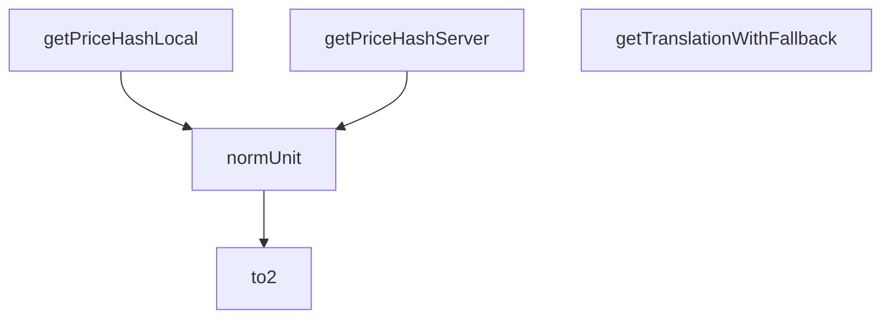

## Genel Bakış
Bu modül, sipariş tamamlama (checkout) sürecinde kullanılan yardımcı işlevleri içerir. Fiyat verilerinin tutarlılığını sağlamak için hash oluşturma, sayısal değerleri formatlama ve normalize etme, ayrıca çeviri metinlerini yönetme gibi görevleri merkezi bir noktadan sunar. Hem istemci hem sunucu taraflı akışları destekleyerek kod tekrarını azaltır.

## Fonksiyon Grupları
### Fiyat Hash Oluşturma Fonksiyonları
Sepet veya sipariş öğeleri için benzersiz bir parmak izi (hash) oluşturarak, checkout sürecinin farklı aşamalarında veya taraflarında fiyatların tutarlı olduğunu doğrulamak için kullanılır.
- getPriceHashLocal, getPriceHashServer

### Veri Biçimlendirme ve Normalizasyon Yardımcıları
Sayısal değerleri standart ve okunabilir formata dönüştürmek ve bilinmeyen türdeki değerleri güvenli bir şekilde sayıya çevirmek için kullanılır.
- to2, normUnit

### Çeviri Yedekleme Yardımcısı
Arayüz metinleri için çeviri anahtarlarını güvenli bir şekilde işler; istenen çeviri yoksa belirli bir varsayılan metni döndürerek eksik içerik sorunlarını önler.
- getTranslationWithFallback

---

## AXIOMS – Mimari Varsayımlar

Bu modül için fonksiyon gövdeleri sağlanmadığından, yalnızca imzalardan çıkarılabilecek varsayımlar belirtilebilir.

[Aksiyom 1]: Eğer `getPriceHashServer` fonksiyonuna `serverItems` parametresi `undefined` veya `null` olarak geçilirse, fonksiyon bu durumla başa çıkacak şekilde davranmalıdır; aksi takdirde null/undefined üzerinde işlem yapma hatası oluşur.

[Aksiyom 2]: Eğer `getPriceHashServer` fonksiyonuna verilen `serverItems` dizisindeki bir öğenin `unit_price` değeri `null` ise, fonksiyon bu null fiyatı işleyebilmelidir; aksi takdirde null üzerinde matematiksel işlem hatası oluşur.

[Aksiyom 3]: Eğer `getPriceHashServer` fonksiyonuna verilen `serverItems` dizisindeki bir öğede `quantity` alanı yoksa, fonksiyon bu eksikliği tolere etmelidir; aksi takdirde undefined değerle çarpma/toplama hatası oluşur.

[Aksiyom 4]: Eğer `normUnit` fonksiyonuna geçersiz bir `value` verilirse (sayıya dönüştürülemeyen bir değer), fonksiyon `null` döndürmelidir; aksi takdirde geçersiz sayıyla devam eden hesaplamalar hatalı sonuç üretir.

[Aksiyom 5]: Eğer `getTranslationWithFallback` fonksiyonuna verilen `t` parametresi belirtilen imzaya (`(key: string) => string`) uymuyorsa, fonksiyon düzgün çalışamaz; aksi takdirde `t(key)` çağrısı runtime hat

---

## FONKSİYON DETAYLARI

### to2
**Ne yapar**: Verilen bir sayıyı güvenli bir şekilde 2 ondalık basamağa dönüştürür. Sayısal olmayan değerleri sayıya çevirmeyi dener; sonucun sonlu bir sayı olup olmadığını kontrol eder.
**Nasıl yapar**: Fonksiyon, gelen `value` parametresinin `number` tipinde olup olmadığını kontrol eder. Eğer sayı değilse `Number()` ile sayıya çevirmeye çalışır. Elde edilen değer `Number.isFinite()` ile sonlu bir sayı mı diye denetlenir. Sonlu ise `to2` fonksiyonu çağrılarak 2 ondalık basamağa yuvarlanır; sonlu değilse `null` döndürülür. Bu yapı, geçersiz veya sonsuz değerlerin sisteme girmesini engelleyen bir güvenlik katmanı oluşturur.
**Parametreler**:
- value: unknown — Dönüştürülecek değer; sayısal olmayan bir tip gelirse otomatik olarak sayıya çevrilmeye çalışılır
**Dönüş**: Sayısal ve sonlu bir değerse 2 ondalık basamaklı `number`; aksi halde `null` döndürür.

### normUnit
**Ne yapar**: Geliştirildi ancak detay üretilemedi.

### getPriceHashLocal
**Ne yapar**: İstemci tarafında tutulan yerel sepet öğeleri için tutarlı bir hash string'i oluşturur. Oluşturulan bu hash, ödeme süreci boyunca sepet içeriğinde meydana gelen değişiklikleri anında tespit etmek için kullanılır. Sepet tutarlılığını kontrol etmeye yarayan temel bir yardımcı fonksiyondur.
**Nasıl yapar**: Sepetteki her ürünün fiyat, miktar, kimlik gibi benzersiz ve değişebilecek özelliklerini birleştirerek sabit bir karma değer üretir. Herhangi bir öğe eklendiğinde, silindiğinde veya özellikleri değiştiğinde üretilen hash değeri de değişir, bu sayede sepet değişiklikleri kolayca izlenir.
**Parametreler**:
- name: items, type: CartItem[] — Yerel sepetin tüm ürünlerini içeren CartItem tipinde dizi
**Dönüş**: Dönüş tipi dokümantasyonda bilinmiyor veya void olarak işaretlenmiştir, ancak amacı gereği sepet içeriğini temsil eden benzersiz bir hash string'i döndürmesi beklenir.

### getPriceHashServer
**Ne yapar**: Sunucu tarafından gelen sepet verileri için tutarlı bir hash string'i oluşturur. Sunucu ve istemci tarafındaki sepet verileri arasındaki tutarsızlıkları tespit etmeye olanak tanır, ödeme sürecindeki veri uyumsuzluklarını önlemek için kullanılır.
**Nasıl yapar**: Hem sunucudan alınan sepet öğelerinin hem de yerel istemci sepetindeki öğelerin özelliklerini referans alarak, her iki tarafın verilerini eşleştirebilecek bir karma değer üretir. Bu sayede sunucu ile yerel sepet arasındaki fiyat, miktar gibi farklılıklar anında fark edilebilir.
**Parametreler**:
- name: serverItems, type: Array<{ product_id: string; quantity?: number; unit_price: number }> | undefined | null — Sunucu tarafından gönderilen sepet öğeleri listesi, tanımsız veya null olabilir
- name: localItems, type: CartItem[] — İstemci tarafında tutulan yerel sepetin tüm ürünlerini içeren CartItem tipinde dizi
**Dönüş**: Dönüş tipi dokümantasyonda bilinmiyor veya void olarak işaretlenmiştir, ancak amacı gereği sunucu sepeti içeriğini temsil eden benzersiz bir hash string'i döndürmesi beklenir.

### getTranslationWithFallback
**Ne yapar**: Sağlanan çeviri fonksiyonunu kullanarak istenen çeviri anahtarını sözlükte arar, anahtar eksikse veya çeviri işlemi sırasında herhangi bir hata oluşursa önceden tanımlanmış geri dönüş string'ini döndürür. Bu işlev, belirli çeviri girdileri mevcut olmasa bile kullanıcı arayüzünün boş veya hatalı görünmesini engelleyerek kararlılığını korur.
**Nasıl yapar**: Çeviri işlemini hata yönetimi yapısına alarak olası hataları yakalar. Eğer çeviri sonucu anahtarın kendisiyle aynıysa (yani çeviri bulunamadığında çoğu çeviri kütüphanesinin anahtarı geri döndürmesi durumu) veya bir hata fırlatıldıysa, tanımlanan geri dönüş string'ini kullanıcıya sunar.
**Parametreler**:
- name: t, type: (key: string) => string — i18next gibi çeviri kütüphanelerinden veya özel hook'lardan alınabilecek, bir string anahtar alıp karşılık gelen çeviri string'ini döndüren çeviri fonksiyonu
- name: key, type: string — Sözlükte aranacak olan çeviri anahtarı
- name: fallback, type: string — Çeviri işlemi başarısız olduğunda kullanılacak, kullanıcıya gösterilecek varsayılan geri dönüş string'i
**Dönüş**: Çeviri başarılıysa istenen anahtara ait çevrilmiş string'i, anahtar bulunamazsa veya bir hata oluşursa tanımlanan fallback string'ini döndürür. Dokümantasyonda dönüş tipi geçici olarak bilinmiyor olarak işaretlenmiş olsa da işlevi gereği her zaman string değer döndürür.

---

## İTHALATLAR (IMPORTS)
- import: @/types/cart::type { CartItem }

---

## AST POINTERS

### [N1_NASIL] AST Pointer: src/utils/checkoutHelpers.ts::to2
- **params**: `n` — number türünde bir sayı
- **ic_degiskenler**: (gövde verilmemiş, analiz edilemiyor)
- **Dönüş**: yok

### [N2_NASIL] AST Pointer: src/utils/checkoutHelpers.ts::normUnit
- **params**: `value` — unknown türünde, dönüştürülmeye çalışılacak değer
- **ic_degiskenler**:
  - `v` — `value`'nun number olup olmadığı kontrol edilir; number ise doğrudan atanır, değilse `Number(value)` ile sayıya dönüştürülür
- **Dönüş**: `number | null` — `v` sonucu sonlu bir sayıysa `to2(v)` çağrısının dönüşü, değilse `null`

### [N3_NASIL] AST Pointer: src/utils/checkoutHelpers.ts::getPriceHashLocal
- **params**: `items` — `CartItem[]` türünde, sepet öğeleri dizisi
- **ic_degiskenler**:
  - `norm` — `items` dizisinin her elemanını `{ id: i.id, qty: i.quantity, unit: normUnit(i.unitPrice) }` biçimine dönüştürüp `id` alanına göre alfabetik sıralayan yeni dizi
  - `i` — `map` içindeki her bir `CartItem` elemanı; `id`, `quantity` ve `unitPrice` alanlarına erişilir
- **Dönüş**: `string` — `norm` dizisinin `JSON.stringify` ile JSON metnine dönüştürülmüş hali

### [N4_NASIL] AST Pointer: src/utils/checkoutHelpers.ts::getPriceHashServer
- **params**:
  - `serverItems` — `Array<{ product_id: string; quantity?: number; unit_price: number | null }> | undefined | null` türünde, sunucu sepet öğeleri
  - `localItems` — `CartItem[]` türünde, yerel sepet öğeleri
- **ic_degiskenler**:
  - `arr` — `serverItems` bir dizi ise kendisi, değilse boş dizi `[]`
  - `norm` — `arr` dizisinin her elemanını `{ id: String(i.product_id), qty: Number(i.quantity ?? localItems.find(it => it.id === String(i.product_id))?.quantity ?? 0), unit: normUnit(i.unit_price) }` biçimine dönüştürüp `id` alanına göre alfabetik sıralayan yeni dizi
  - `i` — `map` içindeki her bir sunucu öğesi elemanı; `product_id`, `quantity` ve `unit_price` alanlarına erişilir
  - `it` — `localItems.find` içindeki her bir `CartItem` elemanı; `id` alanıyla eşleşme kontrolü yapılır
- **Dönüş**: `string` — `norm` dizisinin `JSON.stringify` ile JSON metnine dönüştürülmüş hali

### [N5_NASIL] AST Pointer: src/utils/checkoutHelpers.ts::getTranslationWithFallback
- **params**:
  - `t` — `(key: string) => string` türünde, çeviri fonksiyonu
  - `key` — `string` türünde, çeviri anahtarı
  - `fallback` — `string` türünde, yedek metin
- **ic_degiskenler**:
  - `v` — `t(key)` çağrısının sonucu; çevrilmiş metin veya hata durumunda kullanılmaz
- **Dönüş**: `string` — `v` değeri `key`'e eşit değilse `v`, eşitse veya hata oluşursa `fallback`

---

## MERMAID CALL GRAPH

## NODE ID STANDARD

  file: src\utils\checkoutHelpers.ts
  function: src\utils\checkoutHelpers.ts::to2
  function: src\utils\checkoutHelpers.ts::normUnit
  function: src\utils\checkoutHelpers.ts::getPriceHashLocal
  function: src\utils\checkoutHelpers.ts::getPriceHashServer
  function: src\utils\checkoutHelpers.ts::getTranslationWithFallback

---

## DISA AKTARILANLAR (EXPORTS)
  export: getPriceHashLocal
  export: getPriceHashServer
  export: getTranslationWithFallback
  export: normUnit
  export: to2