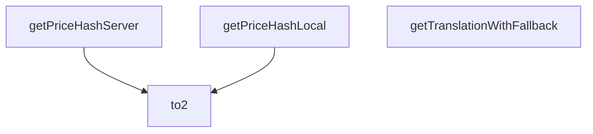

## Genel Bakış
Bu modül, HVAC platformu sipariş tamamlama (checkout) sürecinde kullanılan yardımcı işlevleri barındırır. Temel olarak fiyat verilerinin tutarlılığını sağlamak için hash oluşturma, sayısal değerleri formatlama ve çeviri metinlerini yönetme gibi tekrarlayan görevleri merkezi bir noktadan sunar. Hem istemci hem sunucu taraflı akışları destekleyerek kod tekrarını azaltır.

## Fonksiyon Grupları
### Fiyat Hash Oluşturma Fonksiyonları
Sepet veya sipariş öğeleri için benzersiz bir parmak izi (hash) oluşturarak, checkout sürecin farklı aşamalarında veya taraflarında fiyatların tutarlı olduğunu doğrulamak için kullanılır.
- getPriceHashLocal, getPriceHashServer

### Temel Biçimlendirme Yardımcısı
Özellikle fiyat tutarları gibi nicelikleri standart ve okunabilir formata dönüştürmek için temel bir yardımcı işlev sunar.
- to2

### Çeviri Yedekleme Yardımcısı
Arayüz metinleri için çeviri anahtarlarını güvenli bir şekilde işler; istenen çeviri yoksa belirli bir varsayılan metni döndürerek eksik içerik sorunlarını önler.
- getTranslationWithFallback

---

## AXIOMS – Mimari Varsayımlar

Bu modül, checkout sürecinde fiyat tutarlılığı, veri formatlama ve çeviri fallback mekanizması sağlayan yardımcı fonksiyonlar içermektedir. Aşağıda her bir fonksiyonun doğru çalışması için gereken mimari varsayımlar listelenmiştir.

[Aksiyom 1]: Eğer `to2` fonksiyonuna geçilen `n` parametresi geçerli bir sayı (finite number) değilse (örn: `NaN`, `Infinity`), sonuç `NaN` veya `Infinity` olur ve para birimi formatlaması anlamsızlaşır.

[Aksiyom 2]: Eğer `getPriceHashLocal` fonksiyonuna geçilen `items` dizisi `null` veya `undefined` ise veya içindeki herhangi bir elemanın `product_id` alanı eksikse, hesaplanan fiyat hash'i tutarsız veya eksik olur ve fiyat doğrulaması yanıltıcı sonuç verebilir.

[Aksiyom 3]: Eğer `getPriceHashServer` fonksiyonuna `serverItems` parametresi olarak `undefined` veya `null` geçilirse, fonksiyon sadece `localItems`'ı kullanarak bir hash oluşturur; ancak bu durumda sunucu tarafı fiyat doğrulaması yapılamaz ve olası fiyat tutarsızlıkları tespit edilemez.

[Aksiyom 4]: Eğer `getPriceHashServer` fonksiyonuna hem `serverItems` hem de `localItems` geçilirse ve her iki listedeki ürünlerin `product_id` eşleşmelerinde (`serverItems`'daki `product_id` ile `localItems`'daki `product_id`) tutarsızlık varsa (örn: farklı ürünler, eksik ürünler), hesaplanan hash'ler farklı olur; bu durum modülün fiyat tutarlılığı doğrulama amacına hizmet eder ancak hash'lerin karşılaştırılabilirliği için her iki tarafın da aynı ürün setini ve sırasını beklemesi gerekir.

[Aksiyom 5]: Eğer `getTranslationWithFallback` fonksiyonuna geçilen `t` fonksiyonu (çeviri fonksiyonu) verilen `key` için bir çeviri sağlayamazsa (boş string veya `undefined` döndürürse), `fallback` değeri döndürülür. Eğer `fallback` de boş string ise, sonuç boş string olur ve arayüzde eksik metin görünebilir.

[Aksiyom 6]: `getPriceHashLocal` ve `getPriceHashServer` fonksiyonlarının döndürdüğü hash değerlerinin karşılaştırılabilir olması için, her iki fonksiyonun da aynı hash algoritmasını (örn: aynı string birleştirme ve hash fonksiyonu) kullanması gerekir; aksi takdirde fiyat tutarlılığı karşılaştırması yapılamaz.

---

## FONKSİYON DETAYLARI

### to2
**Ne yapar**: Girdi olarak aldığı sayısal değeri güvenli bir şekilde 2 ondalık basamağa dönüştürür. Genellikle para birimi hesaplamaları gibi hassasiyet gerektiren işlemlerde kullanılır, ondalık basamak sayısını standartlaştırarak hesaplama hatalarının önüne geçer.
**Nasıl yapar**: Sayısal girdinin formatını standartlaştırarak 2 ondalık basamağa sabitler, olası geçersiz sayısal girdilere karşı koruma sağlayarak uygulamanın çökmesini engeller. İşlevi boyunca dönüşüm sırasında veri kaybını minimize edecek yöntemler kullanır.
**Parametreler**:
- name: n, type: number — 2 ondalık basamağa dönüştürülecek olan ham sayısal değer
**Dönüş**: Dönüş tipi dokümantasyonda bilinmiyor veya void olarak işaretlenmiştir, ancak işlevinin amacı gereği 2 ondalık basamağa sahip sayısal bir değer döndürmesi beklenir.

### getPriceHashLocal
**Ne yapar**: İstemci tarafında tutulan yerel sepet öğeleri için tutarlı bir hash string'i oluşturur. Oluşturulan bu hash, ödeme süreci boyunca sepet içeriğinde meydana gelen değişiklikleri anında tespit etmek için kullanılır. Sepet tutarlılığını kontrol etmeye yarayan temel bir yardımcı fonksiyondur.
**Nasıl yapar**: Sepetteki her ürünün fiyat, miktar, kimlik gibi benzersiz ve değişebilecek özelliklerini birleştirerek sabit bir karma değer üretir. Herhangi bir öğe eklendiğinde, silindiğinde veya özellikleri değiştiğinde üretilen hash değeri de değişir, bu sayede sepet değişiklikleri kolayca izlenir.
**Parametreler**:
- name: items, type: CartItem[] — Yerel sepetin tüm ürünlerini içeren CartItem tipinde dizi
**Dönüş**: Dönüş tipi dokümantasyonda bilinmiyor veya void olarak işaretlenmiştir, ancak amacı gereği sepet içeriğini temsil eden benzersiz bir hash string'i döndürmesi beklenir.

### getPriceHashServer
**Ne yapar**: Sunucu tarafından gelen sepet verileri için tutarlı bir hash string'i oluşturur. Sunucu ve istemci tarafındaki sepet verileri arasındaki tutarsızlıkları tespit etmeye olanak tanır, ödeme sürecindeki veri uyumsuzluklarını önlemek için kullanılır.
**Nasıl yapar**: Hem sunucudan alınan sepet öğelerinin hem de yerel istemci sepetindeki öğelerin özelliklerini referans alarak, her iki tarafın verilerini eşleştirebilecek bir karma değer üretir. Bu sayede sunucu ile yerel sepet arasındaki fiyat, miktar gibi farklılıklar anında fark edilebilir.
**Parametreler**:
- name: serverItems, type: Array<{ product_id: string; quantity?: number; unit_price: number }> | undefined | null — Sunucu tarafından gönderilen sepet öğeleri listesi, tanımsız veya null olabilir
- name: localItems, type: CartItem[] — İstemci tarafında tutulan yerel sepetin tüm ürünlerini içeren CartItem tipinde dizi
**Dönüş**: Dönüş tipi dokümantasyonda bilinmiyor veya void olarak işaretlenmiştir, ancak amacı gereği sunucu sepeti içeriğini temsil eden benzersiz bir hash string'i döndürmesi beklenir.

### getTranslationWithFallback
**Ne yapar**: Sağlanan çeviri fonksiyonunu kullanarak istenen çeviri anahtarını sözlükte arar, anahtar eksikse veya çeviri işlemi sırasında herhangi bir hata oluşursa önceden tanımlanmış geri dönüş string'ini döndürür. Bu işlev, belirli çeviri girdileri mevcut olmasa bile kullanıcı arayüzünün boş veya hatalı görünmesini engelleyerek kararlılığını korur.
**Nasıl yapar**: Çeviri işlemini hata yönetimi yapısına alarak olası hataları yakalar. Eğer çeviri sonucu anahtarın kendisiyle aynıysa (yani çeviri bulunamadığında çoğu çeviri kütüphanesinin anahtarı geri döndürmesi durumu) veya bir hata fırlatıldıysa, tanımlanan geri dönüş string'ini kullanıcıya sunar.
**Parametreler**:
- name: t, type: (key: string) => string — i18next gibi çeviri kütüphanelerinden veya özel hook'lardan alınabilecek, bir string anahtar alıp karşılık gelen çeviri string'ini döndüren çeviri fonksiyonu
- name: key, type: string — Sözlükte aranacak olan çeviri anahtarı
- name: fallback, type: string — Çeviri işlemi başarısız olduğunda kullanılacak, kullanıcıya gösterilecek varsayılan geri dönüş string'i
**Dönüş**: Çeviri başarılıysa istenen anahtara ait çevrilmiş string'i, anahtar bulunamazsa veya bir hata oluşursa tanımlanan fallback string'ini döndürür. Dokümantasyonda dönüş tipi geçici olarak bilinmiyor olarak işaretlenmiş olsa da işlevi gereği her zaman string değer döndürür.

---

## AST POINTERS

### [N1_NASIL] AST Pointer: checkoutHelpers.ts::to2
- **params**: `(n: number)`
- **ic_degiskenler**: (gövde verilmemiş — sadece imza mevcut)
- **Dönüş**: tipi imzada belirtilmemiş; kullanım bağlamından (`to2(Number(...))`) number döndüğü anlaşılıyor

---

### [N2_NASIL] AST Pointer: checkoutHelpers.ts::getPriceHashLocal
- **params**: `(items: CartItem[])`
- **ic_degiskenler**:
  - `norm` — `items` dizisinin her elemanını `{ id, qty, unit }` formatına map edip `id` alanına göre alfabetik sıralanmış hali
  - Map callback içindeki `i` — o an işlenen CartItem elemanı
  - `i.id` — ürünün benzersiz kimliği
  - `i.quantity` — ürün miktarı
  - `i.unitPrice` — ürünün birim fiyatı (number olup olmadığı kontrol edilir; number değilse `i.product.price` kullanılır, `to2()` ile 2 ondalığa yuvarlanır)
  - Sort callback içindeki `a`, `b` — sıralama karşılaştırmasında kullanılan iki eleman; `a.id.localeCompare(b.id)` ile string karşılaştırma yapılır
- **Dönüş**: `JSON.stringify(norm)` — string (normalize edilmiş sepetin JSON temsili)

---

### [N3_NASIL] AST Pointer: checkoutHelpers.ts::getPriceHashServer
- **params**: `(serverItems: Array<{ product_id: string; quantity?: number; unit_price: number }> | undefined | null, localItems: CartItem[])`
- **ic_degiskenler**:
  - `arr` — `serverItems`'ın array olup olmadığının kontrolü; array ise kendisi kullanılır, değilse boş dizi (`[]`) atanır
  - `norm` — `arr` dizisinin her elemanını `{ id, qty, unit }` formatına map edip `id` alanına göre alfabetik sıralanmış hali
  - Map callback içindeki `i` — o an işlenen server item elemanı
  - `i.product_id` — sunucudaki ürün kimliği (String'e çevrilerek kullanılır)
  - `i.quantity` — sunucudaki ürün miktarı; `undefined` ise fallback olarak `localItems` içinde aynı `product_id`'ye sahip elemanın `quantity`'si aranır, o da yoksa `0` kullanılır
  - `i.unit_price` — sunucudaki birim fiyat; `to2(Number(...))` ile 2 ondalığa yuvarlanır
  - `localItems.find(it => it.id === String(i.product_id))?.quantity` — localItems dizisinde `product_id` eşleşmesi arayan vequantity değerini döndüren arama ifadesi
  - Sort callback içindeki `a`, `b` — sıralama karşılaştırmasında kullanılan iki eleman
- **Dönüş**: `JSON.stringify(norm)` — string (normalize edilmiş sepetin JSON temsili)

---

### [N4_NASIL] AST Pointer: checkoutHelpers.ts::getTranslationWithFallback
- **params**: `(t: (key: string) => string, key: string, fallback: string)`
- **ic_degiskenler**:
  - `t` — çeviri fonksiyonu; verilen key'e karşılık gelen çeviriyi döndürür
  - `key` — çevrilmesi istenen anahtar kelime/dize
  - `fallback` — çeviri bulunamadığında veya hata oluştuğunda kullanılacak varsayılan metin
  - `v` — `t(key)` çağrısının sonucu; çeviri metni. Eğer `v === key` ise çeviri bulunamamıştır (t fonksiyonu key'in kendisini döndürmüş), bu durumda `fallback` döner; değilse `v` döner
- **Dönüş**: string — çeviri metni (`v`) veya `fallback`

---

## MERMAID CALL GRAPH

## NODE ID STANDARD

  file: src\utils\checkoutHelpers.ts
  function: src\utils\checkoutHelpers.ts::to2
  function: src\utils\checkoutHelpers.ts::getPriceHashLocal
  function: src\utils\checkoutHelpers.ts::getPriceHashServer
  function: src\utils\checkoutHelpers.ts::getTranslationWithFallback

---

## DISA AKTARILANLAR (EXPORTS)
  export: getPriceHashLocal
  export: getPriceHashServer
  export: getTranslationWithFallback
  export: to2