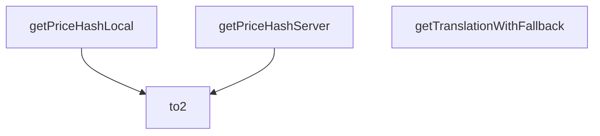

## Genel Bakış
Bu modül, HVAC platformu sipariş tamamlama (checkout) sürecinde ihtiyaç duyulan tüm yardımcı işlevleri tek bir noktada toplayan bir yardımcı modüldür. Hem istemci hem sunucu tarafı checkout akışlarını destekleyerek fiyat tutarlılığı, içerik formatlama ve çeviri yönetimi gibi temel işlemleri sorunsuz bir şekilde yürütülmesini sağlar. Tekrar kullanılabilir yapısıyla checkout sürecindeki tekrarlayan kod miktarını azaltır.

## Fonksiyon Grupları
### Fiyat Tutarlılığı Doğrulama Fonksiyonları
İstemci sepetindeki ürünler ve sunucu tarafından sağlanan ürün verileriyle benzersiz fiyat hash'leri oluşturur, checkout sürecinde fiyat tutarsızlığı olup olmadığını kontrol etmeye olanak tanır. İki farklı çalışma ortamı için ayrı hash üretim işlevi sunar.
- getPriceHashLocal, getPriceHashServer

### Temel Biçimlendirme Yardımcısı
Sayıları standart formatlara dönüştüren temel formatlama işlevini sunar, genellikle para tutarları veya nicelik değerlerini standartlaştırmak için kullanılır.
- to2

### Çeviri Yedekleme Yardımcısı
Checkout arayüzünde gösterilecek metinler için güvenilir bir çeviri mekanizması sunar. İstenen metin için çeviri bulunamadığında önceden tanımlanmış varsayılan bir metin döndürerek arayüzün eksik içerikle görünmesini engeller.
- getTranslationWithFallback

---

## AXIOMS – Mimari Varsayımlar
Bu modül, ödeme (checkout) adımında kullanılan yerel/sunucu fiyat hash hesaplama, sayı formatlama ve çeviri yardımcı fonksiyonlarını barındırır; tüm girdi parametrelerinin tanımlı türlerinde ve fiyat/çeviri hesaplaması için zorunlu alanları içermesi zorunludur.

[Aksiyom 1]: Eğer to2 fonksiyonuna gönderilen n parametresi number türünde değilse, 2 basamaklı sayı formatlama işlemi başarısız olur, hata fırlatılır.
[Aksiyom 2]: Eğer getPriceHashLocal fonksiyonuna gönderilen CartItem türündeki yerel sepet öğeleri fiyat hesaplaması için zorunlu alanları içermiyorsa, yerel fiyat hash'i doğru hesaplanamaz, sepet fiyatı tutarsızlığı oluşur.
[Aksiyom 3]: Eğer getPriceHashServer fonksiyonuna gönderilen serverItems parametresi, null/undefined haricinde tanımlı Array<{product_id: string; quantity?: number; unit_price: number}> türünden farklı bir türdeyse, sunucu tarafı fiyat hash'i hesaplanamaz, ödeme güvenlik doğrulaması başarısız olur.
[Aksiyom 4]: Eğer getPriceHashServer'a gönderilen serverItems veya localItems listelerindeki öğeler, fiyat karşılaştırması için zorunlu product_id ve unit_price alanlarını içermiyorsa, sunucu ve yerel fiyat hash'leri eşleşmez, fiyat manipülasyonu tespiti mekanizması çalışmaz.
[Aksiyom 5]: Eğer getTranslationWithFallback fonksiyonuna gönderilen ilk parametredeki çeviri fonksiyonu (t) string döndüren çalışan bir fonksiyon değilse, istenen çeviri metni getirilemez, kullanıcı arayüzünde geçersiz içerik görüntülenir.
[Aksiyom 6]: Eğer getTranslationWithFallback'a gönderilen fallback parametresi string türünde değilse, çeviri anahtarına karşılık değer bulunamadığında gösterilecek yedek metin kullanılamaz, arayüzde boş içerik oluşur.

---

## FONKSİYON DETAYLARI

### to2
**Ne yapar**: Girdi olarak aldığı sayısal değeri güvenli bir şekilde 2 ondalık basamağa dönüştürür. Genellikle para birimi hesaplamaları gibi hassasiyet gerektiren işlemlerde kullanılır, ondalık basamak sayısını standartlaştırarak hesaplama hatalarının önüne geçer.
**Nasıl yapar**: Sayısal girdinin formatını standartlaştırarak 2 ondalık basamağa sabitler, olası geçersiz sayısal girdilere karşı koruma sağlayarak uygulamanın çökmesini engeller. İşlevi boyunca dönüşüm sırasında veri kaybını minimize edecek yöntemler kullanır.
**Parametreler**:
- name: n, type: number — 2 ondalık basamağa dönüştürülecek olan ham sayısal değer
**Dönüş**: Dönüş tipi dokümantasyonda bilinmiyor veya void olarak işaretlenmiştir, ancak işlevinin amacı gereği 2 ondalık basamağa sahip sayısal bir değer döndürmesi beklenir.

### getPriceHashLocal
**Ne yapar**: İstemci tarafında tutulan yerel sepet öğeleri için tutarlı bir hash string'i oluşturur. Oluşturulan bu hash, ödeme süreci boyunca sepet içeriğinde meydana gelen değişiklikleri anında tespit etmek için kullanılır. Sepet tutarlılığını kontrol etmeye yarayan temel bir yardımcı fonksiyondur.
**Nasıl yapar**: Sepetteki her ürünün fiyat, miktar, kimlik gibi benzersiz ve değişebilecek özelliklerini birleştirerek sabit bir karma değer üretir. Herhangi bir öğe eklendiğinde, silindiğinde veya özellikleri değiştiğinde üretilen hash değeri de değişir, bu sayede sepet değişiklikleri kolayca izlenir.
**Parametreler**:
- name: items, type: CartItem[] — Yerel sepetin tüm ürünlerini içeren CartItem tipinde dizi
**Dönüş**: Dönüş tipi dokümantasyonda bilinmiyor veya void olarak işaretlenmiştir, ancak amacı gereği sepet içeriğini temsil eden benzersiz bir hash string'i döndürmesi beklenir.

### getPriceHashServer
**Ne yapar**: Sunucu tarafından gelen sepet verileri için tutarlı bir hash string'i oluşturur. Sunucu ve istemci tarafındaki sepet verileri arasındaki tutarsızlıkları tespit etmeye olanak tanır, ödeme sürecindeki veri uyumsuzluklarını önlemek için kullanılır.
**Nasıl yapar**: Hem sunucudan alınan sepet öğelerinin hem de yerel istemci sepetindeki öğelerin özelliklerini referans alarak, her iki tarafın verilerini eşleştirebilecek bir karma değer üretir. Bu sayede sunucu ile yerel sepet arasındaki fiyat, miktar gibi farklılıklar anında fark edilebilir.
**Parametreler**:
- name: serverItems, type: Array<{ product_id: string; quantity?: number; unit_price: number }> | undefined | null — Sunucu tarafından gönderilen sepet öğeleri listesi, tanımsız veya null olabilir
- name: localItems, type: CartItem[] — İstemci tarafında tutulan yerel sepetin tüm ürünlerini içeren CartItem tipinde dizi
**Dönüş**: Dönüş tipi dokümantasyonda bilinmiyor veya void olarak işaretlenmiştir, ancak amacı gereği sunucu sepeti içeriğini temsil eden benzersiz bir hash string'i döndürmesi beklenir.

### getTranslationWithFallback
**Ne yapar**: Sağlanan çeviri fonksiyonunu kullanarak istenen çeviri anahtarını sözlükte arar, anahtar eksikse veya çeviri işlemi sırasında herhangi bir hata oluşursa önceden tanımlanmış geri dönüş string'ini döndürür. Bu işlev, belirli çeviri girdileri mevcut olmasa bile kullanıcı arayüzünün boş veya hatalı görünmesini engelleyerek kararlılığını korur.
**Nasıl yapar**: Çeviri işlemini hata yönetimi yapısına alarak olası hataları yakalar. Eğer çeviri sonucu anahtarın kendisiyle aynıysa (yani çeviri bulunamadığında çoğu çeviri kütüphanesinin anahtarı geri döndürmesi durumu) veya bir hata fırlatıldıysa, tanımlanan geri dönüş string'ini kullanıcıya sunar.
**Parametreler**:
- name: t, type: (key: string) => string — i18next gibi çeviri kütüphanelerinden veya özel hook'lardan alınabilecek, bir string anahtar alıp karşılık gelen çeviri string'ini döndüren çeviri fonksiyonu
- name: key, type: string — Sözlükte aranacak olan çeviri anahtarı
- name: fallback, type: string — Çeviri işlemi başarısız olduğunda kullanılacak, kullanıcıya gösterilecek varsayılan geri dönüş string'i
**Dönüş**: Çeviri başarılıysa istenen anahtara ait çevrilmiş string'i, anahtar bulunamazsa veya bir hata oluşursa tanımlanan fallback string'ini döndürür. Dokümantasyonda dönüş tipi geçici olarak bilinmiyor olarak işaretlenmiş olsa da işlevi gereği her zaman string değer döndürür.

---

## AST POINTERS

### [N1_NASIL] AST Pointer: C:\Users\alize\venthub-hvac\src\utils\checkoutHelpers.ts::to2
- **params**: [n: number]
- **ic_degiskenler**: yok
- **Dönüş**: unknown

### [N2_NASIL] AST Pointer: C:\Users\alize\venthub-hvac\src\utils\checkoutHelpers.ts::getPriceHashLocal
- **params**: [items: CartItem[]]
- **ic_degiskenler**:
  - `norm` — Sepet öğelerini standartlaştırıp ürün id'sine göre sıralanmış olarak tutan nesne dizisi, her öğe benzersiz ürün id'si, miktar ve işlenmiş birim fiyat değerini içerir
- **Dönüş**: string (standartlaştırılmış dizinin JSON serileştirilmiş hali)

### [N3_NASIL] AST Pointer: C:\Users\alize\venthub-hvac\src\utils\checkoutHelpers.ts::getPriceHashServer
- **params**: [serverItems: Array<{ product_id: string; quantity?: number; unit_price: number }> | undefined | null, localItems: CartItem[]]
- **ic_degiskenler**:
  - `arr` — Sunucudan gelen öğeler dizisi değilse boş dizi atayarak oluşturulan standart işlenebilir dizi
  - `norm` — Sunucu öğelerini yerel sepet öğeleriyle eşleştirip standartlaştırıp ürün id'sine göre sıralanmış olarak tutan nesne dizisi
- **Dönüş**: string (standartlaştırılmış dizinin JSON serileştirilmiş hali)

### [N4_NASIL] AST Pointer: C:\Users\alize\venthub-hvac\src\utils\checkoutHelpers.ts::getTranslationWithFallback
- **params**: [t: (key: string) => string, key: string, fallback: string]
- **ic_degiskenler**:
  - `v` — Çeviri fonksiyonu çağrılarak verilen key üzerinden elde edilen çeviri metni değeri
- **Dönüş**: string (geçerli çeviri mevcutsa çeviri metni, hata alma veya geçersiz çeviri durumunda yedek fallback metni)

---

## MERMAID CALL GRAPH

## NODE ID STANDARD

  file: src\utils\checkoutHelpers.ts
  function: src\utils\checkoutHelpers.ts::to2
  function: src\utils\checkoutHelpers.ts::getPriceHashLocal
  function: src\utils\checkoutHelpers.ts::getPriceHashServer
  function: src\utils\checkoutHelpers.ts::getTranslationWithFallback

---

## DISA AKTARILANLAR (EXPORTS)
  export: getPriceHashLocal
  export: getPriceHashServer
  export: getTranslationWithFallback
  export: to2