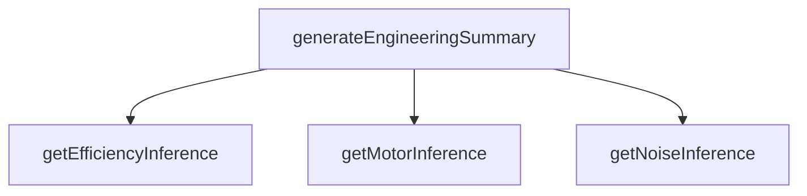

## Genel Bakış
Bu modül, HVAC ürünleri için mühendislik analizlerini otomatikleştiren bir zeka katmanıdır. Ürünlerin teknik özelliklerinden (gürültü, verimlilik, motor tipi gibi) yola çıkarak standartlaştırılmış çıkarımlar üretir ve bu çıkarımları birleştirerek kapsamlı bir mühendislik özeti sunar.

## Fonksiyon Grupları
### Tekil Parametre Tabanlı Çıkarım Fonksiyonları
Bu grup, bir ürünün yalnızca bir teknik parametresini analiz ederek, o özellik için standart bir mühendislik değerlendirmesi ve çıkarımı üretir.
- getNoiseInference, getEfficiencyInference, getMotorInference

### Kapsamlı Mühendislik Özeti Üretim Fonksiyonu
Bu ana fonksiyon, bir ürün nesnini alır ve yukarıdaki tüm tekil çıkarım fonksiyonlarını çalıştırarak, ürüne ait tüm mühendisliksel çıkarımları tek bir listeye dönüştürür.
- generateEngineeringSummary

## Axioms – Mimari Varsayımlar
Bu mühendislik zekâsı modülü, ürünlere ait temel mühendislik metriklerinden yola çıkarak tahmin ve özet raporu üretmek için tüm girdi parametrelerinin geçerli, tanımlı ve modülün iç hesaplama mantığının erişilebilir olmasını varsayar.

**[Aksiyom 1]:** Eğer `getNoiseInference` fonksiyonuna gönderilen `db` parametresi geçerli bir sayısal gürültü değeri değilse, üretilen gürültü tahmini tamamen güvenilmez olur.
**[Aksiyom 2]:** Eğer `getEfficiencyInference` fonksiyonuna gönderilen opsiyonel `efficiency` parametresi geçerli bir sayısal verimlilik değeri değilse, üretilecek verimlilik tahmini hatalı olur veya hiç üretilemez.
**[Aksiyom 3]:** Eğer `getMotorInference` fonksiyonuna gönderilen `motorType` parametresi, modülün bildiği geçerli bir motor tipi dizesi değilse, üretilecek motor tahmini hatalı olur veya hiç üretilemez.

---

## AXIOMS – Mimari Varsayımlar

Bu modül, HVAC ürün teknik parametrelerinden mühendislik çıkarımları üretir; fonksiyon imzalarına ve yapılarına dayalı aşağıdaki varsayımlar geçerlidir.

**[Aksiyom 1]**: Eğer `getNoiseInference` çağrısında `db` parametresi sayısal bir değer olarak sağlanmazsa, gürültü çıkarımı üretilemez (fonksiyon zorunlu parametre bekler, default değer yoktur).

**[Aksiyom 2]**: Eğer `getEfficiencyInference` çağrısında `efficiency` parametresi sağlanmazsa, fonksiyon varsayılan/boş bir verimlilik çıkarımı üretir (parametre opsiyoneldir, `undefined` kabul edilir).

**[Aksiyom 3]**: Eğer `getMotorInference` çağrısında `motorType` parametresi sağlanmazsa, fonksiyon varsayılan/boş bir motor çıkarımı üretir (parametre opsiyoneldir, `undefined` kabul edilir).

**[Aksiyom 4]**: Eğer `generateEngineeringSummary` çağrısında geçerli bir `Product` nesnesi sağlanmazsa, mühendislik özeti üretilemez (fonksiyon zorunlu parametre bekler).

**[Aksiyom 5]**: `generateEngineeringSummary` fonksiyonu, tekil çıkarım fonksiyonlarının (`getNoiseInference`, `getEfficiencyInference`, `getMotorInference`) çıktılarına bağımlıdır; bu fonksiyonlardan birinin hatalı veya eksik sonuç üretmesi, özetin ilgili bölümünün eksik olmasına yol açar.

**[Aksiyom 6]**: `getNoiseInference`, `getEfficiencyInference` ve `getMotorInference` fonksiyonları saf (side-effect-free) olmalıdır; aynı parametrelerle tekrar tekrar çağrıldığında her seferinde aynı sonucu üretmelidir (deterministik çıkarım).

**[Aksiyom 7]**: Fonksiyon gövdelerinde belirtilen eşik değerleri ve çıkarım kuralları modül içinde sabittir; örneğin dB aralıkları, verimlilik yüzdesi eşikleri ve motor tipi eşlemeleri modül dışında değiştirilemez (yapısal sabitlik).

---

## FONKSİYON DETAYLARI

### getNoiseInference
**Ne yapar**: Giriş olarak alınan desibel cinsinden ses basınç seviyesini, insanların bu ses seviyesini nasıl algıladığına dair mühendislik standartlarına uygun yorumlar. Bu yorumu içeren bir çıkarım nesnesi döndürür, geçersiz giriş durumunda null değerini üretir.
**Nasıl yapar**: Önce insan işitme eşiği ve ses algısı referanslarını kullanarak giriş desibel değerini sınıflandırır, ardından bu sınıflandırmaya göre risk durumu, kullanım konforu ve varsa iyileştirme önerilerini içeren bir çıkarım nesnesi yapılandırır. Giriş değerinin fiziksel olarak mümkün olan desibel aralığında olup olmadığını kontrol eder, geçersiz değerler için null döndürür.
**Parametreler**:
- name: db, type: number — Yorumlanması gereken desibel cinsinden ses basınç seviyesi, sadece sayısal değer kabul eder
**Dönüş**: EngineeringInference | null — Ses seviyesinin insan algısına dair tüm yorumları içeren standart mühendislik çıkarım nesnesi; geçersiz giriş durumunda null döndürür

### getEfficiencyInference
**Ne yapar**: Isı Geri Kazanım Ventilatörü (HRV) sistemlerinin yüzdesel enerji verimliliği değerini sektör standartlarına göre yorumlar, bu yoruma dayalı bir mühendislik çıkarım nesnesi üretir. Opsiyonel olarak verilen verimlilik değeri geçerli değilse null döndürür.
**Nasıl yapar**: Küresel HVAC sektöründe kabul edilen HRV verimliliği sınıflandırma eşiklerini referans alır, giriş olarak alınan verimlilik değerinin 0-100 aralığında olup olmadığını kontrol eder. Geçerli değer mevcutsa değere göre düşük, orta veya yüksek verimlilik sınıflandırması yapar, enerji tasarrufu potansiyeli ve yasal uyumluluk durumunu içeren çıkarım nesnesini yapılandırır. Değer girilmemişse veya aralık dışındaysa null döndürür.
**Parametreler**:
- name: efficiency, type: number? — Yorumlanması gereken HRV sisteminin yüzdesel enerji verimliliği değeri, tanımlanması opsiyoneldir
**Dönüş**: EngineeringInference | null — HRV sisteminin enerji verimliliğine ait tüm mühendislik yorumlarını içeren çıkarım nesnesi; geçersiz veya tanımlanmamış giriş durumunda null döndürür

### getMotorInference
**Ne yapar**: HVAC sistemlerinde kullanılan motorun tipini alarak, ilgili motor teknolojisinin teknik özelliklerini, avantajlarını, bakım gereksinimlerini ve enerji tüketimi özelliklerini içeren bir teknoloji analizi yapar. Bu analizi standart bir mühendislik çıkarım nesnesi olarak döndürür, motor tipi geçersiz veya desteklenmiyorsa null üretir.
**Nasıl yapar**: Sistemde kayıtlı tüm desteklenen motor tiplerinin (BLDC, AC indüksiyon, senkron vb.) teknik özelliklerini içeren referans havuzundan giriş olarak alınan motor tipini eşleştirir. Eşleşme başarılı olursa ilgili motora ait tüm analiz metinlerini, uyumluluk notlarını ve kullanım önerilerini içeren çıkarım nesnesini yapılandırır. Tanımlanmamış veya kayıtlarda olmayan motor tipleri için null döndürür.
**Parametreler**:
- name: motorType, type: string? — Analiz edilmesi gereken motorun metinsel tip tanımı, tanımlanması opsiyoneldir
**Dönüş**: EngineeringInference | null — Motor tipine ait tüm teknolojik analizleri içeren standart mühendislik çıkarım nesnesi; geçersiz veya tanımlanmamış motor tipi durumunda null döndürür

### generateEngineeringSummary
**Ne yapar**: Tam bir HVAC ürünü nesnesini giriş olarak alarak, ürünün tüm ilgili teknik parametreleri için ayrı ayrı çıkarımlar üretir, bu çıkarımları tek bir dizide toplayarak ürünün tam kapsamlı mühendislik özetini sunar. Hiçbir geçerli çıkarım üretilemezse boş bir dizi döndürür.
**Nasıl yapar**: Giriş Product nesnesinin ses basıncı, enerji verimliliği ve motor tipi gibi ilgili alanlarını sırayla getNoiseInference, getEfficiencyInference ve getMotorInference fonksiyonlarına gönderir. Bu alt fonksiyonlardan elde edilen geçerli çıkarım nesnelerini tek bir dizide toplar, null dönen değerleri diziye dahil etmez. Ürün nesnesinin eksik alanları durumunda sadece mevcut ve geçerli alanlara ait çıkarımları sunar.
**Parametreler**:
- name: product, type: Product — Tam mühendislik özeti üretilmesi gereken HVAC ürünü, ürünün tüm teknik parametrelerini barındıran nesne
**Dönüş**: EngineeringInference[] — Ürüne ait tüm geçerli mühendislik çıkarımlarını içeren bir dizi, hiçbir geçerli çıkarım üretilemezse boş dizi döndürür

---

## INTERFACES

### EngineeringInference
- `labelKey: string`
- `value: string`
- `type: 'noise' | 'efficiency' | 'power' | 'quality'`
- `descriptionKey: string`
- `isI18n: boolean`

---

## AST POINTERS

### [N1_NASIL] AST Pointer: src/utils/engineeringIntelligence.ts::getNoiseInference
- **params**: `db: number` — desibel seviyesi
- **ic_degiskenler**: (yok)
- **Dönüş**: `EngineeringInference | null` — db değerine göre sessizlik/kalite etiketleme nesnesi veya geçersiz/girdi yoksa null

### [N2_NASIL] AST Pointer: src/utils/engineeringIntelligence.ts::getEfficiencyInference
- **params**: `efficiency?: number` — verimlilik yüzdesi (isteğe bağlı)
- **ic_degiskenler**: (yok)
- **Dönüş**: `EngineeringInference | null` — diamond/platinum/gold etiketleme nesnesi veya eşiklerin altında/kararsız ise null

### [N3_NASIL] AST Pointer: src/utils/engineeringIntelligence.ts::getMotorInference
- **params**: `motorType?: string` — motor tipi adı (isteğe bağlı)
- **ic_degiskenler**:
  - `mt` — motorType'ın küçük harf karşılığı; EC/AC içeriğini kontrol etmek için kullanılır
- **Dönüş**: `EngineeringInference | null` — EC veya AC motor kalite etiketleme nesnesi veya tanımlanamaz motor tipi için null

### [N4_NASIL] AST Pointer: src/utils/engineeringIntelligence.ts::generateEngineeringSummary
- **params**: `product: Product` — mühendislik özetinin üretileceği ürün nesnesi
- **ic_degiskenler**:
  - `inferences` — toplanan mühendislik çıkarımlarının (EngineeringInference[]) tutulduğu başlangıçta boş dizi
  - `specs` — `product.technical_specs` kaydı ise `Record<string, unknown>`'a dönüştürülmüş hali, değilse boş `{}` nesnesi
  - `noise` — `getNoiseInference()` çağrısının döndürdüğü ses analizi sonucu
  - `efficiencyValue` — `specs` içinden `efficiency`, `verilik` veya `isi_gerikazanım_verimi` alanlarından birinden gelen verimlilik değeri
  - `numericEff` — `efficiencyValue`'ın sayısal karşılığı; string ise `[^0-9.]` regex ile temizlenip `parseFloat` ile dönüştürülür, değilse `Number()` ile dönüştürülür
  - `eff` — `getEfficiencyInference(numericEff)` çağrısının döndürdüğü verimlilik analizi sonucu
  - `motorType` — `specs` içinden `motor_tipi`, `motor_type` veya `elektrik_motoru` alanlarından birinden gelen motor tipi değeri
  - `motor` — `getMotorInference(String(motorType))` çağrısının döndürdüğü motor analizi sonucu
  - `isIndustrial` — `product.airflow_capacity > 2000` kontrolü ile endüstriyel kapasite olup olmadığını belirleyen boolean
- **Dönüş**: `EngineeringInference[]` — ürünün ses, verimlilik, motor ve kapasite özelliklerine ait tüm geçerli mühendislik çıkarımlarını içeren dizi

---

## MERMAID CALL GRAPH

## NODE ID STANDARD

  file: src\utils\engineeringIntelligence.ts
  function: src\utils\engineeringIntelligence.ts::getNoiseInference
  function: src\utils\engineeringIntelligence.ts::getEfficiencyInference
  function: src\utils\engineeringIntelligence.ts::getMotorInference
  function: src\utils\engineeringIntelligence.ts::generateEngineeringSummary

---

## DISA AKTARILANLAR (EXPORTS)
  export: EngineeringInference
  export: generateEngineeringSummary
  export: getEfficiencyInference
  export: getMotorInference
  export: getNoiseInference