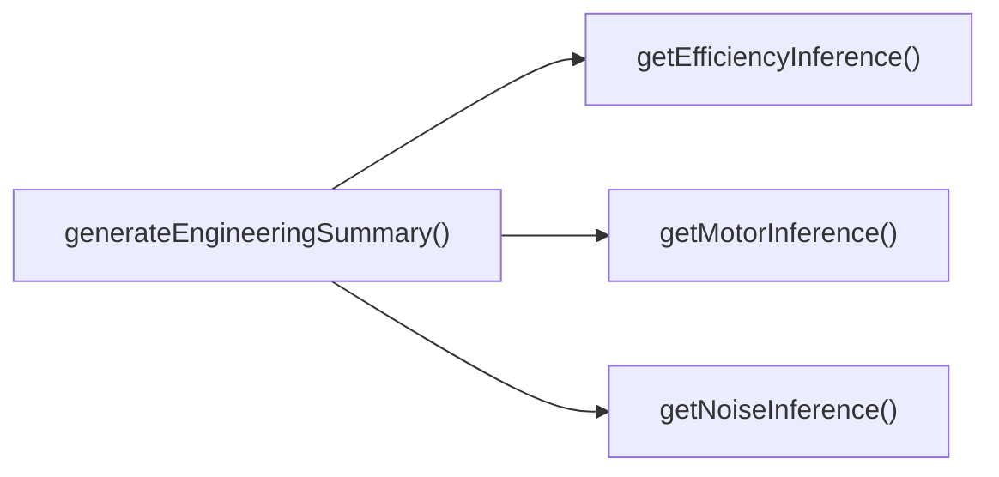

## Genel Bakış
Bu modül, HVAC (ısıtma, havalandırma ve iklimlendirme) sistemleri ürünleri için standartlaştırılmış mühendisliksel analiz ve çıkarımlar üreten bir yardımcı modüldür. Ürünlerin teknik spesifikasyonlarından yola çıkarak uzman değerlendirmeleri formatlar ve tüm analizleri bir araya getirerek kapsamlı bir ürün değerlendirmesi sunar.

## Fonksiyon Grupları
### Tekil Parametre Tabanlı Çıkarım Fonksiyonları
Bir ürünün tek bir teknik özelliğinden (gürültü seviyesi, enerji verimliliği, motor tipi) yola çıkarak standart formatta mühendisliksel çıkarım nesneleri oluşturur.
- getNoiseInference, getEfficiencyInference, getMotorInference

### Kapsamlı Mühendislik Özeti Üretim Fonksiyonu
Bir ürün nesnesi üzerinden tüm tekil parametre çıkarımlarını toplu halde çalıştırır, ürüne ait tüm mühendisliksel analizleri tek bir dizi halinde sunar.
- generateEngineeringSummary

---

## AXIOMS – Mimari Varsayımlar
Bu mühendislik zekâsı modülü, ürünlere ait temel mühendislik metriklerinden yola çıkarak tahmin ve özet raporu üretmek için tüm girdi parametrelerinin geçerli, tanımlı ve modülün iç hesaplama mantığının erişilebilir olmasını varsayar.

[Aksiyom 1]: Eğer getNoiseInference fonksiyonuna gönderilen db parametresi geçerli bir sayısal gürültü değeri değilse, üretilen gürültü tahmini tamamen güvenilmez olur.
[Aksiyom 2]: Eğer getEfficiencyInference fonksiyonuna gönderilen opsiyonel efficiency parametresi geçerli bir sayısal verimlilik değeri değilse, üretilecek verimlilik tahmini hatalı olur veya hiç üretilemez.
[Aksiyom 3]: Eğer getMotorInference fonksiyonuna gönderilen opsiyonel motorType parametresi modülün tanıdığı geçerli motor tipleri listesinde yer almıyorsa, motora özel mühendislik tahmini hiç üretilemez.
[Aksiyom 4]: Eğer generateEngineeringSummary fonksiyonuna gönderilen Product nesnesi, tüm tahmin fonksiyonlarını çalıştırmak için gereken temel mühendislik alanlarını içermiyorsa, tam ve doğru mühendislik özeti üretilemez.
[Aksiyom 5]: Eğer modülün içindeki tüm tahmin ve özetleme fonksiyonlarının çalışması için gereken hesaplama mantığı modül içinde erişilebilir değilse, hiçbir mühendislik çıktısı üretilmez.

---

## FONKSIYON DETAYLARI

### getNoiseInference
**Ne yapar**: Giriş olarak alınan desibel cinsinden ses basınç seviyesini, insanların bu ses seviyesini nasıl algıladığına dair mühendislik standartlarına uygun yorumlar. Bu yorumu içeren bir çıkarım nesnesi döndürür, geçersiz giriş durumunda null değerini üretir.
**Nasıl yapar**: Önce insan işitme eşiği ve ses algısı referanslarını kullanarak giriş desibel değerini sınıflandırır, ardından bu sınıflandırmaya göre risk durumu, kullanım konforu ve varsa iyileştirme önerilerini içeren bir çıkarım nesnesi yapılandırır. Giriş değerinin fiziksel olarak mümkün olan desibel aralığında olup olmadığını kontrol eder, geçersiz değerler için null döndürür.
**Parametreler**:
- name: db, type: number — Yorumlanması gereken desibel cinsinden ses basınç seviyesi, sadece sayısal değer kabul eder
**Dönüş**: EngineeringInference | null — Ses seviyesinin insan algısına dair tüm yorumları içeren standart mühendislik çıkarım nesnesi; geçersiz giriş durumunda null döndürür

### getEfficiencyInference
**Ne yapar**: Isı Geri Kazanım Ventilatörü (HRV) sistemlerinin yüzdesel enerji verimliliği değerini sektör standartlarına göre yorumlar, bu yoruma dayalı bir mühendislik çıkarım nesnesi üretir. Opsiyonel olarak verilen verimlilik değeri geçerli değilse null döndürür.
**Nasıl yapar**: Küresel HVAC sektöründe kabul edilen HRV verimliliği sınıflandırma eşiklerini referans alır, giriş olarak alınan verimlilik değerinin 0-100 aralığında olup olmadığını kontrol eder. Geçerli değer mevcutsa değere göre düşük, orta veya yüksek verimlilik sınıflandırması yapar, enerji tasarrufu potansiyeli ve yasal uyumluluk durumunu içeren çıkarım nesnesini yapılandırır. Değer girilmemişse veya aralık dışındaysa null döndürür.
**Parametreler**:
- name: efficiency, type: number? — Yorumlanması gereken HRV sisteminin yüzdesel enerji verimliliği değeri, tanımlanması opsiyoneldir
**Dönüş**: EngineeringInference | null — HRV sisteminin enerji verimliliğine ait tüm mühendislik yorumlarını içeren çıkarım nesnesi; geçersiz veya tanımlanmamış giriş durumunda null döndürür

### getMotorInference
**Ne yapar**: HVAC sistemlerinde kullanılan motorun tipini alarak, ilgili motor teknolojisinin teknik özelliklerini, avantajlarını, bakım gereksinimlerini ve enerji tüketimi özelliklerini içeren bir teknoloji analizi yapar. Bu analizi standart bir mühendislik çıkarım nesnesi olarak döndürür, motor tipi geçersiz veya desteklenmiyorsa null üretir.
**Nasıl yapar**: Sistemde kayıtlı tüm desteklenen motor tiplerinin (BLDC, AC indüksiyon, senkron vb.) teknik özelliklerini içeren referans havuzundan giriş olarak alınan motor tipini eşleştirir. Eşleşme başarılı olursa ilgili motora ait tüm analiz metinlerini, uyumluluk notlarını ve kullanım önerilerini içeren çıkarım nesnesini yapılandırır. Tanımlanmamış veya kayıtlarda olmayan motor tipleri için null döndürür.
**Parametreler**:
- name: motorType, type: string? — Analiz edilmesi gereken motorun metinsel tip tanımı, tanımlanması opsiyoneldir
**Dönüş**: EngineeringInference | null — Motor tipine ait tüm teknolojik analizleri içeren standart mühendislik çıkarım nesnesi; geçersiz veya tanımlanmamış motor tipi durumunda null döndürür

### generateEngineeringSummary
**Ne yapar**: Tam bir HVAC ürünü nesnesini giriş olarak alarak, ürünün tüm ilgili teknik parametreleri için ayrı ayrı çıkarımlar üretir, bu çıkarımları tek bir dizide toplayarak ürünün tam kapsamlı mühendislik özetini sunar. Hiçbir geçerli çıkarım üretilemezse boş bir dizi döndürür.
**Nasıl yapar**: Giriş Product nesnesinin ses basıncı, enerji verimliliği ve motor tipi gibi ilgili alanlarını sırayla getNoiseInference, getEfficiencyInference ve getMotorInference fonksiyonlarına gönderir. Bu alt fonksiyonlardan elde edilen geçerli çıkarım nesnelerini tek bir dizide toplar, null dönen değerleri diziye dahil etmez. Ürün nesnesinin eksik alanları durumunda sadece mevcut ve geçerli alanlara ait çıkarımları sunar.
**Parametreler**:
- name: product, type: Product — Tam mühendislik özeti üretilmesi gereken HVAC ürünü, ürünün tüm teknik parametrelerini barındıran nesne
**Dönüş**: EngineeringInference[] — Ürüne ait tüm geçerli mühendislik çıkarımlarını içeren bir dizi, hiçbir geçerli çıkarım üretilemezse boş dizi döndürür

---

## INTERFACES

### EngineeringInference
- `labelKey: string`
- `value: string`
- `type: 'noise' | 'efficiency' | 'power' | 'quality'`
- `descriptionKey: string`
- `isI18n: boolean`

---

## AST POINTERS

### [N1_NASIL] AST Pointer: src/utils/engineeringIntelligence.ts::getNoiseInference
- **params**: [db: number]
- **ic_degiskenler**: yok
- **Dönüş**: EngineeringInference | null

---

### [N2_NASIL] AST Pointer: src/utils/engineeringIntelligence.ts::getEfficiencyInference
- **params**: [efficiency?: number]
- **ic_degiskenler**: yok
- **Dönüş**: EngineeringInference | null

---

### [N3_NASIL] AST Pointer: src/utils/engineeringIntelligence.ts::getMotorInference
- **params**: [motorType?: string]
- **ic_degiskenler**:
  - `mt` — motorType parametresinin küçük harfe dönüştürülmüş hali, motor tipi içeren string kontrollerinde kullanılır
- **Dönüş**: EngineeringInference | null

---

### [N4_NASIL] AST Pointer: src/utils/engineeringIntelligence.ts::generateEngineeringSummary
- **params**: [product: Product]
- **ic_degiskenler**:
  - `inferences: EngineeringInference[]` — Tüm geçerli mühendislik çıkarımlarını toplamak için başlatılan boş dizi, fonksiyonun nihai dönüş değeridir
  - `specs` — product.technical_specs'ın tip kontrolünden geçirilerek Record<string, unknown> tipine dönüştürülmüş hali, teknik özelliklere güvenli erişim sağlar
  - `product.noise_level` — Ürünün kayıtlı gürültü seviyesi, getNoiseInference fonksiyonuna parametre olarak geçilir
  - `noise` — getNoiseInference'den dönen geçerli gürültü çıkarımı nesnesi, inferences dizisine eklenir
  - `efficiencyValue` - Ürünün verimlilik değerini farklı olası property isimlerinden (efficiency, verilik, isi_gerikazanım_verimi) çeken genel değişken
  - `numericEff` - efficiencyValue'nun string'ten temizlenerek sayısal türe dönüştürülmüş hali, geçerli sayı olup olmadığı kontrol edilir
  - `eff` - getEfficiencyInference'den dönen geçerli verimlilik çıkarımı nesnesi, inferences dizisine eklenir
  - `motorType` - Ürünün motor tipi değerini farklı olası property isimlerinden (motor_tipi, motor_type, elektrik_motoru) çeken genel değişken
  - `motor` - getMotorInference'den dönen geçerli motor teknolojisi çıkarımı nesnesi, inferences dizisine eklenir
  - `product.airflow_capacity` - Ürünün hava akışı kapasitesi, endüstriyel/yüksek akış etiketini oluşturmak için kullanılır
  - `isIndustrial` - product.airflow_capacity'nin 2000'den büyük olup olmadığını belirten boolean, kullanılacak i18n anahtarlarını seçer
- **Dönüş**: EngineeringInference[]

---

## ÇAĞRI HARİTASI

### Disariya Cagrilar (Outgoing)
generateEngineeringSummary() fonksiyonu, mühendislik özeti oluşturmak için dosya içindeki üç yardımcı fonksiyon olan getEfficiencyInference, getNoiseInference ve getMotorInference fonksiyonlarını çağırır.

### Disaridan Cagrilanlar (Incoming)
Sağlanan veride bu modülü kullanan herhangi bir dış dosya veya fonksiyon bilgisi bulunmamaktadır.

### Ic Ice Fonksiyonlar (Nested)
Yok

---

## DOSYA-İÇİ ÇAĞRI GRAFİĞİ
  generateEngineeringSummary() → getEfficiencyInference()
  generateEngineeringSummary() → getMotorInference()
  generateEngineeringSummary() → getNoiseInference()

---

## NODE ID STANDARD

  file: src\utils\engineeringIntelligence.ts
  function: src\utils\engineeringIntelligence.ts::getNoiseInference
  function: src\utils\engineeringIntelligence.ts::getEfficiencyInference
  function: src\utils\engineeringIntelligence.ts::getMotorInference
  function: src\utils\engineeringIntelligence.ts::generateEngineeringSummary

---

## DISA AKTARILANLAR (EXPORTS)
  export: EngineeringInference
  export: generateEngineeringSummary
  export: getEfficiencyInference
  export: getMotorInference
  export: getNoiseInference