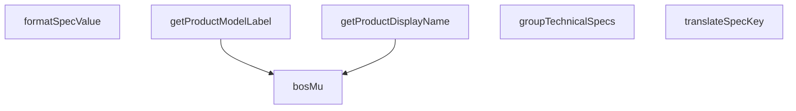

## Genel Bakış
Bu modül, ürün teknik özelliklerinin (spesifikasyonlarının) kullanıcı arayüzünde gösterilmeye uygun forma dönüştürülmesinden ve ürün kimlik bilgilerinin çıkarılmasından sorumludur. Ham veri setlerini işleyerek anahtar terimleri çevirir, değerleri biçimlendirir, özellikleri mantıksal gruplar altında organize eder ve ürün varyantlarından görünen ad ile model etiketi gibi bilgileri elde eder.

## Fonksiyon Grupları

### Teknik Özellik Dönüştürme ve Biçimlendirme
Ham teknik özellik anahtarlarını anlamlı metinlere çevirir, değerleri uygun formata getirir ve boş/null kontrolü sağlar. Bu fonksiyonlar, teknik verinin son kullanıcıya sunulabilir hale getirilmesinden sorumludur.
- translateSpecKey, formatSpecValue, bosMu

### Teknik Özellik Organizasyonu
Çeşitli teknik özelliklerden oluşan ham veri kümesini, tanımlanmış bir düzende ve öncelik sırasına göre gruplandırarak düzenli bir yapıya kavuşturur.
- groupTechnicalSpecs

### Ürün Kimlik Bilgisi Çıkarma
Ürün varyantı ve ailesi bilgilerinden kullanıcıya gösterilecek görünen ad ve model etiketi gibi bilgileri üretir. Çeviri fonksiyonu desteği ile çoklu dil desteğine olanak tanır.
- getProductDisplayName, getProductModelLabel

---

## AXIOMS – Mimari Varsayımlar

Fonksiyon gövdeleri sağlanmadığı için, yalnızca imzalardan çıkarılabilecek sınırlı varsayımlar belirlenebilir.

[Aksiyom 1]: Eğer `groupTechnicalSpecs` fonksiyonuna `specs` parametresi olarak `null` veya `undefined` geçerli bir değer olarak kabul edilmiyorsa, null/undefined girdilerle çağrı yapan kodlar hata alır. Fonksiyon imzası `null | undefined` kabul ettiğinden, bu durumların güvenli şekilde işlenmesi gerekir.

[Aksiyom 2]: Eğer `getProductDisplayName` fonksiyonuna `variant` parametresi `null` veya `undefined` olarak iletilirse ve fonksiyon gövdesinde bu durum için bir fallback yoksa, hata oluşur. İmza bu değerleri kabul ettiğinden, null-safe bir davranış beklenir.

[Aksiyom 3]: Eğer `getProductModelLabel` fonksiyonuna `variant` parametresi `null` veya `undefined` olarak iletilirse ve fonksiyon gövdesinde bu durum için bir fallback yoksa, hata oluşur. Dönüş tipi `string | null` olduğundan, null dönüş senaryosu beklenen bir durumdur.

[Aksiyom 4]: Eğer `bosMu` fonksiyonu string olmayan değerlerle çağrılırsa ve gövdede tip dönüşümü yoksa, beklenmeyen davranış oluşur. İmza `string | null | undefined` kabul ettiğinden, bu tiplerin güvenli işlenmesi gerekir.

[Aksiyom 5]: Eğer `UNIT_SUFFIXES`, `UNIT_BY_KEY` ve `SPEC_SORT_ORDER` sabitleri modül kapsamında tanımlı değilse, bu sabitlere bağımlı fonksiyonlar (gövdelerdeki kullanımlara bağlı olarak) doğru çalışamaz. Sabitlerin modül yüklendiğinde erişilebilir olması gerekir.

[Aksiyom 6]: Eğer `getProductDisplayName` fonksiyonuna opsiyonel `t` parametresi (çeviri fonksiyonu) sağlanmazsa ve gövde bu durumu ele almıyorsa, i18n desteği olmadan çalışır. İmzada opsiyonel olduğundan, sağlanmaması geçerli bir senaryodur ancak gövdedeki davranış bilinmiyor.

[Aksiyom 7]: Eğer `formatSpecValue` fonksiyonuna `value` parametresi olarak `unknown` tipinde beklenmeyen bir değer iletilirse ve gövdede tip kontrolü yoksa, biçimlendirme hatası oluşabilir. `unknown` tipi herhangi bir değeri kabul ettiğinden, gövdede uygun tip kontrolü beklenir.

---

## FONKSİYON DETAYLARI

### translateSpecKey
**Ne yapar**: Teknik spesifikasyon anahtarlarını insan tarafından okunabilir Türkçe etiketlere çevirir. Eğer ilgili anahtar önceden tanımlanmış çeviri sözlüğünde bulunamazsa, anahtarı alt çizgilerden ayırıp Başlık Formatı'na (Title Case) çevirerek yedek bir görünüm ismi üretir. Tüm bilinen ve yeni eklenen spesifikasyonlar için anlaşılır bir standart görünüm ismi sağlar.
**Nasıl yapar**: İlk olarak giriş olarak aldığı anahtarı yerleşik çeviri sözlüğü ile eşleştirir, eğer eşleşme bulamazsa anahtarı alt çizgi karakterlerinden parçalarına ayırır. Her parçanın ilk harfini büyütüp birleştirerek standart bir formatta gösterim ismi oluşturur. Bu süreçle hem bilinen anahtarlar için yerelleştirilmiş, hem de bilinmeyen/yeni eklenen anahtarlar için okunabilir bir çıktı garanti edilir.
**Parametreler**:
- key: string — Çevrilecek ham teknik spesifikasyon anahtarı, örnek olarak 'rpm_max', 'custom_spec_name' gibi değerler alır
**Dönüş**: string — Sözlükten bulunan çevrilmiş etiketi ya da yedek formatlama ile oluşturulmuş okunabilir görünüm ismini döndürür

### formatSpecValue
**Ne yapar**: Ürün spesifikasyon (spec) alanının anahtar-değer çiftini okunabilir bir metin biçimine dönüştürür. Teknik veya ham veriyi kullanıcıya sunulabilir bir string temsiline çevirir.

**Nasıl yapar**: Fonksiyonun iç mantığı verilen kaynakta belirtilmemiştir. `key` parametresi alan adını, `value` parametresi o alana karşılık gelen değeri temsil eder ve sonuçta bir string üretilir.

**Parametreler**:
- key: string — Spesifikasyon alanının adı (anahtar bilgisi)
- value: unknown — Spesifikasyon alanının değeri; herhangi bir türde olabilir

**Dönüş**: string — Biçimlendirilmiş spesifikasyon değeri metni

### groupTechnicalSpecs
**Ne yapar**: Düz bir sözlük olarak gelen teknik spesifikasyonları mantıksal kategorilere ayırarak gruplar. Spesifikasyon anahtarlarında yapılan alt dize eşleşmeleriyle kategorizasyon yapılır, örneğin anahtarında 'airflow' geçen tüm spesifikasyonlar 'performans' kategorisine atanır. Girişteki null, undefined veya boş metin değerine sahip spesifikasyonları işleme dahil etmez, sadece geçerli değerleri gruplandırır.
**Nasıl yapar**: Önce giriş olarak aldığı spesifikasyonlar sözlüğünün null, undefined veya boş olup olmadığını kontrol eder, eğer geçersiz bir girişse null döndürür. Geçerli girişse her bir spesifikasyon anahtarını tarar, anahtar içerisinde geçen önceden tanımlanmış kategori ipuçlarını (alt dizeleri) arayarak doğru kategoriye atar. Kategorilere atamadan önce değerin geçerliliğini tekrar kontrol eder, boş veya geçersiz değerleri tüm gruplamalarda hariç tutar. Oluşturulan kategorize nesnesi her grup için gerekli etiket, ikon ve eşleşen tüm spesifikasyonları barındırır.
**Parametreler**:
- specs: Record<string, unknown> | null | undefined — Ham teknik spesifikasyonlar sözlüğü, ya da null/undefined olarak gelen geçersiz giriş
**Dönüş**: Giriş geçersiz (eksik/null) ise null, aksi takdirde her grup başına etiket, ikon ve eşleşen spesifikasyonları içeren kategorize edilmiş bir nesne döndürür

### bosMu
**Ne yapar**: Geliştirildi ancak detay üretilemedi.

### getProductDisplayName
**Ne yapar**: Geliştirildi ancak detay üretilemedi.

### getProductModelLabel
**Ne yapar**: Geliştirildi ancak detay üretilemedi.

---

## İTHALATLAR (IMPORTS)
- import: lucide-react::Ruler
- import: lucide-react::Settings
- import: react::React

---

## TYPE ALIASES

### ProductIdentitySource
Çözücünün ihtiyaç duyduğu asgari varyant şekli (RPC satırı da, DB satırı da uyar).
```typescript
type ProductIdentitySource = {
  name?: string | null
  model_code?: string | null
  /** BİLEREK opsiyonel ve BİLEREK kullanılmıyor — bkz. yukarıdaki uyarı. */
  sku?: string | null
}
```

### ProductFamilySource
Aile şekli — yalnız ad gerekir.
```typescript
type ProductFamilySource = {
  name?: string | null
}
```

---

## SABİTLER
- **UNIT_SUFFIXES** (call) — `(
  [
    ['_db_a', 'dB(A)'],
    ['_m3h', 'm³/h'],
    ['_pct', '%'],
 ...`
- **UNIT_BY_KEY** (object) — `{
  humidity_removed_l_24h: 'L/24h',
}`
- **SPEC_SORT_ORDER** (object) — `{
  // Performance Group Priority
  'number_of_speeds': 1,
  'max_ambient_...`

---

## AST POINTERS

### [N1_NASIL] AST Pointer: productHelpers.ts::translateSpecKey
- **params**: `key` (string)
- **ic_degiskenler**:
  - `translations` — teknik spec anahtarlarını Türkçe etiketlere eşleyen sabit sözlük (`Record<string, string>`)
  - `lowerKey` — `key` parametresinin `toLowerCase()` ile küçültülmüş hali; `translations` sözlüğünde eşleşme aramak için kullanılır
- **Dönüş**: string — eşleşme varsa Türkçe etiket, yoksa anahtarın `_` ile ayrılmış kelimelerinin baş harfleri büyük yapılarak birleştirilmiş hali

### [N2_NASIL] AST Pointer: productHelpers.ts::formatSpecValue
- **params**: `key` (string), `value` (unknown)
- **ic_degiskenler**:
  - `stringValue` — `value` parametresinin `String(value)` ile metne dönüştürülmüş hali
  - `lowerKey` — `key` parametresinin `toLowerCase()` ile küçültülmüş hali; birim eşleştirmelerinde kullanılır
  - `exact` — `UNIT_BY_KEY[lowerKey]` erişimiyle elde edilen tam eşleşen birim değeri; varsa doğrudan kullanılır
  - `suffix` — `UNIT_SUFFIXES` iterable'ından döngüde alınan son-ek anahtarı
  - `unit` — `UNIT_SUFFIXES` iterable'ından döngüde alınan birim değeri; `suffix` ile eşleşen anahtarın sonu bu ise birim olarak eklenir
- **Dönüş**: string — `value` null/undefined ise `"-"`, metin içeren değerlerde orijinal değer, sayısal değerlerde birim eklenmiş hali, eşleşme yoksa sadece değer

### [N3_NASIL] AST Pointer: productHelpers.ts::groupTechnicalSpecs
- **params**: `specs` (Record<string, unknown> | null | undefined)
- **ic_degiskenler**:
  - `groups` — dört kategoriden oluşan gruplama yapısı: `performance` (Performans Ölçüleri, ikon: `Settings`), `physical` (Fiziksel Ölçüler, ikon: `Ruler`), `electrical` (Elektriksel Veriler, ikon: `Settings`), `other` (Diğer Özellikler, ikon: `Settings`); her birinde `label`, `icon` ve boş `specs` objesi bulunur
  - `key` — `Object.entries(specs)` ile döngüde alınan her bir spec anahtarı
  - `value` — `Object.entries(specs)` ile döngüde alınan her bir spec değeri
  - `k` — `key` parametresinin `toLowerCase()` ile küçültülmüş hali; kategori eşleştirmesinde `includes()` ile anahtar kelime araması yapılır
- **Dönüş**: null (`specs` falsy ise) veya `groups` objesi (kategorilere ayrılmış spec grupları)

### [N4_NASIL] AST Pointer: productHelpers.ts::bosMu
- **params**: `v` (string | null | undefined)
- **ic_degiskenler**: (gövde verilmemiş)
- **Dönüş**: boolean

### [N5_NASIL] AST Pointer: productHelpers.ts::getProductDisplayName
- **params**: `variant` (ProductIdentitySource | null | undefined), `family` (ProductFamilySource | null, opsiyonel), `t` ((key: string) => string, opsiyonel)
- **ic_degiskenler**: (gövde içinde ek değişken tanımlanmamış; doğrudan parametreler ve `bosMu` fonksiyonu kullanılır)
- **Dönüş**: string — öncelik sırasıyla: `variant.name` boş değilse onun `trim()` hali, değilse `family.name` boş değilse onun `trim()` hali, değilse `t` varsa `t('product.unnamed')` çağrısı, yoksa boş string

### [N6_NASIL] AST Pointer: productHelpers.ts::getProductModelLabel
- **params**: `variant` (ProductIdentitySource | null | undefined)
- **ic_degiskenler**: (gövde içinde ek değişken tanımlanmamış; doğrudan `variant` ve `bosMu` fonksiyonu kullanılır)
- **Dönüş**: string | null — `variant` falsy ise veya `variant.model_code` boşsa `null`, değilse `variant.model_code!.trim()`

---


## MERMAID CALL GRAPH


## NODE ID STANDARD

  file: src\utils\productHelpers.ts
  function: src\utils\productHelpers.ts::translateSpecKey
  function: src\utils\productHelpers.ts::formatSpecValue
  function: src\utils\productHelpers.ts::groupTechnicalSpecs
  function: src\utils\productHelpers.ts::bosMu
  function: src\utils\productHelpers.ts::getProductDisplayName
  function: src\utils\productHelpers.ts::getProductModelLabel

---

## DISA AKTARILANLAR (EXPORTS)
  export: ProductFamilySource
  export: ProductIdentitySource
  export: SPEC_SORT_ORDER
  export: bosMu
  export: formatSpecValue
  export: getProductDisplayName
  export: getProductModelLabel
  export: groupTechnicalSpecs
  export: translateSpecKey