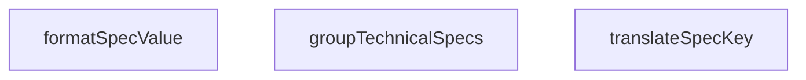

## Genel Bakış
VentHub HVAC projesinde yer alan bu yardımcı modül, ürün teknik özelliklerinin kullanıcı arayüzlerinde kullanılmaya hazır hale getirilmesini sağlar. Ürünlerle ilgili ham spesifikasyon verilerini işleyerek okunabilir, düzenli bir formata dönüştürür, platformun ürün detay ve listeleme sayfalarında ihtiyaç duyduğu tüm veri ön işleme adımlarını yerine getirir. Üç temel fonksiyonu üzerinden anahtar çevirme, değer biçimlendirme ve gruplama işlerini tek bir modül altında toplar.

## Fonksiyon Grupları
### Spesifikasyon Dönüştürme Fonksiyonları
Sistem içindeki ham teknik özellik etiketlerini ve değerlerini kullanıcı dostu, anlaşılır formata çevirmekten sorumludur. Teknik kısaltmaları ve kodlanmış terimleri insanların okuyabileceği açıklamalara dönüştürür, değerleri de sunum için uygun biçimde düzenler.
- translateSpecKey, formatSpecValue

### Spesifikasyon Organizasyon Fonksiyonu
Tek bir nesne olarak gelen tüm ham teknik özellik kümesini mantıksal kategoriler altında gruplayarak düzenli bir yapıya kavuşturur. Dağınık spesifikasyon verilerini kullanıcı arayüzünde kolayca sunulabilecek şekilde organize eder.
- groupTechnicalSpecs

---

## AXIOMS – Mimari Varsayımlar
Ürün teknik özellikleri üzerinde anahtar çevirisi, değer biçimlendirme ve gruplama/sıralama işlemleri yapan bu yardımcı modülün doğru çalışması için aşağıdaki koşulların karşılanması zorunludur.

[Aksiyom 1]: Eğer modül sabiti SPEC_SORT_ORDER tanımsız, bozuk veya eksik yapıdaysa, groupTechnicalSpecs fonksiyonu teknik özellikleri doğru gruplayamaz ve sıralayamaz.
[Aksiyom 2]: Eğer translateSpecKey fonksiyonuna gönderilen key parametresi string tipinde değilse, özellik anahtarı çevirisi yapılamaz, beklenmedik ham anahtar değeri üretilir.
[Aksiyom 3]: Eğer formatSpecValue fonksiyonuna gönderilen key parametresi string tipinde değilse, biçimlendirme kuralı seçilemez, özellik değeri doğru biçimlendirilemez.
[Aksiyom 4]: Eğer groupTechnicalSpecs fonksiyonuna gönderilen specs parametresi ne null/undefined ne de geçerli Record<string, unknown> yapısındaysa, gruplama işlemi başarısız olur, fonksiyon hata fırlatır veya boş çıktı üretir.
[Aksiyom 5]: Eğer translateSpecKey fonksiyonunda kullanılan anahtar çeviri eşleşmeleri (mapping) tüm geçerli özellik anahtarlarını kapsamıyorsa, eşleşmeyen anahtarlar çevrilmeden kullanılır, kullanıcı arayüzünde anlaşılmaz etiketler görünür.
[Aksiyom 6]: Eğer formatSpecValue fonksiyonuna gönderilen value parametresi, ilgili key için desteklenmeyen bir veri tipindeyse, özellik değeri standart dışı biçimde gösterilir, birim ekleme, nicel sıralama gibi işlemler başarısız olur.

---

## FONKSİYON DETAYLARI

### translateSpecKey
**Ne yapar**: Teknik spesifikasyon anahtarlarını insan tarafından okunabilir Türkçe etiketlere çevirir. Eğer ilgili anahtar önceden tanımlanmış çeviri sözlüğünde bulunamazsa, anahtarı alt çizgilerden ayırıp Başlık Formatı'na (Title Case) çevirerek yedek bir görünüm ismi üretir. Tüm bilinen ve yeni eklenen spesifikasyonlar için anlaşılır bir standart görünüm ismi sağlar.
**Nasıl yapar**: İlk olarak giriş olarak aldığı anahtarı yerleşik çeviri sözlüğü ile eşleştirir, eğer eşleşme bulamazsa anahtarı alt çizgi karakterlerinden parçalarına ayırır. Her parçanın ilk harfini büyütüp birleştirerek standart bir formatta gösterim ismi oluşturur. Bu süreçle hem bilinen anahtarlar için yerelleştirilmiş, hem de bilinmeyen/yeni eklenen anahtarlar için okunabilir bir çıktı garanti edilir.
**Parametreler**:
- key: string — Çevrilecek ham teknik spesifikasyon anahtarı, örnek olarak 'rpm_max', 'custom_spec_name' gibi değerler alır
**Dönüş**: string — Sözlükten bulunan çevrilmiş etiketi ya da yedek formatlama ile oluşturulmuş okunabilir görünüm ismini döndürür

### formatSpecValue
**Ne yapar**: Ham teknik spesifikasyon değerlerini, ait oldukları anahtarın soneku üzerinden doğru birimle otomatik olarak birleştirip biçimlendirir. Değer zaten içerisinde birim içeren bir metinse ham halini döndürür, değer null veya undefined ise '-' olarak sunar. Tüm spesifikasyon değerleri için tutarlı birim standardı sağlar.
**Nasıl yapar**: Önce giriş değerinin geçerliliğini kontrol eder, eğer null veya undefined ise direkt '-' çıktısı üretir. Değerin içerisinde zaten birim içerip içermediğini tespit eder, eğer içermiyorsa ait olduğu spesifikasyon anahtarının sone kısmından doğru birimi belirleyerek sayısal değerin sonuna ekler. Bu sayede manuel birim ekleme işlemine gerek kalmadan tüm değerler tutarlı şekilde biçimlendirilir.
**Parametreler**:
- key: string — Genellikle sonunda birim soneku içeren spesifikasyon anahtarı, örnek olarak 'airflow_' gibi değerler alır
- value: unknown — Biçimlendirilecek ham değer, genellikle sayı veya sayısal metin tipindedir
**Dönüş**: string — Doğru birimle eklenmiş biçimlendirilmiş metni, veya eksik değerler için '-' karakterini döndürür

### groupTechnicalSpecs
**Ne yapar**: Düz bir sözlük olarak gelen teknik spesifikasyonları mantıksal kategorilere ayırarak gruplar. Spesifikasyon anahtarlarında yapılan alt dize eşleşmeleriyle kategorizasyon yapılır, örneğin anahtarında 'airflow' geçen tüm spesifikasyonlar 'performans' kategorisine atanır. Girişteki null, undefined veya boş metin değerine sahip spesifikasyonları işleme dahil etmez, sadece geçerli değerleri gruplandırır.
**Nasıl yapar**: Önce giriş olarak aldığı spesifikasyonlar sözlüğünün null, undefined veya boş olup olmadığını kontrol eder, eğer geçersiz bir girişse null döndürür. Geçerli girişse her bir spesifikasyon anahtarını tarar, anahtar içerisinde geçen önceden tanımlanmış kategori ipuçlarını (alt dizeleri) arayarak doğru kategoriye atar. Kategorilere atamadan önce değerin geçerliliğini tekrar kontrol eder, boş veya geçersiz değerleri tüm gruplamalarda hariç tutar. Oluşturulan kategorize nesnesi her grup için gerekli etiket, ikon ve eşleşen tüm spesifikasyonları barındırır.
**Parametreler**:
- specs: Record<string, unknown> | null | undefined — Ham teknik spesifikasyonlar sözlüğü, ya da null/undefined olarak gelen geçersiz giriş
**Dönüş**: Giriş geçersiz (eksik/null) ise null, aksi takdirde her grup başına etiket, ikon ve eşleşen spesifikasyonları içeren kategorize edilmiş bir nesne döndürür

---

## SABİTLER
- **SPEC_SORT_ORDER** (object) — `{

  // Performance Group Priority

  'number_of_speeds': 1,

  'max_ambient_...`

---

## AST POINTERS

### [N1_NASIL] AST Pointer: C:\Users\alize\venthub-hvac\src\utils\productHelpers.ts::translateSpecKey
- **params**: [key: string]
- **ic_degiskenler**:
  - `translations` — Teknik spesifikasyon anahtarlarının Türkçe çevirilerini tutan kayıt nesnesi, anahtar eşleşmesi ile çeviri sağlar
  - `lowerKey` — Gelen `key` parametresinin küçük harfe çevrilmiş hali, çeviri haritasında anahtar ararken kullanılır
- **Dönüş**: string (çevrilmiş veya formatlanmış orijinal anahtar metni)

### [N2_NASIL] AST Pointer: C:\Users\alize\venthub-hvac\src\utils\productHelpers.ts::formatSpecValue
- **params**: [key: string, value: unknown]
- **ic_degiskenler**:
  - `stringValue` — Gelen `value` parametresinin stringe dönüştürülmüş hali, birim ekleme işlemlerinde temel olarak kullanılır
  - `lowerKey` — Gelen `key` parametresinin küçük harfe çevrilmiş hali, anahtar sonuna göre uygun birim eklemesi yapmak için kullanılır
- **Dönüş**: string (birim eklenmiş, formatlanmış spesifikasyon değeri)

### [N3_NASIL] AST Pointer: C:\Users\alize\venthub-hvac\src\utils\productHelpers.ts::groupTechnicalSpecs
- **params**: [specs: Record<string, unknown> | null | undefined]
- **ic_degiskenler**:
  - `groups` — Spesifikasyonları kategorize eden ana nesne, her kategori için etiket, ikon ve boş spesifikasyon nesnesi tutar
  - `key` — `Object.entries(specs)` iterasyonunda elde edilen mevcut spesifikasyonun anahtarı
  - `value` — `Object.entries(specs)` iterasyonunda elde edilen mevcut spesifikasyonun değeri
  - `k` — Mevcut iterasyondaki `key`'in küçük harfe çevrilmiş hali, spesifikasyonun hangi gruba atanacağını belirlemek için kullanılır
- **Dönüş**: Kategorize edilmiş grup nesnesi, boş/null gelen specs için null döndürür

### [N4_NASIL] AST Pointer: C:\Users\alize\venthub-hvac\src\utils\productHelpers.ts::specGroupAssignmentCallback
- **params**: [[key: string, value: unknown]] (tuple olarak alınan spesifikasyon anahtar-değer çifti)
- **ic_degiskenler**:
  - `k` — Gelen anahtarın küçük harfe çevrilmiş hali, spesifikasyonun uygun gruba atanması için anahtar içeriğini kontrol etmede kullanılır
- **Dönüş**: yok (sadece dış kapsamdaki `groups` nesnesine spesifikasyon ekler, herhangi bir dönüş değeri yoktur)

---

## MERMAID CALL GRAPH

## NODE ID STANDARD

  file: src\utils\productHelpers.ts
  function: src\utils\productHelpers.ts::translateSpecKey
  function: src\utils\productHelpers.ts::formatSpecValue
  function: src\utils\productHelpers.ts::groupTechnicalSpecs

---

## DISA AKTARILANLAR (EXPORTS)
  export: SPEC_SORT_ORDER
  export: formatSpecValue
  export: groupTechnicalSpecs
  export: translateSpecKey