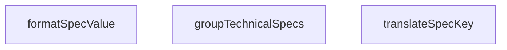

## Genel Bakış
VentHub HVAC projesindeki bu yardımcı modül, ürünlerin teknik özelliklerini (spesifikasyonlarını) insan tarafından okunabilir ve kullanıcı arayüzlerinde gösterilmeye uygun bir forma dönüştürmekle sorumludur. Ham veri setlerini işleyerek anahtar terimleri çevirir, değerleri biçimlendirir ve tüm özellikleri mantıksal gruplar altında organize eder.

## Fonksiyon Grupları
### Veri Dönüştürme ve Biçimlendirme
Ham teknik özellik anahtarlarını ve değerlerini, son kullanıcıya sunulacak anlamlı ve düzenli metinlere dönüştürmekle görevlidir.
- translateSpecKey, formatSpecValue

### Veri Organizasyonu
Çeşitli teknik özelliklerden oluşan ham bir veri kümesini, tanımlanmış bir düzende ve öncelik sırasına göre gruplandırarak düzenli bir yapıya kavuşturur.
- groupTechnicalSpecs

---

## AXIOMS – Mimari Varsayımlar

Bu modül, ürün teknik özelliklerinin dönüştürülmesi ve biçimlendirilmesi için yardımcı fonksiyonlar içerir. Doğru çalışması için aşağıdaki mimari varsayımlar geçerlidir:

[Aksiyom 1]: Eğer `translateSpecKey` fonksiyonuna verilen `key` parametresi için çeviri sözlüğünde karşılık gelen bir tanımlama yoksa, fonksiyon anahtarı olduğu gibi döndürür (çeviri yapılmaz).

[Aksiyom 2]: Eğer `formatSpecValue` fonksiyonuna verilen `value` parametresi, `key`'e özgü beklenen formatta (örneğin `Date` nesnesi, birim bilgisi gerektiren bir metin vb.) sağlanmamışsa, değer varsayılan bir metin temsiline (örneğin `[object Object]`, `Invalid Date`) dönüştürülür veya hata ele alımı devreye girer.

[Aksiyom 3]: Eğer `groupTechnicalSpecs` fonksiyonuna `specs` parametresi olarak `null` veya `undefined` değeri verilirse, fonksiyon boş bir grup sözlüğü döndürür.

[Aksiyom 4]: Eğer modül içinde tanımlı `SPEC_SORT_ORDER` sabiti (objesi) yoksa, `groupTechnicalSpecs` fonksiyonu tarafından üretilen grupların sıralaması tanımsız veya rastgele olur; belirli bir sıralama garantisi verilemez.

---

## FONKSİYON DETAYLARI

### translateSpecKey
**Ne yapar**: Teknik spesifikasyon anahtarlarını insan tarafından okunabilir Türkçe etiketlere çevirir. Eğer ilgili anahtar önceden tanımlanmış çeviri sözlüğünde bulunamazsa, anahtarı alt çizgilerden ayırıp Başlık Formatı'na (Title Case) çevirerek yedek bir görünüm ismi üretir. Tüm bilinen ve yeni eklenen spesifikasyonlar için anlaşılır bir standart görünüm ismi sağlar.
**Nasıl yapar**: İlk olarak giriş olarak aldığı anahtarı yerleşik çeviri sözlüğü ile eşleştirir, eğer eşleşme bulamazsa anahtarı alt çizgi karakterlerinden parçalarına ayırır. Her parçanın ilk harfini büyütüp birleştirerek standart bir formatta gösterim ismi oluşturur. Bu süreçle hem bilinen anahtarlar için yerelleştirilmiş, hem de bilinmeyen/yeni eklenen anahtarlar için okunabilir bir çıktı garanti edilir.
**Parametreler**:
- key: string — Çevrilecek ham teknik spesifikasyon anahtarı, örnek olarak 'rpm_max', 'custom_spec_name' gibi değerler alır
**Dönüş**: string — Sözlükten bulunan çevrilmiş etiketi ya da yedek formatlama ile oluşturulmuş okunabilir görünüm ismini döndürür

### formatSpecValue
**Ne yapar**: Ham teknik spesifikasyon değerlerini, ait oldukları anahtarın soneku üzerinden doğru birimle otomatik olarak birleştirip biçimlendirir. Değer zaten içerisinde birim içeren bir metinse ham halini döndürür, değer null veya undefined ise '-' olarak sunar. Tüm spesifikasyon değerleri için tutarlı birim standardı sağlar.
**Nasıl yapar**: Önce giriş değerinin geçerliliğini kontrol eder, eğer null veya undefined ise direkt '-' çıktısı üretir. Değerin içerisinde zaten birim içerip içermediğini tespit eder, eğer içermiyorsa ait olduğu spesifikasyon anahtarının sone kısmından doğru birimi belirleyerek sayısal değerin sonuna ekler. Bu sayede manuel birim ekleme işlemine gerek kalmadan tüm değerler tutarlı şekilde biçimlendirilir.
**Parametreler**:
- key: string — Genellikle sonunda birim soneku içeren spesifikasyon anahtarı, örnek olarak 'airflow_' gibi değerler alır
- value: unknown — Biçimlendirilecek ham değer, genellikle sayı veya sayısal metin tipindedir
**Dönüş**: string — Doğru birimle eklenmiş biçimlendirilmiş metni, veya eksik değerler için '-' karakterini döndürür

### groupTechnicalSpecs
**Ne yapar**: Düz bir sözlük olarak gelen teknik spesifikasyonları mantıksal kategorilere ayırarak gruplar. Spesifikasyon anahtarlarında yapılan alt dize eşleşmeleriyle kategorizasyon yapılır, örneğin anahtarında 'airflow' geçen tüm spesifikasyonlar 'performans' kategorisine atanır. Girişteki null, undefined veya boş metin değerine sahip spesifikasyonları işleme dahil etmez, sadece geçerli değerleri gruplandırır.
**Nasıl yapar**: Önce giriş olarak aldığı spesifikasyonlar sözlüğünün null, undefined veya boş olup olmadığını kontrol eder, eğer geçersiz bir girişse null döndürür. Geçerli girişse her bir spesifikasyon anahtarını tarar, anahtar içerisinde geçen önceden tanımlanmış kategori ipuçlarını (alt dizeleri) arayarak doğru kategoriye atar. Kategorilere atamadan önce değerin geçerliliğini tekrar kontrol eder, boş veya geçersiz değerleri tüm gruplamalarda hariç tutar. Oluşturulan kategorize nesnesi her grup için gerekli etiket, ikon ve eşleşen tüm spesifikasyonları barındırır.
**Parametreler**:
- specs: Record<string, unknown> | null | undefined — Ham teknik spesifikasyonlar sözlüğü, ya da null/undefined olarak gelen geçersiz giriş
**Dönüş**: Giriş geçersiz (eksik/null) ise null, aksi takdirde her grup başına etiket, ikon ve eşleşen spesifikasyonları içeren kategorize edilmiş bir nesne döndürür

---

## İTHALATLAR (IMPORTS)
- import: lucide-react::Ruler
- import: lucide-react::Settings
- import: react::React

---

## SABİTLER
- **SPEC_SORT_ORDER** (object) — `{
  // Performance Group Priority
  'number_of_speeds': 1,
  'max_ambient_...`

---

## AST POINTERS

### [N1_NASIL] AST Pointer: src/utils/productHelpers.ts::translateSpecKey
- **params**: `(key: string)` — Türkçeye çevrilecek teknik özellik anahtarı
- **ic_degiskenler**:
  - `translations` — Spec anahtarlarını Türkçe etiketlere eşleyen sözlük (ör: 'rpm_max' → '2. Kademe Devir Hızı')
  - `lowerKey` — `key` parametresinin küçük harfli hali, büyük/küçük harf duyarsız sözlük araması için
- **Dönüş**: `string` — Çevrilmiş Türkçe etiket veya `_` ile ayrılmış kelimeleri baş harfi büyükleştirilmiş hali

### [N2_NASIL] AST Pointer: src/utils/productHelpers.ts::formatSpecValue
- **params**: `(key: string, value: unknown)` — Biçimlendirilecek teknik özellik anahtarı ve değeri
- **ic_degiskenler**:
  - `stringValue` — `value` parametresinin string temsili, birim eklemek için kullanılır
  - `lowerKey` — `key` parametresinin küçük harfli hali, son ek kontrolü ile doğru birimi belirler
- **Dönüş**: `string` - Birim eklenmiş biçimlendirilmiş değer (ör: "25 mm", "50 Hz") veya değerin kendisi

### [N3_NASIL] AST Pointer: src/utils/productHelpers.ts::groupTechnicalSpecs
- **params**: `(specs: Record<string, unknown> | null | undefined)` — Gruplanacak teknik özellikler sözlüğü
- **ic_degiskenler**:
  - `groups` — Dört kategoriye ayrılmış grup yapısı: `performance` (performans ölçüleri, `Settings` ikonu), `physical` (fiziksel ölçümler, `Ruler` ikonu), `electrical` (elektriksel veriler, `Settings` ikonu), `other` (diğer özellikler, `Settings` ikonu); her kategori `label`, `icon` ve boş `specs` sözlüğü içerir
  - `k` — Döngü içindeki mevcut anahtarın küçük harf hali, kategori sınıflandırması için kullanılır
- **Dönüş**: `Record<string, { label: string; icon: React.ComponentType; specs: Record<string, unknown> }> | null` — Gruplanmış özellikler sözlüğü veya `specs` null/undefined ise `null` döner
- **Yan etkiler**: `Object.entries(specs)` döngüsü ile her özellik, anahtar kelime eşleşmesine göre ilgili grubun `specs` alanına atanır: airflow/speed/rpm/delivery/pressure → performance, size/weight/width/height/depth/dim_ → physical, voltage/power/hz/absorbed/current/phase → electrical, diğerleri → other; null/undefined/boş string değerler atlanır

---

## MERMAID CALL GRAPH

## NODE ID STANDARD

  file: src\utils\productHelpers.ts
  function: src\utils\productHelpers.ts::translateSpecKey
  function: src\utils\productHelpers.ts::formatSpecValue
  function: src\utils\productHelpers.ts::groupTechnicalSpecs

---

## DISA AKTARILANLAR (EXPORTS)
  export: SPEC_SORT_ORDER
  export: formatSpecValue
  export: groupTechnicalSpecs
  export: translateSpecKey