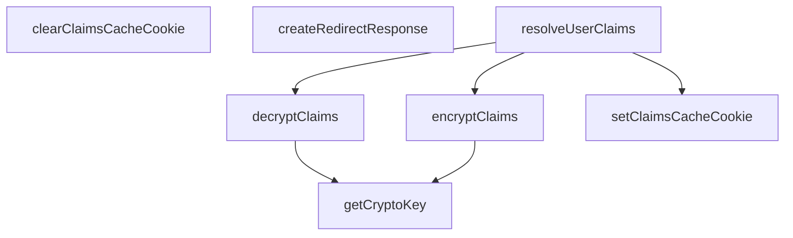

## Genel Bakış
Bu modül, bir Next.js uygulamasında kullanıcı oturum yönetimi ve yönlendirme işlemleri için gerekli yardımcı (utility) fonksiyonları içerir. Temel olarak, kullanıcının kimlik doğrulama bilgilerini (claims) güvenli bir şekilde şifreleyip çözmeyi, bunları önbellek cookie'si ile yönetmeyi ve isteklere uygun yönlendirme yanıtları oluşturmayı sağlar.

## Fonksiyon Grupları
### Kripto İşlemleri
Bu grup, hassas kullanıcı bilgilerinin (claims) güvenli bir şekilde şifrelenmesi ve çözülmesi için gerekli kripto anahtarı yönetimini ve asimetrik şifreleme mantığını barındırır.
- getCryptoKey, encryptClaims, decryptClaims

### Kullanıcı İddiası Çözümleme
Bu grup, bir HTTP isteğindeki (request) kullanıcı bilgilerini (claims) çözmek için merkezi bir işlev sunar. Farklı kaynaklardan (cookie önbelleği veya doğrudan istemci) veri almayı ve hatasıyla birlikte sonuç döndürmeyi yönetir.
- resolveUserClaims

### Cookie Yönetimi
Bu grup, çözülmüş kullanıcı bilgilerinin önbelleğe alınması veya temizlenmesi için HTTP yanıtındaki (response) cookie'leri ayarlar veya siler.
- setClaimsCacheCookie, clearClaimsCacheCookie

### Yönlendirme Yardımcıları
Bu grup, bir kullanıcıyı yeni bir URL'ye yönlendirmek için uygun format ve durum koduna sahip HTTP yanıt nesneleri oluşturur.
- createRedirectResponse

---

## AXIOMS – Mimari Varsayımlar
Bu modül, kullanıcı kimlik doğrulama claim'lerini (yetkilendirme bilgilerini) şifreleme, çözümleme ve cookie üzerinden yönetme sorumluluğunu üstlenir. Modülün doğru çalışması için aşağıdaki mimari varsayımlar geçerlidir.

[Aksiyom 1]: Eğer `secret` parametresi, kriptografik işlemler için yeterli entropi (rastgelelik ve uzunluk) içermiyorsa, üretilen anahtar (`getCryptoKey`) zayıf olur ve şifreleme (`encryptClaims`, `decryptClaims`) güvenli değildir. Bu durumda, saldırganlar şifrelenmiş claim'leri çözebilir.

[Aksiyom 2]: Eğer `encryptClaims` ve `decryptClaims` fonksiyonları çağrılırken kullanılan `secret` parametreleri birbirinden farklıysa, `decryptClaims` fonksiyonu, daha önce `encryptClaims` ile şifrelenmiş bir `cookieValue`'yu başarıyla çözemez. Bu durumda fonksiyon hata üretir veya geçersiz veri döner.

[Aksiyom 3]: Eğer `resolveUserClaims` fonksiyonuna geçirilen `supabase` nesnesinin `auth.getClaims` metodu çağrılamazsa (örn. fonksiyon tanımsızsa veya promise reddedilirse), kullanıcının mevcut claim'leri (sessions, roller vb.) sunucudan alınamaz. Bu durumda, `resolveUserClaims` hata fırlatır veya varsayılan/boş bir claim seti ile devam eder.

[Aksiyom 4]: Eğer `setClaimsCacheCookie` fonksiyonuna geçirilen `maxAgeSeconds` parametresi, bir tarayıcı cookie'si için geçerli (0'dan büyük) bir süreyi temsil etmiyorsa (örn. negatif veya `Infinity`), cookie'nin süresi tarayıcı tarafından hemen sona erdirilir veya belirsiz hale gelir. Bu durumda, cache cookie'si beklenen süreyi koruyamaz.

[Aksiyom 5]: Eğer `decryptClaims` fonksiyonuna geçirilen `cookieValue`, `encryptClaims` fonksiyonunun output formatına (örn. Base64-URL encoded, belirli bir JSON yapısı) uymuyorsa, çözümleme işlemi başarısız olur. Bu durumda fonksiyon `null`, boş bir nesne veya bir hata fırlatır.

[Aksiyom 6]: Eğer `createRedirectResponse` fonksiyonuna geçirilen `targetUrl`, geçerli bir URL nesnesi veya string'i değilse (örn. boş string, `undefined` veya bozuk bir yapı), oluşan redirect response (`302`/`301` status kodu ile) tarayıcıyı geçersiz veya beklenmeyen bir hedefe yönlendirir. Bu durumda kullanıcı hedef sayfaya ulaşamaz.

[Aksiyom 7]: Eğer `setClaimsCacheCookie` veya `clearClaimsCacheCookie` fonksiyonlarına

---

## FONKSİYON DETAYLARI

### getCryptoKey
**Ne yapar**: Bir string gizli anahtardan (secret) SHA-256 kullanarak AES şifreleme için bir `CryptoKey` nesnesi türetir. Edge ortamlarıyla uyumlu Web Crypto API sarmalayıcısı olarak çalışır.

**Nasıl yapar**: Önce `TextEncoder` ile gizli anahtar string'ini bayt dizisine dönüştürür. Ardından `crypto.subtle.digest` ile SHA-256 özetini hesaplayarak deterministik bir 256-bit değer elde eder. Son olarak `crypto.subtle.importKey` ile bu özeti `'raw'` formatında, AES algoritmasıyla ve `['encrypt', 'decrypt']` kullanım amaçlarıyla bir `CryptoKey` nesnesine dönüştürür. Anahtar dışa aktarılamaz olarak (`false`) ayarlanır.

**Parametreler**:
- secret: string — Türetilecek kriptografik anahtarın kaynağı olan gizli dize

**Dönüş**: `Promise<CryptoKey>` — AES-GCM şifreleme ve çözme işlemlerinde kullanılacak kriptografik anahtar nesnesi

### encryptClaims
**Ne yapar**: Bir claims (talep) nesnesini AES-GCM algoritması ile şifreler, oluşturulan şifreli veriyi Base64URL formatına dönüştürerek bir token string’i üretir.

**Nasıl yapar**: Claims nesnesini JSON stringine dönüştürür ve byte dizisine çevirir. Rastgele 12 byte uzunluğunda bir başlatma vektörü (IV) üretir. CryptoKey ile AES-GCM şifreleme işlemi yapar. Oluşturulan rastgele IV ile şifreli veriyi tek bir byte dizisinde birleştirir. Son olarak, bu byte dizisini Base64URL formatına (URL'lerde güvenli, padding'siz) dönüştürür.

**Parametreler**:
- `claims`: Record<string, unknown> — Şifrelenecek anahtar-değer çiftlerinden oluşan nesne.
- `secret`: string — Kriptoografik anahtarı türetmek için kullanılacak gizli dize.

**Dönüş**: `Promise<string>` — Base64URL ile kodlanmış, IV ve şifreli veriyi içeren tek bir string.

### decryptClaims
**Ne yapar**: Base64URL kodlanmış bir AES-GCM token'ını çözer ve claims nesnesine dönüştürür. Şifreleme başarısız olursa (imza geçersizse, veriler değiştirilmişse veya secret yanlış/expiry ise) null döner.

**Nasıl yapar**: Base64URL string'ini standart Base64'e ve ardından byte dizisine geri dönüştürür. Byte dizisinin en az 12 byte (IV uzunluğu) olup olmadığını kontrol eder. İlk 12 byte'ı IV olarak, geri kalanını şifreli veri olarak ayırır. CryptoKey ve IV ile AES-GCM şifre çözümü yapar. Çözülmüş byte'ları UTF-8 stringine ve ardından JSON nesnesine dönüştürür. İşlem sırasında oluşabilecek herhangi bir hatayı yakalar ve null döner.

**Parametreler**:
- `cookieValue`: string — Base64URL ile kodlanmış, çözülecek token.
- `secret`: string — Kriptoografik anahtarı türetmek için kullanılacak gizli dize.

**Dönüş**: `Promise<Record<string, unknown> | null>` — Başarılı olursa claims nesnesi, başarısız olursa `null`.

### resolveUserClaims
**Ne yapar**: Kullanıcı claims bilgisini önbellekten veya Supabase istemcisinden çözer. Önce HTTP cookie'sindeki şifreli önbelleği kontrol eder, geçerli claims yoksa Supabase'den taze bilgi çeker ve önbelleği günceller.

**Nasıl yapar**: İstek cookie'sindeki ‘sb-claims-cache’ değerini alır ve `decryptClaims` ile çözmeyi dener. Çözülen claims içinde `user_role` alanı varsa, bu bilgiyi ‘cache’ kaynağından döner. Önbellek miss (bulunamadı/hatalı) ise, `supabase.auth.getClaims()` çağrısıyla sunucudan taze claims alır. Başarılı olursa claims’i `encryptClaims` ile şifreler ve `setClaimsCacheCookie` ile yanıt nesnesinde 15 dakikalık (900 saniye) bir cookie olarak saklar.

**Parametreler**:
- `request`: NextRequest — Mevcut HTTP isteği (cookie'leri okumak için).
- `response`: NextResponse — Önbellek cookie'sinin ayarlanacağı HTTP yanıtı.
- `supabase`: `{ auth: { getClaims: () => Promise<{ data: { claims: Record<string, unknown> | null } | null; error: unknown }> } }` — Kullanıcı claims'ini almak için Supabase client instance.
- `secret`: string — Kriptoografik anahtarı türetmek için kullanılacak gizli dize.

**Dönüş**: `Promise<{ claims: Record<string, unknown> | null; error: unknown; source: 'cache' | 'client' }>` — Çözülen claims, varsa hata ve bilginin kaynak bilgisini (önbellek veya istemci) içeren nesne.

### setClaimsCacheCookie
**Ne yapar**: HTTP-only, güvenli ve belirli bir ömre sahip claims önbellek cookie'sini HTTP yanıtına ekler.

**Nasıl yapar**: `response.cookies.set` metodunu kullanarak ‘sb-claims-cache’ adında bir cookie ayarlar. Cookie, sadece HTTP istekleriyle gönderilir (`httpOnly: true`), production ortamında sadece HTTPS üzerinden gönderilir (`secure`), CSRF saldırılarına karşı ‘lax’ sameSite politikası uygulanır ve belirtilen `maxAgeSeconds` süresince tarayıcıda kalır.

**Parametreler**:
- `response`: NextResponse — Cookie'nin ekleneceği HTTP yanıtı.
- `cookieValue`: string — Cookie'nin değeri (genellikle şifreli claims token'ı).
- `maxAgeSeconds`: number — Cookie'nin tarayıcıda kalma süresi (saniye cinsinden, varsayılan: 900).

**Dönüş**: Yok (void).

### clearClaimsCacheCookie
**Ne yapar**: Claims önbellek cookie'sini hemen silmek için HTTP yanıtına ekler. Çıkış (logout) işlemlerinde çağrılmalıdır.

**Nasıl yapar**: `response.cookies.set` metodunu kullanarak ‘sb-claims-cache’ cookie’sini boş bir değerle ve `maxAge: 0` ile ayarlayarak tarayıcıdan anında silinmesini sağlar. Diğer güvenlik ayarları (`httpOnly`, `secure`, `sameSite`) korunur.

**Parametreler**:
- `response`: NextResponse — Cookie'nin silineceği HTTP yanıtı.

**Dönüş**: Yok (void).

### createRedirectResponse
**Ne yapar**: Mevcut bir HTTP yanıtındaki (örn., bir middleware yanıtında) tüm header'ları ve cookie'leri koruyarak yeni bir yönlendirme (redirect) yanıtı oluşturur. Bu, kimlik doğrulama veya kiracı (tenant) bilgisi içeren cookie'lerin yönlendirme sırasında kaybolmasını önler.

**Nasıl yapar**: Belirtilen URL ve durum koduyla yeni bir `NextResponse.redirect` nesnesi oluşturur. `responseToCopyFrom` parametresinden gelen yanıtın tüm cookie'lerini (`getAll()`) yeni yanıta kopyalar. Aynı şekilde, tüm header'ları da (`forEach`) yeni yanıta aktarır.

**Parametreler**:
- `request`: NextRequest — Yönlendirme isteği (mevcut API için gerekli, ancak işlevde doğrudan kullanılmıyor).
- `targetUrl`: string | URL — Yönlendirme yapılacak hedef URL.
- `responseToCopyFrom`: NextResponse — Header ve cookie'lerin kopyalanacağı kaynak yanıt.
- `status`: number — Yönlendirme HTTP durum kodu (varsayılan: 302).

**Dönüş**: `NextResponse` — Tüm header ve cookie'leri korunmuş yönlendirme yanıtı.

---

## İTHALATLAR (IMPORTS)
- import: next/server::NextRequest
- import: next/server::NextResponse

---

## AST POINTERS

### [N1_NASIL] AST Pointer: src/utils/router.ts::getCryptoKey
- **params**: `secret` — şifreleme anahtarı türetilecek gizli dize
- **ic_degiskenler**:
  - `encoder` — `TextEncoder` örneği, `secret` dizesini bayt dizisine dönüştürmek için kullanılır
  - `secretBytes` — `encoder.encode(secret)` sonucu oluşan `Uint8Array`, SHA-256 özetlemesine girdi olarak verilir
  - `hash` — `crypto.subtle.digest('SHA-256', secretBytes)` sonucu oluşan 256-bit `ArrayBuffer`, ham anahtar olarak `importKey`'e aktarılır
- **Dönüş**: `CryptoKey` — AES-GCM algoritmasıyla `encrypt` ve `decrypt` işlemleri için kullanılacak anahtar

---

### [N2_NASIL] AST Pointer: src/utils/router.ts::encryptClaims
- **params**: `claims` — şifrelenecek `Record<string, unknown>` türünde veri; `secret` — şifreleme anahtarı türetilecek gizli dize
- **ic_degiskenler**:
  - `key` — `getCryptoKey(secret)` çağrısından dönen `CryptoKey`, AES-GCM şifrelemesinde kullanılır
  - `encoder` — `TextEncoder` örneği, JSON dizesini bayt dizisine dönüştürmek için
  - `dataBytes` — `JSON.stringify(claims)` sonucunun `encoder.encode` ile bayt karşılığı
  - `iv` — `crypto.getRandomValues(new Uint8Array(12))` ile üretilen 12 baytlık rastgele Initialization Vector
  - `encryptedBuffer` — `crypto.subtle.encrypt({ name: AES_ALGORITHM, iv }, key, dataBytes)` sonucu oluşan şifreli `ArrayBuffer`
  - `combined` — `iv` ve `encryptedBuffer`'ın birleştirildiği `Uint8Array`; önce `iv` başa, ardından şifreli veri eklenir
- **Dönüş**: `string` — `combined` bayt dizisinin Base64URL kodlaması (`=`, `+`, `/` karakterleri kaldırılarak)

---

### [N3_NASIL] AST Pointer: src/utils/router.ts::decryptClaims
- **params**: `cookieValue` — Base64URL kodlanmış şifreli çerez değeri; `secret` — şifreleme anahtarı türetilecek gizli dize
- **ic_degiskenler**:
  - `key` — `getCryptoKey(secret)` çağrısından dönen `CryptoKey`
  - `base64` — `cookieValue`'nun `-` → `+`, `_` → `/` dönüşümü yapılmış ve padding eklenmiş hali
  - `binary` — `atob(base64)` sonucu oluşan ikili dize
  - `bytes` — `binary` dizesinin her karakterinin `charCodeAt` ile `Uint8Array`'e dönüştürülmüş hali
  - `iv` — `bytes.slice(0, 12)` ile çıkarılan 12 baytlık Initialization Vector
  - `encryptedData` — `bytes.slice(12)` ile çıkarılan şifreli veri kısmı
  - `decryptedBuffer` — `crypto.subtle.decrypt({ name: AES_ALGORITHM, iv }, key, encryptedData)` sonucu oluşan `ArrayBuffer`
  - `decryptedStr` — `new TextDecoder().decode(decryptedBuffer)` sonucu oluşan düz metin
  - `error` — `catch` bloğunda yakalanan hata; `console.error` ile `[Router] Claims cache decryption failed:` mesajıyla loglanır
- **Dönüş**: `Record<string, unknown> | null` — başarılıysa çözümlenmiş claims nesnesi, hata durumunda veya `bytes.length < 12` ise `null`

---

### [N4_NASIL] AST Pointer: src/utils/router.ts::resolveUserClaims
- **params**: `request` — gelen `NextRequest` nesnesi; `response` — yanıt olarak kullanılacak `NextResponse` nesnesi; `supabase` — `auth.getClaims` metodu olan Supabase istemcisi; `secret` — şifreleme anahtarı türetilecek gizli dize
- **ic_degiskenler**:
  - `cachedCookie` — `request.cookies.get('sb-claims-cache')?.value` ile okunan çerez değeri; varsa önbellekten çözümleme denenir
  - `claims` — (ilk blok) `decryptClaims(cachedCookie, secret)` sonucu; `claims.user_role` varsa önbellek kaynağıyla dönülür
  - `data` — `supabase.auth.getClaims()` sonucundaki `data` alanı; `data.claims` null değilse kullanılır
  - `error` — `supabase.auth.getClaims()` sonucundaki `error` alanı; varsa hata ile dönülür
  - `claims` — (ikinci blok) `data.claims` ataması; önbelleğe yazılır ve `source: 'client'` ile dönülür
  - `encrypted` — `encryptClaims(claims, secret)` sonucu oluşan Base64URL dizesi; `setClaimsCacheCookie` ile çereze yazılır
  - `err` — `catch` bloğunda yakalanan hata; `source: 'client'` ile birlikte dönülür
- **Dönüş**: `{ claims: Record<string, unknown> | null; error: unknown; source: 'cache' | 'client' }` — claims verisi, hata durumu ve verinin kaynağı (önbellek veya Supabase istemcisi)

---

### [N5_NASIL] AST Pointer: src/utils/router.ts::setClaimsCacheCookie
- **params**: `response` — çerez eklenecek `NextResponse` nesnesi; `cookieValue` — çereze yazılacak şifreli değer; `maxAgeSeconds` — çerez ömrü saniye cinsinden (varsayılan `900`, yani 15 dakika)
- **ic_degiskenler**: yok
- **Dönüş**: yok — yan etki olarak `response.cookies.set('sb-claims-cache', ...)` çağrısı yapılır; `httpOnly: true`, `secure` ortama bağlı (`process.env.NODE_ENV === 'production'`), `sameSite: 'lax'`, `path: '/'`

---

### [N6_NASIL] AST Pointer: src/utils/router.ts::clearClaimsCacheCookie
- **params**: `response` — çerez silinecek `NextResponse` nesnesi
- **ic_degiskenler**: yok
- **Dönüş**: yok — yan etki olarak `response.cookies.set('sb-claims-cache', '', ...)` çağrısı yapılır; `maxAge: 0` ile çerez hemen silinir; `httpOnly: true`, `secure` ortama bağlı, `sameSite: 'lax'`, `path: '/'`

---

### [N7_NASIL] AST Pointer: src/utils/router.ts::createRedirectResponse
- **params**: `request` — gelen `NextRequest` nesnesi (fonksiyon gövdesinde doğrudan kullanılmaz); `targetUrl` — yönlendirme hedefi `string | URL`; `responseToCopyFrom` — çerez ve başlıkları kopyalanacak `NextResponse` nesnesi; `status` — HTTP durum kodu (varsayılan `302`)
- **ic_degiskenler**:
  - `redirectRes` — `NextResponse.redirect(targetUrl, status)` ile oluşturulan yönlendirme yanıtı
  - `name` — `responseToCopyFrom.cookies.getAll()` sonucundaki her çerez nesnesinden çıkarılan çerez adı
  - `value` — çerez değeri
  - `options` — çerez nesnesinden geriye kalan seçenekler (`...options` ile yayılır)
  - `value` — `responseToCopyFrom.headers.forEach` içindeki başlık değeri
  - `key` — başlık adı
- **Dönüş**: `NextResponse` — `responseToCopyFrom`'dan tüm çerezlerin ve başlıkların kopyalandığı yönlendirme yanıtı

---

## MERMAID CALL GRAPH

## NODE ID STANDARD

  file: src\utils\router.ts
  function: src\utils\router.ts::getCryptoKey
  function: src\utils\router.ts::encryptClaims
  function: src\utils\router.ts::decryptClaims
  function: src\utils\router.ts::resolveUserClaims
  function: src\utils\router.ts::setClaimsCacheCookie
  function: src\utils\router.ts::clearClaimsCacheCookie
  function: src\utils\router.ts::createRedirectResponse

---

## DISA AKTARILANLAR (EXPORTS)
  export: clearClaimsCacheCookie
  export: createRedirectResponse
  export: decryptClaims
  export: encryptClaims
  export: getCryptoKey
  export: resolveUserClaims
  export: setClaimsCacheCookie