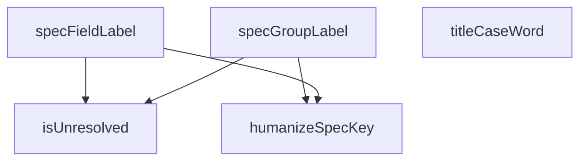

## Genel Bakış
Bu modül, teknik spesifikasyon (spec) key'lerini kullanıcıya gösterilebilir etiketlere dönüştürmekten sorumludur. Çeviri desteği sağlar ve çeviri bulunamadığında anlamlı fallback etiketler üretir. Modül, veri tabanında veya API yanıtında camelCase/snake_case olarak saklanan spec alan adlarını insan tarafından okunabilir başlık formatına çevirir.

## Fonksiyon Grupları

### Metin Dönüştürme Yardımcıları
Teknik formattaki key'leri insan tarafından okunabilir metinlere dönüştüren temel yardımcı fonksiyonlardır. `titleCaseWord` tek bir kelimeyi baş harfleri büyük forma çevirirken, `humanizeSpecKey` alt çizgi veya tire ile ayrılmış key'leri okunabilir metne dönüştürür.
- titleCaseWord, humanizeSpecKey

### Çeviri Durumu Kontrolü
Bir spec key'in çevirisinin başarıyla yapılıp yapılmadığını denetler. Çeviri başarısız olduğunda (örneğin çeviri sözlüğünde karşılığı bulunamadığında) true döner ve bu durumda fallback etiket üretimine geçilmesi gerektiğini işaret eder.
- isUnresolved

### Etiket Üretimi
Spec alanları ve grupları için kullanıcıya gösterilecek etiketleri üretir. Önce çeviri fonksiyonu ile çeviri denenir; çeviri çözülmemiş durumdaysa `humanizeSpecKey` ile otomatik bir etiket oluşturulur. `specGroupLabel` ayrıca opsiyonel bir fallback etiket parametresi alır.
- specFieldLabel, specGroupLabel

---

## AXIOMS – Mimari Varsayımlar
- Bu modül davranışsal mantık içermez (salt veri / konfigürasyon / tip tanımı).
- [Aksiyom 1]: Modülün dışa açtığı yapı (anahtar kümesi / şema) bir sözleşmedir; tüketiciler bu sabit yapıya bağlıdır — kırıcı değişiklik tüm tüketicileri etkiler.
- [Aksiyom 2]: Bir öğe ekleme/çıkarma yapısal-uyumlu olmalı; ilgili tipler ve seçiciler aynı commit'te güncel tutulmalıdır.

---

## FONKSİYON DETAYLARI

### titleCaseWord
**Ne yapar**: Verilen bir kelimenin ilk harfini büyük harfe, geri kalanını küçük harfe dönüştürerek "Title Case" formatında bir string döndürür. Boş veya falsy bir değer gelirse olduğu gibi geri döndürür.

**Nasıl yapar**: Fonksiyon önce gelen değerin doğruluğunu kontrol eder; falsy ise (boş string, undefined, null vb.) doğrudan gelen değeri döndürür. Aksi halde `charAt(0)` ile ilk karakteri alıp `toLocaleUpperCase('en-US')` ile İngilizce locale kurallarına göre büyük harfe çevirir, ardından `slice(1)` ile kalan karakterleri alıp `toLocaleLowerCase('en-US')` ile küçük harfe çevirir ve bu iki parçayı birleştirir.

**Parametreler**:
- word: string — Title Case formatına dönüştürülecek kelime. Boş veya falsy olabilir.

**Dönüş**: string — İlk harfi büyük, geri kalanı küçük harfle yazılmış kelime. Girdi falsy ise girdinin kendisi.

### humanizeSpecKey
**Ne yapar**: Geliştirildi ancak detay üretilemedi.

### isUnresolved
**Ne yapar**: Geliştirildi ancak detay üretilemedi.

### specFieldLabel
**Ne yapar**: Geliştirildi ancak detay üretilemedi.

### specGroupLabel
**Ne yapar**: Geliştirildi ancak detay üretilemedi.

---

## İTHALATLAR (IMPORTS)
- import: ./productHelpers::translateSpecKey

---

## TYPE ALIASES

### TranslateFn
F5-B W2.2 — Teknik özellik ETİKET çözümü (asla ham anahtar yolu render etme). PDP'de spec grup başlıkları ve alan adları dinamik anahtarlarla çözülür (`pdp.specGroups.<group>` / `pdp.specs.<key>`). DB'den sözlükte karşılığı olmayan yeni bir anahtar geldiğinde `t()` anahtarın KENDİSİNİ döndürür ve ek
```typescript
type TranslateFn = (key: string, paramsOrAlt?: Record<string, unknown> | string) => string
```

---

## SABİTLER
- **UNIT_SUFFIXES** (object) — `{
  m3h: 'm³/h',
  m3s: 'm³/s',
  ls: 'l/s',
  ms: 'm/s',
  mm: 'mm',
 ...`

---

## AST POINTERS

### [N1_NASIL] AST Pointer: src/utils/specLabel.ts::titleCaseWord
- **params**: `word` — dönüştürülecek kelime
- **ic_degiskenler**: yok
- **Dönüş**: string — kelimenin ilk harfi büyük, geri kalanı küçük harfli hali; boş/falsy ise olduğu gibi döner

### [N2_NASIL] AST Pointer: src/utils/specLabel.ts::humanizeSpecKey
- **params**: `key` — insan tarafından okunabilir hale getirilecek spec anahtarı
- **ic_degiskenler**:
  - `parts` — `key` değerinin `_` veya boşluk karakterlerine göre bölünmesiyle oluşan, boş olmayan parçalar dizisi
  - `lastLower` — `parts` dizisinin son elemanının tamamen küçük harfe dönüştürülmüş hali
  - `unit` — `parts` uzunluğu 1'den büyükse `UNIT_SUFFIXES` objesinde `lastLower` anahtarına karşılık gelen birim kısaltması; aksi halde `undefined`
  - `words` — `unit` tanımlıysa `parts` dizisinin son elemanı hariç hali; tanımlı değilse `parts` dizisinin kendisi
  - `label` — `words` dizisinin her elemanına `titleCaseWord` uygulanıp boşlukla birleştirilmesiyle oluşan metin
- **Dönüş**: string — `unit` varsa `"label (unit)"` formatında, yoksa sadece `label` metni

### [N3_NASIL] AST Pointer: src/utils/specLabel.ts::isUnresolved
- **params**: `dictKey` — çeviri sözlüğündeki anahtar, `translated` — çevrilmiş metin
- **ic_degiskenler**: yok
- **Dönüş**: boolean — `translated` değeri `dictKey` ile aynıysa veya `trimmed` hali boşsa `true` döner

### [N4_NASIL] AST Pointer: src/utils/specLabel.ts::specFieldLabel
- **params**: `key` — spec alan anahtarı, `t` — çeviri fonksiyonu (TranslateFn)
- **ic_degiskenler**:
  - `dictKey` — `"pdp.specs."` ön eki ile `key` değerinin birleştirilmesiyle oluşan çeviri anahtarı
  - `translated` — `t` fonksiyonuna `dictKey` verilerek elde edilen çevrilmiş metin
  - `curated` — `translateSpecKey` fonksiyonuna `key` verilerek dönen küratörlü eşleşme
  - `genericFallback` — `key` değerinin `_` ile bölünüp her kelimesinin baş harfi büyük, gerisi küçük yapılarak boşlukla birleştirilmesiyle oluşan jenerik etiket
- **Dönüş**: string — çeviri çözümlenmişse `translated`; değilse `curated` ile `genericFallback` aynıysa `humanizeSpecKey(key)`, farklıysa `curated` döner

### [N5_NASIL] AST Pointer: src/utils/specLabel.ts::specGroupLabel
- **params**: `groupKey` — spec grup anahtarı, `t` — çeviri fonksiyonu (TranslateFn), `fallbackLabel` (opsiyonel) — çeviri bulunamazsa kullanılacak yedek etiket
- **ic_degiskenler**:
  - `dictKey` — `"pdp.specGroups."` ön eki ile `groupKey` değerinin birleştirilmesiyle oluşan çeviri anahtarı
  - `translated` — `t` fonksiyonuna `dictKey` verilerek elde edilen çevrilmiş metin
- **Dönüş**: string — çeviri çözümlenmişse `translated`; değilse `fallbackLabel` tanımlı ve boşluklardan arındırılmış hali doluysa `fallbackLabel`, aksi halde `humanizeSpecKey(groupKey)` döner

---


## MERMAID CALL GRAPH


## NODE ID STANDARD

  file: src\utils\specLabel.ts
  function: src\utils\specLabel.ts::titleCaseWord
  function: src\utils\specLabel.ts::humanizeSpecKey
  function: src\utils\specLabel.ts::isUnresolved
  function: src\utils\specLabel.ts::specFieldLabel
  function: src\utils\specLabel.ts::specGroupLabel

---

## DISA AKTARILANLAR (EXPORTS)
  export: humanizeSpecKey
  export: isUnresolved
  export: specFieldLabel
  export: specGroupLabel
  export: titleCaseWord