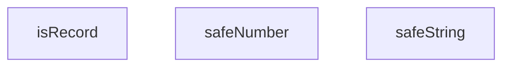

## Genel Bakış
Bu TypeScript modülü, VentHub HVAC projesinin genel amaçlı yardımcı araçlarından biridir. Bilinmeyen türdeki giriş değerlerini güvenli bir şekilde standart tiplere dönüştürmek ve temel tip doğrulamaları yapmak üzere tasarlanmıştır, tür uyumsuzluklarından kaynaklanabilecek uygulama hatalarını önler.

## Fonksiyon Grupları
### Güvenli Tip Dönüştürme Fonksiyonları
Bilinmeyen türdeki girişleri, tür uyumsuzluğu halinde tanımlanmış varsayılan değerle döndürerek güvenli şekilde istenen türe çevirir, uygulama genelinde tutarlı tip güvenliği sağlar.
- safeNumber, safeString

### Temel Tip Doğrulama Fonksiyonu
Gelen değerin geçerli bir anahtar-değer kaydı (nesne) olup olmadığını kontrol eder, diğer tip işleme süreçlerinde doğrulama adımı olarak kullanılır.
- isRecord

---

## AXIOMS – Mimari Varsayımlar
Bu modül, TypeScript ile yazılmış tip dönüşüm ve denetim yardımcı fonksiyonlarını barındırır; tüm fonksiyonların doğru ve beklenen şekilde çalışması için giriş parametrelerinin belirtilen tiplerde gönderilmesini, çalışma zamanında JavaScript'in temel tip denetimi mekanizmalarının sorunsuz çalışmasını varsayar.

[Aksiyom 1]: Eğer safeNumber fonksiyonuna gönderilen fallback parametresi number tipinde bir değer değilse, giriş değerinin sayıya dönüştürülememesi durumunda fonksiyonun number tipinde değer döndürme garantisi ortadan kalkar, tip uyumsuzluğu oluşur.
[Aksiyom 2]: Eğer safeString fonksiyonuna gönderilen fallback parametresi string tipinde bir değer değilse, giriş değerinin metne dönüştürülememesi durumunda dönecek varsayılan değer string tipinde olmaz, tip güvenliği ihlal edilir.
[Aksiyom 3]: Eğer çalışma zamanında JavaScript'in typeof operatörü gibi temel yerel tip denetimi mekanizmaları doğru çalışmıyorsa, modüldeki tüm tip dönüşüm ve denetim fonksiyonları (safeNumber, safeString, isRecord) yanlış sonuç üretir.
[Aksiyom 4]: Eğer isRecord fonksiyonu tarafından denetlenen val değeri standart yerel JavaScript nesne yapısına sahip değilse, nesne kaydı olarak sınıflandırılması gereken bir değer yanlış işaretlenir, tip denetimi doğruluğu bozulur.

---

## FONKSİYON DETAYLARI

### safeNumber
**Ne yapar**: Bilinmeyen türdeki bir değeri güvenli şekilde sayıya dönüştürür. Dönüştürme işlemi başarısız olduğunda tanımlanmış yedek (fallback) sayı değerini döndürür, tüm giriş türlerini güvenli şekilde işleyerek tür uyumsuzluğu hatalarının önüne geçer.
**Nasıl yapar**: String türündeki girişler için yerleşik `parseFloat` fonksiyonunu kullanır, bu sayede giriş stringinin sonundaki gereksiz metinleri otomatik olarak yok sayar, örneğin `'42px'` girişi 42 sayısına dönüştürülür. Null, nesne, dizi, boolean gibi sayısal olmayan tüm türler veya ayrıştırılamayan stringler için parametre olarak alınan yedek sayıyı döndürür, yedek değer varsayılan olarak 0 olarak tanımlıdır.
**Parametreler**:
- val: unknown — Dönüştürülmek üzere gönderilen bilinmeyen türdeki giriş değeri
- fallback: number — Dönüştürme işlemi başarısız olduğunda döndürülecek yedek sayı değeri, varsayılan olarak 0 atanır
**Dönüş**: number — Başarıyla ayrıştırılmış geçerli sayı veya dönüştürme başarısız olursa tanımlanan yedek (fallback) sayı değeri

### safeString
**Ne yapar**: Bilinmeyen türdeki bir değeri güvenli şekilde stringe dönüştürür. Dönüştürme işleminin uygun olmadığı durumlarda tanımlanmış yedek (fallback) string değerini döndürerek tüm giriş türleri için tutarlı string çıkışı sağlar.
**Nasıl yapar**: Zaten string türünde olan girişleri doğrudan olduğu gibi korur, number ve boolean türündeki değerleri yerleşik `String()` yapıcısı ile güvenli şekilde stringe dönüştürür. Null, undefined veya karmaşık nesne türleri için parametre olarak alınan yedek stringi döndürür, yedek değer varsayılan olarak boş string olarak tanımlıdır.
**Parametreler**:
- val: unknown — Dönüştürülmek üzere gönderilen bilinmeyen türdeki giriş değeri
- fallback: string — Dönüştürme işlemi uygun olmadığında döndürülecek yedek string değeri, varsayılan olarak boş string atanır
**Dönüş**: string — Başarıyla dönüştürülmüş geçerli string veya dönüştürme uygun olmadığında tanımlanan yedek (fallback) string değeri

### isRecord
**Ne yapar**: Bilinmeyen türdeki bir değerin düz JavaScript nesnesi (Record<string, unknown>) olup olmadığını güvenli şekilde tespit eden tür koruyucusudur (type guard). Normalde `typeof` operatörü ile nesne olarak sınıflandırılan null ve dizi gibi değerleri filtreleyerek sadece düz nesneleri doğru şekilde tanımlar.
**Nasıl yapar**: İlk olarak giriş değerinin `typeof` kontrolü ile nesne türünde olup olmadığını kontrol eder, ardından değerin null olmadığından ve dizi olmadığından emin olarak yanlış pozitifleri eler. Bu sayede sadece temel düz JavaScript nesneleri için true döndürür, tür tabanlı güvenlik sağlayarak sonradan yapılacak nesne işlemlerinde hata oluşma riskini azaltır.
**Parametreler**:
- val: unknown — Kontrol edilmek üzere gönderilen bilinmeyen türdeki giriş değeri
**Dönüş**: boolean — Giriş değerinin null olmayan, dizi olmayan düz bir nesne olması durumunda true, aksi takdirde false döndürür

---

## AST POINTERS

### [N1_NASIL] AST Pointer: C:\Users\alize\venthub-hvac\src\utils\type-converters.ts::safeNumber
- **params**: val: unknown, fallback: number
- **ic_degiskenler**:
  - `parsed` — giriş string değerinden parseFloat ile çıkarılan sayısal değer, geçerliliği isNaN kontrolü ile test edilir
- **Dönüş**: number

### [N2_NASIL] AST Pointer: C:\Users\alize\venthub-hvac\src\utils\type-converters.ts::safeString
- **params**: val: unknown, fallback: string
- **ic_degiskenler**: (yok)
- **Dönüş**: string

### [N3_NASIL] AST Pointer: C:\Users\alize\venthub-hvac\src\utils\type-converters.ts::isRecord
- **params**: val: unknown
- **ic_degiskenler**: (yok)
- **Dönüş**: val is Record<string, unknown>

---

## MERMAID CALL GRAPH

## NODE ID STANDARD

  file: src\utils\type-converters.ts
  function: src\utils\type-converters.ts::safeNumber
  function: src\utils\type-converters.ts::safeString
  function: src\utils\type-converters.ts::isRecord

---

## DISA AKTARILANLAR (EXPORTS)
  export: isRecord
  export: safeNumber
  export: safeString