## Genel Bakış
Bu modül, VentHub projesinde WhatsApp iletişim süreçlerini merkezi olarak yöneten bir yardımcı (utility) modülüdür. Telefon numarası yönetimi, farklı kullanım senaryolarına yönelik otomatik mesaj şablonları oluşturma ve tek tıklamayla açılabilir iletişim bağlantıları üretme gibi temel WhatsApp entegrasyonu işlevlerini bir araya getirir. Modül, uygulama genelinde tutarlı ve yapılandırılabilir bir WhatsApp arayüzü sunar.

## Fonksiyon Grupları
### Altyapı ve Yardımcı Fonksiyonlar
WhatsApp hizmetinin temel yapı taşlarını ve genel yardımcı işlevleri yönetir. Bu grup, hizmetin kullanılabilirliğini kontrol eder, sistemde tanımlı resmi numaraya erişir, telefon numaralarını standart formatlara dönüştürür ve çoklu dil destekli (i18n) mesaj anahtarlarının çözümlemesini yapar.
- msg, getWhatsAppNumber, formatPhoneNumber, isWhatsAppAvailable

### Senaryo Bazlı Mesaj Şablonu Üreteçleri
Farklı müşteri veya iç iletişim senaryoları için önceden tanımlanmış, dinamik ve kişiselleştirilebilir WhatsApp mesaj içerikleri üretir. Her fonksiyon, belirli bir duruma (stok sorgulama, destek talebi, teknik teklif vb.) uygun, dille uyumlu bir metin döndürür.
- generateStockInquiryMessage, generateSupportMessage, generateTechnicalQuoteMessage, generateFAQSupportMessage, generateContactMessage

### Bağlantı (Link) Üreteçleri
Oluşturulan mesaj şablonlarını ve formatlanmış telefon numaralarını birleştirerek, kullanıcıların doğrudan WhatsApp uygulamasını açarak sohbete başlayabileceği tıklanabilir URL'ler üretir. Bu fonksiyonlar, üst düzey iş akışlarını kolaylaştıran bir arabirim sunar.
- createWhatsAppLink, getStockInquiryLink, getSupportLink

## Mimari Notlar
- **Dış Bağımlılıklar**: `msg` fonksiyonu, büyük olasılıkla dinamik olarak yüklenen bir uluslararasılaştırma (i18n) modülüne bağımlıdır. Bu, metinlerin proje dışında tutulmasına ve çoklu dil desteklenmesine olanak tanır.
- **Veri Kaynağı**: `getWhatsAppNumber` fonksiyonu, numarayı muhtemelen bir yapılandırma dosyasından veya merkezi bir servisten okur; bu da numara değişikliğinde modül içi değişiklik gerektirmediğini gösterir.
- **Sorumluluk Prensibi**: Modül tek bir amacı (WhatsApp iletişimi) tartışmasız şekilde üstlenir. Üst düzey iş mantığından (sipariş, stok yönetimi vb.) tamamen izole edilmiştir, bu da farklı bir messenger servisine geçiş veya yapılandırma güncellemesi senaryolarında değişimin tek bir noktada yapılmasını sağlar.

---

## AXIOMS – Mimari Varsayımlar
- Bu modül davranışsal mantık içermez (salt veri / konfigürasyon / tip tanımı).
- [Aksiyom 1]: Modülün dışa açtığı yapı (anahtar kümesi / şema) bir sözleşmedir; tüketiciler bu sabit yapıya bağlıdır — kırıcı değişiklik tüm tüketicileri etkiler.
- [Aksiyom 2]: Bir öğe ekleme/çıkarma yapısal-uyumlu olmalı; ilgili tipler ve seçiciler aynı commit'te güncel tutulmalıdır.

---

## FONKSİYON DETAYLARI

### msg
**Ne yapar**: Verilen dil ve anahtar kelime için WhatsApp iletişim sözlüğünden yerelleştirilmiş bir mesaj dizesini getirir. İsteğe bağlı değişkenlerle yer tutucuları değiştirerek dinamik mesajlar oluşturur.
**Nasıl yapar**: Fonksiyon, `lang` parametresine göre İngilizce (`en`) veya Türkçe (`tr`) sözlük nesnesini seçer. Seçilen sözlükten `whatsappMessages` alt nesnesine erişerek `key` ile eşleşen mesajı bulur. Eğer `vars` parametresi sağlanırsa, mesaj içindeki `{{anahtar}}` formatındaki tüm yer tutucuları ilgili değerlerle değiştirir. Bu,正则表达式 kullanarak tüm eşleşmeleri global olarak (tüm出现位置larını) değiştirerek çoklu yer tutucuları destekler.
**Parametreler**:
- `lang`: WhatsAppLang — Mesajın dili ('tr' veya 'en' olarak tanımlı bir type).
- `key`: string — Sözlükte aranacak mesaj anahtarı.
- `vars`: Record<string, string> — (İsteğe bağlı) Mesaj içindeki yer tutucuları doldurmak için anahtar-değer çiftleri sözlüğü. Anahtarlar, mesajdaki `{{...}}` formatındaki yer tutucu isimlerine karşılık gelir.
**Dönüş**: string — Yerelleştirilmiş ve değişkenlerle zenginleştirilmiş (varsa) mesaj dizesi.

### getWhatsAppNumber
**Ne yapar**: Ortam değişkeninden WhatsApp iletişim numarasını alır, temizler ve geçerliliğini doğrular. Numara yoksa veya geçerli değilse null döner.
**Nasıl yapar**: Fonksiyon, `NEXT_PUBLIC_SHOP_WHATSAPP` ortam değişkeninin değerini kontrol eder. Değer varsa, tüm boşlukları temizler ve yalnızca rakamları tutarak normalize eder. Normalize edilmiş numaranın uzunluğu 10 veya daha fazla ise bu numarayı döner, aksi takdirde null döner. Bu, pre-live aşamasındafallback numarası kullanılmaması gerektiği için WhatsApp öğelerinin gizlenmesini sağlar.
**Parametreler**: Parametre almaz.
**Dönüş**: string | null — Geçerli, yalnızca rakamlardan oluşan WhatsApp numarası veya numara geçerli/ayarlı değilse null.

### formatPhoneNumber
**Ne yapar**: Ham olarak girilen herhangi bir formatta telefon numarasını WhatsApp kullanımı için uygun hale getirir, tüm sayısal olmayan karakterleri kaldırarak sadece rakamlardan oluşan bir string oluşturur.
**Nasıl yapar**: Gelen ham telefon numarası stringi üzerinden tüm sayı dışındaki karakterleri (+, parantez, tire, boşluk vb.) siler, sadece sayısal değerleri koruyarak WhatsApp entegrasyonu için uygun formatta bir string hazırlar.
**Parametreler**:
- phone: string — '+90 (555) 123-4567' gibi farklı formatlarda olabilen ham telefon numarası stringi
**Dönüş**: string — Tamamen sayılardan oluşan, WhatsApp kullanımına uygun telefon numarası temsilini döndürür.

### createWhatsAppLink
**Ne yapar**: Verilen hedef telefon numarası ve önceden doldurulacak mesaj ile tam formatlanmış wa.me WhatsApp API bağlantısı oluşturur, bu bağlantı tıklandığında doğrudan WhatsApp uygulaması veya web sürümünü açar.
**Nasıl yapar**: Gelen telefon numarası ve mesajı URL standartlarına uygun şekilde kodlar, wa.me domaini ile birleştirerek eksiksiz bir HTTPS URL'si oluşturur, mesajın sohbet açıldığında otomatik olarak metin alanına gelmesini sağlar.
**Parametreler**:
- phone: string — Mesaj gönderilecek hedef telefon numarası
- message: string — WhatsApp sohbetinde otomatik olarak doldurulacak ilk metin mesajı
**Dönüş**: string — WhatsApp'ı açmak için kullanılabilecek eksiksiz HTTPS URL'sini döndürür.

### generateStockInquiryMessage
**Ne yapar**: Belirli bir ürünün stok durumunu sormak için önceden doldurulmuş, yapılandırılmış bir mesaj oluşturur. Ürün adı ve opsiyonel SKU kullanarak dil destekli bir mesaj üretir.
**Nasıl yapar**: Fonksiyon, `sku` parametresi sağlanıp sağlanmadığına bağlı olarak `msg` fonksiyonunu farklı bir anahtarla (`stockInquiryWithSku` veya `stockInquiry`) çağırır. `msg` fonksiyonu, belirtilen dil sözlüğünden ilgeli mesajı çeker ve `product` ile `sku` (varsa) değişkenlerini yerleştirerek döner. Dil parametresi varsayılan olarak 'tr' dir.
**Parametreler**:
- `productName`: string — Stok durumu sorulan ürünün adı.
- `sku`: string — (İsteğe bağlı) Ürünün Stok Tutma Birimi (SKU) tanımlayıcısı.
- `lang`: WhatsAppLang — Mesajın dili (varsayılan: 'tr').
**Dönüş**: string — Stok sorgulaması için oluşturulmuş dil destekli mesaj dizesi.

### generateSupportMessage
**Ne yapar**: Genel bir destek talebi başlatmak için yapılandırılmış bir mesaj oluşturur. İsteğe bağlı konu eklenebilir.
**Nasıl yapar**: Fonksiyon, önce `msg` fonksiyonunu kullanarak 'support' anahtarından temel mesajı alır. Eğer `subject` parametresi sağlanırsa, `subjectLine` anahtarından alınan ve konu adını içeren ek bir satırı temel mesajın sonuna ekler. Dil parametresi varsayılan olarak 'tr' dir.
**Parametreler**:
- `subject`: string — (İsteğe bağlı) Destek talebinin konusu veya konu başlığı.
- `lang`: WhatsAppLang — Mesajın dili (varsayılan: 'tr').
**Dönüş**: string — Destek görüşmesini başlatmak için oluşturulmuş, isteğe bağlı konu satırını içeren mesaj dizesi.

### generateTechnicalQuoteMessage
**Ne yapar**: Teknik bir teklif talep etmek için yapılandırılmış, çok bölümlü bir mesaj oluşturur. İsteğe bağlı ürün adı ve proje bilgisi ekleyerek esnek bir yapı sunar.
**Nasıl yapar**: Fonksiyon, `quoteIntro` anahtarından giriş mesajını alır. Sağlanan opsiyonel parametrelere göre mesajı kademeli olarak büyütür: `productName` varsa `quoteProduct` anahtarından ürün bilgisini, `projectInfo` varsa `quoteProjectInfo` anahtarından proje detayını ekler. `projectInfo` sağlanmazsa, `quoteAskProject` anahtarından proje bilgisi isteyen bir mesaj ekler. Her eklemenin başında bir satır başı karakteri (`\n`) bulunur. Dil parametresi varsayılan olarak 'tr' dir.
**Parametreler**:
- `productName`: string — (İsteğe bağlı) İlgilenilen belirli ürünün adı.
- `projectInfo`: string — (İsteğe bağlı) Proje kapsamına ilişkin detaylar.
- `lang`: WhatsAppLang — Mesajın dili (varsayılan: 'tr').
**Dönüş**: string — Teknik teklif talebi için oluşturulmuş, yapılandırılmış mesaj dizesi.

### generateFAQSupportMessage
**Ne yapar**: Kullanıcının SSS sayfasında aradığı cevabı bulamadığı durumlar için standart bir yardım talebi mesajı oluşturur.
**Nasıl yapar**: Fonksiyon, doğrudan `msg` fonksiyonunu 'faqSupport' anahtarıyla çağırarak dil destekli standard bir mesaj dizesi döner. Herhangi bir değişken Manipülasyonu veya koşullu mantık içermez. Dil parametresi varsayılan olarak 'tr' dir.
**Parametreler**:
- `lang`: WhatsAppLang — Mesajın dili (varsayılan: 'tr').
**Dönüş**: string — SSS bağlamında yardım isteyen standart mesaj dizesi.

### generateContactMessage
**Ne yapar**: Genel bir iletişim başlatmak için yapılandırılmış bir mesaj oluşturur. Gönderenin adını ve/veya konusunu opsiyonel olarak ekleyebilir.
**Nasıl yapar**: Fonksiyon, `name` parametresi sağlanıp sağlanmadığına bağlı olarak farklı bir selamlama mesajı seçer: Ad varsa 'contactIntro' (isimle), yoksa 'greeting' (genel selamlama) kullanılır. Ardından, `subject` parametresi varsa 'subjectLine' anahtarından konu eklenir. Son olarak, her zaman 'contactHelp' anahtarından yardımı teşvik eden bir mesaj eklenir. Her bölüm之间有空行 karakteri ile ayrılmıştır. Dil parametresi varsayılan olarak 'tr' dir.
**Parametreler**:
- `name`: string — (İsteğe bağlı) Mesajı gönderen kişinin adı.
- `subject`: string — (İsteğe bağlı) İletişim talebinin konusu.
- `lang`: WhatsAppLang — Mesajın dili (varsayılan: 'tr').
**Dönüş**: string — Genel iletişim başlatmak için oluşturulmuş, opsiyonel isim ve konu satırlarını içeren mesaj dizesi.

### isWhatsAppAvailable
**Ne yapar**: Mevcut çalışma ortamında WhatsApp özelliğinin tam olarak yapılandırılmış ve kullanıma hazır olup olmadığını kontrol eder, sadece geçerli bir numara mevcutsa hizmetin kullanılabileceğini bildirir.
**Nasıl yapar**: İçinde getWhatsAppNumber fonksiyonunu çağırarak geçerli bir WhatsApp numarasının ortam değişkenlerinde mevcut olup olmadığını denetler, elde edilen sonuca göre boolean bir durum değeri döndürür.
**Parametreler**:
- Bu fonksiyon herhangi bir parametre almaz
**Dönüş**: boolean — Eğer ortam değişkenlerinde geçerli bir WhatsApp numarası mevcutsa true, aksi takdirde false değerini döndürür.

### getStockInquiryLink
**Ne yapar**: Belirli bir ürünün stok durumu hakkında WhatsApp üzerinden sorgulama yapmak için kullanılabilecek, önceden doldurulmuş mesajlı tam bir URL oluşturur.
**Nasıl yapar**: Fonksiyon önce `getWhatsAppNumber` fonksiyonunu çağırarak sistemde yapılandırılmış geçerli bir WhatsApp numarası olup olmadığını kontrol eder. Numara yoksa (`null` dönüyorsa) `null` döner. Numara varsa, `generateStockInquiryMessage` fonksiyonunu kullanarak dil destekli sorgulama mesajını oluşturur ve ardından bu mesaj ile numarayı `createWhatsAppLink` fonksiyonuna (dışarıda tanımlı) vererek tam URL'yi oluşturur ve döner.
**Parametreler**:
- `productName`: string — Stok durumu sorulan ürünün adı.
- `sku`: string — (İsteğe bağlı) Ürünün SKU kodu.
- `lang`: WhatsAppLang — Mesajın dili (varsayılan: 'tr').
**Dönüş**: string | null — Tam WhatsApp URL'si veya WhatsApp numarası yapılandırılmamışsa/numara geçersizse null.

### getSupportLink
**Ne yapar**: Genel bir destek talebi başlatmak için kullanılabilecek, önceden doldurulmuş mesajlı tam bir WhatsApp URL'si oluşturur.
**Nasıl yapar**: Fonksiyon önce `getWhatsAppNumber` fonksiyonunu çağırarak geçerli bir WhatsApp numarası olup olmadığını kontrol eder. Numara yoksa (`null` dönüyorsa) `null` döner. Numara varsa, `generateSupportMessage` fonksiyonunu kullanarak opsiyonel konu içeren destek mesajını oluşturur ve bu mesaj ile numarayı `createWhatsAppLink` fonksiyonuna (dışarıda tanımlı) vererek tam URL'yi oluşturur ve döner.
**Parametreler**:
- `subject`: string — (İsteğe bağlı) Destek talebinin konu başlığı.
- `lang`: WhatsAppLang — Mesajın dili (varsayılan: 'tr').
**Dönüş**: string | null — Tam WhatsApp URL'si veya WhatsApp numarası yapılandırılmamışsa/numara geçersizse null.

---

## İTHALATLAR (IMPORTS)
- import: ../i18n/dictionaries/en::en
- import: ../i18n/dictionaries/tr::tr
- import: ../lib/utils::buildWhatsAppLink

---

## TYPE ALIASES

### WhatsAppLang
WhatsApp mesaj metinleri SÖZLÜKTEN gelir (CLAUDE.md kural 7: kullanıcıya görünen metin sözlükte yaşar). Bu dosya `lib/services/*` DEĞİL, dolayısıyla sözlük importu DI kuralını (kural 2 — Supabase client enjeksiyonu) ilgilendirmez. `lang` parametresi tüm üreticilere OPSİYONEL eklendi ve varsayılanı `
```typescript
type WhatsAppLang = 'tr' | 'en'
```

---

## AST POINTERS

### [N1_NASIL] AST Pointer: src/utils/whatsapp.ts::msg
- **params**: (lang: WhatsAppLang, key: string, vars?: Record<string, string>)
- **ic_degiskenler**:
  - `dict` — Dil parametresine göre选用的 sözlük (en veya tr)
  - `table` — Sözlükten alınan whatsappMessages nesnesi
  - `out` — Anahtar kelimeye karşılık gelen mesaj metni veya anahtar kelimenin kendisi
- **Dönüş**: string

### [N2_NASIL] AST Pointer: src/utils/whatsapp.ts::getWhatsAppNumber
- **params**: ()
- **ic_degiskenler**:
  - `envWa` — NEXT_PUBLIC_SHOP_WHATSAPP ortam değişkeninin değeri
  - `raw` — Ortam değişkeninden alınan ham telefon numarası dizisi veya boş string
  - `normalized` — Sadece rakamları içerecek şekilde normalize edilmiş telefon numarası
- **Dönüş**: string | null

### [N3_NASIL] AST Pointer: src/utils/whatsapp.ts::formatPhoneNumber
- **params**: (phone: string)
- **ic_degiskenler**: (yok)
- **Dönüş**: string

### [N4_NASIL] AST Pointer: src/utils/whatsapp.ts::createWhatsAppLink
- **params**: (phone: string, message: string)
- **ic_degiskenler**: (yok)
- **Dönüş**: string

### [N5_NASIL] AST Pointer: src/utils/whatsapp.ts::generateStockInquiryMessage
- **params**: (productName: string, sku?: string, lang: WhatsAppLang = 'tr')
- **ic_degiskenler**: (yok)
- **Dönüş**: string

### [N6_NASIL] AST Pointer: src/utils/whatsapp.ts::generateSupportMessage
- **params**: (subject?: string, lang: WhatsAppLang = 'tr')
- **ic_degiskenler**:
  - `baseMessage` — Dil sözlüğünden alınan temel destek mesajı
- **Dönüş**: string

### [N7_NASIL] AST Pointer: src/utils/whatsapp.ts::generateTechnicalQuoteMessage
- **params**: (productName?: string, projectInfo?: string, lang: WhatsAppLang = 'tr')
- **ic_degiskenler**:
  - `message` — Oluşturulan teknik teklif mesajının başlangıç değeri
- **Dönüş**: string

### [N8_NASIL] AST Pointer: src/utils/whatsapp.ts::generateFAQSupportMessage
- **params**: (lang: WhatsAppLang = 'tr')
- **ic_degiskenler**: (yok)
- **Dönüş**: string

### [N9_NASIL] AST Pointer: src/utils/whatsapp.ts::generateContactMessage
- **params**: (name?: string, subject?: string, lang: WhatsAppLang = 'tr')
- **ic_degiskenler**:
  - `message` — Oluşturulan iletişim mesajının başlangıç değeri
- **Dönüş**: string

### [N10_NASIL] AST Pointer: src/utils/whatsapp.ts::isWhatsAppAvailable
- **params**: ()
- **ic_degiskenler**: (yok)
- **Dönüş**: boolean

### [N11_NASIL] AST Pointer: src/utils/whatsapp.ts::getStockInquiryLink
- **params**: (productName: string, sku?: string, lang: WhatsAppLang = 'tr')
- **ic_degiskenler**:
  - `phone` — getWhatsAppNumber() fonksiyonuyla alınan normalize edilmiş telefon numarası
  - `message` — generateStockInquiryMessage() ile oluşturulan stok sorgulama mesajı
- **Dönüş**: string | null

### [N12_NASIL] AST Pointer: src/utils/whatsapp.ts::getSupportLink
- **params**: (subject?: string, lang: WhatsAppLang = 'tr')
- **ic_degiskenler**:
  - `phone` — getWhatsAppNumber() fonksiyonuyla alınan normalize edilmiş telefon numarası
  - `message` — generateSupportMessage() ile oluşturulan destek mesajı
- **Dönüş**: string | null

---


## MERMAID CALL GRAPH

```mermaid
graph TD
    whatsapp_ts__createWhatsAppLink["createWhatsAppLink"]
    whatsapp_ts__formatPhoneNumber["formatPhoneNumber"]
    whatsapp_ts__generateContactMessage["generateContactMessage"]
    whatsapp_ts__generateFAQSupportMessage["generateFAQSupportMessage"]
    whatsapp_ts__generateStockInquiryMessage["generateStockInquiryMessage"]
    whatsapp_ts__generateSupportMessage["generateSupportMessage"]
    whatsapp_ts__generateTechnicalQuoteMessage["generateTechnicalQuoteMessage"]
    whatsapp_ts__getStockInquiryLink["getStockInquiryLink"]
    whatsapp_ts__getSupportLink["getSupportLink"]
    whatsapp_ts__getWhatsAppNumber["getWhatsAppNumber"]
    whatsapp_ts__isWhatsAppAvailable["isWhatsAppAvailable"]
    whatsapp_ts__msg["msg"]
    whatsapp_ts__getStockInquiryLink --> whatsapp_ts__generateStockInquiryMessage
    whatsapp_ts__isWhatsAppAvailable --> whatsapp_ts__getWhatsAppNumber
    whatsapp_ts__generateSupportMessage --> whatsapp_ts__msg
    whatsapp_ts__getSupportLink --> whatsapp_ts__createWhatsAppLink
    whatsapp_ts__generateStockInquiryMessage --> whatsapp_ts__msg
    whatsapp_ts__getSupportLink --> whatsapp_ts__generateSupportMessage
    whatsapp_ts__generateTechnicalQuoteMessage --> whatsapp_ts__msg
    whatsapp_ts__generateContactMessage --> whatsapp_ts__msg
    whatsapp_ts__getSupportLink --> whatsapp_ts__getWhatsAppNumber
    whatsapp_ts__generateFAQSupportMessage --> whatsapp_ts__msg
    whatsapp_ts__getStockInquiryLink --> whatsapp_ts__getWhatsAppNumber
    whatsapp_ts__getStockInquiryLink --> whatsapp_ts__createWhatsAppLink
```


## NODE ID STANDARD

  file: src\utils\whatsapp.ts
  function: src\utils\whatsapp.ts::msg
  function: src\utils\whatsapp.ts::getWhatsAppNumber
  function: src\utils\whatsapp.ts::formatPhoneNumber
  function: src\utils\whatsapp.ts::createWhatsAppLink
  function: src\utils\whatsapp.ts::generateStockInquiryMessage
  function: src\utils\whatsapp.ts::generateSupportMessage
  function: src\utils\whatsapp.ts::generateTechnicalQuoteMessage
  function: src\utils\whatsapp.ts::generateFAQSupportMessage
  function: src\utils\whatsapp.ts::generateContactMessage
  function: src\utils\whatsapp.ts::isWhatsAppAvailable
  function: src\utils\whatsapp.ts::getStockInquiryLink
  function: src\utils\whatsapp.ts::getSupportLink

---

## DISA AKTARILANLAR (EXPORTS)
  export: WhatsAppLang
  export: createWhatsAppLink
  export: formatPhoneNumber
  export: generateContactMessage
  export: generateFAQSupportMessage
  export: generateStockInquiryMessage
  export: generateSupportMessage
  export: generateTechnicalQuoteMessage
  export: getStockInquiryLink
  export: getSupportLink
  export: getWhatsAppNumber
  export: isWhatsAppAvailable
  export: msg