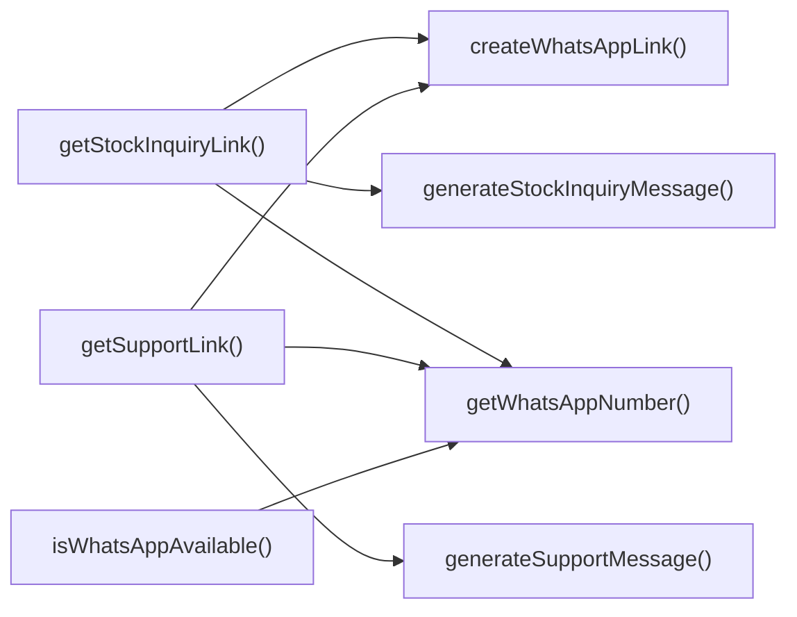

## Genel Bakış
Bu modül, VentHub HVAC projesinde WhatsApp üzerinden müşteri ve iç iletişim süreçlerini kolaylaştırmak için geliştirilmiş bir utility modülüdür. Tüm WhatsApp entegrasyonu ile ilgili işlevleri tek merkezde toplayarak, uygulama içinde tutarlı bir iletişim altyapısı sunar. Telefon numarası formatlama, senaryoya özel mesaj şablonları oluşturma ve tek tıkla kullanılabilir iletişim linkleri üretme gibi temel sorumlulukları üstlenir.

## Fonksiyon Grupları
### Temel WhatsApp Altyapı Fonksiyonları
WhatsApp hizmetinin kullanılabilirliğini kontrol eden, sistemdeki kayıtlı resmi WhatsApp numarasını çeken ve telefon numaralarını standart formata dönüştüren temel işlevleri barındırır.
- getWhatsAppNumber, isWhatsAppAvailable, formatPhoneNumber

### Mesaj Şablonu Üretici Fonksiyonları
Stok sorgulama, müşteri desteği, teknik teklif, SSS ve genel iletişim gibi farklı kullanım senaryolarına özel dinamik WhatsApp mesaj içerikleri üreten fonksiyonları içerir.
- generateStockInquiryMessage, generateSupportMessage, generateTechnicalQuoteMessage, generateFAQSupportMessage, generateContactMessage

### WhatsApp Link Üretici Fonksiyonları
Numara formatlama ve mesaj şablonu oluşturma işlevlerini birleştirerek, kullanıcıların doğrudan tıklayarak WhatsApp sohbetini açabileceği standart iletişim linkleri üretir. Hem genel amaçlı hem de senaryoya özel link üretici fonksiyonları barındırır.
- createWhatsAppLink, getStockInquiryLink, getSupportLink

---

## AXIOMS – Mimari Varsayımlar
Bu modül, WhatsApp iletişimi için telefon numarası formatlama, şablonlu mesaj üretme ve paylaşılabilir sohbet bağlantısı oluşturma işlemlerini gerçekleştirir, doğru çalışması için aşağıdaki koşulların varlığı zorunludur.

[Aksiyom 1]: Eğer çalışma zamanında cihazda veya sunucuda erişilebilir bir WhatsApp istemcisi/API erişimi yoksa, isWhatsAppAvailable() fonksiyonu doğru kullanılabilirlik durumunu döndüremez, tüm üretilen WhatsApp bağlantıları işlevsiz kalır.
[Aksiyom 2]: Eğer telefon numarası alan tüm fonksiyonlara (formatPhoneNumber, createWhatsAppLink vb.) iletilen string, geçerli bir telefon numarası desenine uymuyorsa, numara başarıyla formatlanamaz ve oluşturulan sohbet bağlantıları açılamaz.
[Aksiyom 3]: Eğer fonksiyon imzalarında zorunlu (opsiyonel olmayan) olarak tanımlanan phone, message, productName gibi parametreler ilgili fonksiyonlara iletilmezse, istenen mesaj veya bağlantı oluşturulamaz, çalışma zamanında hata meydana gelir.
[Aksiyom 4]: Eğer WhatsApp tarafından kullanılan resmi wa.me deep link standardı erişilemez olursa veya kullanım dışı kalırsa, createWhatsAppLink ve tüm get...Link prefixli fonksiyonlar tarafından üretilen bağlantılar çalışmaz.
[Aksiyom 5]: Eğer modül içinde önceden tanımlı sabit mesaj şablonları yoksa, sıfır veya sadece opsiyonel parametre alan generateFAQSupportMessage(), generateContactMessage() gibi fonksiyonlar geçerli bir ileti metni üretemez.
[Aksiyom 6]: Eğer opsiyonel parametre olarak tanımlanan sku, subject, projectInfo, name gibi ek bilgiler ilgili fonksiyonlara iletilmezse, üretilen mesajlarda ilgili detaylar eksik kalır, iletilerin içeriği yetersiz olur.

---

## FONKSIYON DETAYLARI

### getWhatsAppNumber
**Ne yapar**: Ortam değişkenlerinden WhatsApp telefon numarasını alır, temizler ve geçerliliğini kontrol eder. Eğer ortam değişkeni eksikse veya numara 10 haneden kısaysa null döndürür, kullanıma hazır sadece sayılardan oluşan bir numara sunar.
**Nasıl yapar**: Öncelikle ilgili ortam değişkenindeki ham numara değerini çeker, tüm sayısal olmayan karakterleri temizler. Sonra temizlenmiş numaranın uzunluğunu kontrol eder, 10 hane veya daha uzunsa geçerli sayarak ilgili değeri döndürür, aksi halde null döndürür.
**Parametreler**:
- Bu fonksiyon herhangi bir parametre almaz
**Dönüş**: string | null — Yalnızca sayılardan oluşan temizlenmiş geçerli telefon numarasını, eğer numara geçersiz veya mevcut değilse null değerini döndürür.

### formatPhoneNumber
**Ne yapar**: Ham olarak girilen herhangi bir formatta telefon numarasını WhatsApp kullanımı için uygun hale getirir, tüm sayısal olmayan karakterleri kaldırarak sadece rakamlardan oluşan bir string oluşturur.
**Nasıl yapar**: Gelen ham telefon numarası stringi üzerinden tüm sayı dışındaki karakterleri (+, parantez, tire, boşluk vb.) siler, sadece sayısal değerleri koruyarak WhatsApp entegrasyonu için uygun formatta bir string hazırlar.
**Parametreler**:
- phone: string — '+90 (555) 123-4567' gibi farklı formatlarda olabilen ham telefon numarası stringi
**Dönüş**: string — Tamamen sayılardan oluşan, WhatsApp kullanımına uygun telefon numarası temsilini döndürür.

### createWhatsAppLink
**Ne yapar**: Verilen hedef telefon numarası ve önceden doldurulacak mesaj ile tam formatlanmış wa.me WhatsApp API bağlantısı oluşturur, bu bağlantı tıklandığında doğrudan WhatsApp uygulaması veya web sürümünü açar.
**Nasıl yapar**: Gelen telefon numarası ve mesajı URL standartlarına uygun şekilde kodlar, wa.me domaini ile birleştirerek eksiksiz bir HTTPS URL'si oluşturur, mesajın sohbet açıldığında otomatik olarak metin alanına gelmesini sağlar.
**Parametreler**:
- phone: string — Mesaj gönderilecek hedef telefon numarası
- message: string — WhatsApp sohbetinde otomatik olarak doldurulacak ilk metin mesajı
**Dönüş**: string — WhatsApp'ı açmak için kullanılabilecek eksiksiz HTTPS URL'sini döndürür.

### generateStockInquiryMessage
**Ne yapar**: Ürün stok durumu hakkında soru sormak için standart, önceden doldurulmuş Türkçe bir mesaj oluşturur, isteğe bağlı olarak ürün SKU bilgisini de mesaja ekleyerek kişiselleştirilmiş bir metin sunar.
**Nasıl yapar**: Hazır şablonundaki Türkçe mesaja, gelen ürün adı ve varsa SKU bilgisini yerleştirerek kullanıcının herhangi bir ek düzenleme yapmasına gerek kalmadan doğrudan gönderebileceği bir stok sorgusu mesajı hazırlar.
**Parametreler**:
- productName: string — Stok durumu sorgulanacak ürünün adı
- sku?: string — İsteğe bağlı olarak ürünün Stok Takip Numarası (SKU) tanımlayıcısı
**Dönüş**: string — Stok durumu hakkında soru içeren formatlanmış Türkçe bir mesaj döndürür.

### generateSupportMessage
**Ne yapar**: Genel destek talebi başlatmak için formatlanmış Türkçe bir mesaj oluşturur, isteğe bağlı olarak destek talebinin konusunu mesaja ekleyerek kişiselleştirilmiş bir destek başlangıç metni sunar.
**Nasıl yapar**: Varsayılan selamlama ve yardım talebi şablonuna, eğer konu bilgisi girilmişse konu başlığını ekleyerek eksiksiz bir destek mesajı oluşturur, kullanıcının sohbeti başlatırken ek metin girmesine gerek kalmadan doğrudan göndermesini sağlar.
**Parametreler**:
- subject?: string — İsteğe bağlı olarak destek talebinin konusu veya konu hakkındaki detay
**Dönüş**: string — Destek görüşmesi başlatmak için formatlanmış Türkçe bir mesaj döndürür.

### generateTechnicalQuoteMessage
**Ne yapar**: Teknik teklif talebi göndermek için yapılandırılmış Türkçe bir mesaj oluşturur, isteğe bağlı olarak ilgili ürün ve proje detaylarını mesaja dahil ederek kapsamlı bir teklif talebi metni sunar.
**Nasıl yapar**: Teklif talebi için hazırlanmış şablon mesaja, girilmişse ürün adı ve proje kapsamı hakkındaki detayları ekleyerek kişiselleştirilmiş, tüm gerekli bilgileri içeren bir mesaj oluşturur.
**Parametreler**:
- productName?: string — İsteğe bağlı olarak ilgilenilen spesifik ürünün adı
- projectInfo?: string — İsteğe bağlı olarak projenin kapsamı hakkındaki detaylar
**Dönüş**: string — Teknik teklif talebi için formatlanmış Türkçe bir mesaj döndürür.

### generateFAQSupportMessage
**Ne yapar**: SSS (Sıkça Sorulan Sorular) sayfasında aradığı cevabı bulamayan kullanıcılar için standart Türkçe bir yardım talebi mesajı oluşturur, herhangi bir parametreye gerek duymadan sabit şablonunu doğrudan sunar.
**Nasıl yapar**: Önceden tanımlanmış sabit şablonundaki metni doğrudan döndürerek, kullanıcının herhangi bir ek bilgi girmesine gerek kalmadan doğrudan destek ekibine gönderebileceği bir mesaj sunar.
**Parametreler**:
- Bu fonksiyon herhangi bir parametre almaz
**Dönüş**: string — SSS bağlamında yardım talep eden standart Türkçe bir mesaj döndürür, örnek çıktısı "Merhaba! SSS sayfasında aradığım bilgiyi bulamadım. Bana yardımcı olabilir misiniz?" şeklindedir.

### generateContactMessage
**Ne yapar**: Genel iletişim talepleri için formatlanmış Türkçe bir mesaj oluşturur, isteğe bağlı olarak gönderenin adı ve talebin konusunu mesaja ekleyerek kişiselleştirilmiş bir iletişim başlangıç metni sunar.
**Nasıl yapar**: Genel iletişim için hazırlanmış şablon mesaja, girilmişse gönderenin adı ve talep konusunu ekleyerek kullanıcının doğrudan gönderebileceği eksiksiz bir iletişim mesajı oluşturur.
**Parametreler**:
- name?: string — İsteğe bağlı olarak mesajı gönderen kişinin adı
- subject?: string — İsteğe bağlı olarak sorgulamanın konusu
**Dönüş**: string — Genel iletişim başlatmak için uygun formatlanmış Türkçe bir mesaj döndürür.

### isWhatsAppAvailable
**Ne yapar**: Mevcut çalışma ortamında WhatsApp özelliğinin tam olarak yapılandırılmış ve kullanıma hazır olup olmadığını kontrol eder, sadece geçerli bir numara mevcutsa hizmetin kullanılabileceğini bildirir.
**Nasıl yapar**: İçinde getWhatsAppNumber fonksiyonunu çağırarak geçerli bir WhatsApp numarasının ortam değişkenlerinde mevcut olup olmadığını denetler, elde edilen sonuca göre boolean bir durum değeri döndürür.
**Parametreler**:
- Bu fonksiyon herhangi bir parametre almaz
**Dönüş**: boolean — Eğer ortam değişkenlerinde geçerli bir WhatsApp numarası mevcutsa true, aksi takdirde false değerini döndürür.

### getStockInquiryLink
**Ne yapar**: Belirli bir ürünün stok durumu sorgusu için özel olarak hazırlanmış eksiksiz bir WhatsApp URL'si oluşturur, eğer WhatsApp hizmeti mevcut ortamda yapılandırılmamışsa null döndürür.
**Nasıl yapar**: Önce WhatsApp'ın kullanılabilirliğini isWhatsAppAvailable fonksiyonu ile kontrol eder, geçerliyse generateStockInquiryMessage ile stok sorgusu mesajını oluşturur, son olarak createWhatsAppLink ile sistemdeki geçerli WhatsApp numarası kullanılarak tam URL'yi birleştirir. Herhangi bir aşamada geçersizlik durumunda null döndürür.
**Parametreler**:
- productName: string — Stok durumu sorgulanacak ürünün adı
- sku?: string — İsteğe bağlı olarak ürünün Stok Takip Numarası (SKU)
**Dönüş**: string | null — Tam olarak yapılandırılmış kullanılabilir WhatsApp URL'sini, eğer WhatsApp hizmeti yapılandırılmamışsa null değerini döndürür.

---

### getSupportLink
**Ne yapar**: WhatsApp üzerinden genel destek talepleri gönderilmek üzere kullanılacak tam, standartlara uygun bir WhatsApp URL'si oluşturan fonksiyondur. Sistemde WhatsApp servisi için gerekli konfigürasyonlar tanımlanmamışsa null döndürerek bağlantı açma gibi işlemlerde oluşabilecek hataları önler. İsteğe bağlı olarak gelen talep konusunu da URL içine entegre ederek kullanıcının destek talebini kolayca iletebilmesini sağlar.
**Nasıl yapar**: Öncelikle uygulama içindeki WhatsApp konfigürasyonunun geçerliliğini kontrol eder, eğer konfigürasyon eksik veya geçersizse hiç URL yapısı oluşturmadan direkt null değerini döndürür. Konfigürasyon geçerliyse opsiyonel olarak gönderilen subject parametresini URL güvenliği için encode ederek, standart WhatsApp tıklanabilir sohbet URL formatına uygun tam bir bağlantı oluşturur. Oluşturulan bu bağlantı, kullanıcıyı doğrudan destek ekibiyle WhatsApp sohbetine, önceden doldurulmuş talep konusuyla yönlendirir.
**Parametreler**:
- name: subject, type: string (opsiyonel) — Destek talebinin konusunu belirten metin, URL yapısına eklenerek WhatsApp sohbet ekranındaki mesaj kutusuna otomatik olarak yazılır. Herhangi bir konu belirtilmemesi durumunda boş bir mesaj kutusuyla yönlendirme gerçekleştirilir.
**Dönüş**: string | null — Uygulamada WhatsApp servisi doğru şekilde konfigüre edilmişse, tam olarak yapılandırılmış tıklanabilir WhatsApp URL'si döndürülür. Eğer WhatsApp konfigürasyonu eksik veya geçersizse herhangi bir URL yerine null değeri döndürülür. Kullanım örneğinde görüldüğü gibi null durumu kontrol edilerek pencere açma işlemleri güvenli bir şekilde gerçekleştirilebilir.

---

## AST POINTERS

### [N1_NASIL] AST Pointer: C:\Users\alize\venthub-hvac\src\utils\whatsapp.ts::getWhatsAppNumber
- **params**: (parametre yok)
- **ic_degiskenler**:
  - `envWa` — Ortam değişkeninden okunan WhatsApp numarası değişkeni
  - `raw` — envWa'nın geçerli string olması durumunda değerini, aksi halde boş string atanan ham numara değişkeni
  - `normalized` — raw'dan tüm rakam dışı karakterleri temizlenerek normalize edilmiş telefon numarası
- **Dönüş**: string | null

### [N2_NASIL] AST Pointer: C:\Users\alize\venthub-hvac\src\utils\whatsapp.ts::formatPhoneNumber
- **params**: (phone: string)
- **ic_degiskenler**: (yok)
- **Dönüş**: string

### [N3_NASIL] AST Pointer: C:\Users\alize\venthub-hvac\src\utils\whatsapp.ts::createWhatsAppLink
- **params**: (phone: string, message: string)
- **ic_degiskenler**: (yok)
- **Dış çağrılar**: `buildWhatsAppLink(phone, message)`
- **Dönüş**: string

### [N4_NASIL] AST Pointer: C:\Users\alize\venthub-hvac\src\utils\whatsapp.ts::generateStockInquiryMessage
- **params**: (productName: string, sku?: string)
- **ic_degiskenler**: (yok)
- **Dönüş**: string

### [N5_NASIL] AST Pointer: C:\Users\alize\venthub-hvac\src\utils\whatsapp.ts::generateSupportMessage
- **params**: (subject?: string)
- **ic_degiskenler**:
  - `baseMessage` - Konusuz durumda kullanılacak varsayılan destek mesajı metni
- **Dönüş**: string

### [N6_NASIL] AST Pointer: C:\Users\alize\venthub-hvac\src\utils\whatsapp.ts::generateTechnicalQuoteMessage
- **params**: (productName?: string, projectInfo?: string)
- **ic_degiskenler**:
  - `message` - Teknik teklif talebi mesajını biriktiren string değişkeni
- **Dönüş**: string

### [N7_NASIL] AST Pointer: C:\Users\alize\venthub-hvac\src\utils\whatsapp.ts::generateFAQSupportMessage
- **params**: (parametre yok)
- **ic_degiskenler**: (yok)
- **Dönüş**: string

### [N8_NASIL] AST Pointer: C:\Users\alize\venthub-hvac\src\utils\whatsapp.ts::generateContactMessage
- **params**: (name?: string, subject?: string)
- **ic_degiskenler**:
  - `message` - İletişim mesajını biriktiren string değişkeni
- **Dönüş**: string

### [N9_NASIL] AST Pointer: C:\Users\alize\venthub-hvac\src\utils\whatsapp.ts::isWhatsAppAvailable
- **params**: (parametre yok)
- **ic_degiskenler**: (yok)
- **İç çağrılar**: `getWhatsAppNumber()`
- **Dönüş**: boolean

### [N10_NASIL] AST Pointer: C:\Users\alize\venthub-hvac\src\utils\whatsapp.ts::getStockInquiryLink
- **params**: (productName: string, sku?: string)
- **ic_degiskenler**:
  - `phone` - getWhatsAppNumber() ile alınan geçerli WhatsApp numarası
  - `message` - generateStockInquiryMessage ile üretilen stok sorgu mesajı
- **İç çağrılar**: `getWhatsAppNumber()`, `generateStockInquiryMessage(productName, sku)`, `createWhatsAppLink(phone, message)`
- **Dönüş**: string | null

### [N11_NASIL] AST Pointer: C:\Users\alize\venthub-hvac\src\utils\whatsapp.ts::getSupportLink
- **params**: (subject?: string)
- **ic_degiskenler**:
  - `phone` - getWhatsAppNumber() ile alınan geçerli WhatsApp numarası
  - `message` - generateSupportMessage ile üretilen genel destek mesajı
- **İç çağrılar**: `getWhatsAppNumber()`, `generateSupportMessage(subject)`, `createWhatsAppLink(phone, message)`
- **Dönüş**: string | null

---

## ÇAĞRI HARİTASI

### Disariya Cagrilar (Outgoing)
getStockInquiryLink() stok sorgusu WhatsApp bağlantısı oluşturmak için createWhatsAppLink, getWhatsAppNumber ve generateStockInquiryMessage fonksiyonlarını çağırır. getSupportLink() destek talebi WhatsApp bağlantısı oluşturmak için createWhatsAppLink, getWhatsAppNumber ve generateSupportMessage fonksiyonlarını çağırır. isWhatsAppAvailable() WhatsApp'ın kullanılabilirliğini kontrol etmek için telefon numarası bilgisini çeken getWhatsAppNumber fonksiyonunu çağırır.

### Disaridan Cagrilanlar (Incoming)
Sağlanan veride bu modülü kullanan herhangi bir dış dosya veya fonksiyona dair bilgi bulunmamaktadır.

### Ic Ice Fonksiyonlar (Nested)
Yok

---

## DOSYA-İÇİ ÇAĞRI GRAFİĞİ
  getStockInquiryLink() → createWhatsAppLink()
  getStockInquiryLink() → generateStockInquiryMessage()
  getStockInquiryLink() → getWhatsAppNumber()
  getSupportLink() → createWhatsAppLink()
  getSupportLink() → generateSupportMessage()
  getSupportLink() → getWhatsAppNumber()
  isWhatsAppAvailable() → getWhatsAppNumber()

---

## NODE ID STANDARD

  file: src\utils\whatsapp.ts
  function: src\utils\whatsapp.ts::getWhatsAppNumber
  function: src\utils\whatsapp.ts::formatPhoneNumber
  function: src\utils\whatsapp.ts::createWhatsAppLink
  function: src\utils\whatsapp.ts::generateStockInquiryMessage
  function: src\utils\whatsapp.ts::generateSupportMessage
  function: src\utils\whatsapp.ts::generateTechnicalQuoteMessage
  function: src\utils\whatsapp.ts::generateFAQSupportMessage
  function: src\utils\whatsapp.ts::generateContactMessage
  function: src\utils\whatsapp.ts::isWhatsAppAvailable
  function: src\utils\whatsapp.ts::getStockInquiryLink
  function: src\utils\whatsapp.ts::getSupportLink

---

## DISA AKTARILANLAR (EXPORTS)
  export: createWhatsAppLink
  export: formatPhoneNumber
  export: generateContactMessage
  export: generateFAQSupportMessage
  export: generateStockInquiryMessage
  export: generateSupportMessage
  export: generateTechnicalQuoteMessage
  export: getStockInquiryLink
  export: getSupportLink
  export: getWhatsAppNumber
  export: isWhatsAppAvailable