## Genel Bakış
Bu modül, WhatsApp entegrasyonu için merkezi bir yardımcı katman sağlar. Farklı kullanım senaryoları (stok sorgusu, teknik destek, teklif isteme, genel iletişim) için önceden tanımlanmış mesajlar ve doğrudan WhatsApp'a yönlendiren linkler oluşturur. Ayrıca, telefon numarasını biçimlendirme ve WhatsApp'ın sistemde etkin olup olmadığını kontrol etme gibi temel işlevleri sunar.

## Fonksiyon Grupları
### Temel Yardımcı ve Durum Fonksiyonları
Modülün temel altyapısını oluşturan, genel amaçlı yardımcılar ve sistem durumunu kontrol eden fonksiyonlardır. Mesaj şablonlarına erişim, numara biçimi ve WhatsApp'ın varlığı bu grupta ele alınır.
- msg, getWhatsAppNumber, formatPhoneNumber, isWhatsAppAvailable

### Link Oluşturma Fonksiyonları
Belirli bir telefon numarası ve mesaj içeriğiyle doğrudan WhatsApp uygulamasını açacak olan URL'leri üretir. Bu fonksiyonlar, mesaj oluşturma fonksiyonlarının ürettiği metinleri kullanarak son kullanıcıya yönlendirme linki sağlar.
- createWhatsAppLink, getStockInquiryLink, getSupportLink

### Mesaj Oluşturma Fonksiyonları
Önceden tanımlanmış şablonları kullanarak, farklı iş senaryolarına özel (stok sorgusu, teknik destek, proje teklifi, sıkça sorulan sorular, genel iletişim) WhatsApp mesaj metinlerini oluşturur. Bu fonksiyonlar, `msg` fonksiyonunu çağırarak dil ve anahtar bazlı şablonları alır ve gerekli değişkenlerle doldurur.
- generateStockInquiryMessage, generateSupportMessage, generateTechnicalQuoteMessage, generateFAQSupportMessage, generateContactMessage

---

## AXIOMS – Mimari Varsayımlar

**[Aksiyom 1]**: Eğer `tr.whatsappMessages` yapısı (ve içinde `key` olarak kullanılacak alanlar) tanımlı değilse, `msg` fonksiyonu çalışamaz; tüm mesaj üretme fonksiyonları (`generateStockInquiryMessage`, `generateSupportMessage`, `generateTechnicalQuoteMessage`, `generateFAQSupportMessage`, `generateContactMessage`) da başarısız olur.

**[Aksiyom 2]**: Eğer `WhatsAppLang` tipi ve bu tipe karşılık gelen dil anahtarları (`tr.whatsappMessages` içinde) mevcut değilse, `msg` fonksiyonu istenen dili çözümleyemez; tüm mesaj üretme ve link oluşturma fonksiyonları hedef dilde çıktı veremez.

**[Aksiyom 3]**: `getWhatsAppNumber()` fonksiyonu `null` döndürebilir. Eğer WhatsApp numarası yapılandırılmamışsa (veya erişilemez durumdaysa), `isWhatsAppAvailable()` fonksiyonu `false` döndürür ve `getStockInquiryLink` ile `getSupportLink` fonksiyonları `null` döndürür; kullanıcıya WhatsApp linki sunulamaz.

**[Aksiyom 4]**: `createWhatsAppLink` fonksiyonuna `phone` ve `message` parametreleri zorunlu olarak iletilmelidir. Eğer bu parametrelerden biri eksik veya geçersiz formatta ise, geçerli bir WhatsApp yönlendirme linki üretilemez.

**[Aksiyom 5]**: `getStockInquiryLink` ve `getSupportLink` fonksiyonları `null` döndürebilir. Bu fonksiyonlar, `getWhatsAppNumber()` fonksiyonunun `null` döndürdüğü durumda (veya mesaj oluşturulamadığında) `null` dönecektir; çağrı yapan taraf bu `null` durumunu ele almalıdır.

**[Aksiyom 6]**: `generateStockInquiryMessage` fonksiyonunda `productName` parametresi zorunludur. Eğer `productName` sağlanmazsa, stok sorgu mesajı üretilemez.

**[Aksiyom 7]**: `formatPhoneNumber` fonksiyonuna iletilen `phone` parametresi zorunludur. Eğer geçerli bir telefon numarası sağlanmazsa, `createWhatsAppLink` ve dolayısıyla tüm link ü

---

## FONKSİYON DETAYLARI

### msg
**Ne yapar**: Belirtilen dile ve anahtara göre WhatsApp mesaj şablonunu döndürür. Şablondaki `{{değişken_adı}}` kalıplarını isteğe bağlı olarak verilen değerlerle değiştirir.

**Nasıl yapar**: İlk olarak `lang` parametresine göre uygun sözlük nesnesini (`en` veya `tr`) seçer. Seçilen sözlüğün `whatsappMessages` alanından `key` parametresine karşılık gelen değeri alır; böyle bir anahtar bulunamazsa anahtarın kendisini kullanır. Eğer `vars` parametresi verilmişse, `Object.entries` ile her bir anahtar-değer çiftini dolaşarak metin içindeki `{{anahtar}}` kalıplarını ilgili değerle değiştirir. Değiştirme işlemi `RegExp` ile global olarak yapılır, yani aynı kalıp metin içinde birden fazla geçiyorsa hepsi değiştirilir.

**Parametreler**:
- lang: `WhatsAppLang` — Mesajın hangi dilde döndürüleceğini belirtir. `'en'` veya `'tr'` değerlerinden birini alır.
- key: `keyof typeof tr.whatsappMessages` — `tr.whatsappMessages` nesnesinin tanımlı anahtarlarından biri olmalıdır. Hangi mesaj şablonunun kullanılacağını belirler.
- vars: `Record<string, string>` (isteğe bağlı) — Şablon içindeki `{{anahtar}}` yer tutucularını değiştirmek için kullanılacak anahtar-değer çiftlerini içerir.

**Dönüş**: `string` — Değişkenler yerleştirilmiş (veya yerleştirilmemiş) nihai mesaj metnini döndürür.

### getWhatsAppNumber
**Ne yapar**: Geliştirildi ancak detay üretilemedi.

### formatPhoneNumber
**Ne yapar**: Geliştirildi ancak detay üretilemedi.

### createWhatsAppLink
**Ne yapar**: Geliştirildi ancak detay üretilemedi.

### generateStockInquiryMessage
**Ne yapar**: Geliştirildi ancak detay üretilemedi.

### generateSupportMessage
**Ne yapar**: Geliştirildi ancak detay üretilemedi.

### generateTechnicalQuoteMessage
**Ne yapar**: Geliştirildi ancak detay üretilemedi.

### generateFAQSupportMessage
**Ne yapar**: Geliştirildi ancak detay üretilemedi.

### generateContactMessage
**Ne yapar**: Geliştirildi ancak detay üretilemedi.

### isWhatsAppAvailable
**Ne yapar**: Geliştirildi ancak detay üretilemedi.

### getStockInquiryLink
**Ne yapar**: Bir ürün için stok sorgusu amacıyla tam bir WhatsApp URL'si oluşturur. Ürün adı ve opsiyonel SKU bilgisini kullanarak, WhatsApp üzerinden stok durumu sormaya yönelik bir bağlantı üretir. WhatsApp yapılandırılmamışsa `null` döner.

**Nasıl yapar**: Önce `getWhatsAppNumber()` fonksiyonunu çağırarak WhatsApp telefon numarasını alır. Eğer telefon numarası yoksa (yani WhatsApp yapılandırılmamışsa) `null` döner ve işlemi sonlandırır. Telefon numarası mevcutsa, `generateStockInquiryMessage` fonksiyonunu kullanarak ürün adı, SKU ve dil parametreleriyle stok sorgu mesajını oluşturur. Ardından `createWhatsAppLink` fonksiyonuna telefon numarasını ve mesajı vererek tam WhatsApp URL'sini üretir ve döndürür.

**Parametreler**:
- productName: `string` — Stok sorgusu yapılacak ürünün adı.
- sku: `string` (opsiyonel) — Ürünün stok kodu (SKU). Belirtilmeyebilir.
- lang: `WhatsAppLang` — Mesajın oluşturulacağı dil. Varsayılan değeri `'tr'`dir.

**Dönüş**: `string | null` — Tam olarak oluşturulmuş WhatsApp URL'sini döndürür. WhatsApp yapılandırılmamışsa `null` döner.

### getSupportLink
**Ne yapar**: Geliştirildi ancak detay üretilemedi.

---

## İTHALATLAR (IMPORTS)
- import: ../i18n/dictionaries/en::en
- import: ../i18n/dictionaries/tr::tr
- import: ../lib/utils::buildWhatsAppLink

---

## TYPE ALIASES

### WhatsAppLang
WhatsApp mesaj metinleri SÖZLÜKTEN gelir (CLAUDE.md kural 7: kullanıcıya görünen metin sözlükte yaşar). Bu dosya `lib/services/*` DEĞİL, dolayısıyla sözlük importu DI kuralını (kural 2 — Supabase client enjeksiyonu) ilgilendirmez. `lang` parametresi tüm üreticilere OPSİYONEL eklendi ve varsayılanı `
```typescript
type WhatsAppLang = 'tr' | 'en'
```

---

## AST POINTERS

### [N1_NASIL] AST Pointer: src/utils/whatsapp.ts::msg
- **params**: `lang` (WhatsAppLang), `key` (keyof typeof tr.whatsappMessages), `vars?` (Record<string, string>)
- **ic_degiskenler**:
  - `dict` — lang değeri `'en'` ise `en` import'u, değilse `tr` import'u atanır; i18n sözlük seçimi
  - `table` — `dict.whatsappMessages` erişimi; seçilen dilin mesaj tablosu
  - `out` — `table[key]` değeri, bulunamazsa `key` kendisi atanır; placeholder değiştirme öncesi ham mesaj
  - `k` — `Object.entries(vars)` döngüsündeki anahtar; her bir placeholder adı
  - `v` — `Object.entries(vars)` döngüsündeki değer; placeholder yerine konacak metin
- **Dönüş**: string — `{{k}}` placeholder'ları `v` ile değiştirilmiş mesaj

### [N2_NASIL] AST Pointer: src/utils/whatsapp.ts::getWhatsAppNumber
- **params**: (parametre yok)
- **ic_degiskenler**:
  - `envWa` — `process.env.NEXT_PUBLIC_SHOP_WHATSAPP` erişimi; ortam değişkeninden WhatsApp numarası
  - `raw` — `envWa` string ise ve boşluklardan arındırılmış hali doluysa o değer, değilse boş string; normalize edilecek ham numara
  - `normalized` — `raw` üzerinde `[^\d]` regex ile rakam olmayan karakterlerin kaldırılması; saf rakam numara
- **Dönüş**: string | null — `normalized` uzunluğu 10 veya üzeriyse normalized, değilse null

### [N3_NASIL] AST Pointer: src/utils/whatsapp.ts::formatPhoneNumber
- **params**: `phone` (string)
- **ic_degiskenler**: (yok)
- **Dönüş**: string — `phone` üzerinde `[^\d]` regex ile rakam olmayan karakterlerin kaldırılması

### [N4_NASIL] AST Pointer: src/utils/whatsapp.ts::createWhatsAppLink
- **params**: `phone` (string), `message` (string)
- **ic_degiskenler**: (yok)
- **Dönüş**: string — `buildWhatsAppLink(phone, message)` çağrısının dönüşü

### [N5_NASIL] AST Pointer: src/utils/whatsapp.ts::generateStockInquiryMessage
- **params**: `productName` (string), `sku?` (string), `lang` (WhatsAppLang, varsayılan `'tr'`)
- **ic_degiskenler**: (yok)
- **Dönüş**: string — `sku` varsa `msg(lang, 'stockInquiryWithSku', { product: productName, sku })`, yoksa `msg(lang, 'stockInquiry', { product: productName })`

### [N6_NASIL] AST Pointer: src/utils/whatsapp.ts::generateSupportMessage
- **params**: `subject?` (string), `lang` (WhatsAppLang, varsayılan `'tr'`)
- **ic_degiskenler**:
  - `baseMessage` — `msg(lang, 'support')` çağrısının dönüşü; temel destek mesajı
- **Dönüş**: string — `subject` varsa `baseMessage` + boş satır + `msg(lang, 'subjectLine', { subject })`, yoksa `baseMessage`

### [N7_NASIL] AST Pointer: src/utils/whatsapp.ts::generateTechnicalQuoteMessage
- **params**: `productName?` (string), `projectInfo?` (string), `lang` (WhatsAppLang, varsayılan `'tr'`)
- **ic_degiskenler**:
  - `message` — `msg(lang, 'quoteIntro')` ile başlayan, koşullu olarak `productName` ve `projectInfo` eklenerek büyüyen mesaj string'i
- **Dönüş**: string — birleştirilmiş teklif mesajı; `productName` varsa `msg(lang, 'quoteProduct', { product: productName })` eklenir, `projectInfo` varsa `msg(lang, 'quoteProjectInfo', { info: projectInfo })` eklenir, yoksa `msg(lang, 'quoteAskProject')` eklenir

### [N8_NASIL] AST Pointer: src/utils/whatsapp.ts::generateFAQSupportMessage
- **params**: `lang` (WhatsAppLang, varsayılan `'tr'`)
- **ic_degiskenler**: (yok)
- **Dönüş**: string — `msg(lang, 'faqSupport')` çağrısının dönüşü

### [N9_NASIL] AST Pointer: src/utils/whatsapp.ts::generateContactMessage
- **params**: `name?` (string), `subject?` (string), `lang` (WhatsAppLang, varsayılan `'tr'`)
- **ic_degiskenler**:
  - `message` — `name` varsa `msg(lang, 'contactIntro', { name })`, yoksa `msg(lang, 'greeting')` ile başlayan; `subject` varsa `msg(lang, 'subjectLine', { subject })` eklenen; sonuna `msg(lang, 'contactHelp')` eklenen mesaj string'i
- **Dönüş**: string — birleştirilmiş iletişim mesajı

### [N10_NASIL] AST Pointer: src/utils/whatsapp.ts::isWhatsAppAvailable
- **params**: (parametre yok)
- **ic_degiskenler**: (yok)
- **Dönüş**: boolean — `getWhatsAppNumber()` çağrısının `null` olup olmadığı kontrolü; null değilse true

### [N11_NASIL] AST Pointer: src/utils/whatsapp.ts::getStockInquiryLink
- **params**: `productName` (string), `sku?` (string), `lang` (WhatsAppLang, varsayılan `'tr'`)
- **ic_degiskenler**:
  - `phone` — `getWhatsAppNumber()` çağrısının dönüşü; WhatsApp numarası veya null
  - `message` — `generateStockInquiryMessage(productName, sku, lang)` çağrısının dönüşü; stok sorgu mesajı
- **Dönüş**: string | null — `phone` null ise null, değilse `createWhatsAppLink(phone, message)` çağrısının dönüşü

### [N12_NASIL] AST Pointer: src/utils/whatsapp.ts::getSupportLink
- **params**: `subject?` (string), `lang` (WhatsAppLang, varsayılan `'tr'`)
- **ic_degiskenler**:
  - `phone` — `getWhatsAppNumber()` çağrısının dönüşü; WhatsApp numarası veya null
  - `message` — `generateSupportMessage(subject, lang)` çağrısının dönüşü; destek mesajı
- **Dönüş**: string | null — `phone` null ise null, değilse `createWhatsAppLink(phone, message)` çağrısının dönüşü

---


## MERMAID CALL GRAPH

```mermaid
graph TD
    whatsapp_ts__createWhatsAppLink["createWhatsAppLink"]
    whatsapp_ts__formatPhoneNumber["formatPhoneNumber"]
    whatsapp_ts__generateContactMessage["generateContactMessage"]
    whatsapp_ts__generateFAQSupportMessage["generateFAQSupportMessage"]
    whatsapp_ts__generateStockInquiryMessage["generateStockInquiryMessage"]
    whatsapp_ts__generateSupportMessage["generateSupportMessage"]
    whatsapp_ts__generateTechnicalQuoteMessage["generateTechnicalQuoteMessage"]
    whatsapp_ts__getStockInquiryLink["getStockInquiryLink"]
    whatsapp_ts__getSupportLink["getSupportLink"]
    whatsapp_ts__getWhatsAppNumber["getWhatsAppNumber"]
    whatsapp_ts__isWhatsAppAvailable["isWhatsAppAvailable"]
    whatsapp_ts__msg["msg"]
    whatsapp_ts__getSupportLink --> whatsapp_ts__createWhatsAppLink
    whatsapp_ts__generateTechnicalQuoteMessage --> whatsapp_ts__msg
    whatsapp_ts__getSupportLink --> whatsapp_ts__generateSupportMessage
    whatsapp_ts__generateFAQSupportMessage --> whatsapp_ts__msg
    whatsapp_ts__generateSupportMessage --> whatsapp_ts__msg
    whatsapp_ts__getStockInquiryLink --> whatsapp_ts__getWhatsAppNumber
    whatsapp_ts__getStockInquiryLink --> whatsapp_ts__createWhatsAppLink
    whatsapp_ts__generateStockInquiryMessage --> whatsapp_ts__msg
    whatsapp_ts__isWhatsAppAvailable --> whatsapp_ts__getWhatsAppNumber
    whatsapp_ts__generateContactMessage --> whatsapp_ts__msg
    whatsapp_ts__getSupportLink --> whatsapp_ts__getWhatsAppNumber
    whatsapp_ts__getStockInquiryLink --> whatsapp_ts__generateStockInquiryMessage
```


## NODE ID STANDARD

  file: whatsapp.ts
  function: whatsapp.ts::msg
  function: whatsapp.ts::getWhatsAppNumber
  function: whatsapp.ts::formatPhoneNumber
  function: whatsapp.ts::createWhatsAppLink
  function: whatsapp.ts::generateStockInquiryMessage
  function: whatsapp.ts::generateSupportMessage
  function: whatsapp.ts::generateTechnicalQuoteMessage
  function: whatsapp.ts::generateFAQSupportMessage
  function: whatsapp.ts::generateContactMessage
  function: whatsapp.ts::isWhatsAppAvailable
  function: whatsapp.ts::getStockInquiryLink
  function: whatsapp.ts::getSupportLink

---

## DISA AKTARILANLAR (EXPORTS)
  export: WhatsAppLang
  export: createWhatsAppLink
  export: formatPhoneNumber
  export: generateContactMessage
  export: generateFAQSupportMessage
  export: generateStockInquiryMessage
  export: generateSupportMessage
  export: generateTechnicalQuoteMessage
  export: getStockInquiryLink
  export: getSupportLink
  export: getWhatsAppNumber
  export: isWhatsAppAvailable
  export: msg