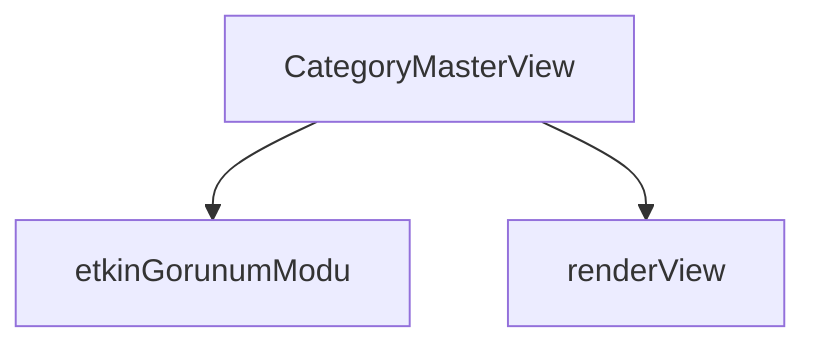

## Genel Bakış

CategoryMasterView, kategori yönetim ekranını görüntüleyen bir React bileşenidir. Bileşen, başlangıç kategorisi, aile listesi, toplam kayıt sayısı ve sayfalama bilgileri gibi proplar alarak ana görünümü oluşturur. Görünümün oluşturulması `renderView` fonksiyonu aracılığıyla gerçekleştirilir; görünüm modu seçimi ise `etkinGorunumModu` fonksiyonu ile belirlenir.

## Fonksiyon Grupları

### Bileşen ve Görünüm Yönetimi
Ana bileşenin tanımlanması ve görünümün render edilmesiyle ilgilenir. `CategoryMasterView` bileşeni dışarıdan aldığı proplarla yapılandırılır; `renderView` ise bileşenin kullanıcı arayüzünü oluşturan ve hangi alt görünümün çağrılacağına karar veren fonksiyondur.
- CategoryMasterView, renderView

### Görünüm Modu Belirleme
Görüntülenecek görünüm modunu belirler. `etkinGorunumModu`, verilen displayMode ve alt kategori sayısına göre hangi görünüm modunun (showcase, landing, series, grid) etkin olacağını hesaplayarak döndürür.
- etkinGorunumModu

---

## AXIOMS – Mimari Varsayımlar

Bu modül, kategori ana görünümünü oluşturmak için bileşen yapısı ve görünüm modu seçim mantığı içerir.

[Aksiyom 1]: Eğer `initialCategory` prop'u sağlanmazsa, bileşen kategori verisi olmadan çalışır ve beklenen görünüm oluşturulamaz.

[Aksiyom 2]: Eğer `etkinGorunumModu` fonksiyonu çağrılmazsa, hangi görünüm modunun (`'showcase'`, `'landing'`, `'series'`, `'grid'`) aktif olacağı belirlenemez.

[Aksiyom 3]: Eğer `displayMode` parametresi `'showcase'`, `'landing'`, `'series'` veya `'grid'` değerlerinden biri değilse, `etkinGorunumModu` fonksiyonu geçerli bir görünüm modu dönemez.

[Aksiyom 4]: Eğer `renderView` fonksiyonu çağrılmazsa, bileşenin kullanıcı arayüzü oluşturulamaz.

[Aksiyom 5]: Eğer modül sabitlerinde tanımlı görünüm bileşenlerinden (`CategoryGridView`, `CategoryLandingView`, `CategorySeriesView`, `CategoryShowcaseView`, `ProductsDiscoveryView`) biri mevcut değilse, ilgili görünüm modu render edilemez.

[Aksiyom 6]: Eğer `families` prop'u sağlanmazsa, varsayılan olarak boş dizi (`[]`) kullanılır; aile listesi olmadan kategori yapısı eksik kalır.

[Aksiyom 7]: Eğer `total` prop'u sağlanmazsa, varsayılan olarak `0` kullanılır; toplam kayıt sayısı bilinmez.

[Aksiyom 8]: Eğer `page` prop'u sağlanmazsa, varsayılan olarak `1` kullanılır; sayfalama birinci sayfadan başlar.

[Aksiyom 9]: Eğer `pageSize` prop'u sağlanmazsa, varsayılan değer bilinmiyor; sayfalama boyutu belirsiz kalır.

---

## FONKSİYON DETAYLARI

### etkinGorunumModu
**Ne yapar**: Görünüm modunun yürürlükteki hâlini belirler. Veritabanında tanımlı `display_mode` değeri ne olursa olsun, veri yapısı o modu destekleyemiyorsa modu düşürerek geçerli bir alternatife çevirir. Bu fonksiyon, görünüm modunun saf hâlini değil, uygulanabilir gerçek hâlini döndürür.

**Nasıl yapar**: Gelen `displayMode` parametresini kontrol eder. Eğer mod `'showcase'` olarak belirlenmiş ancak `altKategoriSayisi` 1'den küçük (yani 0) ise, showcase modu geçersiz sayılır ve `'series'` moduna düşülür. Bunun nedeni docstring'te açıklanmıştır: `CategoryShowcaseView` yalnızca `subCategories` verisini alır, `families` verisini almaz ve showcase modunda sayfalama kapalıdır. Dolayısıyla alt kategorisi olmayan bir kategori showcase modunda düzgün görüntülenemez. Diğer tüm durumlarda gelen `displayMode` değeri aynen döndürülür.

**Parametreler**:
- `displayMode`: `'showcase' | 'landing' | 'series' | 'grid` — Veritabanında tanımlı olan görünüm modu değeri. Dört olası moddan biri olabilir.
- `altKategoriSayisi`: `number` — İlgili kategorinin sahip olduğu alt kategori sayısı. Showcase modunun geçerliliğini bu değer belirler.

**Dönüş**: `'showcase' | 'landing' | 'series' | 'grid` — Yürürlükteki (etkin) görünüm modu. Girdi olarak verilen mod geçerliyse aynen döner; showcase modu alt kategori eksikliğinden dolayı geçersizse `'series'` olarak döner.

### CategoryMasterView
**Ne yapar**: Kategori yönetim ekranını görüntüleyen bir React bileşenidir. Kategori verilerini, aile listesini, sayfalama bilgilerini ve başlangıç kategori değerini alarak ilgili arayüzü render eder.

**Nasıl yapar**: Bileşen, aldığı props değerlerini kullanarak kategori master görünümünü oluşturur. `families` parametresine varsayılan olarak boş dizi, `total` ve `page` parametrelerine sırasıyla 0 ve 1 varsayılan değerleri atanmıştır. Bileşen `React.FC<CategoryMasterViewProps>` tipinde bir fonksiyonel bileşen olarak tanımlanmıştır.

**Parametreler**:
- initialCategory: bilinmiyor — Başlangıçta görüntülenecek kategori verisi. Tip bilgisi kaynakta belirtilmemiştir.
- families: bilinmiyor (varsayılan: []) — Kategorilere ait aile listesi. Varsayılan değeri boş dizidir. Tip bilgisi kaynakta belirtilmemiştir.
- total: bilinmiyor (varsayılan: 0) — Toplam kayıt sayısı. Varsayılan değeri 0'dır. Tip bilgisi kaynakta belirtilmemiştir.
- page: bilinmiyor (varsayılan: 1) — Mevcut sayfa numarası. Varsayılan değeri 1'dir. Tip bilgisi kaynakta belirtilmemiştir.
- pageSize: bilinmiyor — Sayfa başına gösterilecek kayıt sayısı. Varsayılan değeri kaynakta kesilmiş olup bilinmemektedir. Tip bilgisi kaynakta belirtilmemiştir.

**Dönüş**: `React.FC<CategoryMasterViewProps>` — `CategoryMasterViewProps` tipinde props alan bir React fonksiyonel bileşeni döndürür.

### renderView
**Ne yapar**: Geliştirildi ancak detay üretilemedi.

---

## İTHALATLAR (IMPORTS)
- import: ../components/ui/Pagination::Pagination
- import: ../hooks/useCategoryGateway::useCategoryGateway
- import: ../hooks/useCategoryViewModel::useCategoryViewModel
- import: ../i18n/I18nProvider::useI18n
- import: ../i18n/sort::compareText
- import: ../lib/type-converters::type { DomainCategory }
- import: ../types/ui-models::type { FamilyListItem }
- import: next/dynamic::dynamic
- import: react::React
- import: react::useMemo

---

## INTERFACES

### CategoryMasterViewProps
- `initialCategory?: DomainCategory | null`
- `families?: FamilyListItem[]`
- `total?: number`
- `page?: number`
- `pageSize?: number`
- `initialSubCategories?: DomainCategory[]`

---

## SABİTLER
- **CategoryGridView** (call) — `dynamic(() => import('./category/CategoryGridView'))`
- **CategoryLandingView** (call) — `dynamic(() => import('./category/CategoryLandingView'))`
- **CategorySeriesView** (call) — `dynamic(() => import('./category/CategorySeriesView'))`
- **CategoryShowcaseView** (call) — `dynamic(() => import('./category/CategoryShowcaseView'))`
- **ProductsDiscoveryView** (call) — `dynamic(() => import('./ProductsDiscoveryView'))`

---

## AST POINTERS

### [N1_NASIL] AST Pointer: src/views/CategoryMasterView.tsx::etkinGorunumModu
- **params**: `displayMode` — 'showcase' | 'landing' | 'series' | 'grid' türünde görünüm modu; `altKategoriSayisi` — alt kategori sayısı (number)
- **ic_degiskenler**: yok
- **Dönüş**: 'showcase' | 'landing' | 'series' | 'grid' — eğer displayMode 'showcase' ise ve altKategoriSayisi 1'den küçükse 'series', aksi halde displayMode aynen döner

### [N2_NASIL] AST Pointer: src/views/CategoryMasterView.tsx::CategoryMasterView
- **params**: `initialCategory` — başlangıç kategori verisi; `families` — aile listesi (varsayılan `[]`); `total` — toplam kayıt sayısı (varsayılan `0`); `page` — mevcut sayfa numarası (varsayılan `1`); `pageSize` — sayfa başına kayıt sayısı (varsayılan `24`); `initialSubCategories` — başlangıç alt kategorileri
- **ic_degiskenler**:
  - `lang` — `useI18n()` hook'undan gelen aktif dil kodu
  - `rawCategory` — `useCategoryGateway()` hook'undan dönen ham kategori verisi
  - `rawParentCategory` — `useCategoryGateway()` hook'undan dönen ham üst kategori verisi
  - `rawSubCategories` — `useCategoryGateway()` hook'undan dönen ham alt kategoriler dizisi
  - `loading` — `useCategoryGateway()` hook'undan dönen yükleme durumu (boolean)
  - `filters` — `useCategoryGateway()` hook'undan dönen filtre durumu objesi (`catSearch`, `selectedBrands`, `sortBy` alanlarını içerir)
  - `updateFilters` — `useCategoryGateway()` hook'undan dönen filtre güncelleme fonksiyonu
  - `wrapCategory` — `useCategoryViewModel()` hook'undan dönen kategori sarma fonksiyonu
  - `category` — `useMemo` ile `wrapCategory(rawCategory)` çağrılarak elde edilen sarılmış kategori; `rawCategory` veya `wrapCategory` değiştiğinde yeniden hesaplanır
  - `parentCategory` — `useMemo` ile `wrapCategory(rawParentCategory)` çağrılarak elde edilen sarılmış üst kategori; `rawParentCategory` veya `wrapCategory` değiştiğinde yeniden hesaplanır
  - `availableBrands` — `useMemo` ile `families` dizisinden çıkarılan benzersiz `brand_name` değerlerinden oluşan string dizisi; `families` değiştiğinde yeniden hesaplanır
  - `visibleFamilies` — `useMemo` ile `families` üzerinde `filters` ve `lang` kullanılarak filtrelenmiş ve sıralanmış aile listesi; `families`, `filters` veya `lang` değiştiğinde yeniden hesaplanır
  - `pagination` — `<Pagination>` bileşenini içeren JSX; `page`, `pageSize` ve `total` props'larını alır
  - `etkinMod` — `category` varsa `etkinGorunumModu(category.displayMode, rawSubCategories?.length ?? 0)` çağrısının sonucu, yoksa `null`
  - `renderView` — hangi alt görünüm bileşeninin render edileceğini seçen inner fonksiyon
- **Dönüş**: JSX elementi — kategori bulunamadığında `ProductsDiscoveryView`, aksi halde `renderView()` sonucu ve `pagination`'ı içeren `
` yapısı

### [N3_NASIL] AST Pointer: src/views/CategoryMasterView.tsx::renderView
- **params**: yok
- **ic_degiskenler**: yok — dış scope'daki `category`, `etkinMod`, `rawSubCategories`, `parentCategory`, `visibleFamilies`, `availableBrands`, `filters`, `updateFilters`, `loading` değişkenlerini kullanır
- **Dönüş**: JSX elementi veya `null` — `category` yoksa `null`; `etkinMod` değerine göre `CategoryShowcaseView`, `CategoryLandingView`, `CategorySeriesView` veya `CategoryGridView` bileşenlerinden birini döner. `default` dalda önce `category.parentId` kontrolü yapılır, ardından `rawSubCategories` varlığına bakılır, en son `CategoryGridView` kullanılır

### [N4_NASIL] AST Pointer: src/views/CategoryMasterView.tsx::visibleFamilies (useMemo callback)
- **params**: yok
- **ic_degiskenler**:
  - `query` — `filters.catSearch` değerinin `trim()` ve `toLocaleLowerCase()` uygulanmış hali; arama filtresi olarak kullanılır
  - `list` — `families` dizisi; `query` varsa `f.name`, `f.brand_name` ve `f.series_code` alanlarında arama yapılarak filtrelenir; `filters.selectedBrands` doluysa `f.brand_name` üzerinden marka filtresi uygulanır
  - `sorted` — `list` dizisinin kopyası (`[...list]`); `filters.sortBy` 'variants' ise `b.variant_count - a.variant_count` ile azalan sıralanır, aksi halde `compareText(a.name, b.name, lang)` ile metin karşılaştırmalı sıralanır
- **Dönüş**: `FamilyListItem[]` — filtrelenmiş ve sıralanmış aile listesi

### [N5_NASIL] AST Pointer: src/views/CategoryMasterView.tsx::visibleFamilies filter callback (f => ...)
- **params**: `f` — tek bir `FamilyListItem` öğesi
- **ic_degiskenler**: yok — dış scope'daki `query` değişkenini kullanır
- **Dönüş**: boolean — `f.name`'in `toLocaleLowerCase()` sonucu `query`'yi içeriyorsa VEYA `f.brand_name` (null ise boş string) `query`'yi içeriyorsa VEYA `f.series_code` (null ise boş string) `query`'yi içeriyorsa `true`

---

## MERMAID CALL GRAPH

## NODE ID STANDARD

  file: src\views\CategoryMasterView.tsx
  function: src\views\CategoryMasterView.tsx::etkinGorunumModu
  function: src\views\CategoryMasterView.tsx::CategoryMasterView
  function: src\views\CategoryMasterView.tsx::renderView

---

## DISA AKTARILANLAR (EXPORTS)
  export: CategoryMasterView
  export: etkinGorunumModu

---

## STİL TOKENLERİ

### Arbitrary Değerler (token'a geçirilmemiş)
Yok — tüm stiller token'a geçirilmiş. ✅

### Kullanılan Token'lar (zaten token'a geçirilmiş)
- (yok)

### Tailwind Sınıf Özeti
- **Renkler:** `bg-white`, `border-b-2`, `border-primary-navy`
- **Layout:** `flex`, `h-8`, `items-center`, `justify-center`, `min-h-screen`, `w-8`
- **Varyant/Responsive:** (yok)
- **Yardımcı Sınıflar:** `animate-spin`, `py-10`, `rounded-full`