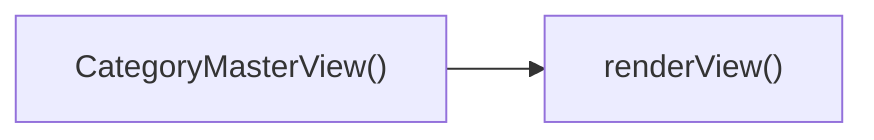

## Genel Bakış
src/views/CategoryMasterView.tsx modülü, VentHub HVAC platformunun ürün ve kategori yönetimi için tasarlanmış ana React görünüm bileşenidir. Dışarıdan aktarılan başlangıç ana kategori, ürün ve alt kategori verilerini alarak kategori yönetimi arayüzünü oluşturur, kullanıcıların içerikleri ana kategoriler üzerinden yönetmesine olanak tanır.

## Fonksiyon Grupları
### Bileşen Giriş ve Başlatma
Modülün ana giriş noktası olarak çalışan, dışarıdan gelen başlangıç verilerini alarak kategori yönetimi görünümünü başlatan temel fonksiyonu içerir.
- CategoryMasterView

### Görünüm Oluşturma
Bileşenin kullanıcıya sunulacak görsel arayüzünü hazırlamak ve ekrana sunmak için sorumlu olan, ana bileşen tarafından çağrılan yardımcı işlevi barındırır.
- renderView

---

## AXIOMS – Mimari Varsayımlar
Bu React görünüm bileşeni, kategori yönetimi ana ekranını kullanıcıya sunmak için aldığı tüm başlangıç veri prop'larının geçerli olarak iletilmesini ve yerleşik render metodunun yaşam döngüsünde doğru tetiklenmesini zorunlu kılar.

[Aksiyom 1]: Eğer CategoryMasterView bileşenine initialCategory prop'u iletilmezse, temel ana kategori verileri gösterilemez, görünümün ana içeriği boş kalır.
[Aksiyom 2]: Eğer CategoryMasterView bileşenine initialProducts prop'u iletilmezse, kategoriye bağlı ürün listesi görüntülenemez, ürünler bölümünde hiç içerik kullanıcıya sunulamaz.
[Aksiyom 3]: Eğer CategoryMasterView bileşenine initialSubCategories prop'u iletilmezse, ana kategoriye bağlı alt kategori hiyerarşisi oluşturulamaz, alt kategori navigasyonu çalışmaz.
[Aksiyom 4]: Eğer renderView() metodu bileşenin yaşam döngüsünde hiç tetiklenmezse, tüm görünüm kullanıcıya yüklenmez, ilgili kategori yönetimi sayfası erişilemez olur.

---

## FONKSIYON DETAYLARI

### CategoryMasterView
**Ne yapar**: VentHub HVAC projesinde kategori yönetimi işlemlerinin gerçekleştirildiği ana görünüm bileşenidir. Kategoriler, alt kategoriler ve ilgili ürünlerin yönetildiği arayüzün temelini oluşturur, projenin src/views dizininde yer alan CategoryMasterView.tsx dosyasında tanımlanan ana React bileşenidir. Kategori hiyerarşisinin görüntülenmesi ve yönetilmesi için gerekli tüm başlangıç verilerini prop olarak alarak görünümü hazırlar.
**Nasıl yapar**: Gelen başlangıç verilerini prop aracılığıyla alır, bu verileri React bileşeninin iç yapısında kullanıma sunar. Tanımında React.FC türünde dönüş sağladığı için ilgili kullanıcı arayüzünü JSX formatında oluşturur, gelen initial değerleri bileşen ömrü boyunca kullanılacak temel veri kaynağı olarak entegre eder. Kategori yönetimi arayüzünün tüm işlevlerinin çalışabileceği bir ortam oluşturmak için gerekli state ve altyapıyı bu başlangıç verileri üzerinden yapılandırır.
**Parametreler**:
- initialCategory: bilinmeyen tür — Görünümün yüklendiği anda temel alınacak ana kategori verisini içerir, kategori yönetimi işlemlerinin başlangıç noktası olan kategori nesnesini sağlar.
- initialProducts: bilinmeyen tür — İlgili kategoriye ait tüm ürünlerin başlangıç listesi verisini içerir, görünümde kullanıcının erişebileceği ürünlerin ilk yüklemesini gerçekleştirir.
- initialSubCategories: bilinmeyen tür — Ana kategoriye bağlı tüm alt kategorilerin başlangıç listesi verisini içerir, kategori hiyerarşisinin doğru bir şekilde görüntülenmesi için gerekli alt kategori verilerini sağlar.
**Dönüş**: React.FC<CategoryMasterViewProps> türünde bir React fonksiyonel bileşeni döndürür, bu bileşen kategori yönetimi arayüzünü tarayıcıda ekrana render eder.

### renderView
**Ne yapar**: CategoryMasterView ana bileşeninin içindeki görünüm içeriğini oluşturan yardımcı bir fonksiyondur. Ana bileşenin sahip olduğu kategori, alt kategori ve ürün verilerini kullanarak kullanıcıya sunulacak kullanıcı arayüzü öğelerini bir araya getirir, ana bileşenin render mantığını ayrıştırarak daha düzenli bir kod yapısı sağlar.
**Nasıl yapar**: İçinde bulunduğu CategoryMasterView bileşeninin erişebildiği tüm prop ve state verilerine erişerek gerekli UI öğelerini oluşturur, ilgili alt bileşenleri çağırarak ana görünümün tam içeriğini ortaya çıkarır. Hiçbir harici parametre almadığı için yalnızca ait olduğu ana bileşenin verilerini kullanarak çalışır, yalnızca görünümün render edilmesi işlevini yerine getirir.
**Parametreler**: Herhangi bir giriş parametresi almamaktadır.
**Dönüş**: Tanımında belirtilen şekilde dönüş tipi tanımsızdır, herhangi bir değer döndürmez, yalnızca ilgili görünüm içeriğini ekrana render eder.

---

## INTERFACES

### CategoryMasterViewProps
- `initialCategory?: DomainCategory | null`
- `initialProducts?: DomainProduct[]`
- `initialSubCategories?: DomainCategory[]`

---

## AST POINTERS

### [N1_NASIL] AST Pointer: C:\Users\alize\venthub-hvac\src\views\CategoryMasterView.tsx::CategoryMasterView
- **params**: initialCategory, initialProducts, initialSubCategories
- **ic_degiskenler**:
  - `rawCategory` — useCategoryGateway'den dönen, işlenmemiş ham kategori verisi
  - `rawParentCategory` — useCategoryGateway'den dönen, işlenmemiş ham üst kategori verisi
  - `rawSubCategories` — useCategoryGateway'den dönen, işlenmemiş ham alt kategori listesi
  - `products` — useCategoryGateway'den gelen kategoriye ait ürün listesi
  - `loading` — useCategoryGateway'den gelen veri yükleme durumu bayrağı
  - `filters` — useCategoryGateway'den gelen ürün filtreleri nesnesi
  - `updateFilters` — useCategoryGateway'den gelen filtreleri güncellemek için kullanılan callback fonksiyonu
  - `wrapCategory` — useCategoryViewModel'den alınan, ham kategori verisini UI için uygun formata sarmalayan fonksiyon
  - `category` — useMemo ile wrapCategory kullanılarak işlenmiş, UI için hazırlanmış kategori nesnesi
  - `parentCategory` — useMemo ile wrapCategory kullanılarak işlenmiş, UI için hazırlanmış üst kategori nesnesi
  - `availableBrands` — ürün listesinden çıkarılan benzersiz geçerli marka listesi, filtreleme için kullanılır
  - `renderView` - kategori özelliklerine göre uygun görünüm bileşenini döndürmek için tanımlanan iç fonksiyon
- **Dönüş**: Ana kapsayıcı div ve içerisine çağrılan renderView() fonksiyonunun döndürdüğü JSX elementi

### [N2_NASIL] AST Pointer: C:\Users\alize\venthub-hvac\src\views\CategoryMasterView.tsx::renderView
- **params**: (parametre yok)
- **ic_degiskenler**:
  - `category` — Üst fonksiyonda işlenmiş UI için hazır kategori nesnesi, displayMode ve parentId değerleri okunur
  - `rawSubCategories` — Üst fonksiyondan gelen ham alt kategori listesi, Landing ve Showcase görünümlerine aktarılır
  - `parentCategory` — Üst fonksiyonda işlenmiş üst kategori nesnesi, Series ve Grid görünümlerine aktarılır
  - `products` — Üst fonksiyondan gelen ürün listesi, tüm görünüm bileşenlerine aktarılır
  - `availableBrands` — Üst fonksiyonda çıkarılan benzersiz marka listesi, Grid görünümüne filtreleme için aktarılır
  - `filters` — Üst fonksiyondan gelen filtre nesnesi, Grid görünümüne aktarılır
  - `updateFilters` — Üst fonksiyondan gelen filtre güncelleme callback'i, Grid görünümüne aktarılır
  - `loading` — Üst fonksiyondan gelen yükleme durumu bayrağı, Grid görünümüne aktarılır
- **Dönüş**: Kategori özelliklerine göre seçilen ilgili görünüm bileşeninin JSX elementi, kategori yoksa null döner

---

## ÇAĞRI HARİTASI

### Disariya Cagrilar (Outgoing)
Bu dosyadaki CategoryMasterView() fonksiyonu, ilgili görünümü işlemek için dosya içindeki renderView fonksiyonunu çağırır.

### Disaridan Cagrilanlar (Incoming)
Verilen çağrı verisinde bu modülü kullanan herhangi bir dış dosya veya fonksiyon belirtilmemiştir.

### Ic Ice Fonksiyonlar (Nested)
Yok

---

## DOSYA-İÇİ ÇAĞRI GRAFİĞİ
  CategoryMasterView() → renderView()

---

## NODE ID STANDARD

  file: src\views\CategoryMasterView.tsx
  function: src\views\CategoryMasterView.tsx::CategoryMasterView
  function: src\views\CategoryMasterView.tsx::renderView

---

## DISA AKTARILANLAR (EXPORTS)
  export: CategoryMasterView