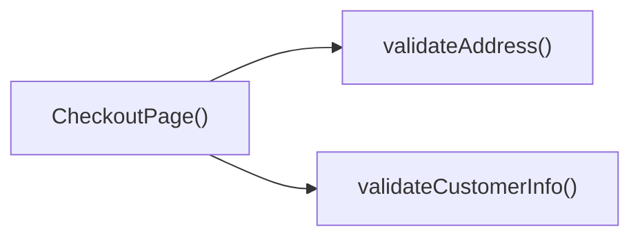

## Genel Bakış
`CheckoutPage` modülü, VentHub HVAC uygulamasının sipariş tamamlama ekranını sağlayan ana React bileşenidir. Kullanıcıdan alınan müşteri ve teslimat bilgilerini doğrular, adım‑adım ilerleme mantığını yönetir ve sonraki adıma geçişi tetikler.

## Fonksiyon Grupları
### Bileşen Girişi
Bileşenin kendisini tanımlar, UI’yı render eder ve tüm alt fonksiyonların yaşam döngüsünü koordine eder.  
- CheckoutPage

### Veri Seçimi ve İşleme
Kullanıcı tarafından seçilen fatura profili gibi verileri alır, ilgili durumu günceller ve diğer fonksiyonların kullanımı için hazır hâle getirir.  
- handleSelectInvoiceProfile

### Girdi Doğrulama
Müşteri bilgileri ve teslimat adresi gibi kritik alanların geçerliliğini kontrol eder; hatalı girişlerde kullanıcıyı uyararak sürecin ilerlemesini engeller.  
- validateCustomerInfo, validateAddress

### Süreç Kontrolü
Tüm doğrulamalar başarılı olduğunda bir sonraki adımın başlatılmasını sağlar; asenkron işlem olduğu için API çağrıları ve yanıt yönetimini de içerir.  
- handleNextStep

---

## AXIOMS – Mimari Varsayımlar
Bu modül için özel aksiyom tanımlanmamıştır.

---

## FONKSIYON DETAYLARI

### CheckoutPage
**Ne yapar**: Bu fonksiyon, ödeme sayfası (checkout page) React bileşenini tanımlar. Sayfanın tüm alt bileşenlerini (adres formu, fatura profili seçimi, ödeme adımları vb.) bir araya getirerek kullanıcıya sunar ve adım adım ilerleyen bir ödeme akışını yönetir.
**Nasıl yapar**: İçerisinde `useState` ve gerekli durum yönetimi hook’larını kullanarak mevcut adımı, müşteri bilgilerini, seçilen fatura profilini ve adres bilgilerini tutar. Her adım için ilgili form bileşenlerini koşullu olarak render eder ve adımlar arası geçişleri `handleNextStep` gibi fonksiyonlarla kontrol eder.
**Parametreler**: Parametre almaz.
**Dönüş**: `React.FC` tipinde bir fonksiyonel bileşen döndürür. Bu bileşen JSX elemanı olarak ödeme sayfasının tamamını render eder.

### handleSelectInvoiceProfile
**Ne yapar**: Kullanıcının fatura profili seçimini işler. Seçilen profili bileşenin durumuna kaydederek sonraki adımlarda kullanılmak üzere hazır hale getirir.
**Nasıl yapar**: Parametre olarak gelen `InvoiceProfile` nesnesini alır ve ilgili state güncelleme fonksiyonunu çağırarak seçili profil bilgisini günceller. Genellikle bir dropdown veya listeden seçim yapıldığında tetiklenir.
**Parametreler**:
- `p: InvoiceProfile` — Seçilen fatura profilini temsil eden nesne. Fatura adı, adresi, vergi bilgileri gibi alanları içerir.
**Dönüş**: `void` — Herhangi bir değer döndürmez; yan etki olarak bileşen durumunu günceller.

### validateCustomerInfo
**Ne yapar**: Müşteri bilgilerinin (ad, soyad, e-posta, telefon vb.) geçerliliğini kontrol eder. Formdaki alanların boş veya hatalı olup olmadığını denetler.
**Nasıl yapar**: Genellikle form alanlarının değerlerini bir doğrulama kuralları seti ile karşılaştırır. Eksik veya hatalı alanlar varsa ilgili hata mesajlarını state’e kaydeder. Doğrulama sonucuna göre kullanıcıya geri bildirim sağlar.
**Parametreler**: Parametre almaz; bileşen içindeki müşteri bilgisi state’ini okur.
**Dönüş**: `void` — Doğrudan bir değer döndürmez; doğrulama sonuçlarını hata mesajı state’inde saklar.

### validateAddress
**Ne yapar**: Verilen adres bilgilerinin (sokak, şehir, posta kodu, ülke) doğruluğunu ve eksiksizliğini kontrol eder.
**Nasıl yapar**: Parametre olarak aldığı `CheckoutAddressInfo` nesnesindeki alanları önceden tanımlanmış kurallara göre inceler. Zorunlu alanların doldurulup doldurulmadığını, format uygunluğunu (örneğin posta kodu) test eder. Geçersiz alanlar varsa hata listesi oluşturur.
**Parametreler**:
- `address: CheckoutAddressInfo` — Doğrulanacak adres bilgilerini içeren nesne. Adres satırı, şehir, eyalet/bölge, posta kodu ve ülke gibi alanlardan oluşur.
**Dönüş**: `void` — Geriye değer döndürmez; doğrulama sonucuna göre hata durumunu günceller.

### handleNextStep
**Ne yapar**: Ödeme akışında bir sonraki adıma geçiş işlemini gerçekleştirir. Mevcut adımın doğrulamalarını tetikleyerek geçişin uygun olup olmadığını denetler.
**Nasıl yapar**: Öncelikle bulunulan adıma ait doğrulama fonksiyonlarını (örneğin `validateCustomerInfo`, `validateAddress`) çağırır. Doğrulama başarılıysa adım sayacını artırarak bir sonraki adımın render edilmesini sağlar. Aksi halde kullanıcıyı hataları düzeltmeye yönlendirir.
**Parametreler**: Parametre almaz; mevcut adım durumunu ve ilgili state’leri kullanır.
**Dönüş**: `void` — Herhangi bir değer döndürmez; adım durumunu güncelleyerek bileşenin yeniden render edilmesine neden olur.

---

## AST POINTERS

### [N1_NASIL] AST Pointer: C:\Users\alize\venthub-hvac\src\views\CheckoutPage.tsx::CheckoutPage
- **params**: (parametre yok)
- **ic_degiskenler**:
  - `items` — useCart hook'undan alınan sepetteki ürün listesi
  - `getCartTotal` — useCart hook'undan alınan sepet toplamını hesaplayan fonksiyon
  - `clearCart` — useCart hook'undan alınan sepeti temizleyen fonksiyon
  - `applyServerPricing` — useCart hook'undan alınan sunucu tarafı fiyatlandırma uygulayan fonksiyon
  - `user` — useAuth hook'undan alınan oturum açmış kullanıcı nesnesi
  - `authLoading` — useAuth hook'undan alınan kimlik doğrulama yükleme durumu
  - `router` — Next.js useRouter hook'undan alınan yönlendirme nesnesi
  - `t` — useI18n hook'undan alınan çeviri fonksiyonu
  - `lang` — useI18n hook'undan alınan mevcut dil kodu
  - `step` — useState ile yönetilen ödeme akışı adımını tutan state (1: Bilgi, 2: Adres, 3: İnceleme, 4: Ödeme)
  - `setStep` — adım state'ini güncelleyen setter fonksiyonu
  - `customerInfo` — Müşteri kişisel bilgilerini tutan form state'i
  - `setCustomerInfo` — customerInfo state'ini güncelleyen setter
  - `shippingAddress` — Teslimat adresi bilgilerini tutan form state'i
  - `setShippingAddress` — shippingAddress state'ini güncelleyen setter
  - `billingAddress` — Fatura adresi bilgilerini tutan form state'i
  - `setBillingAddress` — billingAddress state'ini güncelleyen setter
  - `invoiceType` — Fatura türünü (bireysel/kurumsal) tutan state
  - `setInvoiceType` — invoiceType state'ini güncelleyen setter
  - `invoiceInfo` — Fatura detay bilgilerini tutan form state'i
  - `setInvoiceInfo` — invoiceInfo state'ini güncelleyen setter
  - `legalConsents` — Yasal izinleri (KVKK, satış sözleşmesi vb.) tutan state
  - `setLegalConsents` — legalConsents state'ini güncelleyen setter
  - `sameAsShipping` — Fatura adresinin teslimat adresiyle aynı olduğunu belirten boolean state
  - `setSameAsShipping` — sameAsShipping state'ini güncelleyen setter
  - `shippingMethod` — Kargo yöntemini (standart/ekspres) tutan state
  - `setShippingMethod` — shippingMethod state'ini güncelleyen setter
  - `showHelp` — Yardım penceresinin görünürlüğünü tutan state
  - `setShowHelp` — showHelp state'ini güncelleyen setter
  - `couponCode` — Kupon kodunu tutan state (useCheckoutCoupon'dan)
  - `setCouponCode` — couponCode state'ini güncelleyen setter
  - `couponApplied` — Uygulanmış kupon bilgilerini tutan nesne
  - `applyCoupon` — Kuponu sepete uygulayan fonksiyon
  - `removeCoupon` - Uygulanmış kuponu kaldıran fonksiyon
  - `payment` — useCheckoutPayment hook'undan dönen ödeme işlemlerini yöneten nesne
  - `savedAddresses` — Kullanıcının kayıtlı adreslerini tutan state
  - `setSavedAddresses` — savedAddresses state'ini güncelleyen setter
  - `showAddressModal` — Adres seçme modalının görünürlüğünü tutan state
  - `setShowAddressModal` — showAddressModal state'ini güncelleyen setter
  - `addressPickTarget` — Hangi adres (teslimat/fatura) için modal açıldığını belirten state
  - `setAddressPickTarget` — addressPickTarget state'ini güncelleyen setter
  - `totalAmount` — Sepetin vergi öncesi toplam tutarı
  - `vatAmount` — Sepet toplamı üzerinden hesaplanan KDV tutarı
  - `finalAmount` — Kupon indirimi uygulandıktan sonraki son ödeme tutarı
- **Dönüş**: React JSX elementi (sayfa arayüzü)

### [N2_NASIL] AST Pointer: C:\Users\alize\venthub-hvac\src\views\CheckoutPage.tsx::authCheckEffect
- **params**: (parametre yok)
- **ic_degiskenler**:
  - `authLoading` — Kimlik doğrulama yükleme durumu
  - `user` — Oturum açmış kullanıcı nesnesi
  - `router` — Next.js yönlendirme nesnesi
  - `Routes.auth.login` — Giriş sayfası rotasını oluşturan fonksiyon
- **Dönüş**: yok (yan etki: kullanıcı girişi yoksa login sayfasına yönlendirir)

### [N3_NASIL] AST Pointer: C:\Users\alize\venthub-hvac\src\views\CheckoutPage.tsx::prefillCustomerInfoEffect
- **params**: (parametre yok)
- **ic_degiskenler**:
  - `user` — Oturum açmış kullanıcı nesnesi
  - `user.user_metadata?.full_name` — Kullanıcının kayıtlı tam adı
  - `fullName` — Kullanıcı tam adından elde edilen tam isim stringi
  - `parts` — Tam ismi boşluğa göre ayırarak oluşturulan isim parçaları dizisi
  - `parts[0]` — İsim dizisinin ilk elemanı (kullanıcının ilk adı)
  - `parts.slice(1).join(' ')` — İsim dizisinin geri kalanını birleştirerek oluşturulan soyadı
  - `user.email` — Kullanıcının kayıtlı e-posta adresi
  - `user.user_metadata?.phone` — Kullanıcının kayıtlı telefon numarası
  - `setCustomerInfo` — Müşteri bilgi formunu önceden doldurmak için kullanılan setter
- **Dönüş**: yok (yan etki: kullanıcı bilgilerini müşteri formuna önceden doldurur)

### [N4_NASIL] AST Pointer: C:\Users\alize\venthub-hvac\src\views\CheckoutPage.tsx::loadAddressesWrapperEffect
- **params**: (parametre yok)
- **ic_degiskenler**:
  - `loadAddresses` — Kayıtlı adresleri yükleyen async iç fonksiyon
  - `user` — Oturum açmış kullanıcı nesnesi
  - `sameAsShipping` — Fatura adresinin teslimatla aynı olma durumu
- **Dönüş**: yok (yan etki: kullanıcının kayıtlı adreslerini yükler)

### [N5_NASIL] AST Pointer: C:\Users\alize\venthub-hvac\src\views\CheckoutPage.tsx::loadAddresses
- **params**: (parametre yok)
- **ic_degiskenler**:
  - `user` — Oturum açmış kullanıcı nesnesi
  - `listAddresses` — Kullanıcının kayıtlı adreslerini getiren API fonksiyonu
  - `rows` — API'den dönen adres listesi
  - `setSavedAddresses` — Kayıtlı adresler state'ini güncelleyen setter
  - `defShip` — Varsayılan teslimat adresini bulan dizi elemanı
  - `defShip.is_default_shipping` — Adresin varsayılan teslimat adresi olma durumu
  - `addr` — API'den gelen adres formatını form formatına dönüştüren adres nesnesi
  - `defShip.address_line` — Kayıtlı adresin tam açık adres stringi
  - `defShip.city` — Kayıtlı adresin şehri
  - `defShip.district` — Kayıtlı adresin ilçesi
  - `defShip.postal_code` — Kayıtlı adresin posta kodu
  - `defShip.full_name` — Adresin alıcısının tam adı
  - `defShip.phone` — Adresin alıcısının telefon numarası
  - `setShippingAddress` — Teslimat adresi formunu güncelleyen setter
  - `sameAsShipping` — Fatura adresinin teslimatla aynı olma durumu
  - `setBillingAddress` — Fatura adresi formunu güncelleyen setter
- **Dönüş**: yok (yan etki: kullanıcının varsayılan teslimat adresini formlara yükler)

### [N6_NASIL] AST Pointer: C:\Users\alize\venthub-hvac\src\views\CheckoutPage.tsx::validateCustomerInfo
- **params**: (parametre yok)
- **ic_degiskenler**:
  - `customerInfo.name` — Müşteri isim alanı
  - `customerInfo.email` — Müşteri e-posta alanı
  - `customerInfo.phone` — Müşteri telefon alanı
  - `toast` — Bildirim göstermek için kullanılan react-hot-toast fonksiyonu
  - `t` — Çeviri fonksiyonu, hata mesajlarını çevirmek için kullanılır
- **Dönüş**: Boolean (doğrulama başarılıysa true, başarısızsa false)

### [N7_NASIL] AST Pointer: C:\Users\alize\venthub-hvac\src\views\CheckoutPage.tsx::validateAddress
- **params**: address: CheckoutAddressInfo
- **ic_degiskenler**:
  - `address.full_address` — Adresin tam açık adres alanı
  - `address.fullAddress` — Alternatif formatta tam açık adres alanı
  - `full` — İki adres alanından birini seçerek oluşturulan temizlenmiş adres stringi
  - `address.city` — Adresin şehir alanı
  - `address.district` — Adresin ilçe alanı
  - `toast` — Bildirim fonksiyonu
  - `t` — Hata mesajlarını çeviren çeviri fonksiyonu
- **Dönüş**: Boolean (doğrulama başarılıysa true, başarısızsa false)

### [N8_NASIL] AST Pointer: C:\Users\alize\venthub-hvac\src\views\CheckoutPage.tsx::handleNextStep
- **params**: (parametre yok)
- **ic_degiskenler**:
  - `step` — Mevcut ödeme adımı
  - `validateCustomerInfo` — Müşteri bilgilerini doğrulayan fonksiyon
  - `setStep` — Adım state'ini güncelleyen setter
  - `validateAddress` — Adres bilgilerini doğrulayan fonksiyon
  - `shippingAddress` — Kullanıcının girdiği teslimat adresi
  - `payment.initiatePayment` — Ödeme işlemini başlatan async fonksiyon
  - `success` — Ödeme başlatma işleminin başarı durumu
- **Dönüş**: yok (yan etki: ödeme akışı adımını ilerletir, 3. adımdaysa ödemeyi başlatır)

### [N9_NASIL] AST Pointer: C:\Users\alize\venthub-hvac\src\views\CheckoutPage.tsx::AddressSelectModal_onPick
- **params**: a: UserAddress
- **ic_degiskenler**:
  - `a.address_line` — Seçilen kayıtlı adresin açık adresi
  - `a.city` — Seçilen adresin şehri
  - `a.district` — Seçilen adresin ilçesi
  - `a.postal_code` — Seçilen adresin posta kodu
  - `a.full_name` — Seçilen adresin alıcısının tam adı
  - `a.phone` — Seçilen adresin alıcısının telefon numarası
  - `addr` — Kayıtlı adresi form formatına dönüştüren adres nesnesi
  - `addressPickTarget` — Hangi adrese (teslimat/fatura) atama yapılacağını belirten state
  - `setShippingAddress` — Teslimat adresi formunu güncelleyen setter
  - `setBillingAddress` — Fatura adresi formunu güncelleyen setter
  - `setShowAddressModal` — Adres seçme modalını kapatan setter
- **Dönüş**: yok (yan etki: seçilen adresi ilgili forma atar, modalı kapatır)

### [N10_NASIL] AST Pointer: C:\Users\alize\venthub-hvac\src\views\CheckoutPage.tsx::StepAddressInfo_onOpenInvoiceModal
- **params**: (parametre yok)
- **ic_degiskenler**: yok
- **Dönüş**: yok (henüz implement edilmemiş boş async fonksiyon)

---

---

## ÇAĞRI HARİTASI

### Disariya Çağrılar (Outgoing)
- **CheckoutPage** fonksiyonu, müşteri bilgilerini ve adresi doğrulamak için sırasıyla **validateCustomerInfo** ve **validateAddress** fonksiyonlarını çağırır.

### Disaridan Çağrılanlar (Incoming)
- Bu modülü kullanan dış dosyalar ve fonksiyonlar belirtilmemiştir; yalnızca verilen intra‑file ilişkiler kullanılmaktadır.

### İç İç Fonksiyonlar (Nested)
- Yok.

---

## DOSYA-İÇİ ÇAĞRI GRAFİĞİ
  CheckoutPage() → validateAddress()
  CheckoutPage() → validateCustomerInfo()

---

## NODE ID STANDARD

  file: src\views\CheckoutPage.tsx
  function: src\views\CheckoutPage.tsx::CheckoutPage
  function: src\views\CheckoutPage.tsx::handleSelectInvoiceProfile
  function: src\views\CheckoutPage.tsx::validateCustomerInfo
  function: src\views\CheckoutPage.tsx::validateAddress
  function: src\views\CheckoutPage.tsx::handleNextStep

---

## DISA AKTARILANLAR (EXPORTS)
  export: CheckoutPage