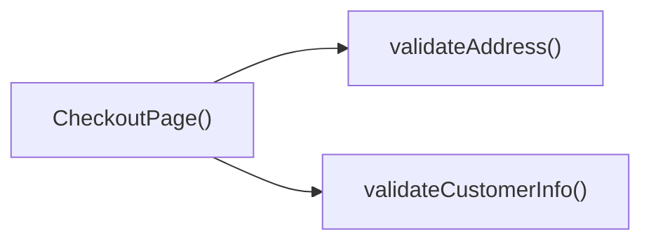

## Genel Bakış
Bu modül, VentHub HVAC platformunun sipariş tamamlama (ödeme) sürecini yöneten React tabanlı bir ön yüz bileşenidir. Müşteri bilgilerinin doğrulanması, adres kontrolü ve adım adım ilerleme mantığını barındıran modül, sipariş sürecinin hatasız ilerlemesini sağlar.

## Fonksiyon Grupları
### Ana Bileşen
Ödeme sayfasının temel giriş noktası olarak tüm kullanıcı arayüzünü ve işlevsel akışın bütünleşik yönetimini üstlenir.
- CheckoutPage

### Girdi Doğrulama Fonksiyonları
Müşteri tarafından girilen kişisel bilgiler ile teslimat adresinin sistem gereksinimlerine uygunluğunu kontrol eder, olası giriş hatalarını tespit eder.
- validateCustomerInfo, validateAddress

### Süreç Yönetimi Fonksiyonu
Ödeme sürecinin adımları arası geçişi yönetir, tüm doğrulamaların başarılı olmasının ardından sonraki adıma geçişi tetikler.
- handleNextStep

---

## AXIOMS – Mimari Varsayımlar
Bu modül, VentHub HVAC projesinin ödeme akışındaki Checkout (ödeme) sayfasını yönetir; müşteri ve adres doğrulama, adım geçiş işlevlerinin sorunsuz çalışması için tüm bağımlı servislere erişim ve sayfaya iletilen zorunlu girdilerin varlığı zorunludur.

[Aksiyom 1]: Eğer CheckoutPage ana bileşenine alışveriş sepeti verisi, yetkili kullanıcı kimliği ve ödeme servisi bağlantısı gibi zorunlu prop'lar iletilmezse, ödeme akışı başlatılamaz, kullanıcı boş veya hatalı yüklenen bir sayfa ile karşılaşır.
[Aksiyom 2]: Eğer müşteri bilgilerini doğrulayan validateCustomerInfo() fonksiyonunun çalışması için gereken doğrulama mantığına erişim sağlanamazsa, müşteri bilgileri geçerli olsa bile ödeme süreci ilerleyemez, kullanıcı kalıcı bir hatayla karşılaşır.
[Aksiyom 3]: Eğer validateAddress() fonksiyonuna parametre olarak iletilen CheckoutAddressInfo tipindeki adres nesnesi, adres doğrulaması için gereken tüm zorunlu alanları içermezse, adres doğrulaması başarısız olur, kullanıcı bir sonraki adıma geçemez.
[Aksiyom 4]: Eğer handleNextStep() fonksiyonu içinde önceki adımlardaki tüm doğrulamaların (müşteri, adres) başarı durumunu kontrol eden mekanizma yoksa, eksik veya hatalı bilgiyle ödeme adımına geçilir, sipariş hatalı olarak kaydedilir.
[Aksiyom 5]: Eğer CheckoutAddressInfo nesnesinin tip uyumluluğunu denetleyen mekanizma yoksa, yanlış yapıda adres verisiyle validateAddress() fonksiyonu çalıştırıldığında runtime hatası oluşur, ödeme akışı tamamen kesintiye uğrar.

---

## FONKSIYON DETAYLARI

### CheckoutPage
**Ne yapar**: VentHub HVAC projesinin src/views dizininde yer alan ödeme süreci ana sayfa bileşenidir, siparişin tamamlanması için tüm kullanıcı arayüzü katmanlarını ve temel iş akışlarını tek bir çatı altında toplar. Kullanıcıların müşteri bilgilerini, adresini ve ödeme detaylarını girdiği ödeme akışının ana bileşeni olarak çalışır.
**Nasıl yapar**: React.FC olarak tanımlanmış ana sayfa bileşeni olarak, sayfa içi state yönetimini, alt bileşenlerin entegrasyonunu ve ödeme adımlarının sıralı işleyişini koordine eder. Tüm ödeme sürecinde kullanılacak yardımcı doğrulama ve adım yönetimi fonksiyonlarını bünyesinde barındırarak kullanıcı deneyimini sürekli kılar.
**Parametreler**: Hiçbir parametre almaz.
**Dönüş**: React.FC tipinde, ödeme sayfasının tüm yapısını oluşturan React fonksiyonel bileşeni döndürür.

### validateCustomerInfo
**Ne yapar**: Ödeme sürecinde kullanıcının girdiği kişisel müşteri bilgilerinin geçerliliğini ve eksiksizliğini kontrol eder, hatalı veya eksik bilgi durumunda kullanıcıya gösterilecek uyarıların tetiklenmesini sağlar. Zorunlu alanların doldurulması, iletişim bilgilerinin format kurallarına uyması gibi temel doğrulamaları gerçekleştirir.
**Nasıl yapar**: Mevcut sayfa state'inde tutulan müşteri bilgilerini okuyarak, önceden tanımlanmış format ve doluluk kurallarına uygunluğunu denetler. Doğrulama başarısız olduğunda oluşan hata mesajlarını sayfa içi hata state'ine yazarak kullanıcı arayüzünde gösterilmesini sağlar.
**Parametreler**: Hiçbir parametre almaz.
**Dönüş**: Tanımlanmış bir dönüş tipi bulunmamaktadır, tüm işlevini sayfa içi state güncellemeleri ile yerine getirir, doğrudan herhangi bir değer döndürmez.

### validateAddress
**Ne yapar**: Ödeme sürecinde kullanıcının girdiği teslimat veya fatura adres bilgilerinin geçerliliğini denetler, adres alanlarının eksiksiz ve format kurallarına uygun olmasını garanti eder. Adresle ilgili tüm doğrulama işlemlerini tek bir fonksiyon altında toplar.
**Nasıl yapar**: Girdi olarak aldığı adres nesnesi içindeki il, ilçe, posta kodu, açık adres gibi alanları tek tek kontrol eder, posta kodu formatı, zorunlu alanların boş bırakılmaması gibi kuralları uygular. Doğrulama sonuçlarını hata state'ine ileterek kullanıcının eksiklerini görmesini sağlar.
**Parametreler**:
- name: address, type: CheckoutAddressInfo — Doğrulanması gereken teslimat veya fatura adresini içeren, projede tanımlanmış özel CheckoutAddressInfo tipinde nesnedir
**Dönüş**: Tanımlanmış bir dönüş tipi bulunmamaktadır, doğrulama işlemlerinin sonuçlarını sayfa içi state mekanizması ile iletir, doğrudan herhangi bir değer döndürmez.

### handleNextStep
**Ne yapar**: Ödeme sürecinin sıralı adımlarını yönetir, mevcut adımdaki tüm doğrulamaların başarılı olması halinde kullanıcının bir sonraki ödeme adımına geçmesini sağlar. Ödeme akışının adım değişikliği işlemini tek bir noktadan koordine eder.
**Nasıl yapar**: Kullanıcı bir sonraki adıma geçmek istediğinde öncelikle mevcut adımdaki zorunlu tüm doğrulama fonksiyonlarını tetikler. Tüm doğrulamaların hatasız tamamlanmasının ardından sayfanın adım tutan state'ini güncelleyerek bir sonraki adımın kullanıcıya sunulmasını sağlar.
**Parametreler**: Hiçbir parametre almaz.
**Dönüş**: Tanımlanmış bir dönüş tipi bulunmamaktadır, sadece adım yönetimi ve state güncelleme işlemlerini gerçekleştirir, doğrudan herhangi bir değer döndürmez.

---

## AST POINTERS

### [N1_NASIL] AST Pointer: C:\Users\alize\venthub-hvac\src\views\CheckoutPage.tsx::CheckoutPage
- **params**: (parametre yok)
- **ic_degiskenler**:
  - `items` — useCart hook'undan alınan sepetteki ürün listesi
  - `getCartTotal` — useCart hook'undan alınan sepet toplamını hesaplayan fonksiyon
  - `clearCart` — useCart hook'undan alınan sepeti temizleyen fonksiyon
  - `applyServerPricing` — useCart hook'undan alınan sunucu tarafı fiyatlandırma uygulayan fonksiyon
  - `user` — useAuth hook'undan alınan oturum açmış kullanıcı nesnesi
  - `authLoading` — useAuth hook'undan alınan kimlik doğrulama yükleme durumu
  - `router` — Next.js useRouter hook'undan alınan yönlendirme nesnesi
  - `t` — useI18n hook'undan alınan çeviri fonksiyonu
  - `lang` — useI18n hook'undan alınan mevcut dil kodu
  - `step` — useState ile yönetilen ödeme akışı adımını tutan state (1: Bilgi, 2: Adres, 3: İnceleme, 4: Ödeme)
  - `setStep` — adım state'ini güncelleyen setter fonksiyonu
  - `customerInfo` — Müşteri kişisel bilgilerini tutan form state'i
  - `setCustomerInfo` — customerInfo state'ini güncelleyen setter
  - `shippingAddress` — Teslimat adresi bilgilerini tutan form state'i
  - `setShippingAddress` — shippingAddress state'ini güncelleyen setter
  - `billingAddress` — Fatura adresi bilgilerini tutan form state'i
  - `setBillingAddress` — billingAddress state'ini güncelleyen setter
  - `invoiceType` — Fatura türünü (bireysel/kurumsal) tutan state
  - `setInvoiceType` — invoiceType state'ini güncelleyen setter
  - `invoiceInfo` — Fatura detay bilgilerini tutan form state'i
  - `setInvoiceInfo` — invoiceInfo state'ini güncelleyen setter
  - `legalConsents` — Yasal izinleri (KVKK, satış sözleşmesi vb.) tutan state
  - `setLegalConsents` — legalConsents state'ini güncelleyen setter
  - `sameAsShipping` — Fatura adresinin teslimat adresiyle aynı olduğunu belirten boolean state
  - `setSameAsShipping` — sameAsShipping state'ini güncelleyen setter
  - `shippingMethod` — Kargo yöntemini (standart/ekspres) tutan state
  - `setShippingMethod` — shippingMethod state'ini güncelleyen setter
  - `showHelp` — Yardım penceresinin görünürlüğünü tutan state
  - `setShowHelp` — showHelp state'ini güncelleyen setter
  - `couponCode` — Kupon kodunu tutan state (useCheckoutCoupon'dan)
  - `setCouponCode` — couponCode state'ini güncelleyen setter
  - `couponApplied` — Uygulanmış kupon bilgilerini tutan nesne
  - `applyCoupon` — Kuponu sepete uygulayan fonksiyon
  - `removeCoupon` - Uygulanmış kuponu kaldıran fonksiyon
  - `payment` — useCheckoutPayment hook'undan dönen ödeme işlemlerini yöneten nesne
  - `savedAddresses` — Kullanıcının kayıtlı adreslerini tutan state
  - `setSavedAddresses` — savedAddresses state'ini güncelleyen setter
  - `showAddressModal` — Adres seçme modalının görünürlüğünü tutan state
  - `setShowAddressModal` — showAddressModal state'ini güncelleyen setter
  - `addressPickTarget` — Hangi adres (teslimat/fatura) için modal açıldığını belirten state
  - `setAddressPickTarget` — addressPickTarget state'ini güncelleyen setter
  - `totalAmount` — Sepetin vergi öncesi toplam tutarı
  - `vatAmount` — Sepet toplamı üzerinden hesaplanan KDV tutarı
  - `finalAmount` — Kupon indirimi uygulandıktan sonraki son ödeme tutarı
- **Dönüş**: React JSX elementi (sayfa arayüzü)

### [N2_NASIL] AST Pointer: C:\Users\alize\venthub-hvac\src\views\CheckoutPage.tsx::authCheckEffect
- **params**: (parametre yok)
- **ic_degiskenler**:
  - `authLoading` — Kimlik doğrulama yükleme durumu
  - `user` — Oturum açmış kullanıcı nesnesi
  - `router` — Next.js yönlendirme nesnesi
  - `Routes.auth.login` — Giriş sayfası rotasını oluşturan fonksiyon
- **Dönüş**: yok (yan etki: kullanıcı girişi yoksa login sayfasına yönlendirir)

### [N3_NASIL] AST Pointer: C:\Users\alize\venthub-hvac\src\views\CheckoutPage.tsx::prefillCustomerInfoEffect
- **params**: (parametre yok)
- **ic_degiskenler**:
  - `user` — Oturum açmış kullanıcı nesnesi
  - `user.user_metadata?.full_name` — Kullanıcının kayıtlı tam adı
  - `fullName` — Kullanıcı tam adından elde edilen tam isim stringi
  - `parts` — Tam ismi boşluğa göre ayırarak oluşturulan isim parçaları dizisi
  - `parts[0]` — İsim dizisinin ilk elemanı (kullanıcının ilk adı)
  - `parts.slice(1).join(' ')` — İsim dizisinin geri kalanını birleştirerek oluşturulan soyadı
  - `user.email` — Kullanıcının kayıtlı e-posta adresi
  - `user.user_metadata?.phone` — Kullanıcının kayıtlı telefon numarası
  - `setCustomerInfo` — Müşteri bilgi formunu önceden doldurmak için kullanılan setter
- **Dönüş**: yok (yan etki: kullanıcı bilgilerini müşteri formuna önceden doldurur)

### [N4_NASIL] AST Pointer: C:\Users\alize\venthub-hvac\src\views\CheckoutPage.tsx::loadAddressesWrapperEffect
- **params**: (parametre yok)
- **ic_degiskenler**:
  - `loadAddresses` — Kayıtlı adresleri yükleyen async iç fonksiyon
  - `user` — Oturum açmış kullanıcı nesnesi
  - `sameAsShipping` — Fatura adresinin teslimatla aynı olma durumu
- **Dönüş**: yok (yan etki: kullanıcının kayıtlı adreslerini yükler)

### [N5_NASIL] AST Pointer: C:\Users\alize\venthub-hvac\src\views\CheckoutPage.tsx::loadAddresses
- **params**: (parametre yok)
- **ic_degiskenler**:
  - `user` — Oturum açmış kullanıcı nesnesi
  - `listAddresses` — Kullanıcının kayıtlı adreslerini getiren API fonksiyonu
  - `rows` — API'den dönen adres listesi
  - `setSavedAddresses` — Kayıtlı adresler state'ini güncelleyen setter
  - `defShip` — Varsayılan teslimat adresini bulan dizi elemanı
  - `defShip.is_default_shipping` — Adresin varsayılan teslimat adresi olma durumu
  - `addr` — API'den gelen adres formatını form formatına dönüştüren adres nesnesi
  - `defShip.address_line` — Kayıtlı adresin tam açık adres stringi
  - `defShip.city` — Kayıtlı adresin şehri
  - `defShip.district` — Kayıtlı adresin ilçesi
  - `defShip.postal_code` — Kayıtlı adresin posta kodu
  - `defShip.full_name` — Adresin alıcısının tam adı
  - `defShip.phone` — Adresin alıcısının telefon numarası
  - `setShippingAddress` — Teslimat adresi formunu güncelleyen setter
  - `sameAsShipping` — Fatura adresinin teslimatla aynı olma durumu
  - `setBillingAddress` — Fatura adresi formunu güncelleyen setter
- **Dönüş**: yok (yan etki: kullanıcının varsayılan teslimat adresini formlara yükler)

### [N6_NASIL] AST Pointer: C:\Users\alize\venthub-hvac\src\views\CheckoutPage.tsx::validateCustomerInfo
- **params**: (parametre yok)
- **ic_degiskenler**:
  - `customerInfo.name` — Müşteri isim alanı
  - `customerInfo.email` — Müşteri e-posta alanı
  - `customerInfo.phone` — Müşteri telefon alanı
  - `toast` — Bildirim göstermek için kullanılan react-hot-toast fonksiyonu
  - `t` — Çeviri fonksiyonu, hata mesajlarını çevirmek için kullanılır
- **Dönüş**: Boolean (doğrulama başarılıysa true, başarısızsa false)

### [N7_NASIL] AST Pointer: C:\Users\alize\venthub-hvac\src\views\CheckoutPage.tsx::validateAddress
- **params**: address: CheckoutAddressInfo
- **ic_degiskenler**:
  - `address.full_address` — Adresin tam açık adres alanı
  - `address.fullAddress` — Alternatif formatta tam açık adres alanı
  - `full` — İki adres alanından birini seçerek oluşturulan temizlenmiş adres stringi
  - `address.city` — Adresin şehir alanı
  - `address.district` — Adresin ilçe alanı
  - `toast` — Bildirim fonksiyonu
  - `t` — Hata mesajlarını çeviren çeviri fonksiyonu
- **Dönüş**: Boolean (doğrulama başarılıysa true, başarısızsa false)

### [N8_NASIL] AST Pointer: C:\Users\alize\venthub-hvac\src\views\CheckoutPage.tsx::handleNextStep
- **params**: (parametre yok)
- **ic_degiskenler**:
  - `step` — Mevcut ödeme adımı
  - `validateCustomerInfo` — Müşteri bilgilerini doğrulayan fonksiyon
  - `setStep` — Adım state'ini güncelleyen setter
  - `validateAddress` — Adres bilgilerini doğrulayan fonksiyon
  - `shippingAddress` — Kullanıcının girdiği teslimat adresi
  - `payment.initiatePayment` — Ödeme işlemini başlatan async fonksiyon
  - `success` — Ödeme başlatma işleminin başarı durumu
- **Dönüş**: yok (yan etki: ödeme akışı adımını ilerletir, 3. adımdaysa ödemeyi başlatır)

### [N9_NASIL] AST Pointer: C:\Users\alize\venthub-hvac\src\views\CheckoutPage.tsx::AddressSelectModal_onPick
- **params**: a: UserAddress
- **ic_degiskenler**:
  - `a.address_line` — Seçilen kayıtlı adresin açık adresi
  - `a.city` — Seçilen adresin şehri
  - `a.district` — Seçilen adresin ilçesi
  - `a.postal_code` — Seçilen adresin posta kodu
  - `a.full_name` — Seçilen adresin alıcısının tam adı
  - `a.phone` — Seçilen adresin alıcısının telefon numarası
  - `addr` — Kayıtlı adresi form formatına dönüştüren adres nesnesi
  - `addressPickTarget` — Hangi adrese (teslimat/fatura) atama yapılacağını belirten state
  - `setShippingAddress` — Teslimat adresi formunu güncelleyen setter
  - `setBillingAddress` — Fatura adresi formunu güncelleyen setter
  - `setShowAddressModal` — Adres seçme modalını kapatan setter
- **Dönüş**: yok (yan etki: seçilen adresi ilgili forma atar, modalı kapatır)

### [N10_NASIL] AST Pointer: C:\Users\alize\venthub-hvac\src\views\CheckoutPage.tsx::StepAddressInfo_onOpenInvoiceModal
- **params**: (parametre yok)
- **ic_degiskenler**: yok
- **Dönüş**: yok (henüz implement edilmemiş boş async fonksiyon)

---

## ÇAĞRI HARİTASI

### Disariya Cagrilar (Outgoing)
CheckoutPage() fonksiyonu, ödeme sürecinde zorunlu bilgi kontrollerini yapmak için dosya içindeki validateCustomerInfo ve validateAddress fonksiyonlarını çağırır.

### Disaridan Cagrilanlar (Incoming)
Sağlanan veri setinde bu modülü kullanan herhangi bir dış dosya veya fonksiyon bilgisi paylaşılmamıştır.

### Ic Ice Fonksiyonlar (Nested)
Yok

---

## DOSYA-İÇİ ÇAĞRI GRAFİĞİ
  CheckoutPage() → validateAddress()
  CheckoutPage() → validateCustomerInfo()

---

## NODE ID STANDARD

  file: src\views\CheckoutPage.tsx
  function: src\views\CheckoutPage.tsx::CheckoutPage
  function: src\views\CheckoutPage.tsx::validateCustomerInfo
  function: src\views\CheckoutPage.tsx::validateAddress
  function: src\views\CheckoutPage.tsx::handleNextStep

---

## DISA AKTARILANLAR (EXPORTS)
  export: CheckoutPage