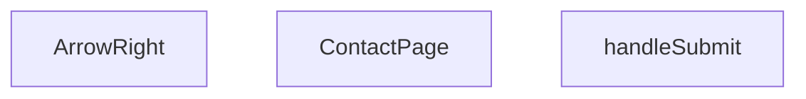

## Genel Bakış  
`ContactPage` bir tek sayfa React bileşenidir; kullanıcıdan e‑posta, telefon ve mesaj bilgilerini toplar, form gönderildiğinde bu verileri işleyen bir asenkron fonksiyon çağırır. Sayfa, basit bir stil ve yönlendirme ikonu içerir.

## Fonksiyon Grupları  

### Sayfa Bileşeni  
`ContactPage` sayfanın ana yapısını oluşturur, form alanlarını ve gönderme butonunu render eder.  
- ContactPage  

### Form İşleme  
`handleSubmit` form gönderildiğinde tetiklenir, e‑postayı, telefonu ve mesajı alır, gerekli doğrulamaları yapar ve sunucuya gönderir.  
- handleSubmit  

### Yardımcı Bileşen  
`ArrowRight` basit bir ok ikonunu, varsayılan 16 piksel boyutuyla render eder; sayfanın navigasyon veya butonlarında kullanılır.  
- ArrowRight

---

## AXIOMS – Mimari Varsayımlar
Bu modül için özel aksiyom tanımlanmamıştır.

---

## FONKSİYON DETAYLARI

### ContactPage
**Ne yapar**: ContactPage, uygulamanın iletişim sayfasını temsil eden bir React fonksiyonel bileşenidir. Bu bileşen, kullanıcıların iletişim bilgilerini girebilecekleri bir form ve ilgili UI öğelerini içerir. Sayfa yüklendiğinde React tarafından render edilerek kullanıcı arayüzüne eklenir.  

**Nasıl yapar**: Fonksiyon, React.FC tipinde bir bileşen döndürür; bu sayede JSX içinde doğrudan kullanılabilir. İçerik, tipik bir React bileşeninin yaşam döngüsü ve render mantığına uygun olarak tanımlanır.  

**Parametreler**:  
- (yok): Bu fonksiyon parametre almaz; sadece bir bileşen tanımı döndürür.  

**Dönüş**: React.FC — bir React fonksiyonel bileşeni.

### handleSubmit
**Ne yapar**: handleSubmit, iletişim formu gönderildiğinde tetiklenen bir olay işleyicisidir. Form verilerini toplar, doğrulama adımlarını başlatabilir ve gönderim sürecini yönetir. İşlem tamamlandığında sayfa yenilenmesi veya başka bir UI güncellemesi yapılabilir.  

**Nasıl yapar**: Fonksiyon, React.FormEvent tipinde bir olay nesnesi alır ve bu nesnenin `preventDefault()` metodunu çağırarak tarayıcının varsayılan form gönderimini engeller. Ardından, form alanlarından değerler okunur ve gerekli iş mantığı (ör. API çağrısı) yürütülür.  

**Parametreler**:  
- e: React.FormEvent — Form gönderim olayını temsil eden nesne; olayın detaylerine ve hedef form elemanlarına erişim sağlar.  

**Dönüş**: Belirtilmemiş; genellikle `void` (geri dönüş değeri yok) olarak kullanılır.

### ArrowRight
**Ne yapar**: ArrowRight, sağa yön gösteren bir ikon bileşenidir ve UI içinde ok işareti olarak kullanılabilir. Varsayılan olarak 16 piksel boyutunda render edilir, ancak `size` parametresi ile farklı boyutlar ayarlanabilir. Bu bileşen, ikonun stil ve renk özelliklerini dışarıdan gelen props ile özelleştirmeye olanak tanır.  

**Nasıl yapar**: Fonksiyon, `size` adlı bir parametre alır; parametre verilmezse 16 değeri varsayılan olarak kullanılır. Bileşen, SVG veya benzeri bir grafik öğesi döndürerek belirtilen boyutta bir ok çizer.  

**Parametreler**:  
- size: number — Ok ikonunun genişlik ve yükseklik değerini belirler; varsayılan değer 16’dır.  

**Dönüş**: Belirtilmemiş; genellikle bir React bileşeni (JSX) döndürür, ancak döndürdüğü tip açıkça tanımlanmamıştır.

---

## AST POINTERS

### [N1_NASIL] AST Pointer: src\views\ContactPage.tsx::ContactPage
- **params**: (parametre yok)
- **ic_degiskenler**:
  - `t` — `useI18n()` hook’inden dönen çeviri fonksiyonu, metinleri yerelleştirmek için kullanılır.
  - `formSubmitted` — formun gönderilip gönderilmediğini tutan boolean state, başlangıçta `false`.
  - `setFormSubmitted` — `formSubmitted` state’ini güncelleyen setter fonksiyonu.
  - `whatsappLink` — `getSupportLink(t('common.whatsapp.supportMessageDefault'))` ifadesiyle oluşturulan WhatsApp destek URL’si.
  - `heroBadgeRef` — `useScrollAnimation` hook’u tarafından döndürülen element referansı, hero badge için kaydırma animasyonu.
  - `heroBadgeVisible` — hero badge’ın görünürlük durumu (boolean) aynı hook’tan.
  - `contactGridRef` — iletişim kartları grid’i için element referansı, kaydırma animasyonu.
  - `contactGridVisible` — grid’in görünürlük durumu (boolean) aynı hook’tan.
  - `formSuccessRef` — form gönderiminden sonra gösterilen başarı mesajı için element referansı, kaydırma animasyonu.
  - `formSuccessVisible` — başarı mesajının görünürlük durumu (boolean) aynı hook’tan.
  - `contactCards` — her bir iletişim kartının `icon`, `title`, `value`, `href`, `label` alanlarını içeren dizi.
  - `handleSubmit` — form gönderildiğinde çalıştırılan async fonksiyon (aşağıda ayrı olarak tanımlanmıştır).
- **Dönüş**: React bileşeni JSX döndürür (`React.ReactNode`). Bileşen yan etkisizdir; sadece UI render eder ve kullanıcı etkileşimlerine (form gönderimi, link tıklamaları) yanıt verir.

### [N2_NASIL] AST Pointer: src\views\ContactPage.tsx::handleSubmit
- **params**: `e` — `React.FormEvent` tipinde form submit olayı.
- **ic_degiskenler**:
  - `e` — form submit olay nesnesi; `preventDefault()` ile varsayılan form gönderimi engellenir.
- **Dönüş**: `void` (yok). Fonksiyon, `setFormSubmitted(true)` çağrısı ile `formSubmitted` state’ini `true` yapar; bu da UI’da başarı mesajının gösterilmesini tetikler.

### [N3_NASIL] AST Pointer: src\views\ContactPage.tsx::ArrowRight
- **params**: `size = 16` — opsiyonel parametre, ikonun genişlik ve yüksekliğini belirler; varsayılan değer 16.
- **ic_degiskenler**:
  - `size` — SVG’nin `width` ve `height` özniteliklerine atanır; ikonun boyutunu kontrol eder.
- **Dönüş**: `React.ReactNode` (JSX). `size` değerine göre ayarlanmış bir SVG elementi döndürür.

---

## MERMAID CALL GRAPH

## NODE ID STANDARD

  file: src\views\ContactPage.tsx
  function: src\views\ContactPage.tsx::ContactPage
  function: src\views\ContactPage.tsx::handleSubmit
  function: src\views\ContactPage.tsx::ArrowRight

---

## DISA AKTARILANLAR (EXPORTS)
  export: ArrowRight
  export: ContactPage

---

## STİL TOKENLERİ

### Arbitrary Değerler (token'a geçirilmemiş)
- **shadow:** `hover:shadow-[0_30px_60px_-15px_rgba(0,0,0,0.05)]`
- **height:** (yok)
- **width:** (yok)
- **spacing:** (yok)
- **diğer:** (yok)

### Kullanılan Token'lar (zaten token'a geçirilmiş)
- `rounded-hvac-2xl`, `rounded-hvac-3xl`, `tracking-hvac-loose`, `tracking-hvac-wide`

### Tailwind Sınıf Özeti
- **Renkler:** `bg-blue-500/10`, `bg-cyan-500`, `bg-cyan-500/10`, `bg-cyan-500/20`, `bg-green-50`, `bg-slate-50`, `bg-slate-950`, `bg-white`, `border-b`, `border-cyan-500/20`, `border-none`, `border-slate-100`, `group-hover:bg-cyan-500`, `group-hover:text-white`, `hover:bg-cyan-400`
- **Layout:** `absolute`, `bottom-0`, `flex`, `gap-2`, `gap-24`, `gap-3`, `gap-4`, `gap-6`, `gap-8`, `grid`, `h-12`, `h-2`, `h-20`, `h-500px`, `inline-flex`
- **Varyant/Responsive:** `active:`, `focus-visible:`, `group-hover:`, `hover:`, `lg:`, `md:`, `sm:` önekleri
- **Yardımcı Sınıflar:** `active:scale-95`, `active:scale-98`, `animate-pulse`, `blur-120`, `border`, `duration-500`, `focus-visible:ring-2`, `focus-visible:ring-cyan-500`, `font-black`, `font-bold`, `font-extralight`, `font-light`, `font-medium`, `group`, `hover:underline`