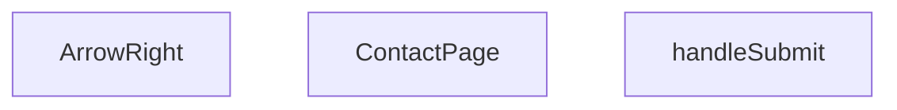

## Genel Bakış

Bu modül, VentHub uygulamasının iletişim sayfasını oluşturan bir React bileşenidir. Kullanıcıdan e-posta, telefon ve mesaj gibi iletişim bilgilerini toplayan bir form içerir ve form gönderim işlemini yönetir. Modül, ana sayfa bileşeni, form gönderme işleyicisi ve yardımcı bir ok ikonu bileşeninden oluşur.

## Fonksiyon Grupları

### Ana Sayfa Bileşeni
İletişim sayfasının tüm kullanıcı arayüzünü oluşturur; form alanlarını, başlığı ve gönderme butonunu render eder. Diğer fonksiyonları ve yardımcı bileşenleri bir araya getirir.
- ContactPage

### Form Gönderme İşleyicisi
Kullanıcı formu gönderdiğinde tetiklenir; form verilerini toplar ve sunucuya gönderme işlemini başlatır. Form olayının varsayılan davranışını engelleyerek sayfanın yeniden yüklenmesini önler.
- handleSubmit

### Yardımcı UI Bileşeni
Sayfa içinde tekrar kullanılabilen bir ok ikonu sağlar. Varsayılan boyutu 16 pikseldir ancak farklı bağlamlarda kullanılabilmesi için boyut parametresi alır.
- ArrowRight

---

## AXIOMS – Mimari Varsayımlar

Bu modül için özel aksiyom tanımlanmamıştır.

**Neden:** Fonksiyon gövdeleri sağlanmadığı için, yalnızca imzalardan (`ContactPage`, `handleSubmit`, `ArrowRight`) mimari varsayımlar üretilememektedir. İmzalar davranışsal koşul içermez; aksiyom üretimi için fonksiyon gövdesindeki mantıksal dallanma, hata kontrolü, eşik değerleri veya bağımlılık kontrolleri gereklidir.

---

## FONKSİYON DETAYLARI

### ContactPage
**Ne yapar**: ContactPage, uygulamanın iletişim sayfasını temsil eden bir React fonksiyonel bileşenidir. Bu bileşen, kullanıcıların iletişim bilgilerini girebilecekleri bir form ve ilgili UI öğelerini içerir. Sayfa yüklendiğinde React tarafından render edilerek kullanıcı arayüzüne eklenir.  

**Nasıl yapar**: Fonksiyon, React.FC tipinde bir bileşen döndürür; bu sayede JSX içinde doğrudan kullanılabilir. İçerik, tipik bir React bileşeninin yaşam döngüsü ve render mantığına uygun olarak tanımlanır.  

**Parametreler**:  
- (yok): Bu fonksiyon parametre almaz; sadece bir bileşen tanımı döndürür.  

**Dönüş**: React.FC — bir React fonksiyonel bileşeni.

### handleSubmit
**Ne yapar**: İletişim formunun gönderilmesi işlemini yöneten asenkron fonksiyondur. Form gönderildiğinde tetiklenir ve müşteriye "iletildi" mesajı gösterir; ancak form verilerini hiçbir veritabanına veya harici hizmete kaydetmez. Kaynak kodda bu fonksiyonun gövdesinde yalnızca bir yorum satırı bulunur: "Form submission logic using supabase would go here". Yani asıl gönderim mantığı hiç uygulanmamıştır.

**Nasıl yapar**: Fonksiyonun iç mantığı kaynakta mevcut değildir — gövdede gerçek bir işlem yerine yalnızca gelecekteki implementasyonu ima eden bir yorum satırı bırakılmıştır. `form-submission-standard.md` belgesinin §7 maddesi, yazma işlemi yerine geçen bu tür yorumları adıyla yasaklamaktadır. Üretim ortamında `contact_messages` tablosuna kayıt yapılmadığı ölçülmüştür.

**Parametreler**:
- `e`: `React.FormEvent` — Formun gönderilme olayını temsil eden event nesnesi. Form submit davranışını kontrol etmek (varsayılan davranışı engellemek gibi) amacıyla kullanılır.

**Dönüş**: Kaynakta dönüş tipi belirtilmemiştir. Bilinmiyor.

### ArrowRight
**Ne yapar**: ArrowRight, sağa yön gösteren bir ikon bileşenidir ve UI içinde ok işareti olarak kullanılabilir. Varsayılan olarak 16 piksel boyutunda render edilir, ancak `size` parametresi ile farklı boyutlar ayarlanabilir. Bu bileşen, ikonun stil ve renk özelliklerini dışarıdan gelen props ile özelleştirmeye olanak tanır.  

**Nasıl yapar**: Fonksiyon, `size` adlı bir parametre alır; parametre verilmezse 16 değeri varsayılan olarak kullanılır. Bileşen, SVG veya benzeri bir grafik öğesi döndürerek belirtilen boyutta bir ok çizer.  

**Parametreler**:  
- size: number — Ok ikonunun genişlik ve yükseklik değerini belirler; varsayılan değer 16’dır.  

**Dönüş**: Belirtilmemiş; genellikle bir React bileşeni (JSX) döndürür, ancak döndürdüğü tip açıkça tanımlanmamıştır.

---

## İTHALATLAR (IMPORTS)
- import: ../components/HVACIcons::WhatsAppIcon
- import: ../components/Seo::Seo
- import: ../hooks/useLocalizedRoutes::useLocalizedRoutes
- import: ../hooks/useScrollAnimation::scrollAnimationClasses
- import: ../hooks/useScrollAnimation::useScrollAnimation
- import: ../i18n/I18nProvider::useI18n
- import: ../lib/errorReporter::reportError
- import: ../lib/services/contactMessageService::submitContactMessage
- import: ../lib/supabase/client::supabaseBrowserClient
- import: ../utils/whatsapp::getSupportLink
- import: lucide-react::CheckCircle
- import: lucide-react::Clock
- import: lucide-react::Mail
- import: lucide-react::MapPin
- import: lucide-react::Phone
- import: next/link::Link
- import: react::React
- import: react::useState

---

## AST POINTERS

### [N1_NASIL] AST Pointer: src/views/ContactPage.tsx::ContactPage
- **params**: yok
- **ic_degiskenler**:
  - `t` — `useI18n()` hook'undan dönen çeviri fonksiyonu; sayfa metinlerini yerelleştirmek için kullanılır
  - `lang` — `useI18n()` hook'undan dönen geçerli dil kodu; `getSupportLink` çağrısına iletilir
  - `Routes` — `useLocalizedRoutes()` hook'undan dönen yönlendirme nesnesi; KVKK linkinde `Routes.legal.kvkk()` olarak erişilir
  - `formSubmitted` — `useState(false)` ile oluşturulan boolean durum; form başarıyla gönderildiğinde `true` olur ve başarı ekranını gösterir
  - `setFormSubmitted` — `formSubmitted` durumunu güncelleyen setter fonksiyonu
  - `name` — `useState('')` ile oluşturulan string; formdaki isim input alanının kontrol edilen değeri
  - `setName` — `name` durumunu güncelleyen setter fonksiyonu
  - `email` — `useState('')` ile oluşturulan string; formdaki e-posta input alanının kontrol edilen değeri
  - `setEmail` — `email` durumunu güncelleyen setter fonksiyonu
  - `subject` — `useState('')` ile oluşturulan string; formdaki konu input alanının kontrol edilen değeri
  - `setSubject` — `subject` durumunu güncelleyen setter fonksiyonu
  - `message` — `useState('')` ile oluşturulan string; formdaki mesaj textarea alanının kontrol edilen değeri
  - `setMessage` — `message` durumunu güncelleyen setter fonksiyonu
  - `consent` — `useState(false)` ile oluşturulan boolean; KVKK rıza kutusunun işaretlenip işaretlenmediğini tutar
  - `setConsent` — `consent` durumunu güncelleyen setter fonksiyonu
  - `submitting` — `useState(false)` ile oluşturulan boolean; form gönderilirken `true` olur, butonu devre dışı bırakır
  - `setSubmitting` — `submitting` durumunu güncelleyen setter fonksiyonu
  - `formError` — `useState('')` ile oluşturulan string; form hata mesajını tutar, boşsa hata gösterilmez
  - `setFormError` — `formError` durumunu güncelleyen setter fonksiyonu
  - `whatsappLink` — `getSupportLink(t('common.whatsapp.supportMessageDefault'), lang)` çağrısından dönen WhatsApp destek URL'si
  - `heroBadgeRef` — `useScrollAnimation<HTMLDivElement>({ threshold: 0.2 })` hook'undan dönen DOM referansı; hero rozet elementine bağlanır
  - `heroBadgeVisible` — aynı hook'tan dönen boolean; hero rozeti görünür olduğunda `true` olur, animasyon sınıfını tetikler
  - `contactGridRef` — `useScrollAnimation<HTMLDivElement>({ threshold: 0.1 })` hook'undan dönen DOM referansı; iletişim kartları ızgarasına bağlanır
  - `contactGridVisible` — aynı hook'tan dönen boolean; ızgara görünür olduğunda `true` olur
  - `formSuccessRef` — `useScrollAnimation<HTMLDivElement>({ threshold: 0.2 })` hook'undan dönen DOM referansı; başarı ekranına bağlanır
  - `formSuccessVisible` — aynı hook'tan dönen boolean; başarı ekranı görünür olduğunda `true` olur
  - `contactCards` — üç elemanlı dizi; her eleman `icon`, `title`, `value`, `href`, `label` alanlarından oluşur (telefon, e-posta, ofis adresi kartları)
  - `handleSubmit` — içe tanımlı async fonksiyon; form gönderimini yönetir, `submitContactMessage` servisini çağırır
- **Dönüş**: JSX — tam sayfa iletişim bileşeni (hero, iletişim kartları ızgarası, WhatsApp CTA, form veya başarı ekranı)

### [N2_NASIL] AST Pointer: src/views/ContactPage.tsx::handleSubmit
- **params**: `e` — `React.FormEvent` türünde form olayı nesnesi; `e.preventDefault()` ile varsayılan form davranışı engellenir
- **ic_degiskenler**:
  - `consent` — üst kapsamdan (ContactPage) gelen boolean; KVKK rıza kutusunun durumunu temsil eder, `false` ise fonksiyon erken döner
  - `t` — üst kapsamdan gelen çeviri fonksiyonu; hata ve rıza uyarı mesajlarını almak için kullanılır
  - `setFormError` — üst kapsamdan gelen setter fonksiyonu; rıza eksikse veya gönderim başarısızsa hata mesajını ayarlar
  - `setSubmitting` — üst kapsamdan gelen setter fonksiyonu; gönderim başlarken `true`, bittiğinde `false` yapılır
  - `submitContactMessage` — import edilen servis fonksiyonu; `supabaseBrowserClient` ve form verileriyle çağrılır
  - `supabaseBrowserClient` — üst kapsamdan gelen Supabase istemci nesnesi; `submitContactMessage`'e birinci argüman olarak iletilir
  - `name` — üst kapsamdan gelen string; form verisi olarak gönderilir
  - `message` — üst kapsamdan gelen string; form verisi olarak gönderilir
  - `email` — üst kapsamdan gelen string; form verisi olarak gönderilir
  - `subject` — üst kapsamdan gelen string; form verisi olarak gönderilir
  - `setFormSubmitted` — üst kapsamdan gelen setter fonksiyonu; başarılı gönderim sonrası `true` yapılır
  - `err` — `catch` bloğunda yakalanan hata nesnesi; `reportError` fonksiyonuna iletilir
  - `reportError` — import edilen hata raporlama fonksiyonu; `err` ve `{ source: 'ContactPage.handleSubmit'}` bağlamıyla çağrılır
- **Dönüş**: yok (void) — yan etki olarak form durumunu günceller, Supabase'e veri yazar

### [N3_NASIL] AST Pointer: src/views/ContactPage.tsx::ArrowRight
- **params**: `size` — number, varsayılan değeri `16`; SVG ikonunun genişlik ve yükseklik değerini belirler
- **ic_degiskenler**:
  - `size` — SVG elementinin `width` ve `height` attribute'larına atanır
- **Dönüş**: JSX — ok ikonu SVG elementi (`<svg>` içinde `<path d="M5 12h14M12 5l7 7-7 7" />`)

### [N4_NASIL] AST Pointer: src/views/ContactPage.tsx::contactCards.map callback
- **params**: `card` — `contactCards` dizisinden gelen nesne (`icon`, `title`, `value`, `href`, `label` alanları), `i` — number, dizi indeksi
- **ic_degiskenler**:
  - `card.href` — `<a>` elementinin `href` attribute'una atanır
  - `card.icon` — bileşen referansı; `<card.icon size={24} strokeWidth={1.5} />` olarak render edilir
  - `card.title` — kart başlık metni; `<h3>` içinde gösterilir
  - `card.value` — kart değer metni; telefon numarası, e-posta veya adres
  - `card.label` — kart etiket metni; ok ikonuyla birlikte gösterilir
  - `contactGridVisible` — üst kapsamdan gelen boolean; `scrollAnimationClasses.fadeUp(contactGridVisible)` ile CSS sınıfını belirler
  - `i` — `scrollAnimationClasses.staggerChild(i)` ile animasyon gecikmesi hesaplanır; ayrıca `key` prop'u olarak kullanılır
- **Dönüş**: JSX — tekil iletişim kartı `<a>` elementi (ikon, başlık, değer, etiket ve ok ikonu içerir)

---

## MERMAID CALL GRAPH

## NODE ID STANDARD

  file: src\views\ContactPage.tsx
  function: src\views\ContactPage.tsx::ContactPage
  function: src\views\ContactPage.tsx::handleSubmit
  function: src\views\ContactPage.tsx::ArrowRight

---

## DISA AKTARILANLAR (EXPORTS)
  export: ArrowRight
  export: ContactPage

---

## STİL TOKENLERİ

### Arbitrary Değerler (token'a geçirilmemiş)
- **shadow:** `hover:shadow-[0_30px_60px_-15px_rgba(0,0,0,0.05)]`
- **height:** (yok)
- **width:** (yok)
- **spacing:** (yok)
- **diğer:** (yok)

### Kullanılan Token'lar (zaten token'a geçirilmiş)
- `rounded-hvac-2xl`, `rounded-hvac-3xl`, `tracking-hvac-loose`, `tracking-hvac-wide`

### Tailwind Sınıf Özeti
- **Renkler:** `bg-blue-500/10`, `bg-cyan-500`, `bg-cyan-500/10`, `bg-cyan-500/20`, `bg-green-50`, `bg-red-50`, `bg-slate-50`, `bg-slate-950`, `bg-white`, `border-b`, `border-cyan-500/20`, `border-none`, `border-red-200`, `border-slate-100`, `border-slate-300`
- **Layout:** `absolute`, `bottom-0`, `flex`, `gap-2`, `gap-24`, `gap-3`, `gap-4`, `gap-6`, `gap-8`, `grid`, `h-12`, `h-2`, `h-20`, `h-4`, `h-500px`
- **Varyant/Responsive:** `active:`, `disabled:`, `focus-visible:`, `group-hover:`, `hover:`, `lg:`, `md:`, `sm:` önekleri
- **Yardımcı Sınıflar:** `active:scale-95`, `active:scale-98`, `animate-pulse`, `blur-120`, `border`, `cursor-pointer`, `disabled:opacity-60`, `duration-500`, `focus-visible:ring-2`, `focus-visible:ring-cyan-500`, `font-black`, `font-bold`, `font-extralight`, `font-light`, `font-medium`