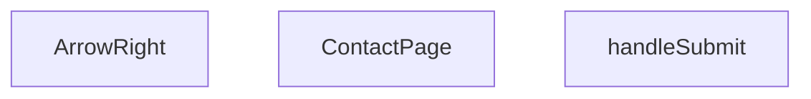

## Genel Bakış
Bu modül, VentHub HVAC platformunun iletişim sayfasını oluşturan React tabanlı bir bileşendir. Kullanıcıların iletişim taleplerini gönderebileceği form yapısını sunarken, form işlemleri ve sayfa içi küçük arayüz elemanlarını tek modül üzerinde toplar. Tüm iletişim sayfası işlevselliğini uçtan uca yönetir.

## Fonksiyon Grupları
### Ana Sayfa Bileşeni
Modülün temel çıktısı olan ana iletişim sayfası bileşenidir, sayfanın tüm kullanıcı arayüzü yapısını oluşturur ve modül içindeki diğer fonksiyonları entegre eder.
- ContactPage

### Form Gönderim Yöneticisi
İletişim formunun gönderim işlemini yöneten, form etkileşimlerini yakalayıp işleyen asenkron fonksiyondur, formun kurallara uygun şekilde işlenmesini sağlar.
- handleSubmit

### Yardımcı Arayüz Bileşeni
Sayfada kullanılan sağa yönelik ok ikonunu oluşturan, boyutu ayarlanabilen küçük, yeniden kullanılabilir özel arayüz bileşenidir.
- ArrowRight

---

## AXIOMS – Mimari Varsayımlar
Bu React tabanlı iletişim sayfası bileşeninin sorunsuz çalışması için React runtime ortamının, bağımlı alt bileşenlerin ve standart form gönderim olaylarını işleyen altyapının erişilebilir olması zorunludur.

[Aksiyom 1]: Eğer React kütüphanesi projeye entegre edilmemiş ve React.FormEvent tip tanımı mevcut değilse, handleSubmit fonksiyonu form gönderim olaylarını tanıyamaz ve iletişim formunun işlevselliği tamamen devre dışı kalır.
[Aksiyom 2]: Eğer ContactPage tarafından kullanılan ArrowRight alt bileşeni import edildiği konumda erişilebilir değilse, sayfa yüklenemez veya ikon öğesi oluşturulamaz, kullanıcı arayüzü eksik görüntülenir.
[Aksiyom 3]: Eğer ArrowRight bileşenine iletilen size prop'u sayı tipinde değilse, varsayılan 16 değerinin üzerine geçirilen yanlış tipte değer nedeniyle ikon beklenen boyutta görüntülenemez, kullanıcı arayüzü düzeninde bozulmalar oluşur.

---

## FONKSIYON DETAYLARI

### ContactPage
**Ne yapar**: VentHub HVAC projesinin iletişim sayfasını oluşturan ana React fonksiyonel bileşenidir. Tüm iletişim sayfasının görsel ve işlevsel yapısını barındırır, kullanıcıların site üzerinden şirketle iletişime geçmesi için gereken form ve içerikleri ekrana sunar.
**Nasıl yapar**: ContactPage.tsx dosyası içinde tanımlı olan React.FC türünde bileşen, içerdiği alt işlevler ve yardımcı bileşenler ile iletişim sayfasının tüm ihtiyaçlarını karşılar. Sayfa yüklemesi sırasında tüm içerik ve etkileşimli öğeleri tek bir bileşen çatısı altında toplayarak tarayıcıya render eder.
**Parametreler**: Herhangi bir giriş parametresi almaz.
**Dönüş**: Tanımlanan React.FC türünde bir değer döndürür, yani iletişim sayfasının tüm DOM yapısını React ekosistemine sunarak ekrana çizilmesini sağlar.

### handleSubmit
**Ne yapar**: ContactPage bileşeni içindeki iletişim formunun gönderim işlemini yöneten olay işleyici fonksiyonudur. Formun gönderilmesi sırasında tetiklenerek tüm gönderim akışını kontrol altına alır.
**Nasıl yapar**: Formun yerleşik gönderim olayını yakalar, olay parametresi üzerinden formun varsayılan tarayıcı davranışını engelleyerek özel bir iş akışı çalıştırır. Form üzerindeki kullanıcı girdilerinin doğrulanması, ilgili API isteğine yönlendirilmesi gibi işlemleri tetiklemek için temel olay yönetimini gerçekleştirir.
**Parametreler**:
- e: React.FormEvent — İletişim formunun gönderim olayını temsil eden, tüm olay özelliklerini barındıran React olay nesnesi
**Dönüş**: Dönüş tipi belirtilmemiştir, herhangi bir değer döndürmez, yalnızca form gönderim sürecini yönetir.

### ArrowRight
**Ne yapar**: ContactPage bileşeni içinde kullanılan, sağ yönlü ok ikonunu oluşturan yardımcı React bileşenidir. Kullanıcı arayüzündeki butonlar, yönlendirme linkleri veya diğer etkileşimli öğeler üzerinde ikon olarak kullanılır.
**Nasıl yapar**: Aldığı boyut parametresine göre ikonun piksel cinsinden boyutlarını ayarlar, standart bir sağ ok grafiğini ekrana render ederek istendiği yerde kullanılmasını sağlar. Varsayılan boyut değeri ile standart kullanım için uygun bir boyut sunar, ihtiyaç halinde boyut özel olarak ayarlanabilir.
**Parametreler**:
- size: number — İkonun piksel cinsinden genişlik ve yüksekliğini belirleyen isteğe bağlı parametre, varsayılan değeri 16'dır
**Dönüş**: Dönüş tipi belirtilmemiştir, yalnızca ilgili ikonun ekrana çizilmesi için gerekli yapıyı üretir.

---

## AST POINTERS

### [N1_NASIL] AST Pointer: C:\Users\alize\venthub-hvac\src\views\ContactPage.tsx::ContactPage
- **params**: (parametre yok)
- **ic_degiskenler**:
  - `t` — useI18n hook'undan alınan çeviri fonksiyonu, sayfa metinlerini çokdilli kullanmak için kullanılır
  - `formSubmitted` — İletişim formunun gönderilip gönderilmediğini takip eden boolean state değişkeni
  - `setFormSubmitted` — formSubmitted state'ini güncellemek için kullanılan React state setter fonksiyonu
  - `whatsappLink` - getSupportLink utility'siyle üretilen WhatsApp destek hattı bağlantısı
  - `heroBadgeRef` - Hero bölümündeki rozet elementi için scroll animasyonu DOM referansı
  - `heroBadgeVisible` - Hero rozetinin görünürlük durumunu tutan scroll animasyonu state'i
  - `contactGridRef` - İletişim kartları grid elementi için scroll animasyonu DOM referansı
  - `contactGridVisible` - İletişim grid'inin görünürlük durumunu tutan scroll animasyonu state'i
  - `formSuccessRef` - Form başarı mesajı elementi için scroll animasyonu DOM referansı
  - `formSuccessVisible` - Form başarı mesajının görünürlük durumunu tutan scroll animasyonu state'i
  - `contactCards` - Sayfada gösterilen 3 iletişim kartının tüm verilerini tutan nesne dizisi
  - `handleSubmit` - Form gönderim işlemini yöneten asenkron iç fonksiyon
- **Dönüş**: React JSX elementi (tam iletişim sayfası DOM yapısı)

### [N2_NASIL] AST Pointer: C:\Users\alize\venthub-hvac\src\views\ContactPage.tsx::handleSubmit
- **params**: e: React.FormEvent
- **ic_degiskenler**:
  - `e` — Form gönderim event nesnesi, tarayıcının varsayılan form yenileme davranışını engellemek için kullanılır
  - `setFormSubmitted` — Üst scope'tan alınan state setter, formun başarıyla gönderildiğini işaretlemek için kullanılır
- **Dönüş**: yok

### [N3_NASIL] AST Pointer: C:\Users\alize\venthub-hvac\src\views\ContactPage.tsx::contactCardsMapCallback
- **params**: card, i
- **ic_degiskenler**:
  - `card` — O anki döngüdeki iletişim kartının tüm verilerini içeren nesne
  - `i` — Döngüdeki kartın sıralama index'i, React anahtarı ve sıralı animasyon için kullanılır
  - `card.href` — Kartın tıklandığında yönlendireceği bağlantı adresi
  - `card.icon` — Kartta gösterilecek Lucide ikon bileşeni
  - `card.title` — Kartın başlık metni
  - `card.value` — Kartın ana içerik metni (telefon numarası, mail adresi vb.)
  - `card.label` — Kartın alt etkiket metni
  - `contactGridVisible` — Üst scope'tan alınan grid görünürlük state'i, scroll animasyonunu tetiklemek için kullanılır
- **Dönüş**: Tek iletişim kartı için React JSX elementi

### [N4_NASIL] AST Pointer: C:\Users\alize\venthub-hvac\src\views\ContactPage.tsx::ArrowRight
- **params**: { size = 16 }
- **ic_degiskenler**:
  - `size` — SVG ikonunun genişlik ve yükseklik değerini belirten parametre, varsayılan değeri 16
- **Dönüş**: Sağ ok simgesi için SVG React JSX elementi

---

## MERMAID CALL GRAPH

## NODE ID STANDARD

  file: src\views\ContactPage.tsx
  function: src\views\ContactPage.tsx::ContactPage
  function: src\views\ContactPage.tsx::handleSubmit
  function: src\views\ContactPage.tsx::ArrowRight

---

## DISA AKTARILANLAR (EXPORTS)
  export: ArrowRight
  export: ContactPage