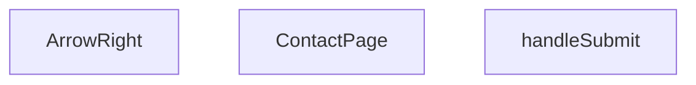

## Genel Bakış
Bu modül, VentHub uygulamasının iletişim sayfasını temsil eden tek bir React bileşeninden oluşur. Temel amacı, kullanıcıdan iletişim formu verilerini (e-posta, telefon, mesaj) toplayarak bu bilgileri sunucuya göndermektir.

## Fonksiyon Grupları
### Ana Sayfa Bileşeni
Modülün ana yapısını ve kullanıcı arayüzünü oluşturur; form alanlarını, başlığı ve gönderme butonunu render eder.
- ContactPage

### Form Veri İşleme
Kullanıcı formu gönderdiğinde tetiklenen mantıksal akışı yönetir; form verilerini toplar, doğrular ve bir eylem (örn. sunucuya gönderme) başlatır.
- handleSubmit

### Yardımcı UI Bileşenleri
Sayfa içinde tekrar kullanılabilen, küçük ve tek sorumlu görsel öğeleri sağlar.
- ArrowRight

---

## AXIOMS – Mimari Varsayımlar

Bu modül için sınırlı sayıda aksiyom tanımlanabilir; çünkü fonksiyon gövdeleri erişime açık değildir.

**[Aksiyom 1]**: Eğer `handleSubmit` fonksiyonu `React.FormEvent` parametresi almıyorsa, form gönderim olayı doğru yakalanamaz ve kullanıcı girişleri işlenemez.

**[Aksiyom 2]**: Eğer `ArrowRight` bileşeni `size` parametresi desteklemiyorsa, bileşen farklı bağlamda (buton, başlık vb.) kullanıldığında boyut ayarlanamaz ve tutarsız render oluşur.

**[Aksiyom 3]**: Eğer `ContactPage` bileşeni bir React form elemanı içermiyorsa, `handleSubmit` hiçbir zaman tetiklenemez ve sayfa işlevsiz kalır.

---

## FONKSİYON DETAYLARI

### ContactPage
**Ne yapar**: ContactPage, uygulamanın iletişim sayfasını temsil eden bir React fonksiyonel bileşenidir. Bu bileşen, kullanıcıların iletişim bilgilerini girebilecekleri bir form ve ilgili UI öğelerini içerir. Sayfa yüklendiğinde React tarafından render edilerek kullanıcı arayüzüne eklenir.  

**Nasıl yapar**: Fonksiyon, React.FC tipinde bir bileşen döndürür; bu sayede JSX içinde doğrudan kullanılabilir. İçerik, tipik bir React bileşeninin yaşam döngüsü ve render mantığına uygun olarak tanımlanır.  

**Parametreler**:  
- (yok): Bu fonksiyon parametre almaz; sadece bir bileşen tanımı döndürür.  

**Dönüş**: React.FC — bir React fonksiyonel bileşeni.

### handleSubmit
**Ne yapar**: handleSubmit, iletişim formu gönderildiğinde tetiklenen bir olay işleyicisidir. Form verilerini toplar, doğrulama adımlarını başlatabilir ve gönderim sürecini yönetir. İşlem tamamlandığında sayfa yenilenmesi veya başka bir UI güncellemesi yapılabilir.  

**Nasıl yapar**: Fonksiyon, React.FormEvent tipinde bir olay nesnesi alır ve bu nesnenin `preventDefault()` metodunu çağırarak tarayıcının varsayılan form gönderimini engeller. Ardından, form alanlarından değerler okunur ve gerekli iş mantığı (ör. API çağrısı) yürütülür.  

**Parametreler**:  
- e: React.FormEvent — Form gönderim olayını temsil eden nesne; olayın detaylerine ve hedef form elemanlarına erişim sağlar.  

**Dönüş**: Belirtilmemiş; genellikle `void` (geri dönüş değeri yok) olarak kullanılır.

### ArrowRight
**Ne yapar**: ArrowRight, sağa yön gösteren bir ikon bileşenidir ve UI içinde ok işareti olarak kullanılabilir. Varsayılan olarak 16 piksel boyutunda render edilir, ancak `size` parametresi ile farklı boyutlar ayarlanabilir. Bu bileşen, ikonun stil ve renk özelliklerini dışarıdan gelen props ile özelleştirmeye olanak tanır.  

**Nasıl yapar**: Fonksiyon, `size` adlı bir parametre alır; parametre verilmezse 16 değeri varsayılan olarak kullanılır. Bileşen, SVG veya benzeri bir grafik öğesi döndürerek belirtilen boyutta bir ok çizer.  

**Parametreler**:  
- size: number — Ok ikonunun genişlik ve yükseklik değerini belirler; varsayılan değer 16’dır.  

**Dönüş**: Belirtilmemiş; genellikle bir React bileşeni (JSX) döndürür, ancak döndürdüğü tip açıkça tanımlanmamıştır.

---

## İTHALATLAR (IMPORTS)
- import: ../components/HVACIcons::WhatsAppIcon
- import: ../components/Seo::Seo
- import: ../hooks/useScrollAnimation::scrollAnimationClasses
- import: ../hooks/useScrollAnimation::useScrollAnimation
- import: ../i18n/I18nProvider::useI18n
- import: ../utils/whatsapp::getSupportLink
- import: lucide-react::CheckCircle
- import: lucide-react::Clock
- import: lucide-react::Mail
- import: lucide-react::MapPin
- import: lucide-react::Phone
- import: react::React
- import: react::useState

---

## AST POINTERS

### [N1_NASIL] AST Pointer: ContactPage.tsx::ContactPage
- **params**: (yok)
- **ic_degiskenler**:
  - `t` — useI18n() hook'undan gelen çeviri fonksiyonu
  - `formSubmitted` — form gönderim durumunu tutan state değişkeni
  - `setFormSubmitted` — formSubmitted state'ini güncelleyen setter fonksiyonu
  - `whatsappLink` — getSupportLink() ile oluşturulan WhatsApp destek bağlantısı
  - `heroBadgeRef` — Hero badge bölümü için ref nesnesi
  - `heroBadgeVisible` — Hero badge bölümünün görünür olup olmadığını belirten boolean
  - `contactGridRef` — İletişim kartları grid'i için ref nesnesi
  - `contactGridVisible` — İletişim kartlarının görünür olup olmadığını belirten boolean
  - `formSuccessRef` — Form başarı mesajı bölümü için ref nesnesi
  - `formSuccessVisible` — Form başarı mesajının görünür olup olmadığını belirten boolean
  - `contactCards` — İletişim bilgilerini tutan dizi (Phone, Mail, MapPin ikonları ile)
- **Dönüş**: React.JSX.Element (sayfa yapısı)

### [N2_NASIL] AST Pointer: ContactPage.tsx::handleSubmit
- **params**: (e: React.FormEvent)
- **ic_degiskenler**: (yok)
- **Dönüş**: void (formSubmitted state'ini true yapar)

### [N3_NASIL] AST Pointer: ContactPage.tsx::ArrowRight
- **params**: ({ size = 16 })
- **ic_degiskenler**: (yok)
- **Dönüş**: React.JSX.Element (SVG ok ikonu)

---

## MERMAID CALL GRAPH

## NODE ID STANDARD

  file: src\views\ContactPage.tsx
  function: src\views\ContactPage.tsx::ContactPage
  function: src\views\ContactPage.tsx::handleSubmit
  function: src\views\ContactPage.tsx::ArrowRight

---

## DISA AKTARILANLAR (EXPORTS)
  export: ArrowRight
  export: ContactPage

---

## STİL TOKENLERİ

### Arbitrary Değerler (token'a geçirilmemiş)
- **shadow:** `hover:shadow-[0_30px_60px_-15px_rgba(0,0,0,0.05)]`
- **height:** (yok)
- **width:** (yok)
- **spacing:** (yok)
- **diğer:** (yok)

### Kullanılan Token'lar (zaten token'a geçirilmiş)
- `rounded-hvac-2xl`, `rounded-hvac-3xl`, `tracking-hvac-loose`, `tracking-hvac-wide`

### Tailwind Sınıf Özeti
- **Renkler:** `bg-blue-500/10`, `bg-cyan-500`, `bg-cyan-500/10`, `bg-cyan-500/20`, `bg-green-50`, `bg-slate-50`, `bg-slate-950`, `bg-white`, `border-b`, `border-cyan-500/20`, `border-none`, `border-slate-100`, `group-hover:bg-cyan-500`, `group-hover:text-white`, `hover:bg-cyan-400`
- **Layout:** `absolute`, `bottom-0`, `flex`, `gap-2`, `gap-24`, `gap-3`, `gap-4`, `gap-6`, `gap-8`, `grid`, `h-12`, `h-2`, `h-20`, `h-500px`, `inline-flex`
- **Varyant/Responsive:** `active:`, `focus-visible:`, `group-hover:`, `hover:`, `lg:`, `md:`, `sm:` önekleri
- **Yardımcı Sınıflar:** `active:scale-95`, `active:scale-98`, `animate-pulse`, `blur-120`, `border`, `duration-500`, `focus-visible:ring-2`, `focus-visible:ring-cyan-500`, `font-black`, `font-bold`, `font-extralight`, `font-light`, `font-medium`, `group`, `hover:underline`