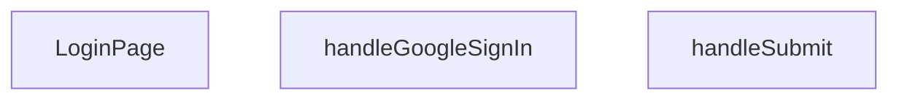

## Genel Bakış
Bu modül, VentHub HVAC uygulamasının giriş sayfasını sunan ana React bileşenidir. Kullanıcıların e-posta/şifre bilgileriyle veya Google OAuth hesabıyla oturum açmasına olanak tanıyan bir kimlik doğrulama arayüzü sağlar. Form gönderimi ve Google OAuth akışı gibi asenkron işlemleri yöneterek kullanıcı kimlik doğrulama deneyimini koordine eder.

## Fonksiyon Grupları
### Sayfa Bileşeni
Giriş sayfasının tüm kullanıcı arayüzünü, form alanlarını ve kimlik doğrulama seçeneklerini bir arada sunan ana React bileşenidir.
- LoginPage

### Kimlik Doğrulama İşleyicileri
Kullanıcının e-posta/şifre bilgilerini sunucuya göndererek veya Google OAuth akışını başlatarak giriş yapmasını sağlayan asenkron olay işleyicileridir.
- handleSubmit, handleGoogleSignIn

---

## AXIOMS – Mimari Varsayımlar

Bu modül, kimlik doğrulama işlemleri içeren bir React bileşeni olduğundan, bazı temel mimari varsayımlar mevcuttur. Varsayımlar, sadece fonksiyon imzaları ve modülün amacından yola çıkarak belirlenmiştir.

[Aksiyom 1]: Eğer `LoginPage` bileşeni dış bir kimlik doğrulama servisi veya context ile bağımlılık enjeksiyonu yoluyla bağımlılıklarını (örneğin, `login` ve `googleSignIn` fonksiyonları) almıyorsa, bileşen kendi içinde bu servisleri import ederek kullanıyordur. Aksi halde, form gönderimi veya Google OAuth işlemleri çağrılamaz.

[Aksiyom 2]: Eğer `handleSubmit` fonksiyonu `React.FormEvent` parametresi almıyorsa, formun varsayılan提交 davranışı (sayfa yenileme) engellenemez ve bu durum istenmeyen bir kullanıcı deneyimine yol açar.

[Aksiyom 3]: Eğer `handleGoogleSignIn` fonksiyonu bir OAuth akışını tetiklemiyorsa (örneğin, bir `authClient` nesnesi veya `signInWithPopup` methodu kullanmıyorsa), kullanıcı Google hesabıyla giriş yapamaz. Bu durum, kimlik doğrulama seçeneğinin işlevsiz kalmasına neden olur.

[Aksiyom 4]: Eğer bileşen içinde bir `useNavigate` veya `useHistory` hook'u kullanılmıyorsa, başarılı bir giriş işleminden sonra kullanıcı otomatik olarak başka bir sayfaya (örneğin dashboard'a) yönlendirilemez. Kullanıcı giriş sayfasında kalır.

[Aksiyom 5]: Eğer bileşenin state yönetimi (örneğin `useState` hook'ları) email, şifre ve hata durumları için tanımlı değilse, form alanlarının değerleri takip edilemez ve kullanıcıya hata mesajları gösterilemez. Bu durum formun hiçbir zaman submit edilemeyeceği anlamına gelir.

---

## FONKSİYON DETAYLARI

### LoginPage
**Ne yapar**: Geliştirildi ancak detay üretilemedi.

### handleSubmit
**Ne yapar**: Geliştirildi ancak detay üretilemedi.

### handleGoogleSignIn
**Ne yapar**: Geliştirildi ancak detay üretilemedi.

---

## İTHALATLAR (IMPORTS)
- import: ../hooks/useAuth::useAuth
- import: ../i18n/I18nProvider::useI18n
- import: ../utils/routes::Routes
- import: @/lib/supabase/client::supabaseBrowserClient
- import: lucide-react::ArrowLeft
- import: lucide-react::Eye
- import: lucide-react::EyeOff
- import: lucide-react::Loader2
- import: lucide-react::Lock
- import: lucide-react::Mail
- import: next/link::Link
- import: next/navigation::useRouter
- import: next/navigation::useSearchParams
- import: react::React
- import: react::useState
- import: sonner::toast

---

## AST POINTERS

### [N1_NASIL] AST Pointer: LoginPage.tsx::LoginPage
- **params**: (parametre yok)
- **ic_degiskenler**:
  - `isPending` — Login isteği devam edip etmediğini takip eden boolean state
  - `signIn` — useAuth hook'undan gelen giriş fonksiyonu
  - `email` — Kullanıcının email adresi için string state
  - `password` — Kullanıcının şifresi için string state
  - `showPassword` — Şifre alanının görünür olup olmadığını kontrol eden boolean state
  - `rememberMe` — "Beni hatırla" seçeneği için boolean state
  - `router` — Next.js yönlendirme hook'u
  - `searchParams` — URL arama parametrelerini okumak için hook
  - `t` — useI18n hook'undan gelen çeviri fonksiyonu
  - `from` — Redirect parametresinden gelen veya '/' olan yönlendirme yolu
  - `handleSubmit` — Form gönderme işlevi (iç fonksiyon)
  - `handleGoogleSignIn` — Google ile giriş işlevi (iç fonksiyon)
- **Dönüş**: React JSX elementi (login sayfası formu)

### [N2_NASIL] AST Pointer: LoginPage.tsx::handleSubmit
- **params**: (e: React.FormEvent)
- **ic_degiskenler**:
  - `e` — Form submit event nesnesi, preventDefault ile varsayılan davranış engellenir
  - `result` — signIn fonksiyonunun dönüş değeri (error veya success durumunu içerir)
- **Dönüş**: yok (async void, yan etkiler: toast bildirimleri, yönlendirme)

### [N3_NASIL] AST Pointer: LoginPage.tsx::handleGoogleSignIn
- **params**: (parametre yok)
- **ic_degiskenler**:
  - `origin` — Tarayıcı kök URL'i veya localhost fallback
  - `redirectTo` — OAuth sonrası yönlendirilecek tam URL
  - `error` — supabase.auth.signInWithOAuth çağrısından dönen hata nesnesi
- **Dönüş**: yok (async void, yan etkiler: console.error, toast bildirimleri)

---

## MERMAID CALL GRAPH

## NODE ID STANDARD

  file: src\views\LoginPage.tsx
  function: src\views\LoginPage.tsx::LoginPage
  function: src\views\LoginPage.tsx::handleSubmit
  function: src\views\LoginPage.tsx::handleGoogleSignIn

---

## DISA AKTARILANLAR (EXPORTS)
  export: LoginPage

---

## STİL TOKENLERİ

### Arbitrary Değerler (token'a geçirilmemiş)
Yok — tüm stiller token'a geçirilmiş. ✅

### Kullanılan Token'lar (zaten token'a geçirilmiş)
- `tracking-hvac-25`, `tracking-hvac-normal`

### Tailwind Sınıf Özeti
- **Renkler:** `bg-clean-white`, `bg-gradient-to-br`, `bg-login-radial`, `bg-primary-navy`, `bg-repeat`, `bg-white`, `bg-white/90`, `border-light-gray`, `border-t`, `border-white/20`, `focus-visible:border-primary-ocean`, `from-air-blue`, `from-primary-navy`, `group-hover:text-primary-navy`, `hover:bg-industrial-gray`
- **Layout:** `absolute`, `backdrop-blur-sm`, `block`, `flex`, `from-air-blue`, `from-primary-navy`, `gap-3`, `group-hover:shadow-login-btn-hover`, `h-16`, `h-4`, `h-5`, `inline-flex`, `items-center`, `justify-between`, `justify-center`
- **Varyant/Responsive:** `active:`, `disabled:`, `focus-visible:`, `group-hover:`, `hover:`, `placeholder:` önekleri
- **Yardımcı Sınıflar:** `active:scale-98`, `animate-spin`, `border`, `cursor-pointer`, `disabled:opacity-70`, `duration-500`, `focus-visible:ring-2`, `focus-visible:ring-primary-ocean/20`, `font-bold`, `font-medium`, `group`, `group-hover:-translate-y-1`, `inset-0`, `inset-y-0`, `mb-2`