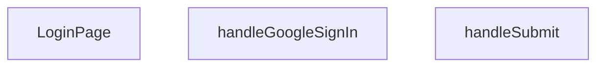

## Genel Bakış
Bu modül, VentHub HVAC uygulamasının giriş sayfasını sunan React bileşenidir. Kullanıcıların e-posta ve şifreyle veya Google hesabıyla oturum açmasına olanak tanır. Form gönderilirken bekleme durumunu yöneterek kullanıcı deneyimini iyileştirir.

## Fonksiyon Grupları
### Sayfa Bileşeni
Giriş sayfasının kullanıcı arayüzünü, form alanlarını ve kimlik doğrulama seçeneklerini bir arada sunan ana React bileşenidir.
- LoginPage

### Kimlik Doğrulama İşlemleri
Kullanıcının e-posta/şifre bilgilerini sunucuya göndererek veya Google OAuth akışını başlatarak giriş yapmasını sağlayan olay işleyicileridir.
- handleSubmit, handleGoogleSignIn

---

## AXIOMS – Mimari Varsayımlar

Bu modül, bir React giriş sayfası bileşenidir ve kimlik doğrulama akışlarını yönetir.

**[Aksiyom 1]:** Eğer React FormEvent nesnesi handleSubmit'e iletilemezse (form elementi mevcut değilse veya event bağlanmamışsa), form gönderimi gerçekleşmez ve kullanıcı giriş yapamaz.

**[Aksiyom 2]:** Eğer Google OAuth kimlik doğrulama servisi yapılandırılmamışsa veya Google istemci ID'si (Client ID) mevcut değilse, handleGoogleSignIn fonksiyonu çalıştırıldığında Google ile giriş akışı başarısız olur.

**[Aksiyom 3]:** Eğer handleSubmit içinde post-submit yönlendirme/sonuç mekanizması tanımlanmamışsa, form başarıyla gönderildikten sonra kullanıcı sayfada kalır ve durum belirsizleşir.

**[Aksiyom 4]:** Eğer handleGoogleSignIn, Google popup/redirect akışını tetikleyen bir kütüphane (örn: firebase auth, gapi) ile entegre değilse, Google ile giriş butonu işlevsiz kalır.

---

**Not:** Bu modül için fonksiyon gövdeleri verilmediğinden, içsel iş mantığı (API çağrı noktaları, state yönetimi, hata işleme stratejileri, yönlendirme mantığı) hakkında kesin çıkarım yapılamamıştır. Aksiyomlar yalnızca fonksiyon imzalarından türetilen yapısal gereksinimleri yansıtmaktadır.

---

## FONKSİYON DETAYLARI

### LoginPage
**Ne yapar**: Geliştirildi ancak detay üretilemedi.

### handleSubmit
**Ne yapar**: Geliştirildi ancak detay üretilemedi.

### handleGoogleSignIn
**Ne yapar**: Geliştirildi ancak detay üretilemedi.

---

## AST POINTERS

### [N1_NASIL] AST Pointer: `src/views/LoginPage.tsx`::LoginPage
- **params**: (parametre yok)
- **ic_degiskenler**:
  - `isPending` — form gönderim işleminin bekleme durumunu tutar, true olduğunda buton spinner gösterir
  - `setIsPending` — isPending durumunu güncellemek için setter
  - `signIn` — `useAuth()` hook'undan alınan giriş fonksiyonu, email/password ile kimlik doğrulama yapar
  - `email` — kullanıcı tarafından girilen e-posta adresi state'i
  - `setEmail` — email state'ini güncellemek için setter
  - `password` — kullanıcı tarafından girilen şifre state'i
  - `setPassword` — password state'ini güncellemek için setter
  - `showPassword` — şifrenin görünür/plain-text mi yoksa gizli mi olduğunu tutar
  - `setShowPassword` — showPassword durumunu toggle eder
  - `rememberMe` — "beni hatırla" checkbox'ının durumu, varsayılan true
  - `setRememberMe` — rememberMe state'ini günceller
  - `router` — `useRouter()` ile alınan Next.js yönlendirici nesnesi, sayfa geçişleri ve refresh için kullanılır
  - `searchParams` — `useSearchParams()` ile alınan URL query parametreleri nesnesi
  - `t` — `useI18n()` hook'undan alınan çeviri fonksiyonu, dil-sensitive metinler için kullanılır
  - `from` — `searchParams?.get('redirect')` değerinden veya varsayılan `'/'` olarak alınan yönlendirme hedef URL'i
  - `handleSubmit` — form submit handler, inner async fonksiyon olarak tanımlanır
  - `handleGoogleSignIn` — Google OAuth giriş handler'ı, inner async fonksiyon olarak tanımlanır
- **Dönüş**: JSX (React functional component return)

---

### [N2_NASIL] AST Pointer: `src/views/LoginPage.tsx`::handleSubmit
- **params**: `e: React.FormEvent` — form submit olay nesnesi, varsayılan davranışı durdurmak için kullanılır
- **ic_degiskenler**:
  - `result` — `signIn(email, password)` çağrısının dönüş değeri; `.error` alanını kontrol eder, hata varsa hata mesajı gösterir, yoksa başarılı giriş bildirimi verir
- **Dönüş**: yok (void)
- **Yan etkiler**: `e.preventDefault()` ile sayfa yenilenmesini engeller; `toast.error`/`toast.success` ile bildirim gösterir; `router.refresh()` ile sayfa verilerini yeniler; `router.push(from as import('next').Route)` ile redirect URL'ine yönlendirir

---

### [N3_NASIL] AST Pointer: `src/views/LoginPage.tsx`::handleGoogleSignIn
- **params**: (parametre yok)
- **ic_degiskenler**:
  - `origin` — `window.location.origin` değerini tutar, tarayıcı tarafında çalışıp çalışmadığını kontrol eder (`typeof window !== 'undefined'`); sunucu tarafında ise `'http://localhost:3000'` fallback'i kullanılır
  - `redirectTo` — Google OAuth callback URL'ini oluşturur: `` `${origin}${Routes.auth.callback()}` ``
  - `error` — `supabase.auth.signInWithOAuth()` çağrısından destructure edilen hata nesnesi; varsa konsola yazdırır ve toast gösterir
  - `e` — catch bloğundaki exception değişkeni, beklenmeyen hataları yakalar
- **Dönüş**: yok (void)
- **Yan etkiler**: `supabase.auth.signInWithOAuth({ provider: 'google', options: { redirectTo } })` ile Google OAuth akışını başlatır; hata durumunda `console.error` ve `toast.error` ile hata bildirimi yapar

---

## MERMAID CALL GRAPH

## NODE ID STANDARD

  file: src\views\LoginPage.tsx
  function: src\views\LoginPage.tsx::LoginPage
  function: src\views\LoginPage.tsx::handleSubmit
  function: src\views\LoginPage.tsx::handleGoogleSignIn

---

## DISA AKTARILANLAR (EXPORTS)
  export: LoginPage

---

## STİL TOKENLERİ

### Arbitrary Değerler (token'a geçirilmemiş)
Yok — tüm stiller token'a geçirilmiş. ✅

### Kullanılan Token'lar (zaten token'a geçirilmiş)
- `tracking-hvac-25`, `tracking-hvac-normal`

### Tailwind Sınıf Özeti
- **Renkler:** `bg-clean-white`, `bg-gradient-to-br`, `bg-login-radial`, `bg-primary-navy`, `bg-repeat`, `bg-white`, `bg-white/90`, `border-light-gray`, `border-t`, `border-white/20`, `focus-visible:border-primary-ocean`, `from-air-blue`, `from-primary-navy`, `group-hover:text-primary-navy`, `hover:bg-industrial-gray`
- **Layout:** `absolute`, `backdrop-blur-sm`, `block`, `flex`, `from-air-blue`, `from-primary-navy`, `gap-3`, `group-hover:shadow-login-btn-hover`, `h-16`, `h-4`, `h-5`, `inline-flex`, `items-center`, `justify-between`, `justify-center`
- **Varyant/Responsive:** `active:`, `disabled:`, `focus-visible:`, `group-hover:`, `hover:`, `placeholder:` önekleri
- **Yardımcı Sınıflar:** `active:scale-98`, `animate-spin`, `border`, `cursor-pointer`, `disabled:opacity-70`, `duration-500`, `focus-visible:ring-2`, `focus-visible:ring-primary-ocean/20`, `font-bold`, `font-medium`, `group`, `group-hover:-translate-y-1`, `inset-0`, `inset-y-0`, `mb-2`