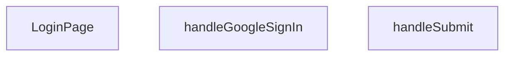

## Genel Bakış
Bu modül, VentHub HVAC sisteminin kullanıcı giriş sayfasını oluşturan React tabanlı bir ön yüz bileşenidir. Kullanıcıların kimlik doğrulama işlemlerini gerçekleştirebileceği arayüzü sunar, hem standart form tabanlı giriş hem de Google ile üçüncü parti giriş yöntemlerini destekler.

## Fonksiyon Grupları
### Ana Giriş Sayfası Bileşeni
Giriş sayfasının temel React bileşenini oluşturur, sayfanın tüm arayüz yapısını ve kullanıcı etkileşimleri için altyapıyı sağlar.
- LoginPage

### Kimlik Doğrulama İşleyicileri
Kullanıcı giriş akışlarını yöneten asenkron işlevleri barındırır, hem standart form gönderimini hem de Google ile üçüncü parti giriş isteklerini işleyerek kimlik doğrulama sürecini yürütür.
- handleSubmit, handleGoogleSignIn

---

## AXIOMS – Mimari Varsayımlar
Bu React tabanlı kullanıcı giriş sayfası modülünün sorunsuz çalışması, React runtime ortamının varlığı, kimlik doğrulama servisleri ile entegrasyonu ve ilgili frontend altyapılarının modüle bağlı olarak çalışmasına bağlıdır.

[Aksiyom 1]: Eğer React çalışma zamanı (runtime) ortamı mevcut değilse, LoginPage ana bileşeni işlenemez, giriş arayüzü hiçbir şekilde kullanıcıya sunulamaz.
[Aksiyom 2]: Eğer React form olay yönetimi altyapısı çalışmıyor ve React.FormEvent türü tanımsız kalıyorsa, handleSubmit fonksiyonu tetiklenemez, kullanıcının form üzerinden girdiği kimlik bilgileri doğrulama servisine iletilemez.
[Aksiyom 3]: Eğer Google OAuth kimlik doğrulama servisi ile modül düzeyinde entegrasyon sağlanmamışsa, handleGoogleSignIn fonksiyonu çalışmaz, Google hesapları ile giriş işlemi hiçbir şekilde gerçekleştirilemez.
[Aksiyom 4]: Eğer uygulama içi kimlik doğrulama sonrası oturum yönetimi altyapısı modüle entegre edilmemişse, başarılı giriş sonrası kullanıcının oturumu korunamaz, uygulama içi yetkilendirme gerektiren sayfalara erişimi engellenir.

---

## FONKSIYON DETAYLARI

### LoginPage
**Ne yapar**: VentHub HVAC projesinin giriş sayfasını oluşturan ana React bileşenidir, kullanıcıların sisteme erişim sağlamak için kullanacağı tüm giriş seçeneklerini ve arayüz elemanlarını ekrana sunar. Proje içindeki kimlik doğrulama akışının başlangıç noktası olan bu sayfa, kullanıcıyı sisteme giriş yaptıktan sonra ana panele yönlendirme işlemlerinin temelini oluşturur.
**Nasıl yapar**: LoginPage.tsx dosyası içerisinde tanımlanan ana bileşen olarak, kendi bünyesindeki form gönderimi ve Google ile giriş işlemlerini yöneten yardımcı fonksiyonları arayüz elemanlarıyla bağlar, giriş sayfasının tüm görsel ve işlevsel yapısını React bileşeni standartlarına uygun olarak birleştirir.
**Parametreler**: Herhangi bir parametre almaz
**Dönüş**: React.FC tipi, yani kullanıcı tarafından görüntülenebilir ve etkileşime açık giriş sayfası arayüzünü içeren React bileşeni döndürür.

### handleSubmit
**Ne yapar**: Kullanıcının e-posta ve şifre ile doldurduğu giriş formunun gönderim olayını yöneten özel işleyici fonksiyondur, formun standart web davranışıyla yenilenmesini engelleyerek projenin özel kimlik doğrulama akışını çalıştırır. Giriş formundan alınan kullanıcı bilgilerinin doğrulanması ve yetkilendirme servisine iletilmesi sürecini başlatır.
**Nasıl yapar**: Formun gönderim sırasında tetiklenen olayı yakalar, olay üzerinden forma girilen kullanıcı verilerine erişir, öncelikli temel doğrulama kontrollerini yaptıktan sonra yetkilendirme işlemlerini tetikler.
**Parametreler**:
- name: e, type: React.FormEvent — HTML formunun gönderim olayını temsil eden, tüm yerel form olay özelliklerini barındıran React uyumlu olay nesnesi
**Dönüş**: Dönüş tipi belirtilmemiştir, herhangi bir değer döndürmeyen void türünde işlem fonksiyonudur.

### handleGoogleSignIn
**Ne yapar**: Kullanıcının üçüncü parti Google hesabıyla sisteme giriş yapma isteğini yöneten olay işleyici fonksiyondur, Google OAuth yetkilendirme akışını proje standartlarına uygun olarak tetikler. Kullanıcıların şifre ile giriş yerine hızlıca Google hesaplarıyla sisteme erişim sağlamasını mümkün kılar.
**Nasıl yapar**: Kullanıcı arayüz üzerindeki "Google ile giriş" butonuna tıkladığında çalışır, entegre edilen üçüncü parti kimlik doğrulama servisini çağırarak Google'ın yetkilendirme ekranının açılmasını sağlar, başarılı giriş sonrası gerekli yönlendirme ve kullanıcı bilgisini kaydetme işlemlerini başlatır.
**Parametreler**: Herhangi bir parametre almaz
**Dönüş**: Dönüş tipi belirtilmemiştir, herhangi bir değer döndürmeyen void türünde işlem fonksiyonudur.

---

## AST POINTERS

### [N1_NASIL] AST Pointer: C:\Users\alize\venthub-hvac\src\views\LoginPage.tsx::LoginPage
- **params**: (parametre yok)
- **ic_degiskenler**:
  - `isPending` — Giriş işleminin yüklenme durumunu tutan state değişkeni, true iken submit butonu devre dışı bırakılır
  - `setIsPending` — isPending state değerini güncelleyen React state setter fonksiyonu
  - `signIn` — useAuth hook'undan alınan email/şifre ile kimlik doğrulaması yapan giriş fonksiyonu
  - `email` — Kullanıcının giriş formuna girdiği email adresini tutan state değişkeni
  - `setEmail` — email state değerini güncelleyen React state setter fonksiyonu
  - `password` — Kullanıcının giriş formuna girdiği şifreyi tutan state değişkeni
  - `setPassword` — password state değerini güncelleyen React state setter fonksiyonu
  - `showPassword` — Şifrenin ekranda gösterilip gösterilmeyeceğini kontrol eden state değişkeni
  - `setShowPassword` — showPassword state değerini güncelleyen React state setter fonksiyonu
  - `rememberMe` — "Beni hatırla" seçeneğinin aktiflik durumunu tutan state değişkeni
  - `setRememberMe` — rememberMe state değerini güncelleyen React state setter fonksiyonu
  - `router` — useRouter hook'undan alınan Next.js yönlendirme işlemleri için kullanılan nesne
  - `searchParams` — useSearchParams hook'undan alınan URL sorgu parametrelerine erişim sağlayan nesne
  - `t` — useI18n hook'undan alınan çeviri metinlerine erişim sağlayan fonksiyon
  - `from` — URL'deki redirect parametresinden alınan, giriş sonrası yönlendirilecek adres, varsayılan değeri '/'
- **Dönüş**: React.FC (React JSX görünümü)

### [N2_NASIL] AST Pointer: C:\Users\alize\venthub-hvac\src\views\LoginPage.tsx::handleSubmit
- **params**: (e: React.FormEvent)
- **ic_degiskenler**:
  - `e` — Form gönderim olayını temsil eden nesne, varsayılan form yenileme davranışını engellemek için kullanılır
  - `setIsPending` — Üst bileşenden erişilen yüklenme durumunu güncelleyen state setter
  - `signIn` — Kimlik doğrulama giriş fonksiyonu, kullanıcı bilgileriyle oturum açmak için çağrılır
  - `email` — Üst bileşenden erişilen kullanıcının girdiği email adresi
  - `password` — Üst bileşenden erişilen kullanıcının girdiği şifre
  - `result` — signIn fonksiyonundan dönen, hata veya başarı durumunu içeren yanıt nesnesi
  - `result.error` — signIn işlemi sırasında oluşan hatayı tutan nesne
  - `result.error.message` — Oluşan hatanın kullanıcıya gösterilecek metin içeriği
  - `toast` — Kullanıcıya bildirim göstermek için kullanılan react-hot-toast kütüphanesi fonksiyonu
  - `t` — Çeviri metinlerine erişen i18n fonksiyonu
  - `router` — Next.js yönlendirme nesnesi, sayfa yenileme ve yönlendirme işlemleri için kullanılır
  - `from` — Giriş başarılı olduktan sonra kullanıcının yönlendirileceği hedef adres
- **Dönüş**: yok (async void, sadece yan etki üretir)

### [N3_NASIL] AST Pointer: C:\Users\alize\venthub-hvac\src\views\LoginPage.tsx::handleGoogleSignIn
- **params**: (parametre yok)
- **ic_degiskenler**:
  - `origin` — Uygulamanın çalıştığı kök adres, tarayıcı ortamında window.location.origin, sunucu tarafında varsayılan olarak `http://localhost:3000`
  - `redirectTo` — Google OAuth ile giriş sonrası yönlendirilecek uygulama içi callback adresi
  - `Routes.auth.callback()` — Rota yönetimi sabitlerinden alınan OAuth callback sayfasının rotasını döndüren fonksiyon
  - `supabase.auth.signInWithOAuth` — Supabase kimlik doğrulama servisinin Google ile OAuth girişini başlatan fonksiyonu
  - `error` — OAuth işlemi sırasında oluşan hatayı tutan nesne
  - `console.error` — Tarayıcı konsoluna hata mesajı yazdıran fonksiyon
  - `toast` — Kullanıcıya bildirim göstermek için kullanılan react-hot-toast fonksiyonu
  - `t` — Çeviri metinlerine erişen i18n fonksiyonu
  - `e` — Catch bloğunda yakalanan beklenmedik istisna nesnesi
- **Dönüş**: yok (async void, sadece yan etki üretir)

---

## MERMAID CALL GRAPH

## NODE ID STANDARD

  file: src\views\LoginPage.tsx
  function: src\views\LoginPage.tsx::LoginPage
  function: src\views\LoginPage.tsx::handleSubmit
  function: src\views\LoginPage.tsx::handleGoogleSignIn

---

## DISA AKTARILANLAR (EXPORTS)
  export: LoginPage