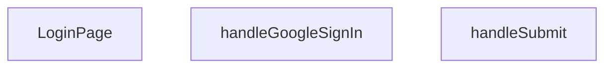

## Genel Bakış
Bu modül, VentHub HVAC uygulamasının giriş sayfasını sunan React bileşenidir. Kullanıcıların e-posta/şifre bilgileriyle veya Google hesabıyla oturum açmasına olanak tanıyan bir kimlik doğrulama arayüzü sağlar. Form gönderimi ve Google OAuth akışı gibi asenkron işlemleri yöneterek kullanıcı deneyimini koordine eder.

## Fonksiyon Grupları
### Sayfa Bileşeni
Giriş sayfasının tüm kullanıcı arayüzünü, form alanlarını ve kimlik doğrulama seçeneklerini bir arada sunan ana React bileşenidir.
- LoginPage

### Kimlik Doğrulama İşleyicileri
Kullanıcının e-posta/şifre bilgilerini sunucuya göndererek veya Google OAuth akışını başlatarak giriş yapmasını sağlayan asenkron olay işleyicileridir.
- handleSubmit, handleGoogleSignIn

---

## AXIOMS – Mimari Varsayımlar

Bu modül için, fonksiyon gövdelerinden üretilen somot mimari varsayımlar belirlenememiştir. Verilen fonksiyon imzaları (LoginPage, handleSubmit, handleGoogleSignIn) sadece imza bilgisi içermektedir; parametrelerin kullanımı, koşul kontrolleri, bağımlılık enjeksiyonu veya hata yönetimi ile ilgili fonksiyon gövdesi detayları paylaşılmamıştır. Dolayısıyla, bu modülün doğru çalışması için var olması gereken koşullar hakkında yalnızca işlevsel beklentilerden çıkarım yapılarak genel nitelikte aksiyomlar tanımlanabilir.

Aşağıda, fonksiyon imzaları ve eski dokümandan elde edilebilen işlevsel bilgiler ışığında çıkarılabilecek olası mimari varsayımlar listelenmektedir:

[Aksiyom 1]: Eğer React Form bileşeni doğru şekilde bağlanmamışsa (yani `handleSubmit` formun `onSubmit` olayına atanmamışsa), form gönderimi tetiklenemez ve kullanıcı giriş yapamaz.
[Aksiyom 2]: Eğer `handleGoogleSignIn` fonksiyonu Google OAuth istemci kimliğini veya ilgili API anahtarını alamıyorsa (örneğin ortam değişkeni eksikse), Google ile giriş akışı başlatılamaz.
[Aksiyom 3]: Eğer form gönderilirken (`handleSubmit` içinde) bekleme durumu (loading state) doğru yönetilmiyorsa, kullanıcı aynı anda birden fazla istek gönderebilir veya gönderim durumu UI'da doğru yansıtılmaz.
[Aksiyom 4]: Eğer kimlik doğrulama isteği başarısız olursa ve hata kullanıcıya gösterilmiyorsa, kullanıcı giriş yapamadığını anlamaz ve UI donuk kalır.

---

## FONKSİYON DETAYLARI

### LoginPage
**Ne yapar**: Geliştirildi ancak detay üretilemedi.

### handleSubmit
**Ne yapar**: Geliştirildi ancak detay üretilemedi.

### handleGoogleSignIn
**Ne yapar**: Geliştirildi ancak detay üretilemedi.

---

## AST POINTERS

### [N1_NASIL] AST Pointer: src/views/LoginPage.tsx::LoginPage
- **params**: () — parametre yok (React FC, props almıyor)
- **ic_degiskenler**:
  - `isPending` — useState boolean, giriş işlemi süresince true olarak butonu devre dışı bırakır ve spinner gösterir
  - `signIn` — useAuth hook'undan dönen giriş fonksiyonu, email/password ile authentication başlatır
  - `email` — useState string, email input değerini tutar
  - `password` — useState string, şifre input değerini tutar
  - `showPassword` — useState boolean, şifre alanının show/hide durumunu kontrol eder
  - `rememberMe` — useState boolean, "beni hatırla" checkbox değeri (varsayılan true)
  - `router` — useRouter hook'undan dönen Next.js router instance, sayfa yönlendirme için kullanılır
  - `searchParams` — useSearchParams hook'undan dönen URL search parametreleri nesnesi
  - `t` — useI18n hook'undan dönen çeviri fonksiyonu, çoklu dil metinleri için kullanılır
  - `from` — string, `searchParams?.get('redirect') || '/'` sonucu, giriş sonrası yönlenecek URL
- **Dönüş**: JSX — Login sayfasının tam UI'ı (form, Google giriş butonu, register linki, brand footer)

### [N2_NASIL] AST Pointer: src/views/LoginPage.tsx::handleSubmit
- **params**: `(e: React.FormEvent)` — form submit olay objesi
- **ic_degiskenler**:
  - `result` — signIn(email, password) çağrısının dönüş değeri, `result.error.message` ile hata mesajı alınır
- **Dönüş**: yok — yan etkiler: toast.success veya toast.error ile bildirim, router.refresh() ve router.push(from) ile yönlendirme

### [N3_NASIL] AST Pointer: src/views/LoginPage.tsx::handleGoogleSignIn
- **params**: () — parametre yok
- **ic_degiskenler**:
  - `origin` — string, `typeof window !== 'undefined' ? window.location.origin : 'http://localhost:3000'` koşuluyla belirlenen base URL
  - `redirectTo` — string, `` `${origin}${Routes.auth.callback()}` `` ile oluşturulmuş OAuth callback URL'i
  - `error` — `{ error }` destructured değer, `supabase.auth.signInWithOAuth` sonucundaki hata nesnesi
- **Dönüş**: yok — yan etkiler: supabase.auth.signInWithOAuth ile OAuth başlatır, hata durumunda console.error ve toast.error

---

## MERMAID CALL GRAPH

## NODE ID STANDARD

  file: src\views\LoginPage.tsx
  function: src\views\LoginPage.tsx::LoginPage
  function: src\views\LoginPage.tsx::handleSubmit
  function: src\views\LoginPage.tsx::handleGoogleSignIn

---

## DISA AKTARILANLAR (EXPORTS)
  export: LoginPage

---

## STİL TOKENLERİ

### Arbitrary Değerler (token'a geçirilmemiş)
Yok — tüm stiller token'a geçirilmiş. ✅

### Kullanılan Token'lar (zaten token'a geçirilmiş)
- `tracking-hvac-25`, `tracking-hvac-normal`

### Tailwind Sınıf Özeti
- **Renkler:** `bg-clean-white`, `bg-gradient-to-br`, `bg-login-radial`, `bg-primary-navy`, `bg-repeat`, `bg-white`, `bg-white/90`, `border-light-gray`, `border-t`, `border-white/20`, `focus-visible:border-primary-ocean`, `from-air-blue`, `from-primary-navy`, `group-hover:text-primary-navy`, `hover:bg-industrial-gray`
- **Layout:** `absolute`, `backdrop-blur-sm`, `block`, `flex`, `from-air-blue`, `from-primary-navy`, `gap-3`, `group-hover:shadow-login-btn-hover`, `h-16`, `h-4`, `h-5`, `inline-flex`, `items-center`, `justify-between`, `justify-center`
- **Varyant/Responsive:** `active:`, `disabled:`, `focus-visible:`, `group-hover:`, `hover:`, `placeholder:` önekleri
- **Yardımcı Sınıflar:** `active:scale-98`, `animate-spin`, `border`, `cursor-pointer`, `disabled:opacity-70`, `duration-500`, `focus-visible:ring-2`, `focus-visible:ring-primary-ocean/20`, `font-bold`, `font-medium`, `group`, `group-hover:-translate-y-1`, `inset-0`, `inset-y-0`, `mb-2`