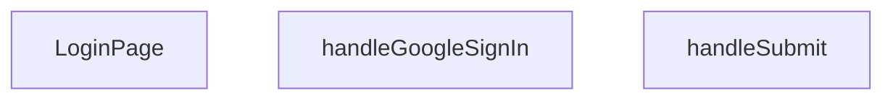

## Genel Bakış
Bu modül, VentHub HVAC uygulamasının giriş sayfasını oluşturan temel React bileşenidir. Kullanıcıların e-posta ve şifre bilgileriyle veya Google OAuth hesabıyla oturum açmalarını sağlayan bir kimlik doğrulama arayüzü sunar. Form gönderimi ve Google OAuth gibi asenkron işlemleri yöneterek kullanıcı girişinin güvenli ve sorunsuz bir şekilde gerçekleştirilmesini koordine eder.

## Fonksiyon Grupları
### Sayfa Bileşeni
Giriş sayfasının tüm kullanıcı arayüzünü, form alanlarını ve kimlik doğrulama seçeneklerini bir arada sunan ana React bileşenidir.
- LoginPage

### Kimlik Doğrulama İşleyicileri
Kullanıcının e-posta/şifre bilgilerini sunucuya göndererek veya Google OAuth akışını başlatarak giriş yapmasını sağlayan asenkron olay işleyicileridir.
- handleSubmit, handleGoogleSignIn

---

## AXIOMS – Mimari Varsayımlar
- Bu modül davranışsal mantık içermez (salt veri / konfigürasyon / tip tanımı).
- [Aksiyom 1]: Modülün dışa açtığı yapı (anahtar kümesi / şema) bir sözleşmedir; tüketiciler bu sabit yapıya bağlıdır — kırıcı değişiklik tüm tüketicileri etkiler.
- [Aksiyom 2]: Bir öğe ekleme/çıkarma yapısal-uyumlu olmalı; ilgili tipler ve seçiciler aynı commit'te güncel tutulmalıdır.

---

## FONKSİYON DETAYLARI

### LoginPage
**Ne yapar**: Geliştirildi ancak detay üretilemedi.

### handleSubmit
**Ne yapar**: Geliştirildi ancak detay üretilemedi.

### handleGoogleSignIn
**Ne yapar**: Geliştirildi ancak detay üretilemedi.

---

## İTHALATLAR (IMPORTS)
- import: ../hooks/useAuth::useAuth
- import: ../i18n/I18nProvider::useI18n
- import: ../utils/routes::Routes
- import: ../utils/routes::localizedHref
- import: @/lib/supabase/client::supabaseBrowserClient
- import: lucide-react::AlertCircle
- import: lucide-react::ArrowLeft
- import: lucide-react::Eye
- import: lucide-react::EyeOff
- import: lucide-react::Loader2
- import: lucide-react::Lock
- import: lucide-react::Mail
- import: next/link::Link
- import: next/navigation::useRouter
- import: next/navigation::useSearchParams
- import: react::React
- import: react::useState
- import: sonner::toast

---

## AST POINTERS

### [N1_NASIL] AST Pointer: src/views/LoginPage.tsx::LoginPage
- **params**: (parametre yok)
- **ic_degiskenler**:
  - `isPending` / `setIsPending` — `useState(false)` ile tanımlı; form gönderilirken yükleme durumunu tutar, butonu devre dışı bırakır ve spinner gösterir
  - `signIn` — `useAuth()` hook'undan destructure edilen; Supabase ile e-posta/şifre giriş işlemini başlatan fonksiyon
  - `email` / `setEmail` — `useState('')` ile tanımlı; e-posta input alanının değerini tutar
  - `password` / `setPassword` — `useState('')` ile tanımlı; şifre input alanının değerini tutar
  - `showPassword` / `setShowPassword` — `useState(false)` ile tanımlı; şifre input'unun `type` özelliğini `'text'` veya `'password'` olarak değiştirir
  - `rememberMe` / `setRememberMe` — `useState(true)` ile tanımlı; "Beni hatırla" checkbox durumunu tutar
  - `router` — `useRouter()` ile alınan Next.js router nesnesi; `router.refresh()` ve `router.push()` çağrılarında kullanılır
  - `searchParams` — `useSearchParams()` ile alınan URL search params nesnesi; `?.get()` ile parametre okumak için kullanılır
  - `t` — `useI18n()` hook'undan destructure edilen çeviri fonksiyonu; tüm UI metinlerini yerelleştirir
  - `lang` — `useI18n()` hook'undan destructure edilen dil kodu; `localizedHref()` çağrılarında URL yolunu yerelleştirmek için kullanılır
  - `from` — `searchParams?.get('redirect')` veya `searchParams?.get('from')` değerlerinden ilki, yoksa `'/'`; başarılı giriş sonrası yönlendirme hedefi
  - `errorParam` — `searchParams?.get('error')` değeri; URL'de varsa hata mesajı olarak alert alanında gösterilir
  - `expired` — `searchParams?.get('reason') === 'expired` karşılaştırmasının sonucu; oturum süresi dolmuşsa `true` olur ve "Oturum süreniz doldu" uyarısı gösterilir
  - `handleSubmit` — form `onSubmit` olayına bağlı iç async fonksiyon; `signIn` çağrısı yapar, hata veya başarı durumuna göre toast gösterir, başarılıysa `from` adresine yönlendirir
  - `handleGoogleSignIn` — Google OAuth butonuna bağlı iç async fonksiyon; `supabase.auth.signInWithOAuth` ile Google giriş akışını başlatır
- **Dönüş**: JSX (React.FC) — giriş sayfasının tam UI çıktısını döndürür

### [N2_NASIL] AST Pointer: src/views/LoginPage.tsx::handleSubmit
- **params**:
  - `e` — `React.FormEvent`; form submit olayını temsil eder, `e.preventDefault()` ile varsayılan davranışı engeller
- **ic_degiskenler**:
  - `result` — `await signIn(email, password)` çağrısının dönüş değeri; `{ error }` içerir, hata varsa `result.error.message` okunur
  - `raw` — `result.error.message || ''`; Supabase'den gelen ham hata metni, boşsa `''` atanır
  - `mapped` — `raw` string'i üzerinde `includes()` kontrolleri yapılarak belirlenen çevrilmiş hata mesajı; `'Email not confirmed'` ise `t('auth.emailNotConfirmed')`, `'Invalid login credentials'` ise `t('auth.invalidCreds')`, diğer durumlarda `raw` veya `t('auth.genericLoginError')` kullanılır
- **Dönüş**: yok (void) — yan etki olarak toast mesajı gösterir, başarılı girişte `router.refresh()` ve `router.push(localizedHref(from, lang))` çağırır, `finally` bloğunda `setIsPending(false)` ile yükleme durumunu sıfırlar

### [N3_NASIL] AST Pointer: src/views/LoginPage.tsx::handleGoogleSignIn
- **params**: (parametre yok)
- **ic_degiskenler**:
  - `origin` — `typeof window !== 'undefined'` kontrolü ile tarayıcı ortamında `window.location.origin`, sunucu ortamında `'http://localhost:3000'` değeri atanır; OAuth yönlendirme URL'inin kök adresini belirler
  - `redirectTo` — `` `${origin}${Routes.auth.callback()}` `` template literal ile oluşturulan tam callback URL'i; Google OAuth sonrası kullanıcı bu adrese yönlendirilir
  - `error` — `await supabase.auth.signInWithOAuth(...)` çağrısından destructure edilen hata nesnesi; varsa `console.error` ile loglanır ve `toast.error(t('auth.googleSignInFail'))` gösterilir
  - `e` — `catch` bloğundaki exception nesnesi; `console.error('Google sign-in exception:', e)` ile loglanır ve `toast.error(t('auth.googleSignInError'))` gösterilir
- **Dönüş**: yok (void) — yan etki olarak Google OAuth akışını başlatır, hata durumunda konsola log yazar ve toast mesajı gösterir

---

## MERMAID CALL GRAPH

## NODE ID STANDARD

  file: src\views\LoginPage.tsx
  function: src\views\LoginPage.tsx::LoginPage
  function: src\views\LoginPage.tsx::handleSubmit
  function: src\views\LoginPage.tsx::handleGoogleSignIn

---

## DISA AKTARILANLAR (EXPORTS)
  export: LoginPage

---

## STİL TOKENLERİ

### Arbitrary Değerler (token'a geçirilmemiş)
Yok — tüm stiller token'a geçirilmiş. ✅

### Kullanılan Token'lar (zaten token'a geçirilmiş)
- `tracking-hvac-25`, `tracking-hvac-normal`

### Tailwind Sınıf Özeti
- **Renkler:** `bg-clean-white`, `bg-error-red/10`, `bg-gradient-to-br`, `bg-login-radial`, `bg-primary-navy`, `bg-repeat`, `bg-white`, `bg-white/90`, `border-error-red/30`, `border-light-gray`, `border-t`, `border-white/20`, `focus-visible:border-primary-ocean`, `from-air-blue`, `from-primary-navy`
- **Layout:** `absolute`, `backdrop-blur-sm`, `block`, `flex`, `from-air-blue`, `from-primary-navy`, `gap-2`, `gap-3`, `group-hover:shadow-login-btn-hover`, `h-16`, `h-4`, `h-5`, `inline-flex`, `items-center`, `items-start`
- **Varyant/Responsive:** `active:`, `disabled:`, `focus-visible:`, `group-hover:`, `hover:`, `placeholder:` önekleri
- **Yardımcı Sınıflar:** `active:scale-98`, `animate-spin`, `border`, `cursor-pointer`, `disabled:opacity-70`, `duration-500`, `focus-visible:ring-2`, `focus-visible:ring-primary-ocean/20`, `font-bold`, `font-medium`, `group`, `group-hover:-translate-y-1`, `inset-0`, `inset-y-0`, `mb-2`