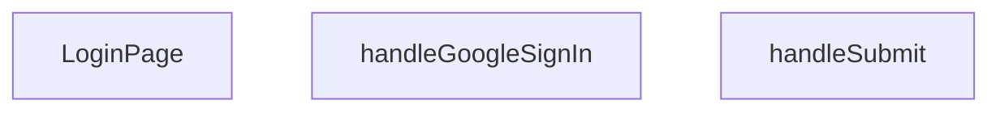

## Genel Bakış
Bu modül, VentHub HVAC uygulamasının giriş sayfasını oluşturan temel React bileşenidir. Kullanıcıların e-posta ve şifre bilgileriyle veya Google OAuth hesabıyla oturum açmalarını sağlayan bir kimlik doğrulama arayüzü sunar. Form gönderimi ve Google OAuth gibi asenkron işlemleri yöneterek kullanıcı girişinin güvenli ve sorunsuz bir şekilde gerçekleştirilmesini koordine eder.

## Fonksiyon Grupları
### Sayfa Bileşeni
Giriş sayfasının tüm kullanıcı arayüzünü, form alanlarını ve kimlik doğrulama seçeneklerini bir arada sunan ana React bileşenidir.
- LoginPage

### Kimlik Doğrulama İşleyicileri
Kullanıcının e-posta/şifre bilgilerini sunucuya göndererek veya Google OAuth akışını başlatarak giriş yapmasını sağlayan asenkron olay işleyicileridir.
- handleSubmit, handleGoogleSignIn

---

## AXIOMS – Mimari Varsayımlar

Bu modül, bir React giriş sayfası bileşeni olup fonksiyon imzalarına dayalı mimari varsayımlar aşağıdadır.

**[Aksiyom 1]:** Eğer `handleSubmit` fonksiyonuna geçerli bir `React.FormEvent` nesnesi sağlanmazsa, form gönderimi doğru işlenemez ve kimlik doğrulama akışı başlatılamaz.

**[Aksiyom 2]:** Eğer `handleGoogleSignIn` fonksiyonu çağrıldığında harici Google OAuth servis yapılandırması (client ID, redirect URI vb.) mevcut değilse, Google ile giriş işlemi başarısız olur.

**[Aksiyom 3]:** Eğer `LoginPage` bileşeni React bileşen ağacı içinde bir `<form>` elementi ile kullanılmazsa, `handleSubmit` fonksiyonu tetiklenemez ve kullanıcı e-posta/şifre ile giriş yapamaz.

**[Aksiyom 4]:** Eğer `handleSubmit` veya `handleGoogleSignIn` asenkron işlemleri sırasında bir hata yakalanmazsa (try-catch veya .catch), kullanıcıya hata geri bildirimi sunulmaz ve uygulama beklenmedik şekilde başarısız olur.

**[Aksiyom 5]:** Eğer `handleSubmit` fonksiyonu çağrıldığında form içindeki e-posta ve şifre alanları boş veya geçersiz değerler içeriyorsa, sunucu tarafı kimlik doğrulaması başarısız olur (bu alanların doğrulaması bu modülün dışında gerçekleşir).

---

> **Not:** Bu aksiyomlar yalnızca fonksiyon imzalarından türetilmiştir. Fonksiyon gövdelerinin içeriği, state yönetimi, API çağrı detayları ve hata işleme stratejileri hakkında bilinmeyenler mevcuttur; bunlar hakkında varsayımda bulunulmamıştır.

---

## FONKSİYON DETAYLARI

### LoginPage
**Ne yapar**: Geliştirildi ancak detay üretilemedi.

### handleSubmit
**Ne yapar**: Geliştirildi ancak detay üretilemedi.

### handleGoogleSignIn
**Ne yapar**: Geliştirildi ancak detay üretilemedi.

---

## İTHALATLAR (IMPORTS)
- import: ../hooks/useAuth::useAuth
- import: ../i18n/I18nProvider::useI18n
- import: ../utils/routes::Routes
- import: ../utils/routes::localizedHref
- import: @/lib/supabase/client::supabaseBrowserClient
- import: lucide-react::ArrowLeft
- import: lucide-react::Eye
- import: lucide-react::EyeOff
- import: lucide-react::Loader2
- import: lucide-react::Lock
- import: lucide-react::Mail
- import: next/link::Link
- import: next/navigation::useRouter
- import: next/navigation::useSearchParams
- import: react::React
- import: react::useState
- import: sonner::toast

---

## AST POINTERS

### [N1_NASIL] AST Pointer: src/views/LoginPage.tsx::LoginPage
- **params**: (parametre yok — React fonksiyon bileşeni)
- **ic_degiskenler**:
  - `isPending` — useState hook'u, form gönderimi sırasında loading durumunu takip eder, true olduğunda buton spinner gösterir
  - `setIsPending` — isPending durumunu güncellemek için setter
  - `signIn` — useAuth hook'undan gelen kimlik doğrulama fonksiyonu, email/şifre ile giriş yapar
  - `email` — useState hook'u, kullanıcı email giriş alanının değeri
  - `setEmail` — email değerini güncellemek için setter
  - `password` — useState hook'u, kullanıcı şifre giriş alanının değeri
  - `setPassword` — password değerini güncellemek için setter
  - `showPassword` — useState hook'u, şifre alanının görünür/gizli durumunu kontrol eder
  - `setShowPassword` — showPassword durumunu toggle eden setter
  - `rememberMe` — useState hook'u, "beni hatırla" checkbox durumu, başlangıç değeri true
  - `setRememberMe` — rememberMe değerini güncelleyen setter
  - `router` — useRouter hook'undan gelen Next.js router, sayfa yönlendirme ve yenileme için kullanılır
  - `searchParams` — useSearchParams hook'undan gelen URLSearchParams, redirect parametresini okumak için kullanılır
  - `t` — useI18n hook'undan gelen çeviri fonksiyonu, tüm metinlerin uluslararasılaştırılması için kullanılır
  - `lang` — useI18n hook'undan gelen güncel dil kodu, localizedHref içinde URL dilini belirler
  - `from` — searchParams'dan `redirect` query parametresi alınarak oluşturulur, fallback olarak `'/'` kullanılır; giriş sonrası yönlendirme hedefini tutar
  - `handleSubmit` — form submit handler, inner function olarak tanımlanır
  - `handleGoogleSignIn` — Google OAuth giriş handler'ı, inner function olarak tanımlanır
- **Dönüş**: JSX — Tam login sayfası görünümü (form, Google sign-in butonu, register linki, brand footer)

---

### [N2_NASIL] AST Pointer: src/views/LoginPage.tsx::handleSubmit
- **params**: `(e: React.FormEvent)` — form submit olay nesnesi, e.preventDefault() ile varsayılan davranış engellenir
- **ic_degiskenler**:
  - `result` — signIn(email, password) asenkron çağrısının dönüş değeri, `.error` alanı varsa hata olduğunu gösterir, başarılıysa kullanıcı giriş yapmıştır
  - `email` — dış kapsamdan (LoginPage) erişilen useState değeri, kullanıcının girdiği email adresi
  - `password` — dış kapsamdan erişilen useState değeri, kullanıcının girdiği şifre
  - `signIn` — dış kapsamdan erişilen useAuth fonksiyonu, supabase auth ile email/şifre girişi yapar
  - `setIsPending` — dış kapsamdan erişilen setter, loading durumunu true/false yapar
  - `toast` — sonner kütüphanesinden import edilen bildirim fonksiyonu, success/error mesajları gösterir
  - `t` — dış kapsamdan erişilen çeviri fonksiyonu, auth.loginSuccess ve auth.genericLoginError anahtarlarından çevirileri alır
  - `router` — dış kapsamdan erişilen Next.js router, .refresh() ile sayfayı yeniler, .push() ile yönlendirme yapar
  - `from` — dış kapsamdan erişilen değişken, yönlendirme hedef URL'si
  - `lang` — dış kapsamdan erişilen dil kodu, localizedHref içinde URL oluşturmak için kullanılır
- **Dönüş**: yok — Yan etkiler: toast bildirimleri gösterir, başarılı girişte sayfayı yeniler ve yönlendirir, finally bloğunda isPending'i false yapar

---

### [N3_NASIL] AST Pointer: src/views/LoginPage.tsx::handleGoogleSignIn
- **params**: (parametre yok)
- **ic_degiskenler**:
  - `origin` — tarayıcı tarafında `window.location.origin` değerini alır; sunucu tarafında (SSR) `'http://localhost:3000'` fallback'i kullanılır; OAuth redirect URL'sinin kök DOMAIN kısmını oluşturur
  - `redirectTo` — origin ve `Routes.auth.callback()` birleştirilerek oluşturulan tam callback URL'si, Google OAuth'tan sonra yönlendirme yapılacak adres
  - `error` — `supabase.auth.signInWithOAuth()` çağrısının destructuring ile alınan hata nesnesi; null ise başarılı, değilse hata olduğunu gösterir
  - `e` — catch bloğunda yakalanan istisna nesnesi, Google sign-in sırasında beklenmeyen bir hata oluştuğunda loglanır
  - `supabase` — dış kapsamdan import edilen supabase browser client, Supabase API'sine istek yapar
  - `t` — dış kapsamdan erişilen çeviri fonksiyonu, auth.googleSignInFail ve auth.googleSignInError çevirilerini alır
- **Dönüş**: yok — Yan etkiler: Google OAuth akışını başlatır (tarayıcıyı Google yetkilendirme sayfasına yönlendirir), hata oluşursa console'a log yazar ve toast bildirimi gösterir

---

## MERMAID CALL GRAPH

## NODE ID STANDARD

  file: src\views\LoginPage.tsx
  function: src\views\LoginPage.tsx::LoginPage
  function: src\views\LoginPage.tsx::handleSubmit
  function: src\views\LoginPage.tsx::handleGoogleSignIn

---

## DISA AKTARILANLAR (EXPORTS)
  export: LoginPage

---

## STİL TOKENLERİ

### Arbitrary Değerler (token'a geçirilmemiş)
Yok — tüm stiller token'a geçirilmiş. ✅

### Kullanılan Token'lar (zaten token'a geçirilmiş)
- `tracking-hvac-25`, `tracking-hvac-normal`

### Tailwind Sınıf Özeti
- **Renkler:** `bg-clean-white`, `bg-gradient-to-br`, `bg-login-radial`, `bg-primary-navy`, `bg-repeat`, `bg-white`, `bg-white/90`, `border-light-gray`, `border-t`, `border-white/20`, `focus-visible:border-primary-ocean`, `from-air-blue`, `from-primary-navy`, `group-hover:text-primary-navy`, `hover:bg-industrial-gray`
- **Layout:** `absolute`, `backdrop-blur-sm`, `block`, `flex`, `from-air-blue`, `from-primary-navy`, `gap-3`, `group-hover:shadow-login-btn-hover`, `h-16`, `h-4`, `h-5`, `inline-flex`, `items-center`, `justify-between`, `justify-center`
- **Varyant/Responsive:** `active:`, `disabled:`, `focus-visible:`, `group-hover:`, `hover:`, `placeholder:` önekleri
- **Yardımcı Sınıflar:** `active:scale-98`, `animate-spin`, `border`, `cursor-pointer`, `disabled:opacity-70`, `duration-500`, `focus-visible:ring-2`, `focus-visible:ring-primary-ocean/20`, `font-bold`, `font-medium`, `group`, `group-hover:-translate-y-1`, `inset-0`, `inset-y-0`, `mb-2`