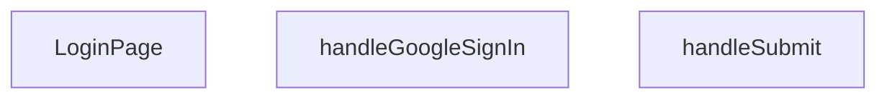

## Genel Bakış
Bu modül, kullanıcıların uygulamaya giriş yapmasını sağlayan bir giriş sayfası bileşeni sunar. E-posta ve şifre ile geleneksel girişin yanı sıra Google hesabı ile kimlik doğrulama seçeneğini de içerir. Sayfa, form gönderimi ve buton tıklamaları gibi kullanıcı etkileşimlerini yöneten olay işleyicilerle donatılmıştır.

## Fonksiyon Grupları
### Sayfa Bileşeni
Giriş sayfasının temel yapısını, kullanıcı arayüzünü ve alt bileşenlerin düzenini tanımlar.
- LoginPage

### Giriş İşlemleri
Kullanıcının kimlik bilgilerini doğrulamak için e-posta/şifre gönderimini ve Google hesabı ile giriş akışını asenkron olarak gerçekleştirir.
- handleSubmit, handleGoogleSignIn

---

## AXIOMS – Mimari Varsayımlar
Bu modül için özel aksiyom tanımlanmamıştır.

---

## FONKSİYON DETAYLARI

### LoginPage
**Ne yapar**: Geliştirildi ancak detay üretilemedi.

### handleSubmit
**Ne yapar**: Geliştirildi ancak detay üretilemedi.

### handleGoogleSignIn
**Ne yapar**: Geliştirildi ancak detay üretilemedi.

---

## AST POINTERS

### [N1_NASIL] AST Pointer: C:\Users\alize\venthub-hvac\src\views\LoginPage.tsx::LoginPage
- **params**: (parametre yok)
- **ic_degiskenler**:
  - `isPending` — `useState(false)` ile tanımlanmış, form gönderimi sırasında bekleme durumunu tutar.
  - `setIsPending` — `isPending` değerini güncellemek için kullanılan state setter fonksiyonu.
  - `signIn` — `useAuth()` hookundan alınan, e‑posta ve şifre ile kimlik doğrulama yapan fonksiyon.
  - `email` — `useState('')` ile tanımlanmış, kullanıcı tarafından girilen e‑posta adresini tutar.
  - `setEmail` — `email` değerini güncellemek için kullanılan state setter fonksiyonu.
  - `password` — `useState('')` ile tanımlanmış, kullanıcı tarafından girilen şifreyi tutar.
  - `setPassword` — `password` değerini güncellemek için kullanılan state setter fonksiyonu.
  - `showPassword` — `useState(false)` ile tanımlanmış, şifre alanının metin/şifre tipinde gösterilip gösterilmeyeceğini belirler.
  - `setShowPassword` — `showPassword` değerini güncellemek için kullanılan state setter fonksiyonu.
  - `rememberMe` — `useState(true)` ile tanımlanmış, “Beni hatırla” seçeneğinin işaretli olup olmadığını tutar.
  - `setRememberMe` — `rememberMe` değerini güncellemek için kullanılan state setter fonksiyonu.
  - `router` — `useRouter()` hookundan alınan, sayfa yönlendirmeleri ve yenileme işlemleri için kullanılan nesne.
  - `searchParams` — `useSearchParams()` hookundan alınan, URL sorgu parametrelerine erişim sağlayan nesne.
  - `t` — `useI18n()` hookundan alınan, çok‑dilli çeviri fonksiyonu.
  - `from` — `searchParams?.get('redirect') || '/'` ifadesiyle elde edilen, başarılı giriş sonrası yönlendirilecek yol.
  - `handleSubmit` — form gönderildiğinde çalıştırılan, kimlik doğrulama, toast bildirimleri ve yönlendirme yapan async fonksiyon.
  - `handleGoogleSignIn` — Google OAuth ile giriş yapmayı sağlayan async fonksiyon.
- **Dönüş**: React bileşeni JSX döndürür; yan etkileri yoktur (render).

### [N2_NASIL] AST Pointer: C:\Users\alize\venthub-hvac\src\views\LoginPage.tsx::handleSubmit
- **params**: `e` — `React.FormEvent` nesnesi.
- **ic_degiskenler**:
  - `e` — form submit olayını temsil eder; `preventDefault()` ile varsayılan gönderim engellenir.
  - `result` — `await signIn(email, password)` çağrısının döndürdüğü nesne; `error` alanı varsa hata, yoksa başarılı oturum açma.
  - `isPending` — `setIsPending(true)` ile işlem başladığında true, `finally` bloğunda false yapılır.
- **Dönüş**: yok (fonksiyon içinde yan etkiler: state güncelleme, toast bildirimleri, router.refresh ve router.push).

### [N3_NASIL] AST Pointer: C:\Users\alize\venthub-hvac\src\views\LoginPage.tsx::handleGoogleSignIn
- **params**: (parametre yok)
- **ic_degiskenler**:
  - `origin` — tarayıcı ortamında `window.location.origin`, sunucu ortamında `'http://localhost:3000'` olarak belirlenen temel URL.
  - `redirectTo` — `${origin}${Routes.auth.callback()}` ifadesiyle oluşturulan, Google OAuth sonrası yönlendirme URL’i.
  - `error` — `await supabase.auth.signInWithOAuth(... )` çağrısının döndürdüğü nesnedeki hata bilgisi.
- **Dönüş**: yok (fonksiyon içinde yan etkiler: console.error, toast.error).

---

## MERMAID CALL GRAPH

## NODE ID STANDARD

  file: src\views\LoginPage.tsx
  function: src\views\LoginPage.tsx::LoginPage
  function: src\views\LoginPage.tsx::handleSubmit
  function: src\views\LoginPage.tsx::handleGoogleSignIn

---

## DISA AKTARILANLAR (EXPORTS)
  export: LoginPage

---

## STİL TOKENLERİ

### Arbitrary Değerler (token'a geçirilmemiş)
Yok — tüm stiller token'a geçirilmiş. ✅

### Kullanılan Token'lar (zaten token'a geçirilmiş)
- `tracking-hvac-25`, `tracking-hvac-normal`

### Tailwind Sınıf Özeti
- **Renkler:** `bg-clean-white`, `bg-gradient-to-br`, `bg-login-radial`, `bg-primary-navy`, `bg-repeat`, `bg-white`, `bg-white/90`, `border-light-gray`, `border-t`, `border-white/20`, `from-air-blue`, `from-primary-navy`, `text-2xl`, `text-center`, `text-industrial-gray`
- **Layout:** `absolute`, `backdrop-blur-sm`, `block`, `flex`, `from-air-blue`, `from-primary-navy`, `gap-3`, `group-hover:-translate-y-1`, `group-hover:shadow-login-btn-hover`, `group-hover:text-primary-navy`, `h-16`, `h-4`, `h-5`, `inline-flex`, `items-center`
- **Responsive:** (yok)