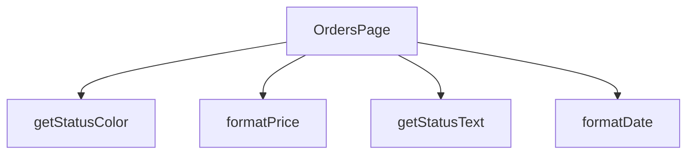

## Genel Bakış
OrdersPage modülü, VentHub HVAC uygulamasının sipariş yönetimi arayüzünü oluşturan temel React sayfasıdır. Sipariş listesini sunar, kullanıcının durum filtrelemesi yapmasını sağlar ve sipariş detaylarını gösterir. Modül, ham veri değerlerini (tarih, fiyat, durum kodları) arayüzde okunabilir ve tutarlı bir şekilde formatlayan yardımcı fonksiyonlar içerir; bu soyutlama sayesinde ana bileşenin sorumlulukları netleşir ve kodun bakım kolaylığı artar.

## Fonksiyon Grupları
### Sayfa Bileşeni ve Ana Mantık
Sipariş sayfasının tüm yaşam döngüsünü (veri çekme, filtreleme, durum yönetimi) ve kullanıcı arayüzünün yapısını kontrol eden ana React bileşenidir. Bileşen, iç bağımlılıklar olarak Yardımcı Format Fonksiyonlarını çağırarak verileri görsel formata dönüştürür.
- OrdersPage

### Yardımcı Format Fonksiyonları
Sipariş verilerinin temel bileşenlerini (tarih dizeleri, sayısal fiyatlar, durum kodları) kullanıcı arayüzünde doğrudan gösterilecek standart formatlara ve renklere dönüştürerek soyutlayan işlevlerdir. Bu fonksiyonlar, bileşen içindeki tekrar eden formatlama mantığını kaldırır ve görünüm tutarlılığını sağlar.
- formatDate, formatPrice, getStatusColor, getStatusText

---

## AXIOMS – Mimari Varsayımlar

Bu modül için aksiyomlar, fonksiyon imzalarındaki parametre tiplerinden ve dönüş tiplerinden türetilmiştir.

**[Aksiyom 1]:** Eğer `formatDate` fonksiyonuna string olmayan bir değer (örn: `Date` objesi veya `number` timestamp) verilirse, fonksiyon beklenmedik sonuç döner veya hata oluşur.

**[Aksiyom 2]:** Eğer `formatPrice` fonksiyonuna `number` olmayan bir değer (örn: string fiyat "150.00") verilirse, fonksiyon beklenmedik sonuç döner veya hata oluşur.

**[Aksiyom 3]:** Eğer `getStatusColor` veya `getStatusText` fonksiyonlarına geçerli olmayan bir status string'i verilirse (örn: boş string, null, veya tanınmayan bir durum), beklenmeyen renk/metin döner veya varsayılan bir değer döndürülmeyebilir.

**[Aksiyom 4]:** Eğer `OrdersPage` bileşeni çağrılmadan önce sipariş verisi (tarih, fiyat, durum alanları) hazırlanmamışsa veya bu alanların tipleri yukarıdaki formatlara uymuyorsa, sayfa hatalı render edilir.

**[Aksiyom 5]:** `OrdersPage` fonksiyonu `React.FC` dönüş tipine sahiptir — bileşen React fiber ağacına bağlanabilir bir JSX döndürmelidir; farklı bir dönüş tipi beklenmemelidir.

---

**Not:** Bu modülde herhangi bir modül sabiti veya eşik değeri tanımlanmadığından, buna ilişkin ek aksiyom bulunmamaktadır. `formatDate`, `formatPrice`, `getStatusColor` ve `getStatusText` fonksiyonlarının gövdeleri verilmediğinden, hangi string değerlerinin geçerli kabul edildiği ve hangi dönüşlerin yapıldığı bilinmemektedir.

---

## FONKSİYON DETAYLARI

### OrdersPage
**Ne yapar**: Fonksiyonun amacı ve işlevi kaynak kodunda belirtilmemiştir.  
**Nasıl yapar**: İç mantığı hakkında bilgi bulunmamaktadır.  
**Parametreler**:  
- (parametre yok)  
**Dönüş**: `React.FC` – bir React fonksiyonel bileşeni tipini döndürür.

### formatDate
**Ne yapar**: Fonksiyonun ne amaçla kullanıldığı ve ne yaptığı belirtilmemiştir.  
**Nasıl yapar**: İşlevsel içeriği hakkında bilgi mevcut değildir.  
**Parametreler**:  
- `dateString`: `string` — tarih bilgisini içeren metin.  
**Dönüş**: Belirtilmemiştir (return tipi bilinmiyor).

### formatPrice
**Ne yapar**: Fonksiyonun görevi ve çıktısı kaynakta tanımlanmamıştır.  
**Nasıl yapar**: İç mantığı hakkında veri bulunmamaktadır.  
**Parametreler**:  
- `price`: `number` — fiyat değerini temsil eden sayı.  
**Dönüş**: Belirtilmemiştir (return tipi bilinmiyor).

### getStatusColor
**Ne yapar**: Fonksiyonun işlevi ve kullanım amacı açıklanmamıştır.  
**Nasıl yapar**: İşlevsel detayları mevcut değildir.  
**Parametreler**:  
- `status`: `string` — durum bilgisini ifade eden metin.  
**Dönüş**: Belirtilmemiştir (return tipi bilinmiyor).

### getStatusText
**Ne yapar**: Fonksiyonun ne yaptığı ve ne döndürdüğü kaynakta yer almamaktadır.  
**Nasıl yapar**: İç mantığı hakkında bilgi yoktur.  
**Parametreler**:  
- `status`: `string` — durum bilgisini temsil eden metin.  
**Dönüş**: Belirtilmemiştir (return tipi bilinmiyor).

---

## İTHALATLAR (IMPORTS)
- import: ../hooks/useAuth::useAuth
- import: ../hooks/useLocalizedRoutes::useLocalizedRoutes
- import: ../i18n/I18nProvider::useI18n
- import: ../i18n/datetime::formatDateTime
- import: ../i18n/format::formatCurrency
- import: ../lib/type-converters::isRecord
- import: @/lib/supabase/client::supabaseBrowserClient
- import: lucide-react::Calendar
- import: lucide-react::CreditCard
- import: lucide-react::Eye
- import: lucide-react::Package
- import: lucide-react::ShoppingBag
- import: next/navigation::useRouter
- import: next/navigation::useSearchParams
- import: react::React
- import: react::useEffect
- import: react::useState
- import: sonner::toast

---

## INTERFACES

### Order
- `id: string`
- `total_amount: number`
- `status: string`
- `payment_status?: string`
- `created_at: string`
- `customer_name: string`
- `customer_email: string`
- `shipping_address: unknown`
- `order_items: OrderItem[]`
- `order_number?: string`
- `is_demo?: boolean`
- `payment_data?: unknown`
- `conversation_id?: string`
- `carrier?: string`
- `tracking_number?: string`
- `tracking_url?: string`
- `shipped_at?: string`
- `delivered_at?: string`

### OrderItem
- `id: string`
- `product_id?: string`
- `product_name: string`
- `quantity: number`
- `unit_price: number`
- `total_price: number`
- `product_image_url?: string`

---

## TYPE ALIASES

### StatusFilter
```typescript
type StatusFilter = 'all' | 'pending' | 'paid' | 'shipped' | 'delivered' | 'failed'
```

---

## AST POINTERS

### [N1_NASIL] AST Pointer: src/views/OrdersPage.tsx::OrdersPage
- **params**: ()
- **ic_degiskenler**:
  - `setLoading` — loading durumunu güncelleyen state setter
  - `setOrders` — sipariş listesini güncelleyen state setter
  - `setProductFilter` — ürün filtresini güncelleyen state setter
  - `supabase` — Supabase tarayıcı istemcisi, veritabanı sorguları için
  - `user` — useAuth hook'undan gelen mevcut kullanıcı nesnesi
  - `authLoading` — kimlik doğrulama durumunun yüklenme bayrağı
  - `searchParams` — URL arama parametrelerini okuyan hook çıktısı
  - `router` — Next.js yönlendirme nesnesi
  - `t` — useI18n hook'undan gelen çeviri fonksiyonu
  - `lang` — useI18n hook'undan gelen aktif dil kodu
  - `Routes` — useLocalizedRoutes hook'undan gelen rotalar nesnesi
  - `loading` — sayfa yüklenme durumu boolean
  - `orders` — sipariş listesi state dizisi
  - `productFilter` — URL'den gelen ürün adı filtresi string
  - `statusFilter` — durum filtresi string (varsayılan 'all')
  - `dateFrom` — başlangıç tarihi filtresi string
  - `dateTo` — bitiş tarihi filtresi string
  - `searchCode` — sipariş kodu arama filtresi string
  - `ordersData` — supabase.from('venthub_orders').select() sorgusundan dönen ham veri
  - `ordersError` — supabase sorgusundan dönen hata nesnesi
  - `formattedOrders` — ham verinin Order[] tipine dönüştürülmüş hali
  - `rawOrder` — map içindeki her bir ham sipariş nesnesi (unknown)
  - `order` — isRecord ile doğrulanmış sipariş nesnesi
  - `itemsList` — order.venthub_order_items dizisi veya boş dizi
  - `rawIt` — order items içindeki her bir ham ürün nesnesi (unknown)
  - `it` — isRecord ile doğrulanmış ürün nesnesi
  - `items` — OrderItem[] tipinde dönüştürülmüş ürün listesi
  - `productQ` — searchParams.get('product') sonucu string veya null
  - `steps` — durum adım dizisi ['pending','paid','shipped','delivered']
  - `stepLabel` — adım etiketlerini tutan nesne
  - `code` — sipariş numarasının son 8 karakteri veya split ile çıkarılan kod
- **Dönüş**: JSX element (React.FC)

---

### [N2_NASIL] AST Pointer: src/views/OrdersPage.tsx::formatDate
- **params**: `dateString: string` — biçimlendirilecek tarih stringi
- **ic_degiskenler**:
  - `formatDateTime` — import edilen tarih biçimlendirme yardımcı fonksiyonu
  - `lang` — useI18n hook'undan gelen aktif dil kodu
- **Dönüş**: string (biçimlendirilmiş tarih)

---

### [N3_NASIL] AST Pointer: src/views/OrdersPage.tsx::formatPrice
- **params**: `price: number` — biçimlendirilecek para miktarı
- **ic_degiskenler**:
  - `formatCurrency` — import edilen para birimi biçimlendirme yardımcı fonksiyonu
  - `lang` — useI18n hook'undan gelen aktif dil kodu
- **Dönüş**: string (biçimlendirilmiş para birimi)

---

### [N4_NASIL] AST Pointer: src/views/OrdersPage.tsx::getStatusColor
- **params**: `status: string` — sipariş durumu stringi
- **ic_degiskenler**: (yok — switch statement içinde inline CSS class döner)
- **Dönüş**: string (Tailwind CSS renk sınıfı, örn `'bg-yellow-100 text-yellow-800'`)

---

### [N5_NASIL] AST Pointer: src/views/OrdersPage.tsx::getStatusText
- **params**: `status: string` — sipariş durumu stringi
- **ic_degiskenler**:
  - `t` — useI18n hook'undan gelen çeviri fonksiyonu
- **Dönüş**: string (localized durum metni, örn `'orders.pending'` çeviri anahtarı sonucu)

---


## MERMAID CALL GRAPH


## NODE ID STANDARD

  file: src\views\OrdersPage.tsx
  function: src\views\OrdersPage.tsx::OrdersPage
  function: src\views\OrdersPage.tsx::formatDate
  function: src\views\OrdersPage.tsx::formatPrice
  function: src\views\OrdersPage.tsx::getStatusColor
  function: src\views\OrdersPage.tsx::getStatusText

---

## DISA AKTARILANLAR (EXPORTS)
  export: OrdersPage

---

## STİL TOKENLERİ

### Arbitrary Değerler (token'a geçirilmemiş)
Yok — tüm stiller token'a geçirilmiş. ✅

### Kullanılan Token'lar (zaten token'a geçirilmiş)
- (yok)

### Tailwind Sınıf Özeti
- **Renkler:** `bg-clean-white`, `bg-orange-100`, `bg-orange-100/80`, `bg-primary-navy`, `bg-primary-navy/5`, `bg-slate-100`, `bg-slate-50`, `bg-white`, `border-b`, `border-b-2`, `border-orange-200`, `border-primary-navy`, `border-slate-100`, `border-slate-200`, `border-slate-200/60`
- **Layout:** `flex`, `flex-1`, `flex-col`, `gap-2`, `gap-4`, `grid`, `grid-cols-1`, `h-1`, `h-10`, `h-12`, `h-16`, `h-7`, `inline-flex`, `items-center`, `justify-between`
- **Varyant/Responsive:** `:`, `focus-visible:`, `hover:`, `md:` önekleri
- **Yardımcı Sınıflar:** `${active`, `${activeIdx`, `${getStatusColor(order.status`, `1`, `:`, `>=`, `animate-spin`, `border`, `focus-visible:outline-none`, `focus-visible:ring-2`, `focus-visible:ring-primary-navy/20`, `font-bold`, `font-medium`, `hover:scale-102`, `idx`